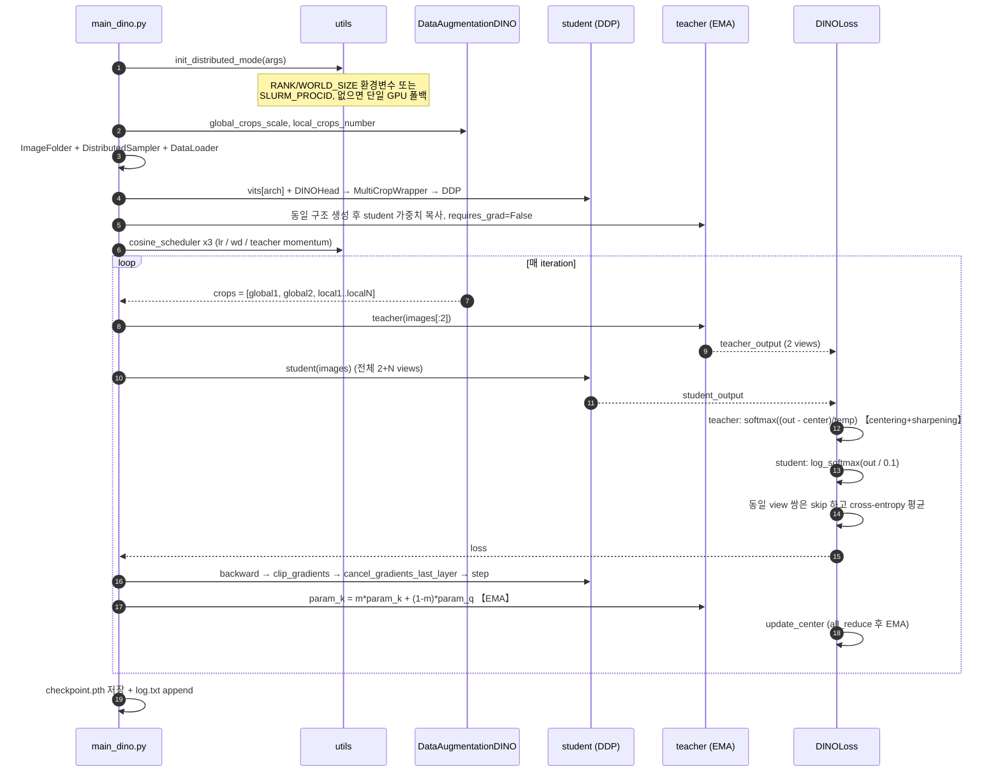
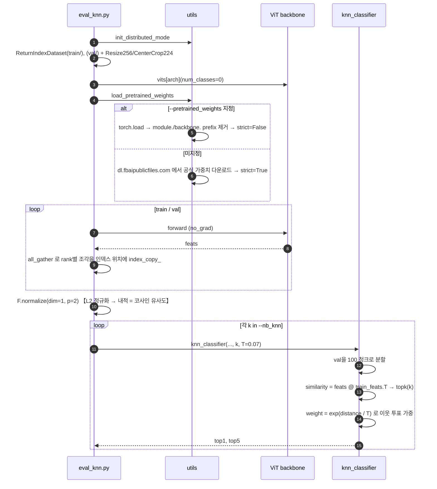
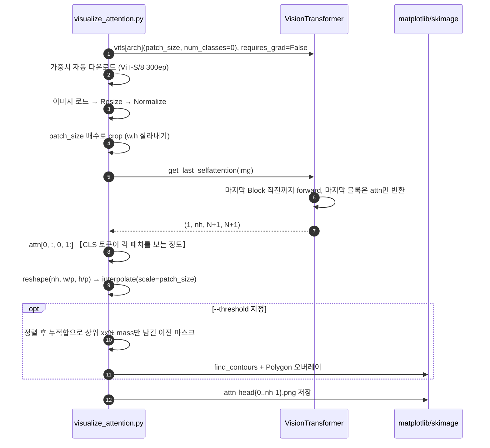
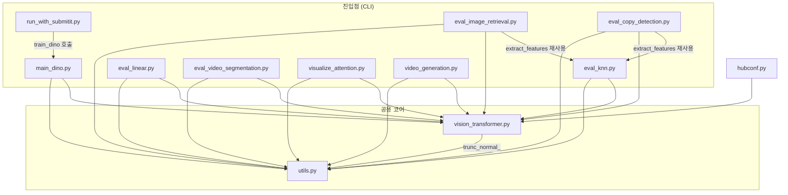

# DINO 프로젝트 전체 분석

> 분석 대상: `facebookresearch/dino` 포크 (main 브랜치, `fcc4dfc`)
> 코드 규모: 최상위 Python 12개 파일 / 3,782 LOC. 저장소 전체 130개 파일(대부분은 논문 PDF·이미지).

---

## Phase 1: 프로젝트 개요

### 프로젝트 목적

ICCV 2021 논문 *Emerging Properties in Self-Supervised Vision Transformers* 의 공식 구현체다.
**레이블 없이** ViT를 학습시키는 self-distillation 기법(DINO)을 제공하며,
핵심 발견은 이렇게 학습된 ViT의 self-attention이 **명시적 지도 없이 객체 경계(semantic segmentation)를
스스로 담아낸다**는 것이다. 학습된 백본은 fine-tuning 없이 k-NN 분류만으로 ImageNet 74.5%~78.3%에
도달할 만큼 강력한 범용 특징 추출기로 동작한다.

### 기술 스택

| 구분 | 내용 |
|---|---|
| 언어 | Python 3 (원 개발 3.6, 현 환경 3.10) |
| 핵심 프레임워크 | PyTorch (원 1.7.1, 검증 환경 2.4.0+cu121), torchvision |
| 분산 학습 | `torch.distributed` (NCCL), `torch.nn.parallel.DistributedDataParallel`, submitit(Slurm) |
| 수치/영상 | numpy, Pillow, OpenCV, scikit-image, matplotlib, tqdm |
| 의존성 관리 | **없음** — `requirements.txt` / `pyproject.toml` / `setup.py` 모두 부재 |
| 패키지화 | 없음. 최상위 스크립트를 직접 실행하는 flat script 구조 |
| 배포 인터페이스 | `hubconf.py` (PyTorch Hub) |

### 디렉토리 구조

```
dino/
├── main_dino.py              # [진입점] DINO self-supervised 학습
├── vision_transformer.py     # ViT 백본 + DINOHead 정의
├── utils.py                  # 분산/로깅/스케줄러/래퍼 공용 유틸 (최대 모듈)
├── hubconf.py                # PyTorch Hub 엔트리 (사전학습 백본 9종)
├── run_with_submitit.py      # [진입점] Slurm 다중 노드 런처
├── eval_knn.py               # [진입점] k-NN 분류 평가 + 특징 추출 파이프라인
├── eval_linear.py            # [진입점] linear probe 평가
├── eval_video_segmentation.py# [진입점] DAVIS 2017 비디오 객체 분할
├── eval_image_retrieval.py   # [진입점] revisited Oxford/Paris 검색
├── eval_copy_detection.py    # [진입점] Copydays 복제 탐지
├── visualize_attention.py    # [진입점] 단일 이미지 어텐션 맵 시각화
├── video_generation.py       # [진입점] 영상 어텐션 시퀀스 생성
├── samples/                  # (포크 추가) 스모크 테스트용 소형 데이터셋 생성기
├── docs/analysis/            # (포크 추가) 본 분석 문서
├── paper/, fm/               # (포크 추가) 논문 PDF·마크다운·플래시카드
├── .github/                  # CODE_OF_CONDUCT, CONTRIBUTING, README용 이미지 (CI 없음)
└── SAMPLES.md, README.md
```

`paper/`, `fm/`, `samples/`, `docs/`는 이 포크에서 추가된 것이고,
**업스트림 DINO 코드는 최상위 `.py` 12개가 전부**다.

### 아키텍처 패턴

1. **Flat script collection** — 패키지도 클래스 계층도 없다. 각 `.py`가 독립 CLI 진입점이며
   `utils.py` / `vision_transformer.py` 두 공용 모듈만 공유한다. 논문 재현 코드의 전형적 형태.
2. **Teacher–Student self-distillation** — 동일 구조의 두 네트워크. student만 역전파하고
   teacher는 student의 EMA로 갱신된다 ([main_dino.py:346-350](../../main_dino.py#L346-L350)).
3. **Decorator/Wrapper** — `MultiCropWrapper`가 백본을 감싸 해상도별 배치 처리를 투명하게 해결
   ([utils.py:594](../../utils.py#L594)).
4. **Strategy by string dispatch** — `vits.__dict__[args.arch]` / `torchvision_models.__dict__[...]`
   패턴으로 아키텍처를 문자열 하나로 교체 ([main_dino.py:159-177](../../main_dino.py#L159-L177)).
5. **Frozen-backbone evaluation protocol** — 모든 `eval_*.py`가 "백본 동결 → 특징 추출 → 가벼운
   분류기/검색" 이라는 동일 골격을 공유한다.

---

## Phase 2: 진입점 및 실행 흐름

### 진입점 목록

모든 진입점은 `if __name__ == '__main__':` 형태다.

| 파일 | 역할 | 데이터 요구 |
|---|---|---|
| [main_dino.py:467](../../main_dino.py#L467) | DINO 사전학습 | ImageFolder (레이블 불필요) |
| [run_with_submitit.py:131](../../run_with_submitit.py#L131) | Slurm 제출 래퍼 → `main_dino` | 상동 |
| [eval_knn.py:191](../../eval_knn.py#L191) | k-NN 평가 | ImageFolder `train/`+`val/` |
| [eval_linear.py:254](../../eval_linear.py#L254) | linear probe | 상동 |
| [eval_video_segmentation.py:251](../../eval_video_segmentation.py#L251) | DAVIS 분할 | DAVIS 2017 |
| [eval_image_retrieval.py:82](../../eval_image_retrieval.py#L82) | 이미지 검색 | rOxford/rParis |
| [eval_copy_detection.py:206](../../eval_copy_detection.py#L206) | 복제 탐지 | Copydays |
| [visualize_attention.py:98](../../visualize_attention.py#L98) | 어텐션 시각화 | **없음** (자동 다운로드) |
| [video_generation.py:374](../../video_generation.py#L374) | 어텐션 영상 | 영상 파일 1개 |

### 유스케이스 1: DINO 사전학습

가장 중요한 흐름이다. 한 iteration에서 **teacher는 global crop 2장만**, **student는 전체 crop
(global 2 + local N)**을 본다. 이 비대칭이 "local-to-global correspondence" 학습을 만든다.



**붕괴(collapse) 방지 장치가 이 흐름의 핵심**이다. 레이블이 없으므로 두 네트워크가 상수를
출력하는 자명해로 빠질 수 있는데, DINO는 세 가지로 막는다:
- **Centering** — teacher 출력에서 배치 평균(`center`)을 빼 한 차원 지배를 막음 (uniform 쪽으로 압박)
- **Sharpening** — teacher temperature를 student(0.1)보다 낮게(0.04) 두어 분포를 뾰족하게 (collapse 쪽으로 압박)
- **freeze_last_layer** — 초기 1 epoch 동안 head의 마지막 층 gradient를 죽여 초기 불안정을 회피

### 유스케이스 2: k-NN 평가

학습된 백본의 품질을 **분류기 학습 없이** 재는 흐름. 특징 정규화 후 코사인 유사도 기반
가중 투표를 한다.



### 유스케이스 3: 어텐션 시각화

의존성이 가장 얕고 데이터가 필요 없어 "동작 확인"에 가장 좋은 경로다.



---

## Phase 3: 핵심 모듈 심층 분석

### 3.1 `utils.py` (829 LOC) — 최대 모듈

**책임**: 분산 학습 부트스트랩, 로깅, 스케줄링, multi-crop 래핑, 가중치 로딩 등 모든 스크립트가
공유하는 인프라를 한 파일에 모아둔 잡화점.

| 심볼 | 역할 |
|---|---|
| `init_distributed_mode` | 3단계 폴백으로 분산 환경 감지 (env vars → SLURM → 단일 GPU) |
| `MultiCropWrapper` | 해상도별로 입력을 묶어 백본 forward 횟수를 최소화 |
| `cosine_scheduler` | warmup + cosine decay 스케줄을 **iteration 단위 numpy 배열로 미리 생성** |
| `MetricLogger` / `SmoothedValue` | ETA·median·global_avg 지원 로거, 프로세스 간 동기화 포함 |
| `load_pretrained_weights` | 로컬 체크포인트 또는 공식 URL에서 로드, prefix 정리 포함 |
| `restart_from_checkpoint` | `**kwargs` 로 임의 객체를 키 이름으로 복원하는 범용 재개 |
| `clip_gradients` / `cancel_gradients_last_layer` | 학습 안정화 |
| `get_params_groups` | bias·norm 파라미터를 weight decay에서 제외 |
| `LARS` | 대배치 convnet용 옵티마이저 |
| `PCA` | 검색·복제탐지용 whitening (`train_pca` / `apply`) |
| `trunc_normal_` | ViT 초기화 |
| `compute_ap` / `compute_map` | 검색 평가 지표 (revisitop 호환) |
| `multi_scale` | 여러 스케일 특징을 합산 정규화 |

**핵심 알고리즘: `MultiCropWrapper.forward`**

crop 리스트는 `[224, 224, 96, 96, ..., 96]` 처럼 해상도가 정렬돼 있다.
`torch.unique_consecutive(..., return_counts=True)` 로 **연속 동일 해상도 구간의 경계**를 구해
그 구간만 `torch.cat` 후 한 번에 백본에 넣는다. 즉 crop 개수(2+N)만큼이 아니라
**서로 다른 해상도 개수(보통 2)만큼만** forward가 돈다. 마지막에 전체 특징을 이어붙여 head에 한 번 통과.

**핵심 알고리즘: `cosine_scheduler`**

epoch이 아니라 **iteration 단위 배열**을 통째로 만들어 두고 `schedule[it]`로 조회한다.
스케줄 상태를 옵티마이저에 두지 않아 재개(resume) 시 상태 동기화 문제가 사라지는 깔끔한 설계다.
다만 `warmup_epochs > epochs`이면 `np.arange`가 음수 길이가 되어
[utils.py:197](../../utils.py#L197)의 `assert`에서 죽는다 (실측 확인).

### 3.2 `vision_transformer.py` (291 LOC)

**책임**: timm 계보의 표준 ViT를 **의존성 없이 자급자족 구현**하고, DINO 전용 projection head를 정의.

| 심볼 | 역할 |
|---|---|
| `DropPath`, `Mlp`, `Attention`, `Block`, `PatchEmbed` | 표준 ViT 구성 요소 |
| `VisionTransformer` | 백본. `prepare_tokens`, `get_last_selfattention`, `get_intermediate_layers` 제공 |
| `vit_tiny/small/base` | 팩토리 함수 (embed_dim 192/384/768, heads 3/6/12) |
| `DINOHead` | 3층 MLP → L2 정규화 → weight-norm 선형층(out_dim 65536) |

**핵심 알고리즘: `interpolate_pos_encoding`** ([vision_transformer.py:174](../../vision_transformer.py#L174))

ViT는 224x224 기준 위치 임베딩을 갖지만, 어텐션 시각화나 DAVIS 평가는 임의 해상도를 쓴다.
CLS 토큰 위치 임베딩은 분리해 두고, 패치 위치 임베딩만 2D로 reshape 후 bicubic interpolate 한다.
`w0, h0 = w0 + 0.1, h0 + 0.1` 이라는 눈에 띄는 한 줄은 부동소수점 오차로 출력 크기가 1 어긋나는
것을 막는 실전 대응이다(코드에 이슈 링크 주석 포함). **이 함수 덕분에 하나의 체크포인트가
모든 입력 해상도에 재사용된다.**

**설계 포인트: `DINOHead`의 out_dim=65536**

분류 head가 아니라 "프로토타입" 차원이다. 클래스 수와 무관하게 크게 잡아 표현력을 확보하고,
마지막 층은 `weight_norm` 후 `weight_g`를 1로 고정(`norm_last_layer=True`)해 학습 초기를 안정화한다.
ViT-S에서만 이 고정을 푸는 것이 안전하다고 README가 명시한다.

### 3.3 `main_dino.py` (471 LOC)

**책임**: DINO 학습 루프 전체 — 데이터 증강 정의, student/teacher 구성, 손실, 최적화, 체크포인트.

| 심볼 | 역할 |
|---|---|
| `get_args_parser` | 30여 개 하이퍼파라미터 CLI |
| `train_dino` | 전체 셋업 + epoch 루프 ([main_dino.py:132](../../main_dino.py#L132)) |
| `train_one_epoch` | iteration 루프, AMP, EMA 갱신 ([main_dino.py:301](../../main_dino.py#L301)) |
| `DINOLoss` | centering + sharpening cross-entropy ([main_dino.py:363](../../main_dino.py#L363)) |
| `DataAugmentationDINO` | multi-crop 증강 ([main_dino.py:419](../../main_dino.py#L419)) |

**핵심 알고리즘: `DINOLoss.forward`**

```
student_out = (student_output / 0.1).chunk(2 + N)        # 모든 view
teacher_out = softmax((teacher_output - center) / temp).detach().chunk(2)   # global 2개만
for iq, q in enumerate(teacher_out):
    for v in range(len(student_out)):
        if v == iq: continue                              # 같은 view 쌍은 제외
        loss += mean(sum(-q * log_softmax(student_out[v])))
```
`v == iq` 를 건너뛰는 것이 본질이다. 같은 crop을 두 네트워크에 넣어 비교하면 학습 신호가 없다.
서로 **다른** view끼리만 맞추게 하여 "이 이미지의 일부만 봐도 전체와 같은 표현이 나와야 한다"는
제약을 만든다. 총 손실 항 수는 `2 x (2+N) - 2`.

**증강 비대칭성**: `global_transfo1`은 GaussianBlur(p=1.0), `global_transfo2`는 blur(p=0.1) +
Solarization(p=0.2), local은 96x96 + blur(p=0.5). BYOL 계열의 비대칭 증강을 그대로 따른다.

**학습률 선형 스케일링**: `lr * (batch_size_per_gpu * world_size) / 256` —
배치 크기를 바꿔도 유효 학습률이 유지되도록 자동 보정한다.

### 3.4 `eval_knn.py` (242 LOC)

**책임**: 백본 동결 상태의 특징만으로 가중 k-NN 분류 정확도를 측정.

핵심은 `extract_features`의 **분산 특징 수집**이다. `ReturnIndexDataset`이 `(img, index)`를
반환하고, 각 rank가 `all_gather`한 특징을 **원본 인덱스 위치에 `index_copy_`** 한다.
`DistributedSampler(shuffle=False)`로 흩어진 샘플이 정확히 원래 순서로 복원된다.

`knn_classifier`는 L2 정규화된 특징의 내적(=코사인 유사도) top-k를 구하고
`exp(distance / T)` 로 가중 투표한다. T=0.07이 기본.

> **이 파일의 두 가지 실무 함정** (실측 확인)
> - `imgs_per_chunk = num_test_images // 100` 이므로 **val 이미지가 100장 미만이면
>   `ValueError: range() arg 3 must not be zero`** ([eval_knn.py:149](../../eval_knn.py#L149)).
> - `knn_classifier`가 [eval_knn.py:239](../../eval_knn.py#L239)에서 **`num_classes` 인자 없이**
>   호출돼 항상 기본값 1000이 쓰인다. 클래스 수가 적은 데이터셋에서도 `(k, 1000)` 버퍼를
>   잡으므로 낭비지만, `scatter_` 인덱스는 실제 레이블 범위 안이라 결과는 정확하다.

### 3.5 `eval_linear.py` (281 LOC)

**책임**: 동결 특징 위에 선형 분류기 하나만 학습해 표현 품질을 측정 (표준 linear probe 프로토콜).

특징 구성이 인자에 따라 달라진다 ([eval_linear.py:165-169](../../eval_linear.py#L165-L169)):
- `--n_last_blocks n`: 마지막 n개 블록의 **CLS 토큰을 concat** (ViT-S 기본 n=4 → 384x4=1536차원)
- `--avgpool_patchtokens`: 마지막 블록의 **패치 토큰 평균**을 추가 concat (ViT-B 기본)

`SGD(lr * batch*world/256, momentum=0.9, weight_decay=0)` + cosine annealing.
백본은 `torch.no_grad()` 안에서만 호출되어 절대 갱신되지 않는다.

> **함정**: [eval_linear.py:139](../../eval_linear.py#L139)가 `output_dir`을 만들지 않고
> `log.txt`를 열어, 디렉터리가 없으면 첫 epoch 검증 직후 `FileNotFoundError`로 죽는다 (실측 확인).

### 3.6 `eval_video_segmentation.py` (292 LOC)

**책임**: DAVIS 2017 semi-supervised 비디오 객체 분할. **학습 없이** 첫 프레임 마스크를
어텐션 특징 유사도로 전파한다.

`label_propagation` ([eval_video_segmentation.py:113](../../eval_video_segmentation.py#L113))이
핵심이다: 타깃 프레임 특징과 컨텍스트 프레임들 특징의 affinity `exp(feat_tar @ feat_src / 0.1)`를
구하고, `restrict_neighborhood`로 공간적으로 먼 대응을 마스킹한 뒤 top-k만 남겨 정규화한다.
그 affinity로 컨텍스트 프레임의 세그멘테이션을 가중 합성해 타깃 마스크를 얻는다.
큐(`queue`) 자료구조로 최근 N 프레임을 컨텍스트로 유지한다.

### 3.7 `eval_image_retrieval.py` / `eval_copy_detection.py`

두 파일 모두 `eval_knn.extract_features`를 재사용한다.
- **검색**: rOxford/rParis에서 query/database 특징을 뽑아 유사도 정렬, `utils.compute_map`으로
  Medium/Hard mAP 산출. `--multiscale`이면 `utils.multi_scale` 사용.
- **복제 탐지**: `CopydaysDataset`이 strong/jpeg/crop 등 변형 블록을 관리하고,
  YFCC100M 이미지로 학습한 `utils.PCA` whitening을 적용한 뒤 AP를 계산한다.

### 3.8 `hubconf.py` (151 LOC)

`dependencies = ["torch", "torchvision"]` 선언과 9개 팩토리 함수(`dino_vits16` 등).
각 함수는 `vits.__dict__`로 모델을 만들고 `torch.hub.load_state_dict_from_url`로 가중치를 붙인다.
`torch.hub.load('facebookresearch/dino:main', 'dino_vits16')` 또는
`torch.hub.load('.', 'dino_vits16', source='local')`로 소비된다.

### 3.9 `run_with_submitit.py` (132 LOC)

Slurm 제출 래퍼. `Trainer` 클래스가 `__call__`에서 `main_dino.train_dino`를 호출하고,
`checkpoint()`에서 `submitit.helpers.DelayedSubmission`으로 **preemption 시 자동 재제출**한다.
공유 파일시스템 경로를 `dist_url`(file://)로 써서 노드 간 rendezvous를 맞춘다.

### 데이터 모델

이 프로젝트에는 dataclass/TypedDict 같은 명시적 데이터 모델이 거의 없다.
사실상의 데이터 계약은 다음 넷이다:

| 계약 | 형태 |
|---|---|
| 입력 데이터셋 | `torchvision.datasets.ImageFolder` 구조 (`root/class_x/*.jpg`) |
| crop 배치 | `List[Tensor]`, 해상도 내림차순 정렬, `[224, 224, 96 x N]` |
| 체크포인트 | `{'student', 'teacher', 'optimizer', 'epoch', 'args', 'dino_loss', 'fp16_scaler'?}` |
| 배포 가중치 | 백본 전용 `state_dict` (prefix 없음) 또는 full ckpt (`teacher`/`student` 키) |

---

## Phase 4: 모듈 관계도



**순환 의존 없음.** 의존 그래프는 `진입점 → {vision_transformer, eval_knn} → utils` 로 흐르는
깨끗한 DAG다. `utils.py`는 내부 모듈을 하나도 import하지 않는 리프 노드이고,
`vision_transformer.py`는 `utils.trunc_normal_` 하나만 쓴다.

주목할 결합 하나: `eval_image_retrieval.py`와 `eval_copy_detection.py`가
**평가 스크립트인 `eval_knn.py`를 라이브러리처럼 import** 한다. `extract_features`가
`eval_knn`에 있는 것은 위치상 어색하며, `utils.py`로 올리는 편이 자연스럽다.

---

## Phase 5: 상태 관리 및 데이터 흐름

### 전역 상태

이 코드베이스의 전역 상태는 대부분 **프레임워크 수준**에 있다.

| 상태 | 위치 | 수명 |
|---|---|---|
| 분산 프로세스 그룹 | `torch.distributed` (전역) | 프로세스 전체 |
| `MASTER_ADDR/PORT`, `RANK`, `WORLD_SIZE`, `LOCAL_RANK` | 환경변수 | 프로세스 전체 |
| `builtins.print` 재정의 | `utils.setup_for_distributed` | 프로세스 전체 (rank 0만 출력) |
| `cudnn.benchmark = True` | `train_dino` | 프로세스 전체 |
| `DINOLoss.center` | `register_buffer` | 학습 전체, EMA로 갱신 |
| teacher 가중치 | student의 EMA | 학습 전체 |
| torch hub 캐시 | `~/.cache/torch/hub/checkpoints/` | 머신 영구 |

> **주의할 파이썬 전역**: [eval_linear.py](../../eval_linear.py)의 `args`는 모듈 최상위 변수이고,
> `train()` / `validate_network()`가 **인자로 받지 않고 전역으로 참조**한다
> ([eval_linear.py:165](../../eval_linear.py#L165)의 `args.arch`). 함수를 다른 곳에서 재사용하기
>어렵게 만드는 유일한 구조적 결함이다. `main_dino.py`는 같은 실수를 하지 않고 `args`를 넘긴다.

### 데이터 흐름

**단방향 파이프라인**이며 이벤트나 콜백이 없다.

```
이미지 → DataAugmentationDINO → List[crop]
      → MultiCropWrapper(해상도별 묶어 forward)
      → 백본 특징 → DINOHead → 65536차원 로짓
      → DINOLoss (centering/sharpening)
      → student 역전파 ─┐
                        └→ EMA → teacher (역전파 없음)
```

주요 변환 지점:
1. **crop 분해** — 1장 이미지 → 2+N 텐서 (`DataAugmentationDINO.__call__`)
2. **해상도 그룹핑** — crop 리스트 → 해상도별 배치 (`MultiCropWrapper.forward`)
3. **L2 정규화** — head 내부, 그리고 모든 평가 스크립트의 특징 후처리
4. **분산 재조립** — `all_gather` + `index_copy_` (`eval_knn.extract_features`)
5. **위치 임베딩 보간** — 임의 해상도 대응 (`interpolate_pos_encoding`)

### 외부 연동

| 종류 | 대상 |
|---|---|
| 네트워크 (읽기) | `dl.fbaipublicfiles.com` 사전학습 가중치, `torch.hub` XCiT 저장소, 예시 이미지 |
| 파일 I/O | ImageFolder 읽기, `checkpoint.pth` 쓰기, `log.txt` JSON Lines append |
| 스케줄러 | Slurm (submitit) |
| DB/API | **없음** |

로그는 별도 프레임워크(W&B, TensorBoard) 없이 `log.txt`에 JSON Lines로 append 된다.
의존성이 없다는 장점과, 시각화를 직접 만들어야 한다는 단점이 함께 있다.

---

## Phase 6: 설정 및 환경

### 환경 변수

| 변수 | 역할 | 설정 주체 |
|---|---|---|
| `RANK`, `WORLD_SIZE`, `LOCAL_RANK` | 분산 랭크 | `torchrun` / `torch.distributed.launch` |
| `MASTER_ADDR`, `MASTER_PORT` | rendezvous (단일 GPU 시 코드가 127.0.0.1:29500 자동 설정) | 런처 또는 `utils.init_distributed_mode` |
| `SLURM_PROCID`, `SLURM_JOB_ID`, `SLURM_NODEID` | Slurm 경로 | Slurm |
| `TORCH_HOME` | hub 가중치 캐시 위치 (선택) | 사용자 |

### 빌드 설정

**빌드 단계가 없다.** 컴파일도, 패키지 설치도, 스크립트 러너도 없다. 인터프리터로 직접 실행한다.
단점은 명확하다 — **의존성 매니페스트가 없어 재현 가능한 환경을 코드만 보고 만들 수 없다.**
README의 산문("python 3.6, PyTorch 1.7.1, CUDA 11.0, torchvision 0.8.2")이 유일한 기록이다.

### 로컬 개발 환경 셋업

이 저장소에서 실측 검증된 셋업 (상세는 [SAMPLES.md](../../SAMPLES.md)):

```bash
# 1. 환경 (검증된 조합: Python 3.10 / torch 2.4.0+cu121 / torchvision 0.19.0+cu121)
conda activate trellis
python -c "import torch, torchvision, cv2, skimage; print(torch.__version__, torch.cuda.is_available())"

# 2. 의존성 확인 (매니페스트가 없으므로 수동)
#    필수: torch, torchvision, numpy, Pillow
#    시각화: matplotlib, opencv-python, scikit-image, requests
#    Slurm: submitit    /  진행표시: tqdm

# 3. 1분 스모크 테스트 — 데이터도 체크포인트도 불필요
python visualize_attention.py --arch vit_small --patch_size 8 --output_dir /tmp/dino_attn

# 4. 전체 파이프라인 스모크 테스트
python samples/make_tiny_dataset.py --out /tmp/dino_tiny --source synth
python main_dino.py --arch vit_tiny --data_path /tmp/dino_tiny/train --output_dir /tmp/dino_train \
    --epochs 2 --warmup_epochs 0 --batch_size_per_gpu 8 --num_workers 2
python eval_knn.py --arch vit_small --data_path /tmp/dino_tiny --nb_knn 10 20
mkdir -p /tmp/dino_linear && python eval_linear.py --arch vit_small --data_path /tmp/dino_tiny \
    --output_dir /tmp/dino_linear --epochs 2 --num_labels 5
```

**torch 2.4 호환성**: 원 코드는 torch 1.7.1 기준이지만 수정 없이 동작한다.
`torch.cuda.amp.autocast` / `GradScaler` FutureWarning만 출력된다.
`utils.init_distributed_mode`의 단일 GPU 폴백 덕에 `torchrun` 없이 `python main_dino.py`도 된다.

---

## Phase 7: 코드 품질 관찰

### 잘된 점

1. **자급자족 ViT 구현** — timm 의존 없이 `vision_transformer.py` 한 파일에 ViT가 완결돼 있다.
   5년 뒤에도 `pip install` 하나 없이 읽고 돌릴 수 있는 이유가 이것이다. 논문 재현 코드로서
   최선의 선택이며, 실제로 torch 1.7 → 2.4 전환을 무수정으로 통과했다.
2. **`MultiCropWrapper`의 추상화 위치** — multi-crop이라는 DINO 고유 요구를 모델도 학습 루프도
   아닌 얇은 래퍼에 격리했다. 덕분에 `train_one_epoch`은 `student(images)` 한 줄로 끝나고,
   ViT·ResNet·XCiT가 동일 코드로 학습된다.
3. **스케줄러를 배열로 미리 생성** — 상태가 없으니 resume이 자동으로 정확하다.
   옵티마이저 상태와 스케줄러 상태가 어긋나는 흔한 버그를 구조적으로 제거했다.
4. **`restart_from_checkpoint`의 `**kwargs` 설계** — 복원 대상을 호출자가 이름으로 선언한다.
   `fp16_scaler`가 나중에 추가돼도 함수는 그대로였을 것이다.
5. **좋은 주석 밀도** — `w0 + 0.1` 같은 마법의 상수에 GitHub 이슈 링크가 달려 있고,
   XCiT 튜플 반환 처리에도 원본 코드 링크가 있다. "왜"를 남긴 주석들이다.
6. **하이퍼파라미터 문서화** — `get_args_parser`의 help 문자열이 단순 설명이 아니라
   "작은 배치에서는 0.9995를 권장" 같은 **운영 지침**을 담고 있다.

### 개선 가능한 점

1. **의존성 매니페스트 추가** — 가장 큰 결함. `requirements.txt` 한 장이면 재현성이 크게 오른다.
   현재는 `import cv2`가 어느 스크립트에 필요한지 파일을 열어봐야 안다.
2. **`extract_features`를 `utils.py`로 이동** — 평가 스크립트가 다른 평가 스크립트를 import하는
   현재 구조(`eval_image_retrieval → eval_knn`)는 의존 방향이 어색하다.
3. **`eval_linear.py`의 전역 `args` 제거** — `train(model, ..., args)`로 넘기면
   `main_dino.py`와 스타일이 통일되고 함수 재사용이 가능해진다.
4. **`output_dir` 자동 생성** — `main_dino.py`는 하지 않고 `visualize_attention.py`는 `makedirs`를
   호출한다. `eval_linear.py`는 둘 다 안 해서 실제로 죽는다. 진입점마다 `Path(...).mkdir(parents=True, exist_ok=True)`
   한 줄이면 통일된다.
5. **`knn_classifier(num_classes=...)` 전달** — 호출부에서 `len(dataset_train.classes)`를 넘기면
   불필요한 `(k, 1000)` 버퍼가 사라진다.
6. **`weights_only=True`** — `torch.load` 3곳 모두 지정이 없다. torch 2.6부터 기본값이 바뀌므로
   미리 명시하면 향후 파손과 임의 코드 실행 위험을 함께 줄인다.
7. **`torch.cuda.amp` → `torch.amp`** — FutureWarning 제거. 2줄 수정.
8. **스모크 테스트 부재** — 테스트도 CI도 전혀 없다. `.github/`에 워크플로가 하나도 없다.
   이 포크의 [SAMPLES.md](../../SAMPLES.md)가 사실상 그 공백을 메우고 있다.

### 복잡도가 높은 영역

| 영역 | 왜 어려운가 |
|---|---|
| `DINOLoss.forward`의 이중 루프 | `v == iq` skip의 의미(같은 view 제외)가 코드만 보고는 안 보인다. 논문 Fig.2를 같이 봐야 이해된다. |
| `MultiCropWrapper.forward`의 `unique_consecutive` | crop 리스트가 **해상도 정렬돼 있다는 암묵적 전제**에 의존한다. 이 전제가 코드에 명시돼 있지 않다. |
| `eval_knn.extract_features`의 분산 재조립 | `all_gather` + `index_copy_` + `DistributedSampler` 패딩 처리가 얽혀 있다. 단일 GPU에서는 절대 드러나지 않는 경로. |
| `label_propagation`의 텐서 변형 | `reshape`/`transpose`가 6회 연속으로 나오며 각 축의 의미가 주석에만 있다. |
| `interpolate_pos_encoding` | `+0.1` 트릭 없이는 크기가 어긋난다는 사실이 직관에 반한다. |

### 잠재적 이슈

| 관점 | 이슈 |
|---|---|
| **보안** | `torch.load(..., weights_only 미지정)` 3곳. 신뢰할 수 없는 체크포인트를 로드하면 임의 코드 실행이 가능하다. 공식 URL만 쓴다면 실질 위험은 낮지만 명시하는 편이 낫다. |
| **보안** | `visualize_attention.py`가 인자 없이 실행되면 원격 URL에서 이미지를 자동 fetch한다. 오프라인/폐쇄망에서는 실패한다. |
| **성능** | `train_one_epoch`의 `torch.cuda.synchronize()`가 매 iteration 호출된다. 로깅 정확도를 위한 것이지만 파이프라인을 직렬화한다. |
| **성능** | `knn_classifier`의 `(k, 1000)` 버퍼가 항상 잡힌다 (위 참조). |
| **유지보수** | 가중치 URL 매핑이 `utils.load_pretrained_weights`, `hubconf.py`, `visualize_attention.py`, `video_generation.py` **네 곳에 중복**돼 있다. 모델 추가 시 네 곳을 고쳐야 한다. |
| **유지보수** | DAVIS 평가는 README가 명시적으로 "PyTorch 1.7.1이 아니면 재현 불가"라고 경고한다. 현 환경(2.4)에서 수치가 논문과 다를 수 있다. |
| **운영** | 체크포인트 1개가 ViT-S 기준 약 440MB이고 `--saveckp_freq 20` 기본값으로 100 epoch 학습 시 6개가 쌓인다. 디스크 계획 필요. |

---

## Phase 8: 빠른 참조 가이드

### 필수 파일 읽기 순서

1. **[README.md](../../README.md)** — 모델 표와 각 평가 프로토콜의 존재 이유를 먼저 파악
2. **[vision_transformer.py](../../vision_transformer.py)** — 데이터가 통과하는 실체.
   `VisionTransformer.forward` → `prepare_tokens` → `DINOHead.forward` 순으로 읽는다
3. **[main_dino.py](../../main_dino.py)** — `train_dino` (셋업) → `train_one_epoch` (루프) →
   `DINOLoss` (핵심 아이디어) → `DataAugmentationDINO` (입력 계약)
4. **[utils.py](../../utils.py)** — 통독하지 말고 `MultiCropWrapper`, `cosine_scheduler`,
   `init_distributed_mode` 세 개만 먼저
5. **[eval_knn.py](../../eval_knn.py)** — 학습 결과를 어떻게 평가하는지. 다른 `eval_*.py`의 원형

### 핵심 용어 사전

| 용어 | 정의 |
|---|---|
| **self-distillation** | 레이블 없이, 같은 구조의 teacher 출력을 student가 따라 배우는 학습. DINO의 D |
| **teacher / student** | teacher는 역전파 없이 student의 EMA로만 갱신되는 사본 |
| **EMA (momentum encoder)** | `param_k = m*param_k + (1-m)*param_q`. m은 0.996 → 1.0으로 cosine 증가 |
| **multi-crop** | 한 이미지에서 global crop 2장(224) + local crop N장(96)을 만드는 증강 |
| **local-to-global** | student가 local crop을, teacher가 global crop을 볼 때 둘을 맞추게 하는 학습 신호 |
| **centering** | teacher 로짓에서 배치 평균을 빼 한 차원 지배를 막는 붕괴 방지책 |
| **sharpening** | teacher temperature(0.04)를 student(0.1)보다 낮춰 분포를 뾰족하게 만드는 것 |
| **collapse** | 모든 입력에 같은 출력을 내는 자명해. centering과 sharpening이 서로 반대 방향으로 눌러 방지 |
| **out_dim (65536)** | DINOHead 출력 차원. 클래스가 아니라 "프로토타입" 개수 |
| **k-NN eval** | 분류기 학습 없이 특징의 코사인 유사도 투표만으로 정확도를 재는 프로토콜 |
| **linear probe** | 동결된 특징 위에 선형층 하나만 학습해 표현 품질을 재는 프로토콜 |
| **n_last_blocks** | linear probe에서 마지막 몇 개 블록의 CLS 토큰을 concat할지 (ViT-S=4, ViT-B=1) |
| **CLS token** | 시퀀스 앞에 붙는 학습 가능 토큰. 이미지 전역 표현이자 어텐션 시각화의 query |
| **patch_size** | 8 또는 16. 작을수록 해상도·성능이 오르고 연산량은 급증 |
| **freeze_last_layer** | 초기 n epoch 동안 head 마지막 층 gradient를 죽이는 안정화 장치 |

### 자주 수정되는 파일

| 목적 | 건드릴 파일 |
|---|---|
| 새 백본 아키텍처 추가 | [vision_transformer.py](../../vision_transformer.py) + [main_dino.py:159-177](../../main_dino.py#L159-L177)의 dispatch |
| 손실/붕괴 방지 실험 | [main_dino.py](../../main_dino.py)의 `DINOLoss` |
| 증강 변경 | [main_dino.py](../../main_dino.py)의 `DataAugmentationDINO` |
| 새 하이퍼파라미터 | [main_dino.py](../../main_dino.py)의 `get_args_parser` |
| 새 평가 프로토콜 | `eval_*.py` 하나를 복사해 시작 (`extract_features` 재사용) |
| 사전학습 가중치 추가 | **4곳 모두**: `utils.load_pretrained_weights`, `hubconf.py`, `visualize_attention.py`, `video_generation.py` |
| 분산/런처 문제 | [utils.py:467](../../utils.py#L467) `init_distributed_mode` |

### 디버깅 팁

| 증상 | 확인 지점 |
|---|---|
| `AssertionError` (utils.py:197) | `--warmup_epochs`가 `--epochs`보다 큰지. 짧은 실험은 `--warmup_epochs 0` |
| `ValueError: range() arg 3 must not be zero` | val 이미지가 100장 미만 ([eval_knn.py:149](../../eval_knn.py#L149)) |
| `FileNotFoundError: .../log.txt` | `eval_linear.py`의 `--output_dir`을 미리 `mkdir -p` |
| `Loss is nan, stopping training` | [main_dino.py:323](../../main_dino.py#L323)의 명시적 종료. `--teacher_temp` 하향, `--freeze_last_layer` 상향, `--clip_grad` 확인 |
| 손실이 상수로 수렴 (collapse) | `DINOLoss.center`의 노름 확인. centering이 동작하려면 `dist.all_reduce`가 필요하므로 프로세스 그룹 초기화 여부 확인 |
| 가중치 로드 후 성능이 0 | `load_pretrained_weights`가 `strict=False`라 **조용히 실패한다**. 출력되는 `msg`의 `missing_keys`를 반드시 확인 |
| `--checkpoint_key` 관련 혼란 | backbone-only 가중치는 키가 없고, full ckpt는 `teacher`/`student` 키가 있다 |
| 분산 hang | `MASTER_PORT` 충돌, 또는 rank 간 `dist.barrier()` 도달 불일치 |
| 아무 로그도 안 나옴 | `setup_for_distributed`가 rank 0 외의 `print`를 막는다. `force=True`로 우회 가능 |
| 해상도 바꿨더니 shape 에러 | 입력이 `patch_size`의 배수인지. `interpolate_pos_encoding`은 배수를 전제한다 |
| OOM | `--batch_size_per_gpu` 하향, `--local_crops_number` 하향, `eval_knn`은 `--use_cuda False` |

---

## 부록: 이 포크에서 검증된 사항

2026-09-04, RTX 3090 단일 GPU / Python 3.10 / torch 2.4.0+cu121 환경에서
어텐션 시각화, torch.hub 로드, DINO 학습, k-NN 평가, linear probe, 어텐션 영상 생성 6종을
**실제 실행해 성공을 확인**했다. 재현 커맨드와 함정은 [SAMPLES.md](../../SAMPLES.md)에 있다.
외부 데이터셋이 필요한 DAVIS / rOxford-rParis / Copydays 3종은 임포트·인자 파싱까지만 확인했다.
