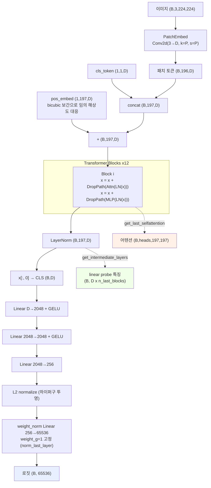
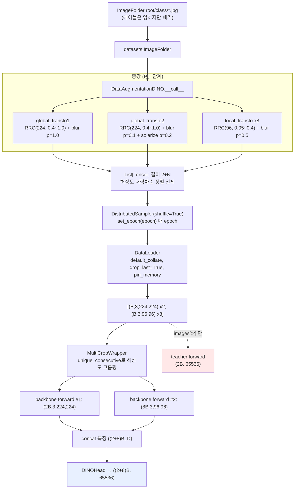

# DINO — ML 심층 분석

> 검증 환경: RTX 3090 24GB x1 / Python 3.10 / torch 2.4.0+cu121 / torchvision 0.19.0+cu121 / Pillow 10.4.0
> 본 문서의 파라미터 수·텐서 shape은 전부 **실제 모델을 인스턴스화해 측정한 값**이다.
> 구조·의존성 일반 분석은 [2026-09-04-full-analysis.md](2026-09-04-full-analysis.md) 참조.

---

## Phase 1: 프로젝트 개요

### 구현 논문

| 항목 | 내용 |
|---|---|
| 논문 | **Emerging Properties in Self-Supervised Vision Transformers** (ICCV 2021) |
| arXiv | [2104.14294](https://arxiv.org/abs/2104.14294) — 저장소 내 `paper/2104.14294v2.pdf` |
| 저자 | Caron, Touvron, Misra, Jégou, Mairal, Bojanowski, Joulin (FAIR / Inria) |
| 방법론 이름 | **DINO** = self-**DI**stillation with **NO** labels |
| 계보 | BYOL(momentum encoder, 비대칭 증강) + SwAV(multi-crop) + MoCo(EMA teacher)의 종합. 단, **negative pair도 contrastive loss도 predictor도 없다** |

### 과제 유형

**Self-supervised representation learning (pretext task)** 이 본체다. 레이블 없이 백본을 학습시키고,
그 표현의 품질을 4가지 하위 과제로 검증하는 구조다.

| 단계 | 과제 | 스크립트 | 학습 파라미터 |
|---|---|---|---|
| Pretext | self-distillation | `main_dino.py` | 백본 + head 전체 |
| Downstream | image classification (k-NN) | `eval_knn.py` | **없음** (파라미터 0개) |
| Downstream | image classification (linear probe) | `eval_linear.py` | 선형층 1개만 |
| Downstream | video object segmentation | `eval_video_segmentation.py` | **없음** (특징 유사도 전파) |
| Downstream | image retrieval / copy detection | `eval_image_retrieval.py`, `eval_copy_detection.py` | **없음** (PCA whitening만) |

논문의 핵심 주장이 이 표에 그대로 담겨 있다 — **DINO ViT의 특징은 그 자체로 충분히 좋아서,
하위 과제에서 학습할 게 거의 없다.**

### 기술 스택

| 구분 | 내용 | 비고 |
|---|---|---|
| 프레임워크 | PyTorch (순수 `nn.Module`) | Lightning / HF Trainer / mmcv 레지스트리 **전부 미사용** |
| 모델 라이브러리 | **없음** (ViT 자체 구현) | timm 의존 없음. XCiT만 `torch.hub`로 외부 로드 |
| CUDA 의존 | `nn.SyncBatchNorm`, NCCL backend, AMP | **CUDA 필수** — `init_distributed_mode`가 GPU 없으면 `sys.exit(1)` |
| 분산 | `DistributedDataParallel` + `torch.distributed` | FSDP / DeepSpeed / accelerate 미사용 |
| 설정 관리 | `argparse` 단독 | **Hydra / OmegaConf / yacs / config 디렉토리 전부 없음** |
| 실험 추적 | **없음** | wandb / tensorboard / mlflow 전무. `log.txt` JSON Lines가 전부 |
| 의존성 고정 | **없음** | requirements.txt / pyproject.toml / environment.yml 전부 부재 |

---

## Phase 2: 모델 아키텍처

### 구성 요소

학습 시 모델은 **backbone + head** 2단이다. neck도 FPN도 없다.

```
student = MultiCropWrapper(
    backbone = VisionTransformer(...),   # 교체 가능: ViT / XCiT / torchvision convnet
    head     = DINOHead(embed_dim, out_dim=65536)
)
teacher = 동일 구조, requires_grad=False, student의 EMA로만 갱신
```

### 파라미터 규모 (실측)

| 백본 | embed_dim / depth / heads | 백본 params | DINOHead params | **학습 시 총합** |
|---|---|---|---|---|
| `vit_tiny` | 192 / 12 / 3 | 5.5M | 22.0M | 27.5M |
| `vit_small` | 384 / 12 / 6 | **21.7M** | 22.4M | **44.0M** |
| `vit_base` | 768 / 12 / 12 | **85.8M** | 23.1M | 108.9M |

> **가장 중요한 수치**: ViT-S에서 **head(22.4M)가 백본(21.7M)보다 크다.**
> `out_dim=65536`이라 마지막 층 하나가 `256 x 65536 = 16.8M`을 차지하기 때문이다.
> 그리고 이 head는 **학습이 끝나면 통째로 버려진다** — 공개된 "backbone only" 가중치가
> ViT-S 21M / ViT-B 85M인 이유가 이것이다. 학습 시 VRAM 계획에는 head를 반드시 포함해야 한다.

`patch_size`는 파라미터 수를 바꾸지 않는다(8이든 16이든 동일). 대신 **토큰 수가 4배**가 되어
어텐션 연산량이 약 16배로 늘어난다 — 224px 기준 patch16은 196토큰, patch8은 784토큰.

### forward 흐름 (실측 shape, ViT-S/16, batch=2)

```
input                   (2, 3, 224, 224)
  └ PatchEmbed: Conv2d(3→384, k=16, s=16) → flatten(2) → transpose
after PatchEmbed        (2, 196, 384)          # 196 = (224/16)^2
  └ cls_token.expand → cat(dim=1)
                        (2, 197, 384)
  └ + interpolate_pos_encoding(x, w, h)        # 해상도 다르면 bicubic 보간
after prepare_tokens    (2, 197, 384)
  └ Block x 12:  x = x + DropPath(Attn(LN(x)));  x = x + DropPath(MLP(LN(x)))
                        (2, 197, 384)
  └ LayerNorm → x[:, 0]                        # CLS 토큰만 취함
VisionTransformer out   (2, 384)
  └ DINOHead: Linear(384→2048) GELU
              Linear(2048→2048) GELU
              Linear(2048→256)
              F.normalize(dim=-1, p=2)         # ★ L2 정규화 = 하이퍼구 위로 투영
              weight_norm(Linear(256→65536, bias=False))
DINOHead out            (2, 65536)
```

**보조 출력 경로** (실측):

| 메서드 | 출력 shape | 용도 |
|---|---|---|
| `forward` | `(B, 384)` | 학습·k-NN·검색 (CLS 토큰) |
| `get_last_selfattention` | `(B, 6, 197, 197)` | 어텐션 시각화 (`[0,:,0,1:]` = CLS→패치) |
| `get_intermediate_layers(x, 4)` | `4 x (B, 197, 384)` | linear probe |
| linear probe 특징 | `(B, 1536)` | 위 4개의 CLS를 concat (384x4) |
| local crop 96px | `(B, 37, 384)` | 36패치 + CLS. pos_embed가 자동 보간됨 |

### 모델 구조 다이어그램



### 커스텀 레이어

**커스텀 CUDA 커널은 없다.** 전부 순수 PyTorch 연산이다. 직접 구현한 것은 다음 넷:

| 구현 | 위치 | 특징 |
|---|---|---|
| `Attention` | [vision_transformer.py:68](../../vision_transformer.py#L68) | **어텐션 맵을 항상 함께 반환** (`return x, attn`). SDPA/FlashAttention 미사용 — 시각화를 위해 명시적 `softmax(q@k.T * scale)` 유지 |
| `DropPath` | [vision_transformer.py:38](../../vision_transformer.py#L38) | stochastic depth. `drop_path_rate=0.1`을 depth에 걸쳐 선형 증가 |
| `trunc_normal_` | [utils.py:548](../../utils.py#L548) | truncated normal 초기화 (erfinv 기반). timm 없이 쓰려고 복사 |
| `LARS` | [utils.py:553](../../utils.py#L553) | Barlow Twins에서 가져온 layer-wise adaptive LR. convnet 대배치용 |

> **설계 트레이드오프**: `Attention.forward`가 `(attn @ v)`를 명시적으로 계산하므로
> `F.scaled_dot_product_attention`의 메모리 이점(FlashAttention)을 못 쓴다.
> `(B, heads, N, N)` 어텐션 행렬이 항상 materialize되며, patch8 + 큰 이미지에서 OOM의 주범이다.
> 어텐션 시각화라는 이 프로젝트의 핵심 산출물 때문에 의도적으로 남긴 선택으로 보인다.

### 사전학습 가중치

`https://dl.fbaipublicfiles.com/dino/` 에서 자동 다운로드된다 ([utils.py:71](../../utils.py#L71)).
9종: `vit_small/8,16`, `vit_base/8,16`, `xcit_small_12_p8,p16`, `xcit_medium_24_p8,p16`, `resnet50`.
`--pretrained_weights` 미지정 시 자동으로 이 URL을 쓴다.

| 가중치 종류 | state_dict 키 | 로드 방식 |
|---|---|---|
| backbone only | prefix 없음 | `strict=True` |
| full checkpoint | `teacher` / `student` | `--checkpoint_key`로 선택 후 `module.`·`backbone.` prefix 제거, `strict=False` |

---

## Phase 3: 데이터 파이프라인

### 데이터 소스

| 과제 | 포맷 | 준비 |
|---|---|---|
| 사전학습 | `torchvision.datasets.ImageFolder` (`root/class/*.jpg`) — **레이블은 읽히지만 무시된다** | ImageNet train |
| k-NN / linear | ImageFolder `train/` + `val/` | ImageNet |
| DAVIS | JPEG 프레임 + 인덱스 PNG 마스크 | `davis-2017/data/get_davis.sh` |
| 검색 | rOxford5k / rParis6k + `gnd_*.pkl` | [revisitop](https://github.com/filipradenovic/revisitop) |
| 복제 탐지 | Copydays 블록 구조 (original/strong/jpeg/crop) | INRIA |

`main_dino.py`는 `ImageFolder`를 쓰지만 `train_one_epoch`이 `for it, (images, _) in ...`로
**레이블을 버린다**. 따라서 클래스 디렉토리가 1개뿐이어도 학습은 정상 동작한다.

### 전처리·증강

**사전학습 (multi-crop)** — [main_dino.py:419](../../main_dino.py#L419)

| crop | 해상도 | scale | 증강 체인 |
|---|---|---|---|
| global 1 | 224 | `(0.4, 1.0)` | RRC(bicubic) → flip → ColorJitter(0.8) → Grayscale(0.2) → **GaussianBlur(p=1.0)** → norm |
| global 2 | 224 | `(0.4, 1.0)` | 위와 동일하되 **GaussianBlur(p=0.1) + Solarization(p=0.2)** |
| local x8 | 96 | `(0.05, 0.4)` | 위와 동일하되 **GaussianBlur(p=0.5)** |

**증강의 비대칭성이 핵심이다.** 두 global crop이 blur 확률(1.0 vs 0.1)과 solarize 유무에서
다르게 처리되는 것은 BYOL의 설계를 그대로 따른 것으로, 두 view가 동일 통계를 갖지 않게 해
표현 붕괴를 추가로 억제한다. local crop의 scale 상한(0.4)이 global의 하한(0.4)과 맞닿아 있어
**local은 항상 global보다 작은 영역**을 본다.

정규화는 전 과제 공통 ImageNet 통계 `mean=(0.485,0.456,0.406)`, `std=(0.229,0.224,0.225)`.

> **발견**: [eval_video_segmentation.py:244](../../eval_video_segmentation.py#L244)의
> `color_normalize`만 `std=[0.228, 0.224, 0.225]` — 첫 값이 **0.229가 아니라 0.228**이다.
> 원 저장소부터 있던 오타로 보이며 영향은 무시할 수준이지만, 다른 스크립트와 불일치한다.

**평가 전처리** (train/val 차이)

| 스크립트 | train transform | val transform |
|---|---|---|
| `eval_knn.py` | — (추출만) | Resize(256) → CenterCrop(224) → norm |
| `eval_linear.py` | RandomResizedCrop(224) → HFlip → norm | Resize(256) → CenterCrop(224) → norm |
| `eval_image_retrieval.py` | `thumbnail(imsize)` → ToTensor → norm | 동일 |

### 배치 구성

**커스텀 `collate_fn`이 없다.** PyTorch 기본 `default_collate`가 처리한다.

`DataAugmentationDINO.__call__`이 `List[Tensor]`를 반환하므로, `default_collate`는
리스트의 **각 위치별로** 배치를 만든다. 결과적으로 배치는 텐서 하나가 아니라
`List[Tensor]` 길이 `2 + local_crops_number` 가 된다:

```
batch = [ (B,3,224,224),      # global 1
          (B,3,224,224),      # global 2
          (B,3,96,96), ... ]  # local x8
```

패딩도 마스킹도 없다 — 모든 crop이 고정 해상도라서 필요가 없다.

**`MultiCropWrapper`의 해상도 그룹핑** (실측: batch=8, global 2 + local 8)

```
crop 해상도 리스트: [224, 224, 96, 96, 96, 96, 96, 96, 96, 96]
unique_consecutive → 경계 cumsum: [2, 10]
→ 백본 forward 호출 횟수 = 2 (crop 10개가 아니라!)
→ 출력: (80, 65536) = (2+8) x 8 rows
```

이 그룹핑이 **암묵적으로 전제하는 것**: crop 리스트가 해상도별로 연속 정렬돼 있어야 한다.
`DataAugmentationDINO`가 global 2개를 먼저 넣기 때문에 성립하지만, 코드 어디에도 이 계약이
문서화돼 있지 않다. 증강 순서를 바꾸면 조용히 forward 횟수가 늘어난다.

### 레이블 형식

| 과제 | 타겟 |
|---|---|
| 사전학습 | **없음.** teacher의 softmax 분포 `(B, 65536)`가 소프트 타겟 역할 |
| k-NN | `dataset.samples`의 int 인덱스, one-hot으로 scatter |
| linear probe | int 클래스 인덱스 → `nn.CrossEntropyLoss` |
| DAVIS | 인덱스 PNG → `to_one_hot` → `(1, C, h, w)` |

### 데이터 흐름 다이어그램



---

## Phase 4: 학습 루프

### Optimizer / Scheduler

| 항목 | 사전학습 (`main_dino.py`) | linear probe (`eval_linear.py`) |
|---|---|---|
| Optimizer | `AdamW` (기본) / `SGD` / `LARS` | `SGD(momentum=0.9)` |
| base LR | `0.0005 x (batch x world_size) / 256` (**linear scaling rule**) | `0.001 x (batch x world) / 256` |
| LR 스케줄 | warmup 10 epoch → cosine → `min_lr=1e-6`, **iteration 단위 배열** | `CosineAnnealingLR(eta_min=0)`, **epoch 단위** |
| Weight decay | `0.04 → 0.4` 로 **cosine 증가** (감소가 아님) | `0` (적용 안 함) |
| WD 제외 대상 | bias 및 1차원 파라미터(Norm) — `get_params_groups` | — |

> **주목할 설계**: weight decay가 학습이 진행될수록 **커진다**(0.04→0.4).
> 일반적인 스케줄과 반대다. 초기에는 자유롭게 탐색하고 후반에 강하게 정규화해
> 표현을 압축하려는 의도로 읽힌다. 세 스케줄(lr, wd, teacher momentum) 모두
> `cosine_scheduler`가 **학습 전에 iteration 길이의 numpy 배열로 통째 생성**하고
> `schedule[it]`로 조회한다 — 스케줄러에 상태가 없어 resume이 자동으로 정확하다.

### Loss 함수

단일 항이다. multi-task 가중치가 없다.

```python
# main_dino.py:380  DINOLoss.forward
student_out = (student_output / 0.1).chunk(2 + N)                    # 모든 crop
teacher_out = softmax((teacher_output - center) / temp).detach().chunk(2)   # global 2개만

for iq, q in enumerate(teacher_out):        # teacher view 2개
    for v in range(len(student_out)):       # student view 2+N개
        if v == iq: continue                # ★ 같은 view 쌍 제외
        total_loss += mean(sum(-q * log_softmax(student_out[v])))
total_loss /= n_loss_terms                  # = 2*(2+N) - 2 = 18 (N=8)
```

| 온도 | 값 | 역할 |
|---|---|---|
| `student_temp` | 0.1 (고정) | student 분포를 상대적으로 부드럽게 |
| `teacher_temp` | 0.04 → `--teacher_temp` (warmup epoch 동안 선형 증가) | **sharpening**. student보다 낮아야 학습 신호가 생김 |
| `center_momentum` | 0.9 | **centering** EMA 계수 |

**붕괴 방지 3중 장치** — 논문의 핵심이자 이 코드의 존재 이유:

| 장치 | 코드 | 미는 방향 |
|---|---|---|
| centering | `teacher_output - self.center`, `update_center`가 `all_reduce` 후 EMA | uniform 분포 쪽 |
| sharpening | `teacher_temp(0.04) < student_temp(0.1)` | one-hot 쪽 |
| freeze_last_layer | `cancel_gradients_last_layer(epoch, ...)` 초기 1 epoch | 초기 진동 억제 |

centering과 sharpening이 **서로 반대 방향으로 밀어** 균형을 만든다. 하나만 있으면 붕괴한다.
`update_center`가 `dist.all_reduce`를 쓰므로 **프로세스 그룹 초기화가 필수**다.

### 학습 기법

| 기법 | 설정 | 코드 |
|---|---|---|
| **AMP** | `--use_fp16 True` (기본). `torch.cuda.amp.GradScaler` + `autocast` | [main_dino.py:235,317](../../main_dino.py#L317) |
| **Gradient clipping** | `--clip_grad 3.0`. 파라미터별 개별 클리핑(전체 노름 아님) | [utils.py:132](../../utils.py#L132) |
| **EMA (momentum encoder)** | `m: 0.996 → 1.0` cosine 증가. `param_k.mul_(m).add_((1-m)*param_q)` | [main_dino.py:346](../../main_dino.py#L346) |
| **Stochastic depth** | `--drop_path_rate 0.1`, depth에 걸쳐 선형 증가 | [vision_transformer.py:150](../../vision_transformer.py#L150) |
| **Gradient accumulation** | **없음** | — |
| **NaN 가드** | `math.isfinite(loss)` 실패 시 `sys.exit(1)` | [main_dino.py:322](../../main_dino.py#L322) |

> `clip_gradients`는 `torch.nn.utils.clip_grad_norm_`과 **다르다**. 전체 파라미터의 글로벌 노름이
> 아니라 **파라미터 텐서마다 개별적으로** 노름을 재고 클리핑한다. 의도된 선택이지만
> 표준 함수를 기대하고 읽으면 오해하기 쉽다.

### 분산 학습

| 항목 | 내용 |
|---|---|
| 방식 | `DistributedDataParallel` (FSDP/DeepSpeed 없음) |
| backend | NCCL |
| 초기화 3단계 폴백 | ① `RANK`/`WORLD_SIZE` 환경변수 → ② `SLURM_PROCID` → ③ **단일 GPU 자동 폴백** (`127.0.0.1:29500`) |
| SyncBatchNorm | `has_batchnorms(student)`가 True일 때만 변환 — ViT는 BN이 없어 미적용, ResNet은 적용 |
| teacher DDP | BN이 있을 때만 DDP로 감싼다 (SyncBN 동작을 위해). ViT는 감싸지 않고 `teacher_without_ddp = teacher` |
| 멀티 노드 | `run_with_submitit.py` (Slurm). `file://` dist_url로 rendezvous, preemption 시 자동 재제출 |

**③ 단일 GPU 폴백** 덕분에 `torchrun` 없이 `python main_dino.py`가 그대로 돈다 (실측 확인).

### 체크포인트

| 항목 | `main_dino.py` | `eval_linear.py` |
|---|---|---|
| 파일명 | `checkpoint.pth` (+ `checkpoint{epoch:04}.pth`) | `checkpoint.pth.tar` |
| 주기 | 매 epoch + `--saveckp_freq 20` 마다 별도 스냅샷 | 매 epoch |
| 내용 | `student`, `teacher`, `optimizer`, `epoch`, `args`, `dino_loss`, `fp16_scaler?` | `state_dict`, `optimizer`, `scheduler`, `epoch`, `best_acc` |
| 크기 | ViT-S 약 440MB (student+teacher+optimizer 전부) | 수 MB |
| resume | 자동. `restart_from_checkpoint`가 `output_dir/checkpoint.pth` 존재 시 로드 | 동일 |

> **best model이 저장되지 않는다.** `eval_linear.py`는 `best_acc`를 추적해 출력하지만,
> `save_dict`는 매 epoch **현재** state_dict로 덮어쓴다. 최종 파일은 last epoch 모델이지
> best 모델이 아니다. 리포트되는 "Top-1 test accuracy"는 best 값이므로 **저장된 체크포인트와
> 보고된 수치가 서로 다른 모델일 수 있다.**

### 평가 루프

| 항목 | 내용 |
|---|---|
| 검증 주기 | `--val_freq 1` (기본, 매 epoch) + 마지막 epoch 강제 |
| 메트릭 | `utils.accuracy`의 top-1 / top-5. k-NN은 `nb_knn=[10,20,100,200]` 각각의 top1/top5 |
| best 기준 | `max(best_acc, test_stats["acc1"])` — 보고용으로만 사용 |
| 사전학습 중 검증 | **없음.** `main_dino.py`는 loss/lr/wd만 로깅하고 어떤 검증도 하지 않는다 |

사전학습 루프에 검증이 없다는 점이 중요하다. **표현 품질을 보려면 학습을 멈추고
`eval_knn.py`를 따로 돌려야 한다.** 조기 종료도 best 선택도 불가능하며, loss 값 자체는
표현 품질과 잘 상관되지 않는다(붕괴해도 loss는 낮아질 수 있다).

### 학습 step 시퀀스

```mermaid
sequenceDiagram
    autonumber
    participant DL as DataLoader
    participant SCH as schedules (numpy)
    participant S as student (DDP)
    participant T as teacher (no grad)
    participant L as DINOLoss
    participant OPT as AdamW + GradScaler

    DL-->>S: images = [g1, g2, l1..l8] (List[Tensor])
    SCH->>OPT: lr = lr_schedule[it]<br/>wd = wd_schedule[it] (group 0만)
    Note over SCH,OPT: it = len(loader)*epoch + i 【전역 iteration】

    rect rgb(245,245,255)
    Note over S,L: autocast(fp16) 구간
    S->>T: teacher(images[:2]) 【global 2개만】
    T-->>L: teacher_output (2B, 65536)
    S->>S: student(images) 【전체 10개】
    S-->>L: student_output (10B, 65536)
    L->>L: teacher: softmax((out - center)/temp).detach()
    L->>L: student: log_softmax(out / 0.1)
    L->>L: v != iq 쌍만 cross-entropy → 18개 항 평균
    L-->>OPT: loss
    end

    OPT->>OPT: math.isfinite(loss) 실패 시 sys.exit(1)
    OPT->>S: scaler.scale(loss).backward()
    OPT->>S: scaler.unscale_ → clip_gradients(3.0) 【파라미터별】
    OPT->>S: cancel_gradients_last_layer(epoch < 1 이면 grad=None)
    OPT->>S: scaler.step() + scaler.update()

    S->>T: m = momentum_schedule[it]<br/>param_k.mul_(m).add_((1-m)*param_q) 【EMA】
    L->>L: update_center: all_reduce(batch_center) → EMA(0.9)
    Note over L: ★ all_reduce 때문에 프로세스 그룹 필수
    OPT->>OPT: torch.cuda.synchronize() → MetricLogger 갱신
```

---

## Phase 5: 설정 시스템

### 설정 방식

**`argparse` 단독.** Hydra도 OmegaConf도 yacs도 dataclass config도 없고, `configs/` 디렉토리도 없다.
설정 조합은 CLI 문자열로만 표현되며, 실행된 설정은 **체크포인트의 `args` 키에 pickle되어**
남는 것이 유일한 영속 기록이다 (`save_dict['args'] = args`).

재현용 인자는 각 모델의 공개 `args.txt`(README의 args 링크)로 배포된다 — 즉 **설정 관리를
저장소가 아니라 배포 아티팩트에 위임**한 구조다.

### 주요 하이퍼파라미터 (실측 기본값)

| 인자 | 기본값 | 의미 / 튜닝 지침 |
|---|---|---|
| `--arch` | `vit_small` | ViT / XCiT / torchvision convnet |
| `--patch_size` | `16` | 8로 낮추면 성능↑ 연산량 약 16배↑ |
| `--out_dim` | `65536` | DINOHead 프로토타입 수. 클래스 수와 무관 |
| `--norm_last_layer` | `True` | `False`는 **ViT-S에서만 안전**하다고 README가 명시 |
| `--momentum_teacher` | `0.996` | 배치 256 이하 소규모면 `0.9995` 권장 (help 문자열) |
| `--warmup_teacher_temp` | `0.04` | |
| `--teacher_temp` | `0.04` | `0.07`로 올리면 성능↑ 하지만 불안정. `--warmup_teacher_temp_epochs 30` 동반 필요 |
| `--warmup_teacher_temp_epochs` | `0` | |
| `--use_fp16` | `True` | ViT-B는 불안정하면 `False` 고려 |
| `--weight_decay` → `--weight_decay_end` | `0.04` → `0.4` | cosine **증가** |
| `--clip_grad` | `3.0` | `0`이면 비활성 |
| `--batch_size_per_gpu` | `64` | ViT-S/16 + 8 GPU = 유효 배치 512 |
| `--epochs` | `100` | 논문 최고 성능은 300 |
| `--freeze_last_layer` | `1` | 불안정하면 상향 |
| `--lr` | `0.0005` | linear scaling으로 자동 보정됨 |
| `--warmup_epochs` | `10` | **`--epochs`보다 크면 assert 실패** |
| `--min_lr` | `1e-06` | |
| `--optimizer` | `adamw` | convnet 대배치는 `lars` |
| `--drop_path_rate` | `0.1` | |
| `--global_crops_scale` | `(0.4, 1.0)` | convnet은 `0.14 1` 권장 |
| `--local_crops_number` | `8` | 0이면 multi-crop 비활성 |
| `--local_crops_scale` | `(0.05, 0.4)` | convnet은 `0.05 0.14` |
| `--saveckp_freq` | `20` | 440MB x N 디스크 계획 필요 |
| `--seed` | `0` | |
| `--num_workers` | `10` | **재현성에 영향** (아래 Phase 6) |

### 설정 오버라이드 예시

```bash
# 논문 최고 성능 재현 (ViT-S/16, 300 epoch)
python run_with_submitit.py --arch vit_small --epochs 300 \
    --teacher_temp 0.07 --warmup_teacher_temp_epochs 30 --norm_last_layer false \
    --data_path /path/to/imagenet/train --output_dir /path/to/save

# ResNet-50 (옵티마이저·crop scale 전부 조정 필요)
python -m torch.distributed.launch --nproc_per_node=8 main_dino.py \
    --arch resnet50 --optimizer sgd --lr 0.03 \
    --weight_decay 1e-4 --weight_decay_end 1e-4 \
    --global_crops_scale 0.14 1 --local_crops_scale 0.05 0.14 ...
```

> **`--arch` choices의 함정**: 선택지가 `torchvision_models.__dict__.keys()`로 만들어져
> torchvision 0.13+ 의 헬퍼 함수까지 포함된다 — `get_model`, `list_models`, `get_weight`,
> `get_model_builder`가 **유효한 `--arch` 값으로 보인다.** argparse는 통과시키고 이후 크래시한다.
> 원 코드가 작성된 torchvision 0.8.2에는 없던 함수들이다.

### 환경 변수

| 변수 | 역할 |
|---|---|
| `RANK`, `WORLD_SIZE`, `LOCAL_RANK` | 분산 랭크 (torchrun 설정) |
| `MASTER_ADDR`, `MASTER_PORT` | rendezvous. 단일 GPU 시 코드가 `127.0.0.1:29500` 자동 설정 |
| `SLURM_PROCID`, `SLURM_JOB_ID`, `SLURM_NODEID` | Slurm 경로 |
| `CUDA_VISIBLE_DEVICES` | 코드가 직접 읽지는 않음. `torch.cuda.set_device(args.gpu)` 사용 |
| `TORCH_HOME` | 사전학습 가중치 캐시 (기본 `~/.cache/torch/hub/checkpoints/`) |

**데이터 경로 환경변수는 없다** — 전부 `--data_path` CLI 인자다.

---

## Phase 6: 실험 추적 및 재현성

### 실험 로깅

| 도구 | 사용 여부 |
|---|---|
| wandb / tensorboard / mlflow / neptune / clearml | **전부 미사용** |
| 실제 로깅 | `output_dir/log.txt` 에 JSON Lines append |

기록 항목은 `{"train_loss", "train_lr", "train_wd", "epoch"}` 뿐이다.
`MetricLogger`가 stdout에 ETA·max mem·data time을 찍지만 **파일로는 남지 않는다.**
`utils.get_sha()`가 git commit/status/branch를 stdout에 출력해 코드 버전 추적은 가능하다.

> 개선 여지가 가장 큰 영역이다. `log.txt`에 grad norm(이미 `param_norms`로 계산됨),
> teacher momentum, 그리고 무엇보다 **주기적 k-NN 정확도**를 남기면
> 붕괴를 조기에 감지할 수 있다.

### 시드 고정 — 실측 검증 결과

```python
def fix_random_seeds(seed=31):     # utils.py:215
    torch.manual_seed(seed)
    torch.cuda.manual_seed_all(seed)
    np.random.seed(seed)
    # ← Python 표준 random 은 시드되지 않는다
```

증강(`GaussianBlur`, `Solarization`)은 `random.random()`을 쓴다. 그래서 이 누락이 문제인지
**직접 실험했다**:

| 설정 | 동일 시드 2회 실행 결과 |
|---|---|
| `num_workers=2` | `[0.213153, 0.276449, ...]` / `[0.213153, 0.276449, ...]` → **일치** |
| `num_workers=0` | `[0.868519, 0.715487, ...]` / `[0.720528, 0.552444, ...]` → **불일치** |

**결론**: PyTorch DataLoader가 워커마다 `random`을 torch base_seed에서 파생시켜 재시드하므로,
**`num_workers > 0`(기본 10)에서는 증강도 재현된다.** 다만 `num_workers=0`으로 디버깅할 때는
증강 난수가 고정되지 않아 결과가 매번 달라진다 — 디버깅 중 혼란의 원인이 될 수 있다.

추가로 `cudnn.benchmark = True`가 5개 스크립트 모두에 설정돼 있고
`cudnn.deterministic`은 어디에도 없다. **비트 단위 재현은 애초에 보장되지 않는다.**

### 학습 실행 명령어

```bash
# 단일 GPU — torchrun 불필요 (init_distributed_mode 폴백)
python main_dino.py --arch vit_small --data_path /path/to/imagenet/train --output_dir ./out

# 단일 노드 8 GPU
python -m torch.distributed.launch --nproc_per_node=8 main_dino.py \
    --arch vit_small --data_path /path/to/imagenet/train --output_dir ./out
# torch 2.x 권장 형태
torchrun --nproc_per_node=8 main_dino.py --arch vit_small --data_path ... --output_dir ...

# 멀티 노드 (Slurm, 2노드 x 8GPU)
python run_with_submitit.py --nodes 2 --ngpus 8 --arch vit_small --data_path ... --output_dir ...
```

### 추론·데모

```bash
# 백본만 가져다 쓰기
python -c "import torch; m = torch.hub.load('facebookresearch/dino:main', 'dino_vits16')"

# 어텐션 시각화 (데이터 불필요, 가중치 자동 다운로드)
python visualize_attention.py --arch vit_small --patch_size 8 --output_dir ./attn

# 어텐션 영상
python video_generation.py --input_path video.mp4 --output_path ./out --resize 240
```

전체 실행 샘플과 검증 결과는 [SAMPLES.md](../../SAMPLES.md) 참조.

---

## Phase 7: 코드 품질 관찰

### 잘된 점

1. **스케줄을 상태 없는 배열로** — `cosine_scheduler`가 lr/wd/momentum을 iteration 길이 배열로
   미리 만든다. resume 시 스케줄러 상태 복원이라는 고전적 버그원이 구조적으로 제거된다.
2. **`MultiCropWrapper`의 추상화 위치** — multi-crop을 모델도 학습 루프도 아닌 얇은 래퍼에
   격리했다. `train_one_epoch`이 `student(images)` 한 줄로 끝나고, ViT·ResNet·XCiT가 동일 코드로 학습된다.
3. **linear scaling rule 자동 적용** — `lr * batch * world_size / 256`. 사용자가 GPU 수를 바꿔도
   유효 LR이 유지된다. 사전학습과 linear probe 양쪽에 일관되게 적용됐다.
4. **명시적 NaN 가드** — `math.isfinite(loss)` 실패 시 즉시 종료. 며칠짜리 학습에서
   NaN이 조용히 전파되는 것을 막는 값싼 방어책.
5. **해상도 독립 백본** — `interpolate_pos_encoding` 덕에 체크포인트 하나가 224 학습 /
   96 local crop / 480 시각화 / 임의 DAVIS 해상도에 모두 재사용된다.
6. **하이퍼파라미터 help에 운영 지침** — "배치 256 이하면 momentum 0.9995 권장",
   "norm_last_layer false는 ViT-S에서만 안전" 같은 문장이 argparse help에 들어 있다.

### 개선 가능한 점

1. **사전학습 중 k-NN 모니터링 추가** — 현재 loss만으로는 붕괴를 감지할 수 없다.
   N epoch마다 소규모 k-NN을 돌려 `log.txt`에 남기면 며칠짜리 학습의 조기 중단 판단이 가능해진다.
2. **`log.txt`에 grad norm 기록** — `clip_gradients`가 이미 `param_norms`를 반환하는데
   `train_one_epoch`이 받아만 놓고 버린다 (`param_norms = utils.clip_gradients(...)` 후 미사용).
   한 줄이면 학습 안정성 진단 지표가 생긴다.
3. **best 체크포인트 저장** — `eval_linear.py`가 `best_acc`를 추적하면서 정작 best 가중치는
   저장하지 않는다. 보고 수치와 저장 파일이 다른 모델이 된다.
4. **`F.scaled_dot_product_attention` 선택적 사용** — 시각화 경로(`get_last_selfattention`)만
   현재 구현을 유지하고 학습 경로는 SDPA로 바꾸면 메모리·속도가 크게 개선된다.
5. **`--arch` choices 정리** — torchvision 헬퍼 함수(`list_models` 등)를 명시적으로 필터링.
6. **`torch.cuda.amp` → `torch.amp`** — FutureWarning 제거, 2줄.
7. **의존성 매니페스트** — 아래 재현성 리스크의 근본 원인.

### 잠재적 이슈

| 관점 | 이슈 | 근거 |
|---|---|---|
| **런타임 파손 (확인됨)** | `eval_image_retrieval.py:68`의 `Image.ANTIALIAS`가 **Pillow 10에서 제거됨.** 현 환경(10.4.0)에서 `hasattr(Image,'ANTIALIAS') == False` 실측 확인. `--help`는 통과하지만 **첫 배치에서 `AttributeError`로 죽는다.** `Image.LANCZOS`로 교체 필요 | [eval_image_retrieval.py:68](../../eval_image_retrieval.py#L68) |
| **OOM** | `Attention`이 `(B, heads, N, N)` 어텐션을 항상 materialize. patch8 + 480px면 N=3601 → 헤드당 13M 원소. 시각화·DAVIS에서 OOM 1순위 | [vision_transformer.py:85](../../vision_transformer.py#L85) |
| **OOM** | `eval_knn.py`가 전체 데이터셋 특징을 **GPU 한 장에** 올린다 (`use_cuda=True` 기본). ImageNet 128만 x 384 float32 = 약 2GB. ViT-B(768)면 4GB. `--use_cuda False`가 탈출구 | [eval_knn.py:109](../../eval_knn.py#L109) |
| **OOM** | 학습 시 head가 백본만큼 크다 (ViT-S 22.4M). 로짓 `(10B, 65536)`도 배치 64 x 10 crop = 640 x 65536 float16 = 84MB/스텝 | 실측 |
| **데이터 병목** | crop 10장을 **PIL 단계에서** 생성한다. GaussianBlur가 PIL 필터라 CPU 부하가 크다. `--num_workers 10`이 기본인 이유. GPU가 빠를수록 데이터 로딩이 병목 | [main_dino.py:419](../../main_dino.py#L419) |
| **수치 안정성** | fp16 + `out_dim=65536` softmax. `teacher_temp`를 0.07 이상으로 올리면 불안정해진다고 README가 경고. `--freeze_last_layer`와 `--clip_grad`가 방어선 | — |
| **수치 안정성** | `update_center`의 `dist.all_reduce`는 프로세스 그룹이 없으면 예외. 단일 GPU 폴백이 그룹을 만들어 주므로 동작하지만, 그룹 없이 `DINOLoss`만 단독 사용하면 깨진다 | [main_dino.py:412](../../main_dino.py#L412) |
| **하드코딩** | `knn_classifier(num_classes=1000)`이 호출부에서 전달되지 않아 항상 1000. 결과는 정확하나 버퍼 낭비 | [eval_knn.py:239](../../eval_knn.py#L239) |
| **하드코딩** | `--data_path` 기본값이 `/path/to/imagenet/train/` 플레이스홀더. 인자를 잊으면 FileNotFoundError | — |
| **불일치** | DAVIS `color_normalize`의 std 첫 값이 `0.228` (다른 곳은 모두 `0.229`) | [eval_video_segmentation.py:244](../../eval_video_segmentation.py#L244) |

### 재현성 리스크

| 리스크 | 심각도 | 상세 |
|---|---|---|
| **의존성 버전 미고정** | 높음 | requirements.txt / pyproject.toml / environment.yml **전부 없음**. README 산문("torch 1.7.1, torchvision 0.8.2")이 유일한 기록. 위 Pillow 10 파손이 바로 이 결과다 |
| **`cudnn.benchmark = True` + deterministic 미설정** | 중간 | 비트 단위 재현 불가. 5개 스크립트 전부 해당 |
| **`random` 미시드** | 낮음 (조건부) | `num_workers > 0`이면 DataLoader가 재시드해 재현됨(실측). `num_workers=0` 디버깅 시에만 문제 |
| **실험 설정이 체크포인트에만 존재** | 중간 | `args`가 pickle로만 남는다. 체크포인트를 잃으면 어떤 설정으로 학습했는지 복원 불가 |
| **DAVIS 평가는 torch 1.7.1 필요** | 중간 | README가 "1.8.1에서는 재현 실패"라고 명시. torch 2.4인 현 환경 수치는 논문과 다를 수 있다 |
| **사전학습 검증 부재** | 중간 | 재현 시도가 성공했는지 학습 중에는 알 수 없다. 끝난 뒤 k-NN을 돌려야 판정 가능 |

---

## Phase 8: 빠른 참조 가이드

### 필수 파일 읽기 순서

1. **[README.md](../../README.md)** 모델 표 — 각 아키텍처의 k-NN/linear 수치가 목표값이다
2. **[vision_transformer.py](../../vision_transformer.py)** — `PatchEmbed` → `Attention` →
   `Block` → `VisionTransformer.forward` → `DINOHead`. 텐서가 흐르는 실체
3. **[main_dino.py](../../main_dino.py)의 `DINOLoss`** (362~415) — 논문의 아이디어가 응축된 50줄.
   여기만 이해하면 나머지는 배관이다
4. **[main_dino.py](../../main_dino.py)의 `train_one_epoch`** (300~359) — AMP·클리핑·EMA의 순서
5. **[utils.py](../../utils.py)의 `MultiCropWrapper`, `cosine_scheduler`** — 통독하지 말고 이 둘만

### 핵심 용어 사전

| 용어 | 정의 |
|---|---|
| **pretext task** | 레이블 없이 스스로 만든 학습 과제. DINO에서는 "teacher 분포 맞추기" |
| **self-distillation** | teacher와 student가 **같은 구조**인 distillation. 외부 교사 모델이 없다 |
| **momentum encoder / EMA teacher** | `param_k = m*param_k + (1-m)*param_q`. m은 0.996→1.0 cosine 증가 |
| **multi-crop** | 한 이미지에서 global 2장(224) + local N장(96)을 뽑는 증강 (SwAV 유래) |
| **local-to-global correspondence** | student가 local을, teacher가 global을 볼 때 둘을 맞추게 하는 학습 신호 |
| **collapse** | 모든 입력에 같은 출력을 내는 자명해. SSL의 최대 실패 모드 |
| **centering** | teacher 로짓에서 배치 평균(EMA)을 빼는 붕괴 방지책. uniform 쪽으로 압박 |
| **sharpening** | teacher temperature(0.04)를 student(0.1)보다 낮추는 것. one-hot 쪽으로 압박 |
| **prototype (out_dim)** | DINOHead 출력 65536차원. 클래스가 아니라 학습되는 기준 벡터 |
| **CLS token** | 시퀀스 맨 앞의 학습 가능 토큰. 이미지 전역 표현이자 어텐션 시각화의 query |
| **linear probe** | 동결 특징 위에 선형층 하나만 학습. 표현 품질의 표준 척도 |
| **k-NN eval** | 학습 파라미터 0개. 특징의 코사인 유사도 가중 투표만으로 분류 |
| **n_last_blocks** | linear probe에서 마지막 몇 블록의 CLS를 concat할지 (ViT-S=4, ViT-B=1) |
| **avgpool_patchtokens** | 마지막 블록 패치 토큰 평균을 특징에 추가 concat (ViT-B 기본) |
| **stochastic depth (drop_path)** | 잔차 분기를 확률적으로 건너뛰는 정규화 |
| **linear scaling rule** | `lr ∝ 총 배치 크기 / 256` |
| **label propagation** | DAVIS 평가에서 첫 프레임 마스크를 특징 유사도로 전파하는 것. 학습 없음 |

### 실험 변경 지점

| 하고 싶은 것 | 고칠 파일 |
|---|---|
| **백본 교체** | [vision_transformer.py](../../vision_transformer.py)에 팩토리 추가 + [main_dino.py:159-177](../../main_dino.py#L159-L177) dispatch. `embed_dim` 추출 경로도 함께 |
| **head 구조/차원 변경** | [vision_transformer.py:257](../../vision_transformer.py#L257) `DINOHead` + `--out_dim` |
| **손실/붕괴 방지 실험** | [main_dino.py:363](../../main_dino.py#L363) `DINOLoss`. centering 제거 실험은 `update_center` 무력화 |
| **증강 변경** | [main_dino.py:419](../../main_dino.py#L419) `DataAugmentationDINO`. **crop 해상도 정렬 순서 유지 필수** |
| **crop 개수/스케일** | `--local_crops_number`, `--global_crops_scale`, `--local_crops_scale` (코드 수정 불필요) |
| **옵티마이저/스케줄** | [main_dino.py:224-250](../../main_dino.py#L224-L250) + [utils.py:187](../../utils.py#L187) `cosine_scheduler` |
| **데이터셋 교체** | ImageFolder 구조로 맞추면 코드 수정 0. 아니면 [main_dino.py:145](../../main_dino.py#L145) |
| **새 평가 프로토콜** | `eval_knn.py` 복사 → `extract_features` 재사용 |
| **로깅 추가** | [main_dino.py:354-356](../../main_dino.py#L354-L356) `metric_logger.update(...)` + `log_stats` |
| **사전학습 가중치 추가** | **4곳 모두**: `utils.load_pretrained_weights`, `hubconf.py`, `visualize_attention.py`, `video_generation.py` |

### 디버깅 팁

**Shape mismatch**

| 증상 | 확인 |
|---|---|
| `interpolate_pos_encoding`의 assert 실패 | 입력 H·W가 `patch_size`의 배수인지. `visualize_attention.py`는 명시적으로 잘라낸다 |
| linear probe 차원 불일치 | `embed_dim * (n_last_blocks + int(avgpool_patchtokens))`. 백본을 바꿨으면 `--n_last_blocks`도 함께 |
| `MultiCropWrapper` 출력 행 수가 예상과 다름 | crop 리스트가 해상도별로 **연속 정렬**돼 있는지. 정렬이 깨지면 forward 그룹이 쪼개진다 |
| 체크포인트 로드 후 성능 0 | `load_pretrained_weights`가 `strict=False`라 **조용히 실패한다**. 출력 `msg`의 `missing_keys`를 반드시 확인 |

**OOM**

| 위치 | 대응 |
|---|---|
| 학습 | `--batch_size_per_gpu` ↓ → `--local_crops_number` ↓ → `--patch_size 16` → `vit_tiny` |
| `eval_knn` | `--use_cuda False` (특징을 CPU에 저장) |
| 시각화/DAVIS | `--image_size` / `--resize` ↓. 어텐션이 `N^2`로 커진다 |
| 일반 | `--use_fp16 True` 확인. `max mem`이 `MetricLogger` 출력에 찍힌다 |

**Loss 발산 / 붕괴**

| 증상 | 확인 |
|---|---|
| `Loss is nan, stopping training` | `--teacher_temp` ↓(0.04), `--freeze_last_layer` ↑, `--clip_grad` 확인, fp16이면 `--use_fp16 False` 시도 |
| loss가 상수로 수렴 (붕괴) | `DINOLoss.center`의 노름을 찍어 본다. centering은 `all_reduce`가 필요하므로 프로세스 그룹 확인. `--momentum_teacher`가 배치 대비 너무 낮지 않은지 |
| loss는 낮은데 k-NN이 나쁨 | **전형적 붕괴 신호.** loss만으로는 판별 불가 — `eval_knn.py`를 별도로 돌려야 한다 |
| 학습 초반 진동 | `--warmup_epochs`, `--warmup_teacher_temp_epochs` 상향 |
| `AssertionError` (utils.py:197) | `--warmup_epochs > --epochs`. 짧은 실험은 `--warmup_epochs 0` |

**환경**

| 증상 | 원인 |
|---|---|
| `AttributeError: module 'PIL.Image' has no attribute 'ANTIALIAS'` | Pillow 10+. `eval_image_retrieval.py:68`을 `Image.LANCZOS`로 수정 |
| 분산 hang | `MASTER_PORT` 충돌, 또는 rank 간 `dist.barrier()` 도달 불일치 |
| 로그가 안 나옴 | `setup_for_distributed`가 rank 0 외 `print`를 막는다. `print(..., force=True)`로 우회 |
| GPU 없이 실행 | `init_distributed_mode`가 `sys.exit(1)`. 단 `visualize_attention.py`만 CPU 폴백 지원 |

---

## 부록: 이 문서에서 실측한 값

| 항목 | 방법 |
|---|---|
| 파라미터 수 (6개 백본 + 3개 head) | 모델 인스턴스화 후 `sum(p.numel())` |
| 전체 shape trace (8개 지점) | `vit_small/16`에 `(2,3,224,224)` 통과 |
| MultiCropWrapper forward 횟수 | crop 10개 입력 시 `unique_consecutive` 경계 = `[2, 10]` → 2회 |
| 증강 RNG 재현성 | `num_workers` 0/2 각각 동일 시드 2회 실행 비교 |
| `Image.ANTIALIAS` 부재 | Pillow 10.4.0에서 `hasattr` 확인 |
| argparse 기본값 31개 | `get_args_parser()._actions` 순회 |
| 학습·평가 실행 가능성 | [SAMPLES.md](../../SAMPLES.md)의 6개 샘플 실행 |
