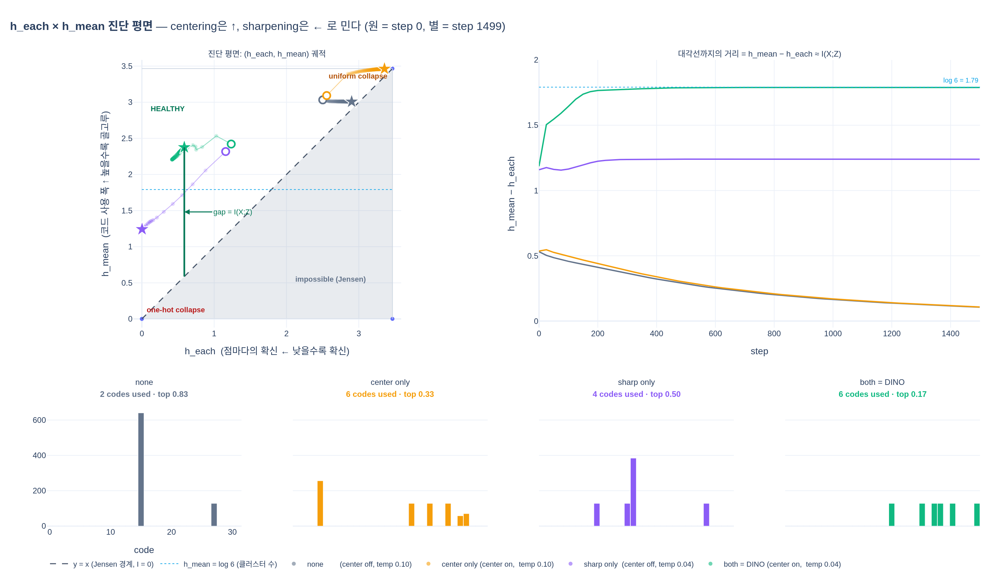
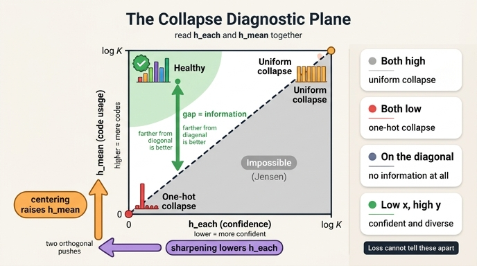

# `h_each`와 `h_mean`은 짝이다 — 붕괴 진단 평면 읽기

## 한 줄 문제

노트북 5절의 지표 표에는 이런 줄이 있다.

| 지표 | 뜻 | 원-핫 붕괴 | 균등 붕괴 | 건강 |
|---|---|---|---|---|
| `h_each` | 점 하나하나의 분포 엔트로피 평균 — "확신하는가" | ↓ 0 | ↑ log K | 낮음 |
| `h_mean` | 전체 점의 **평균** 분포의 엔트로피 — "차원을 골고루 쓰는가" | ↓ 0 | ↑ log K | log(클러스터 수) 근처 |

표를 세로로 읽으면 답이 나온다. **어느 한 열도 지표 하나만으로는 구분되지 않는다.**

- `h_each = 0`을 봤다고 하자. 원-핫 붕괴일 수도 있고, 건강한 상태일 수도 있다.
- `h_mean = \log K`를 봤다고 하자. 균등 붕괴일 수도 있고, 완벽한 상태일 수도 있다.

두 지표를 **좌표 하나**로 묶어야 비로소 상태가 특정된다. 그래서 이 카드는 두 값을 축으로 하는 **진단 평면(diagnostic plane)** 을 세우고, 그 평면 위에서 학습 궤적이 어디로 움직이는지를 읽는 법을 다룬다.

```python
hist["h_each"].append(entropy(q).mean().item())   # 먼저 엔트로피, 그다음 평균
hist["h_mean"].append(entropy(q.mean(0)).item())  # 먼저 평균, 그다음 엔트로피
```

코드로 보면 차이는 `entropy`와 `mean`의 **순서 하나**뿐이다. 그 순서가 바뀌면 재는 대상이 완전히 달라진다.

---

## 1. 평면의 뼈대 — 도달 가능한 영역은 삼각형 하나

$N$개의 점 각각에 대한 teacher 분포를 $q^{(1)}, \dots, q^{(N)} \in \Delta^{K-1}$이라 하고, 평균 분포를 $\bar q = \frac{1}{N}\sum_n q^{(n)}$이라 하자.

$$x \;=\; h_{\text{each}} \;=\; \frac{1}{N}\sum_{n} h\big(q^{(n)}\big), \qquad
y \;=\; h_{\text{mean}} \;=\; h(\bar q)$$

두 값 모두 엔트로피이므로 **범위는 $[0, \log K]$로 같다.** 축의 단위가 같다는 것이 이 평면의 첫 번째 축복이다 — 두 값을 그냥 빼도 뜻이 있다.

### 대각선 아래는 물리적으로 도달 불가

엔트로피 $h$는 **오목 함수(concave)** 다. Jensen 부등식에 의해

$$h\Big(\tfrac{1}{N}\textstyle\sum_n q^{(n)}\Big) \;\ge\; \tfrac{1}{N}\textstyle\sum_n h\big(q^{(n)}\big)
\qquad\Longleftrightarrow\qquad
\boxed{\,h_{\text{mean}} \;\ge\; h_{\text{each}}\,}$$

즉 평면 위의 점 $(x, y)$는 **항상 $y \ge x$** 다. 정사각형 $[0,\log K]^2$ 중 **대각선 위쪽 절반(삼각형)만 도달 가능**하고, 아래쪽 절반은 어떤 모델도 갈 수 없는 금지 구역이다.

expy에서 실제로 확인한다.

```
기록된 점 244개 중 gap < 0 인 점: 0개
gap 범위: [0.1065, 1.7893]
```

4개 설정 × 61개 로깅 스텝, 244개 점 전부가 대각선 위에 있다.

### 대각선까지의 수직 거리 = 정보량

입력 $X$를 균등하게 뽑고 코드 $Z \sim q^{(X)}$를 뽑는 채널로 보면, 두 지표는 정확히 조건부 엔트로피와 주변 엔트로피다.

$$h_{\text{each}} = H(Z \mid X), \qquad h_{\text{mean}} = H(Z)$$

따라서

$$h_{\text{mean}} - h_{\text{each}} \;=\; H(Z) - H(Z\mid X) \;=\; I(X; Z)$$

**대각선 $y = x$까지의 수직 거리가 곧 상호정보다.** 이게 이 평면의 핵심이고, 판독 규칙을 하나로 압축해 준다.

> **대각선에서 멀수록 좋다.** 대각선 위(=거리 0)는 출력이 입력에 대해 아무 정보도 담지 않는 상태다.

$I(X;Z)$의 상한은 두 개다. $I \le H(Z) \le \log K$ (코드 수의 한계)이고, 동시에 $I \le H(X)$ (입력에 실제로 존재하는 정보량). 노트북 토이는 6개 클러스터이므로 실질 상한이 $\log 6 = 1.792$이고, expy의 `both = DINO`가 **1.789** — 사실상 상한을 친다.

### 세 개의 특징적 위치

| 평면 위 위치 | $x$ | $y$ | $I$ | 이름 |
|---|---|---|---|---|
| 원점 $(0, 0)$ | 0 | 0 | 0 | **원-핫 붕괴** — 모든 점이 같은 한 차원을 확신 |
| 대각선 우상단 끝 $(\log K, \log K)$ | $\log K$ | $\log K$ | 0 | **균등 붕괴** — 모든 점이 $1/K$씩 |
| 좌상단 코너 $(0, \log K)$ | 0 | $\log K$ | $\log K$ | **이론적 최적** — 점마다 다른 차원을 확신, $K$개 코드 균등 사용 |
| 대각선 중간 아무 곳 | $t$ | $t$ | 0 | 이름 없는 **퇴화 상태** — 붕괴의 두 극단은 아니지만 정보는 0 |

마지막 줄이 이 평면을 그려야만 보이는 것이다. `none` 설정(centering도 sharpening도 없음)은 $(2.90, 3.01)$에 멈춘다. 원점도 아니고 $(\log K, \log K)$ 코너도 아니어서 표의 두 붕괴 유형 어디에도 딱 들어맞지 않는데, **대각선에 딱 붙어 있으므로 $I \approx 0.11$** — 정보량 기준으로는 붕괴와 다를 바 없다. 실제로 최종 코드는 2개뿐이고 한 코드가 데이터의 83%를 먹는다.

**정리하면 "붕괴 여부"는 $x$나 $y$의 절대값이 아니라 대각선까지의 거리가 결정한다.** 두 붕괴 유형은 그 대각선 위에서 어느 쪽 끝에 있느냐로 나뉠 뿐이다.

---

## 2. 왜 하나만으로는 안 되는가 — 반례 두 개

노트북 4절이 이미 반례를 만들어 뒀다.

```python
# (1) 원-핫 붕괴: 모든 샘플이 2번 차원에 큰 로짓
const = torch.zeros(B, out_dim); const[:, 2] = 50.0
# (3) 참고: 입력마다 다른 원-핫을 내는 '건강한' 경우
healthy = F.one_hot(torch.arange(B) % out_dim, out_dim).float() * 50.0
```

두 경우 모두 **`h_each = 0`이고 loss = 0.0000**이다. `h_each`만 보면 완전히 같아 보인다. 갈라지는 건 `h_mean`이다.

| 상황 | `h_each` | `h_mean` | $I$ | 판정 |
|---|---|---|---|---|
| (1) 모두 같은 원-핫 | 0 | 0 | 0 | 붕괴 |
| (3) 점마다 다른 원-핫 (8차원 균등) | 0 | $\log 8 = 2.079$ | 2.079 | 완벽 |

반대 방향의 반례도 만들 수 있다. `h_mean = \log K`인 두 상황:

| 상황 | `h_each` | `h_mean` | $I$ | 판정 |
|---|---|---|---|---|
| 모든 점이 균등분포 | $\log K$ | $\log K$ | 0 | 균등 붕괴 |
| 점마다 다른 원-핫, $K$개 코드 균등 사용 | 0 | $\log K$ | $\log K$ | 완벽 |

즉 **`h_each`는 세로 위치만, `h_mean`은 가로 위치만** 정해 준다. 평면 위의 한 점을 특정하려면 좌표 두 개가 다 있어야 한다는, 지극히 당연한 이야기가 그대로 진단 규칙이 된다.

---

## 3. 4가지 설정의 궤적 — 두 장치가 직교하는 두 방향으로 민다

노트북 5절의 `configs`는 centering / sharpening의 2×2 조합이다.

```python
configs = {
    "none        (center off, temp 0.1)":  dict(use_center=False, teacher_temp=0.1),
    "center only (center on,  temp 0.1)":  dict(use_center=True,  teacher_temp=0.1),
    "sharp only  (center off, temp 0.04)": dict(use_center=False, teacher_temp=0.04),
    "both = DINO (center on,  temp 0.04)": dict(use_center=True,  teacher_temp=0.04),
}
```

`temp 0.1`은 student 온도와 같으므로 **sharpening 없음**과 동치다. expy에서 각 1500 step 돌린 최종 좌표(`out_dim=32`, $\log K = 3.466$, 클러스터 6개):

| 설정 | $(x, y) = (h_{\text{each}}, h_{\text{mean}})$ | $I$ = 대각선 거리 | 사용 코드 | `top_share` | `code_acc` |
|---|---|---|---|---|---|
| none | $(2.90,\ 3.01)$ | **0.11** | 2 | 0.83 | 0.33 |
| center only | $(3.36,\ 3.46)$ | **0.11** | 6 | 0.33 | 0.83 |
| sharp only | $(0.00,\ 1.24)$ | **1.24** | 4 | 0.50 | 0.67 |
| both = DINO | $(0.59,\ 2.38)$ | **1.79** | 6 | 0.17 | 1.00 |

### 두 장치의 이동 벡터

`none`을 기준점으로 놓고 한 장치씩 켰을 때의 변화를 보면 방향이 갈린다.

$$\text{centering: } \Delta y = +0.455,\ \ \Delta x = +0.454 \qquad
\text{sharpening: } \Delta x = -2.898$$

- **centering은 위로 민다.** 배치 평균 EMA를 로짓에서 빼므로 늘 큰 차원이 스스로를 상쇄한다 → 코드가 골고루 쓰인다 → $y = h_{\text{mean}}$ ↑. (`none`의 사용 코드 2개 → `center only` 6개, `top_share` 0.83 → 0.33)
- **sharpening은 왼쪽으로 민다.** teacher 온도 $\tau_t = 0.04 < \tau_s = 0.1$이므로 teacher 분포가 뾰족해진다 → $x = h_{\text{each}}$ ↓. (`none`의 2.90 → `sharp only` 0.00)

문제는 **한 장치만 켜면 대각선에서 멀어지지 못하거나, 멀어져도 엉뚱한 데서 멈춘다**는 것이다.

- `center only`는 $y$를 올렸지만 $x$도 같이 끌려 올라가 $(\log K, \log K)$ 코너로 간다. **대각선을 따라 미끄러진 것**이지 대각선에서 멀어진 게 아니다 → $I$는 0.11 그대로. 전형적인 **균등 붕괴**다.
- `sharp only`는 $x$를 0으로 내려 $I$를 1.24까지 벌었다. 그런데 $y$가 1.24에서 멈춘다 — 코드 4개에 6개 클러스터가 뭉치고, 한 코드가 데이터의 50%를 먹는다. **원-핫 붕괴로 내려가는 중**이고, 더 돌리면 원점 쪽으로 계속 끌려간다.
- `both`만이 $x$를 내리면서 동시에 $y$를 지켜 **좌상단(건강 영역)** 에 도달한다. $I = 1.789$로 상한 $\log 6 = 1.792$에 붙고, 6개 코드가 6개 클러스터에 1:1로 붙어 `code_acc = 1.00`이다.

두 장치의 이동 방향이 **거의 직교**하기 때문에(하나는 $y$축 방향, 하나는 $x$축 방향) 둘을 합성해야 대각선에서 수직으로 멀어질 수 있다. 하나만으로는 대각선을 따라 굴러가거나 대각선 아래로 갈 수 없어 막힌다. 논문의 "centering prevents one dimension to dominate but encourages collapse to the uniform distribution, while the sharpening has the opposite effect"가 평면 위에서는 **직교하는 두 화살표**로 보인다.

### 궤적의 시간 흐름

정적인 최종 좌표보다 **궤적의 모양**이 더 많은 걸 말해 준다. expy의 진단 평면 그림에서 원(●)이 step 0, 별(★)이 step 1499다.

- **초기값은 넷 다 대각선 근처 우상단**이다. 랜덤 초기화된 MLP의 출력은 로짓 격차가 작아 거의 균등분포이므로, $x \approx y \approx \log K$에서 시작한다. 즉 **모든 학습은 균등 붕괴 코너에서 출발한다.**
- `none` / `center only`: 거의 움직이지 않는다. 대각선에 붙은 채로 우상단을 맴돈다. 대각선 거리 곡선을 보면 $I$가 0.53에서 **오히려 0.11로 감소**한다 — 학습이 진행될수록 정보가 사라진다.
- `sharp only`: 대각선을 떠나 왼쪽 아래로 길게 내려간다. $I$가 초기 1.17에서 1.24로 살짝 오르고 평평해지지만, 좌표는 계속 원점 방향이다.
- `both`: 초기 100~300 step 사이에 $I$가 1.2 → 1.79로 **급격히 상승**한 뒤 상한에 붙어 유지된다. 좌표는 좌상단에서 안정된다.

**궤적이 대각선에서 멀어지다가 멈추면 학습이 끝난 것이고, 대각선으로 되돌아오면 붕괴가 시작된 것이다.** 스칼라 하나로 보고 싶다면 $I = h_{\text{mean}} - h_{\text{each}}$ 곡선을 로깅하면 된다 — expy의 두 번째 패널이 그것이다.

---

## 4. loss는 이 평면을 못 본다

노트북이 강조하는 함정과 정확히 겹친다.

$$H(q, p) = h(q) + D_{KL}(q \Vert p)$$

loss의 하한은 $h(q)$의 평균, 즉 **$h_{\text{each}}$ 그 자체**다. student가 teacher를 완벽히 따라가면 $\text{loss} \to h_{\text{each}}$.

- `sharp only`: $h_{\text{each}} = 0$ → loss가 0 근처(≈0.2)까지 내려간다.
- `both = DINO`: $h_{\text{each}} = 0.59$ → loss는 그보다 낮아질 수 없다(≈0.8).

**loss가 낮은 쪽이 표현은 훨씬 나쁘다.** loss는 $x$축(한 축)의 하한에 불과하고 $y$축은 아예 보지 않기 때문이다. 진단 평면에서 loss는 "왼쪽으로 갈수록 작아지는 값"일 뿐, 위/아래는 구분하지 못한다. 붕괴를 잡으려면 $y$를 따로 로깅하는 수밖에 없다.

---

## 5. 실전 판독 체크리스트

$L = \log K$라 하자 (DINO 기본 `--out_dim=65536`이면 $L = 11.09$).

### 사분면별 조치

| 관측 | 평면 위 위치 | 진단 | 조치 |
|---|---|---|---|
| $x \to 0$, $y \to 0$ | 원점 | **원-핫 붕괴** | centering 확인 — `dist.all_reduce`가 실제로 도는가, `center` 버퍼가 0이 아닌가. `center_momentum` 0.9 → 0.8로 낮춰 반응 빠르게. 배치 키우기. `teacher_temp` warmup을 더 길게(초기 sharpening 약화) |
| $x \to L$, $y \to L$ | 우상단 코너 | **균등 붕괴** | sharpening 강화 — `teacher_temp` 낮추기, $\tau_t < \tau_s$ 유지 확인. warmup 종료 온도가 너무 높지 않은지. centering만 켜 놓지 않았는지 |
| $y - x \approx 0$ (위치 무관) | 대각선 위 어디든 | **정보 없음** (넓은 의미의 붕괴) | 두 장치 다 확인. 붕괴 유형 이름을 붙일 필요 없이 $I$가 0이면 이미 실패 |
| $x$ 낮고 $y$ 높음, $y - x$ 크고 안정 | 좌상단 | **건강** | 유지. $y$가 예상 클래스 수의 log 근처인지 확인 |
| $y - x$가 커졌다가 **줄어들기 시작** | 대각선으로 복귀 중 | **붕괴 시작** | 조기 경보. 체크포인트 롤백 후 온도/센터 조정 |

### 로깅 코드

```python
with torch.no_grad():
    q = F.softmax((teacher_out - loss_fn.center) / teacher_temp, dim=-1)  # 학습과 동일한 파이프라인
    h_each = -(q * q.clamp_min(1e-12).log()).sum(-1).mean()
    qbar   = q.mean(0)
    h_mean = -(qbar * qbar.clamp_min(1e-12).log()).sum()
    log(h_each=h_each, h_mean=h_mean, mutual_info=h_mean - h_each)
```

### 함정 네 가지

1. **`h_mean`은 표본 수에 강하게 의존한다.** $N$개 샘플의 평균 분포는 엔트로피가 최대 $\log N$까지밖에 못 간다(정확히는 서로 다른 코드가 $N$개를 넘을 수 없다). $K = 65536$인데 배치 256으로 재면 $h_{\text{mean}} \le \log 256 = 5.55$로 천장이 걸려 **건강한 모델도 균등 붕괴가 아닌 것처럼 낮게 나온다.** 여러 배치를 누적하거나 검증셋 전체로 재라.
2. **`h_each`는 배치 크기와 무관하다.** 점별 엔트로피의 평균이라 표본이 적어도 편향이 없다. 두 지표의 통계적 성질이 다르다는 점 자체가 함정이다.
3. **centering을 켰으면 지표도 centering된 $q$로 재라.** 노트북의 `teacher_dist`가 `use_center`를 인자로 받는 이유다. raw 로짓의 softmax로 재면 loss가 실제로 보는 분포와 다른 걸 재게 된다.
4. **$y$의 목표치는 $\log K$가 아니라 $\log(\text{실질 클래스 수})$다.** 토이에서 건강한 `both`의 $y = 2.38$은 $\log 32 = 3.47$에 한참 못 미치지만 $\log 6 = 1.79$보다는 높다 — 6개 클러스터를 6개 코드로 나눈 뒤 각 코드가 약간씩 퍼져 있는 정상 상태다. $y$가 $\log K$에 **딱 붙으면** 오히려 균등 붕괴를 의심하라.

---

## 한 줄 요약

$h_{\text{each}} = H(Z\mid X)$와 $h_{\text{mean}} = H(Z)$를 두 축으로 놓으면 Jensen에 의해 $h_{\text{mean}} \ge h_{\text{each}}$이므로 **대각선 위쪽 삼각형만 도달 가능**하고, 대각선까지의 수직 거리가 곧 $I(X;Z)$다. 원점은 원-핫 붕괴, $(\log K, \log K)$는 균등 붕괴, **대각선에서 멀리 떨어진 좌상단이 건강**이며, centering은 $y$를 올리고 sharpening은 $x$를 내려 **직교하는 두 방향으로** 점을 좌상단으로 민다. 지표 하나만 보면 $(0,0)$과 $(0,\log K)$가, 또는 $(\log K,\log K)$와 $(0,\log K)$가 구별되지 않는다 — 그래서 짝으로 봐야 한다.

## 시각화



## 인포그래픽


