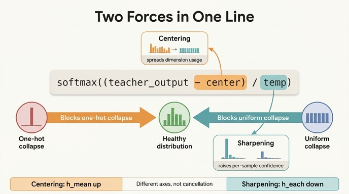

# 한 줄 안의 두 힘 — centering과 sharpening

**Q.** `teacher_out = F.softmax((teacher_output - self.center) / temp, dim=-1)` 한 줄에서 두 장치는 각각 어디인가?
**A.** `- self.center` 가 **centering**, `/ temp` 가 **sharpening**. 서로 반대 방향으로 밀어 균형을 만든다.

---

## 1. 한 줄을 두 조각으로

```python
teacher_out = F.softmax((teacher_output - self.center) / temp, dim=-1)
#                        └─ 원본 로짓 ─┘  └ centering ┘   └ sharpening ┘
#                                          ↑ 뺄셈          ↑ 나눗셈
#                                          평행이동         스케일링
```

`main_dino.py:387` — `DINOLoss.forward` 안의 주석도 딱 한 줄이다: `# teacher centering and sharpening`.

문법적으로도 대칭이다. 하나는 **덧셈군**(로짓의 평행이동), 하나는 **곱셈군**(로짓의 스케일). softmax 입력에 가할 수 있는 아핀 변환 $z \mapsto (z - c)/\tau$ 의 두 성분을 정확히 하나씩 나눠 가졌다.

---

## 2. 대칭 정리표 — 이 카드의 중심

| | **centering** | **sharpening** |
|---|---|---|
| **코드 위치** | `- self.center` | `/ temp` |
| **수식상 연산** | $z \mapsto z - c$ (평행이동, 덧셈) | $z \mapsto z/\tau_t$ (스케일, 곱셈) |
| **하는 일** | 배치 평균 로짓의 EMA를 빼서, **늘 큰 차원의 우위를 상쇄** | teacher 온도를 student보다 낮춰 **분포를 뾰족하게** |
| **작용하는 축** | 차원 **간** 비교 (누가 자주 뽑히나) | 한 분포 **내** 대비 (얼마나 확신하나) |
| **막는 붕괴** | **원-핫 붕괴** (한 차원이 지배) | **균등 붕괴** (모든 차원이 1/K) |
| **혼자 두면 가는 곳** | **균등 붕괴** ($h \to \log K$) | **원-핫 붕괴** ($h \to 0$) |
| **드러나는 지표** | $h_{\text{mean}}$ — 배치 평균 분포의 엔트로피 | $h_{\text{each}}$ — 점별 분포 엔트로피의 평균 |
| **혼자 걸었을 때 실측** | $\Delta h_{\text{mean}} = \mathbf{+0.455}$ | $\Delta h_{\text{each}} = \mathbf{-2.898}$ |
| **상태(state)** | 있음 — `register_buffer("center", ...)`, 학습 중 갱신 | 없음 — 스케줄된 스칼라 하이퍼파라미터 |
| **시간 상수** | EMA momentum $m=0.9$ → $\tfrac{1}{1-m} \approx$ **10 스텝** | `teacher_temp_schedule` → **30 epoch** 선형 warmup (0.04 → 0.07) |
| **성격** | **적응형 피드백** (모델 출력을 보고 반응) | **고정 편향** (모델과 무관하게 항상 같은 방향) |
| **논문 근거** | Eq. (4), $c \leftarrow mc + (1-m)\frac{1}{B}\sum_i g_{\theta_t}(x_i)$ | §3.1 "low value for the temperature $\tau_t$" |
| **깨지는 하이퍼파라미터** | $m = 0.999$ (너무 느림) → 붕괴, k-NN 0.1 | $\tau_t > 0.06$ → loss가 $\ln K$로 수렴, k-NN 0.1 |

두 행이 **모든 칸에서 정확히 반대**다. 이게 이 한 줄의 설계다.

---

## 3. 왜 "반대 방향"인가 — 정량적으로

### 진단 평면 $(h_{\text{each}},\, h_{\text{mean}})$

토이 실험(`dino_collapse_cross_entropy.py` §5, `out_dim=32`, $\log K = 3.466$)의 1500스텝 후 최종값:

| config | $h_{\text{each}}$ | $h_{\text{mean}}$ | top_share | code_acc | loss |
|---|---|---|---|---|---|
| `none` (둘 다 없음) | 2.901 | 3.008 | 0.833 | 0.33 | 2.91 |
| `center only` | **3.355** | **3.463** | 0.333 | 0.83 | 3.37 |
| `sharp only` | **0.003** | **1.242** | 0.500 | 0.67 | 0.22 |
| `both` = DINO | 0.587 | 2.376 | **0.167** | **1.00** | 0.82 |

`none`을 원점 삼아 각 장치를 **하나씩** 켰을 때의 이동:

$$\text{centering}:\quad \Delta h_{\text{mean}} = +0.455,\qquad \Delta h_{\text{each}} = +0.454$$
$$\text{sharpening}:\quad \Delta h_{\text{each}} = -2.898,\qquad \Delta h_{\text{mean}} = -1.765$$

읽는 법:

- **centering의 주효과는 $h_{\text{mean}}$ 축**이다. 3.008 → 3.463 = $\log K$에 거의 붙었다. "32개 차원을 완전히 골고루 쓴다". 동시에 `top_share`가 0.833 → 0.333으로 무너진다 — **한 차원 지배가 해체됐다**. 이게 원-핫 붕괴를 막은 증거.
- **sharpening의 주효과는 $h_{\text{each}}$ 축**이다. 2.901 → 0.003. 모든 점이 완벽한 원-핫이 됐다. "확신을 갖게 만든다". 이게 균등 붕괴를 막은 증거.
- **크기가 다르다.** sharpening의 $|\Delta| = 2.898$ 이 centering의 $0.455$ 보다 6배 이상 크다. $\tau$는 지수 안에서 곱셈으로 작용하고 $c$는 덧셈으로 작용하니 당연하다. 두 힘은 **대칭이되 등강도는 아니다** — 그래서 균형점이 정확히 중간이 아니라 $h_{\text{each}}=0.587$(낮은 쪽), $h_{\text{mean}}=2.376$(높은 쪽)에 잡힌다.

### 논문의 같은 그림

DINO 논문 §5.3 Fig. 7이 ImageNet에서 보여주는 것도 동일하다.

> The centering avoids the collapse induced by a dominant dimension, but encourages an uniform output. Sharpening induces the opposite effect. (§3.1 / §5.3)

> the entropy $h$ converges to different values: **0 with no centering** and **$-\log(1/K)$ with no sharpening**, indicating that both operations induce different form of collapse. Applying both operations balances these effects.

논문은 $h(P_t)$ 한 축만 그렸지만, 그 축 위에서 두 설정이 **정반대 끝**($0$ vs $\log K$)으로 간다는 것이 곧 두 힘이 반대 방향이라는 말이다.

---

## 4. 균형점은 왜 존재하는가 — "상쇄"가 아니라 "분업"

여기가 이 카드의 핵심 논점이다.

**두 힘이 같은 축에서 반대로 밀었다면, 결과는 그냥 상쇄다.** 스칼라 하나에 $+a$와 $-a$를 더하면 아무 일도 안 일어난다. 강도가 다르면 둘 중 센 쪽으로 끌려갈 뿐, 안정된 중간 상태는 없다.

DINO가 안정한 이유는 두 힘이 **서로 다른 자유도**에 걸려 있기 때문이다.

- $h_{\text{each}}$ = "각 샘플이 얼마나 확신하는가" — **분포 내부**의 대비
- $h_{\text{mean}}$ = "32개 차원을 얼마나 골고루 쓰는가" — **샘플 간** 다양성

이 둘은 논리적으로 독립이다. 네 조합이 모두 존재한다:

| | $h_{\text{mean}}$ 낮음 (차원 편중) | $h_{\text{mean}}$ 높음 (골고루) |
|---|---|---|
| **$h_{\text{each}}$ 낮음** (확신) | 원-핫 붕괴 — 모두 같은 차원 | **건강** — 점마다 다른 차원을 확신 있게 |
| **$h_{\text{each}}$ 높음** (애매) | 애매하게 한쪽으로 쏠림 (`none`이 여기) | 균등 붕괴 — 모두 1/K |

건강한 상태는 **$h_{\text{each}}$↓ 이면서 $h_{\text{mean}}$↑** 인 오른쪽 위 칸이다. 이 칸에 도달하려면 두 축을 **각각** 눌러야 한다. sharpening이 $h_{\text{each}}$를 내리고, centering이 $h_{\text{mean}}$을 올린다. 서로의 목표를 방해하지 않으므로 둘 다 자기 일을 끝까지 할 수 있고, 그 지점이 고정점이 된다.

실측이 이 분업을 확인해 준다:

- `sharp only`(0.003, 1.242) → centering 추가 → `both`(0.587, 2.376): **$h_{\text{mean}}$ +1.13**, $h_{\text{each}}$는 +0.58만 올라감. centering이 자기 축을 두 배 더 세게 민다.
- `center only`(3.355, 3.463) → sharpening 추가 → `both`: **$h_{\text{each}}$ −2.77**, $h_{\text{mean}}$은 −1.09. sharpening도 자기 축을 두 배 이상 더 세게 민다.

완전한 직교는 아니다(각자 상대 축에도 절반 정도 새어 나간다). 하지만 **주효과가 서로 다른 축에 있다**는 것으로 충분하다 — 이게 안정된 중간 상태를 만든다. 붕괴한 두 설정에서 `code_acc`가 0.83 / 0.67인 반면, `both`에서만 **1.00**(6개 코드가 6개 클러스터에 1:1)이 나오는 이유다.

> **한 줄 요약**: centering과 sharpening은 줄다리기가 아니라 **직교하는 두 손잡이**다. 줄다리기라면 승자만 남지만, 손잡이 두 개면 원하는 지점에 세울 수 있다.

---

## 5. 연산 순서 — 두 장치는 완전히 독립이 아니다

코드를 다시 보면 괄호가 중요하다.

```python
(teacher_output - self.center) / temp        # 빼고 → 나눈다
```

빼기가 **먼저**, 나누기가 **나중**이다. 그래서 center도 $1/\tau$ 배로 증폭된다.

$$\text{softmax}\!\left(\frac{z - c}{\tau}\right)_i = \frac{e^{z_i/\tau}\cdot e^{-c_i/\tau}}{\sum_j e^{z_j/\tau}\cdot e^{-c_j/\tau}}$$

즉 centering은 **차원별 곱셈 가중치 $e^{-c_i/\tau}$** 로 작용하고, 그 가중치의 스프레드는 $\tau$에 지수적으로 의존한다. center의 최대–최소 폭이 $\Delta c$ nats일 때 가중치 비율은

$$\frac{\max_i e^{-c_i/\tau}}{\min_i e^{-c_i/\tau}} = e^{\Delta c/\tau}$$

### 수치로

$K=32$, 두 차원이 살짝 지배하는 로짓 배치(원-핫 붕괴 조짐), 수렴한 center의 스프레드 $\Delta c = 1.548$ nats:

| $\tau$ | 재가중 비율 $e^{\Delta c/\tau}$ | centering의 $\Delta h_{\text{mean}}$ | centering의 $\Delta h_{\text{each}}$ (부작용) |
|---:|---:|---:|---:|
| 1.00 | $4.7$ | +0.085 | +0.083 |
| 0.50 | $2.2 \times 10^{1}$ | +0.431 | +0.358 |
| 0.20 | $2.3 \times 10^{3}$ | +1.223 | +0.487 |
| 0.10 | $5.3 \times 10^{6}$ | +1.451 | +0.245 |
| **0.07** | $4.0 \times 10^{9}$ | **+1.487** | +0.159 |
| 0.06 | $1.6 \times 10^{11}$ | +1.496 | +0.132 |
| **0.04** | $6.4 \times 10^{16}$ | **+1.510** | +0.083 |

(온도만 바꾸고 center는 고정. $\log K = 3.466$)

읽을 점 셋:

1. **같은 center인데 $\tau$가 작아질수록 centering이 더 세게 작동한다.** $\tau=1$에서 $h_{\text{mean}}$을 0.085밖에 못 올리던 것이 $\tau=0.04$에서는 1.510을 올린다 — 18배. **sharpening을 켤수록 centering도 자동으로 세진다.**
2. 재가중 비율은 $\tau$가 절반이 되면 **제곱**된다($e^{\Delta c/\tau} \to (e^{\Delta c/\tau})^2$). warmup에서 $\tau_t$를 0.04 → 0.07로 올리는 것은 centering의 실효 강도를 $10^{16} \to 10^{9}$ 로, **7자릿수** 낮추는 일이기도 하다.
3. 대신 $h_{\text{each}}$ 부작용은 $\tau \approx 0.2$에서 정점(+0.487)을 찍고 다시 줄어든다. 낮은 $\tau$ 영역에서 centering은 **자기 축($h_{\text{mean}}$)에 집중되고 상대 축은 덜 건드린다** — 즉 DINO의 운용 온도대($0.04\sim0.07$)가 두 장치의 분업이 가장 깨끗한 구간이다. 설계가 우연이 아니다.

### 그래서 무엇이 어려워지는가

$\tau_t$는 **자기 자신의 강도와 centering의 강도를 동시에** 조절한다. 하이퍼파라미터 두 개가 실효적으로 얽혀 있다는 뜻이고, 논문의 ablation이 좁은 창을 보이는 이유이기도 하다.

- $\tau_t > 0.06$ → loss가 $\ln K$로 수렴(균등 붕괴). sharpening이 약해서만이 아니라, centering의 실효 강도까지 함께 약해져 균등 쪽으로 더 밀린다.
- $\tau_t \to 0$ → `argmax` 연산이 되어 하드 원-핫. 이때 centering은 "argmax 전에 $c$를 뺀다"는 **이산적 타이브레이커**로 퇴화한다 — 강도 조절이 불가능해진다.
- 그래서 실제로는 **warmup으로 $\tau_t$를 천천히 올린다**: 첫 30 epoch 동안 0.04 → 0.07 선형 증가(`teacher_temp_schedule`). 초기에는 sharpening을 세게 걸어 균등 쪽으로 무너지는 것을 막고, center가 의미 있는 값으로 수렴한 뒤 완화한다.
- 반대편 손잡이인 $m$(center momentum)은 0 / 0.9 / 0.99에서 k-NN 69.1 / 69.7 / 69.4 로 **둔감**하지만, $m=0.999$에서 0.1로 붕괴한다. center가 배치 통계를 못 따라가면 centering이 사실상 꺼진다.

> `MiniDINOLoss`가 `use_center=False`일 때 `center = 0.0`을 대입하는 것도 같은 이유다 — centering을 끄는 것은 $c = \mathbf{0}$ 으로 두는 것과 정확히 같다. 그리고 $c$가 상수 벡터(모든 성분이 같음)여도 softmax는 평행이동에 불변이므로 아무 효과가 없다. **centering이 하는 일은 $c$의 "평균"이 아니라 "스프레드"** 다.

---

## 6. 이 한 줄이 DINO의 전부인가

아니다. 이 한 줄은 **붕괴 방지 장치**의 전부지, DINO의 전부는 아니다. 그리고 이 한 줄조차 혼자서는 작동하지 않는다.

### (a) 이 줄이 성립하려면 반드시 필요한 것: EMA teacher

논문의 문장에 조건절이 붙어 있다.

> Applying both operations balances their effects which is sufficient to avoid collapse **in presence of a momentum teacher**. (§3.1)

Table 15가 이를 못 박는다 — momentum encoder를 빼고 centering만 쓰면 ImageNet linear **0.1%** (완전 붕괴). teacher를 EMA로 천천히 움직이게 하는 것이 이 한 줄의 **전제**다. 왜냐하면 이 줄의 두 연산은 teacher 출력을 *가공*할 뿐, teacher가 student를 순간적으로 따라가 버리면 가공할 신호 자체가 없기 때문이다. (`sharp only`의 loss 0.22가 `both`의 0.82보다 **낮다**는 토이의 관찰 — loss는 붕괴를 못 잡는다 — 도 같은 맥락이다. 판정은 KL / `code_acc` / k-NN이 한다.)

### (b) 이 줄과 무관하게, 성능을 위해 필요한 것

| 요소 | 이 한 줄과의 관계 | 근거 |
|---|---|---|
| **EMA teacher** ($m: 0.996 \to 1$) | **필수 전제.** 없으면 이 줄이 있어도 붕괴 | Table 15 row 4 → 0.1% |
| **multi-crop** (global 2 + local 8) | 붕괴 방지와 **무관**. 표현 품질용 (빼면 2–4% 하락). 다만 `ncrops`가 loss의 항 수를 정하므로 이 줄 바로 아래 루프와 얽힘 | Table 7 row 4-5 |
| **`out_dim=65536`** | 이 줄의 $K$. 크면 sharpening이 걸 수 있는 여지($\log K$ 범위)가 넓어짐. 붕괴 자체를 막지는 않음 | `--out_dim` 기본값 |
| **`freeze_last_layer=1`** | 첫 epoch 동안 head의 마지막 층 gradient를 죽인다. center가 수렴하기 전 prototype이 폭주하는 것을 막는 **보조 안전장치** | `--freeze_last_layer` help |
| **`norm_last_layer`** | 마지막 층 weight normalization. 안정성 ↔ 성능 트레이드오프 | ViT-B는 True, ViT-S는 False |
| **student_temp = 0.1** | sharpening의 **기준선**. `/ temp`가 sharpening인 이유는 절대값 0.04가 아니라 $\tau_t < \tau_s$ 라는 **부등호** 때문. 토이의 `temp 0.1` 설정이 "sharpening 없음"인 이유가 이것 | `DINOLoss.__init__` |
| **predictor / BN / contrastive loss** | **불필요.** 다른 방법들이 붕괴 방지에 쓰는 장치들인데 DINO에서는 효과가 미미 | Table 7 row 6, Table 14 |

### 정리

$$\underbrace{\text{EMA teacher}}_{\text{신호 존재의 전제}} \;+\; \underbrace{\text{centering} \;\perp\; \text{sharpening}}_{\text{이 한 줄 — 붕괴 방지}} \;+\; \underbrace{\text{multi-crop},\; K{=}65536}_{\text{표현 품질}}$$

이 한 줄은 "DINO가 무너지지 않는 이유"의 전부다. "DINO가 잘 되는 이유"는 여기에 EMA teacher와 multi-crop이 더해져야 한다.

---

## 7. 외울 것

```
- self.center   →  centering  →  h_mean ↑  →  원-핫 붕괴를 막는다  →  혼자 두면 균등으로
/ temp          →  sharpening →  h_each ↓  →  균등 붕괴를 막는다   →  혼자 두면 원-핫으로
```

- 뺄셈 = centering, 나눗셈 = sharpening. **위치가 곧 정체성**이다.
- 두 힘은 **상쇄되지 않는다**. 서로 **다른 축**을 담당하기 때문에 중간에 설 수 있다.
- 빼기가 먼저이므로 center도 $1/\tau$ 배 증폭된다 — **두 손잡이는 완전히 독립이 아니다**.

---

## 인포그래픽


