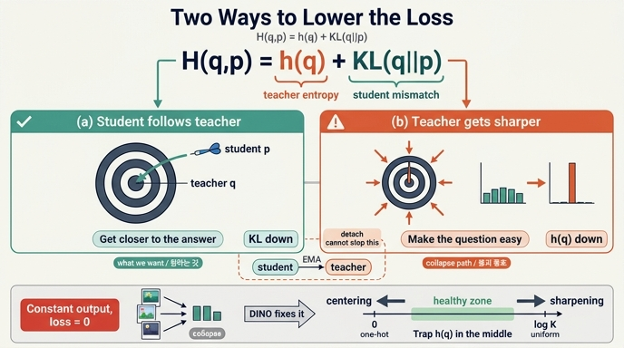

# $H(q,p) = h(q) + KL(q\|p)$ — loss를 낮추는 두 갈래 길

## 질문

$H(q,p) = h(q) + KL(q\|p)$ 분해가 드러내는, loss를 낮추는 두 가지 경로는?

## 답

- **(a)** $KL(q\|p) \downarrow$ : $p \to q$, student가 teacher를 따라간다.
- **(b)** $h(q) \downarrow$ : teacher 분포 자체를 뾰족하게 만든다.

우리가 원하는 건 **(a)뿐**이다. (b)는 붕괴(collapse)로 가는 통로다.

---

## 1. 분해식이 왜 두 갈래를 만드는가

DINO의 loss는 teacher 출력 $q$를 정답 자리에 놓고 student 출력 $p$를 채점하는 교차엔트로피다.

$$H(q,p) = -\sum_i q_i \log p_i$$

여기에 $\log p_i = \log q_i - (\log q_i - \log p_i)$를 끼워 넣으면 정확히 두 항으로 갈라진다.

$$H(q,p) = \underbrace{-\sum_i q_i \log q_i}_{h(q)} + \underbrace{\sum_i q_i \log \frac{q_i}{p_i}}_{KL(q\|p)}$$

$$\Rightarrow\quad H(q,p) = h(q) + KL(q\|p)$$

두 항 모두 $\ge 0$이고, 각각 **독립적으로** 줄일 수 있다. 최적화기 입장에서 loss는 그냥 하나의 숫자이므로, 어느 항을 깎아 숫자를 낮추든 상관하지 않는다. **이 "상관하지 않음"이 문제의 핵심이다.**

| 항 | 의미 | 0이 되는 조건 |
|---|---|---|
| $KL(q\|p)$ | student가 teacher와 **다른 정도** | $p = q$ (완벽히 따라감) |
| $h(q)$ | teacher 분포의 **퍼진 정도** | $q$가 원-핫 (완전히 뾰족) |

$H(q,p)=0$이 되려면 두 조건이 **동시에** 성립해야 한다: $p = q$이면서 $q$가 원-핫.

## 2. 두 항은 각각 누구의 파라미터가 움직이는가

이게 이 카드의 진짜 핵심이다.

- $KL(q\|p)$ — $p$가 들어 있으므로 **student 파라미터**가 지배한다. gradient가 직접 흐른다.
- $h(q)$ — $q$만 들어 있으므로 **teacher 파라미터**가 지배한다.

코드를 보면 teacher 쪽은 `detach()` 되어 있다.

```python
teacher_out = F.softmax((teacher_output - center) / self.teacher_temp, dim=-1)
teacher_out = teacher_out.detach().chunk(2)      # ← gradient 차단
```

그러면 (b)는 막힌 것 아닌가? **아니다.** teacher는 student의 EMA이기 때문이다.

```python
for ps, pt in zip(student.parameters(), teacher.parameters()):
    pt.mul_(m).add_((1 - m) * ps)                # m = 0.996
```

즉 **teacher = 시간축으로 지연된 student**다. student가 자기 파라미터를 어떤 방향으로 밀면, 몇 스텝 뒤 teacher도 같은 방향으로 따라온다. `detach()`가 막는 것은 *이번 스텝의 gradient 경로*일 뿐이고, EMA는 그 경로를 **시간을 통해 우회**시킨다.

> 정리하면: (b)는 한 스텝 안에서는 gradient가 흐르지 않아 안 보이지만, 학습 궤적 전체에서 보면 student가 밀 수 있는 방향 안에 포함되어 있다. `detach()`는 (b)를 막지 못한다.

## 3. 비유 — "정답에 가까워지기" vs "문제를 쉽게 만들기"

시험 상황으로 옮기면 이렇다.

| | (a) $KL \downarrow$ | (b) $h(q) \downarrow$ |
|---|---|---|
| 하는 일 | 학생이 공부해서 **정답에 가까워진다** | 출제자가 **문제를 쉽게 만든다** |
| 손실 감소 | 정당한 방법 | 치트 |
| DINO에서 | student가 teacher의 뷰-불변 표현을 학습 | teacher가 입력과 무관하게 늘 같은 답만 내놓음 |

문제는 DINO에서 **출제자와 학생이 같은 사람**이라는 것이다 (teacher는 student의 EMA). 그러니 "학생이 출제자를 설득해 문제를 쉽게 만드는" 담합이 구조적으로 가능하다. 두 네트워크가 굳이 이미지를 보지 않고 "우리 그냥 항상 3번 찍자"라고 합의하면, 그 순간 (a)와 (b)가 동시에 만족되어 loss는 **정확히 0**이 된다.

## 4. 노트북 2절 — 숫자로 보는 두 갈래

노트북 2절의 표에서 마지막 두 줄이 두 붕괴 상태의 정체다 ($K=8$).

| case | $H(q,p)$ | $h(q)$ | $KL$ | 읽는 법 |
|---|---|---|---|---|
| `q=uniform, p=uniform` | 2.079 | 2.079 | 0 | (a)만 달성. student는 teacher를 완벽히 따라갔는데 **teacher가 아무 말도 안 한다** → 균등 붕괴 |
| `q=one_hot, p=one_hot` | **0.000** | 0 | 0 | (a)+(b) 동시 달성. **완벽한 점수** → 원-핫 붕괴 |

균등 붕괴는 (b)를 못 써서 loss가 $\log K$에서 멈춘 상태다. 반대로 (b)를 끝까지 밀어붙이면 loss = 0에 도달한다 — **(b)가 훨씬 매력적인 경로**라는 뜻이고, 그래서 아무 장치 없이 두면 학습은 (b) 쪽으로 끌려간다.

## 5. 노트북 4절 — 자명해: 입력을 안 봐도 loss가 0

4절은 학습조차 하지 않고, "네트워크가 입력과 무관하게 항상 같은 로짓을 낸다"고 가정해 loss를 계산한다.

```python
const = torch.zeros(B, out_dim); const[:, 2] = 50.0   # 모든 샘플이 2번 차원에 큰 로짓
s_out = torch.cat([const, const]); t_out = s_out.clone()
loss_fn(s_out, t_out)          # → 0.0000   ← 완벽한 점수

zeros = torch.zeros(2 * B, out_dim)
loss_fn(zeros, zeros)          # → 2.0794 = log 8,  KL은 0

healthy = F.one_hot(torch.arange(B) % out_dim, out_dim).float() * 50.0
loss_fn(...)                   # → 0.0000   ← 건강한 모델도 0
```

여기서 나오는 두 가지 결론:

1. **원-핫 붕괴의 loss = 0.** 입력을 한 번도 보지 않는 상수 함수가 loss 기준으로 최적해다. 이게 "자명해(trivial solution)"다.
2. **붕괴한 모델(1)과 건강한 모델(3)의 loss가 똑같이 0이다.** loss는 "입력이 출력을 바꾸는가"를 전혀 보지 않는다. 그래서 loss 곡선만으로는 붕괴를 감지할 수 없고, 실전에서 `eval_knn.py`나 $h_\text{each}$ / $h_\text{mean}$ / $top\_share$ 같은 별도 지표를 로깅해야 한다.

노트북 5절에서 실제 학습으로 확인되는 반전이 이걸 못 박는다: `sharp only` 설정의 최종 loss($\approx 0.2$)가 제대로 학습된 `both = DINO`($\approx 0.8$)보다 **낮다**. 표현 품질은 정반대인데 loss는 거꾸로 말한다.

## 6. 그래서 DINO는 (b)를 두 방향에서 막는다

(b)를 막는다는 건 "teacher 분포가 붕괴 상태로 가는 것을 막는다"는 뜻이다. 그런데 붕괴에는 **방향이 반대인 두 종류**가 있다.

| 붕괴 유형 | teacher 출력 | $h(q)$ | 배치 평균의 엔트로피 |
|---|---|---|---|
| **원-핫 붕괴** | 모든 입력 → 같은 차원 하나 | $\to 0$ | $\to 0$ |
| **균등 붕괴** | 모든 입력 → $1/K$씩 | $\to \log K$ | $\to \log K$ |
| 건강한 상태 | 입력마다 다른, 적당히 뾰족한 분포 | 중간 | 높음 |

방향이 반대이므로 장치도 반대 방향으로 **두 개**가 필요하다. 그리고 그 둘은 코드 한 줄 안에 나란히 들어 있다.

```python
teacher_out = F.softmax((teacher_output - self.center) / temp, dim=-1)
#                        └── centering ──────────────┘   └ sharpening
```

| 장치 | 하는 일 | 막는 것 | 혼자 두면 |
|---|---|---|---|
| **centering** | 배치 평균(EMA)을 로짓에서 뺀다. 늘 큰 차원은 center도 커져 상쇄된다 | **원-핫 방향** 차단 | 균등 붕괴로 간다 |
| **sharpening** | teacher 온도(0.04) < student 온도(0.1) | **균등 방향** 차단 | 원-핫 붕괴로 간다 |

즉 DINO는 (b)를 "금지"하는 게 아니라, $h(q)$를 **양쪽에서 밀어 중간 구간에 가둔다**. $h(q)$가 위아래로 못 움직이게 되면 loss를 낮추는 길은 사실상 (a)밖에 남지 않는다 — 이게 원하는 결과다.

노트북 5절의 4가지 조합 실험이 정확히 이 표를 재현한다.

- `none` (둘 다 없음): $h$ 높은데 $top\_share \approx 0.8$ — 다들 같은 차원을 가리킨다.
- `center only`: $h_\text{each} \to \log K$, loss가 $\log K$에서 멈춤 — **균등 붕괴**.
- `sharp only`: $h_\text{each} = 0$, $top\_share = 0.5$ — 한 코드가 데이터 절반을 먹는 **원-핫 붕괴** 초기 모습.
- `both = DINO`: $h_\text{each}$ 낮고(확신) $h_\text{mean}$ 높음(차원 골고루), 6개 코드가 6개 클러스터에 1:1. `code_acc = 1.0`.

논문 Fig. 7이 ImageNet에서 보여주는 그림과 같다.

## 한 줄 요약

$H(q,p) = h(q) + KL(q\|p)$는 loss가 두 개의 손잡이를 가진다는 뜻이다. **(a) student가 teacher를 따라가기**($KL \downarrow$)는 우리가 원하는 학습이고, **(b) teacher를 뾰족하게 만들기**($h(q) \downarrow$)는 문제 자체를 쉽게 만드는 치트다. teacher가 student의 EMA라서 `detach()`로도 (b)를 막을 수 없고, 방치하면 두 네트워크가 담합해 상수 출력(loss=0)으로 수렴한다. DINO는 centering(원-핫 방향)과 sharpening(균등 방향)으로 $h(q)$를 양쪽에서 가둬 (b)를 봉쇄한다.

## 인포그래픽


