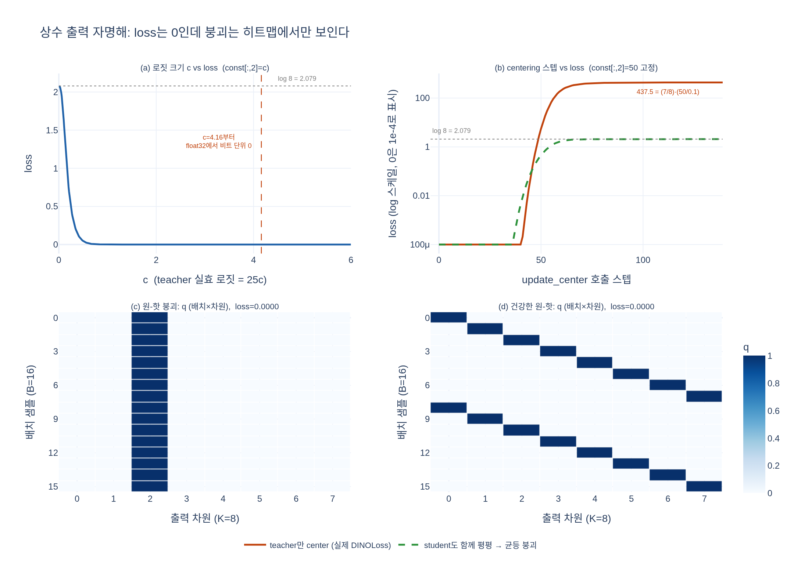

# 4절의 자명해 시연에서 원-핫 붕괴를 어떻게 흉내 냈고 loss는 얼마였는가?

모든 샘플이 2번 차원에 로짓 50.0을 갖는 상수 출력 `const[:, 2] = 50.0`을 두 crop에 똑같이 넣었다.
loss는 0으로 완벽한 점수가 나온다.

- `expy.py` — 노트북 4절 재현 + 로짓 크기 스윕, centering 효과, 붕괴/건강 지표 대비 (jupyter percent script)

## 시각화

