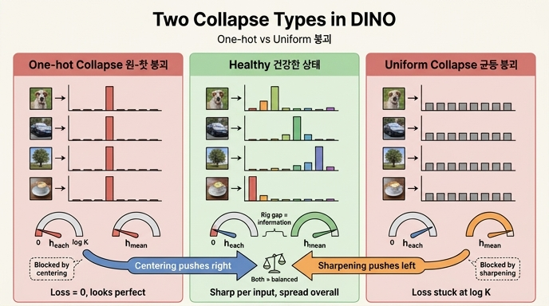

# DINO의 두 가지 붕괴 유형

> **Q.** DINO에서 말하는 두 가지 붕괴 유형은 무엇인가?
> **A.** 모든 입력이 같은 한 차원으로 몰리는 **원-핫 붕괴**와, 모든 입력이 $1/K$씩 균등해지는 **균등 붕괴**다. 두 붕괴는 서로 반대 방향이다.

논문 §5.3의 문장이 원문이다:

> There are two forms of collapse: regardless of the input, the model output is **uniform along all the dimensions** or **dominated by one dimension**.

핵심은 "입력과 무관하게(regardless of the input)"다. 붕괴는 출력 분포의 모양 자체가 나쁜 게 아니라, **출력이 입력의 함수이기를 그만두는 것**이다. 그 "입력 무시" 상태가 취할 수 있는 극단이 정확히 두 개고, 그게 두 붕괴 유형이다.

---

## 1. 정의 — 출력 분포 관점에서 정확히

teacher가 입력 $x$에 대해 내는 $K$차원 확률분포를 $q(x) \in \Delta^{K-1}$라 하자. DINO의 `--out_dim`이 $K$이고 기본값은 65536이다.

### 원-핫 붕괴 (one-hot collapse / dominated by one dimension)

$$q(x) \to e_j \quad \text{for all } x, \ \text{with the same fixed } j$$

- $e_j$는 $j$번째 좌표만 1인 원-핫 벡터.
- **"같은 $j$"가 결정적이다.** 입력마다 *다른* 원-핫을 내는 것은 붕괴가 아니라 오히려 완벽한 클러스터링이다(§5의 `both = DINO` 결과가 그것이다).
- 엔트로피 $h(q) \to 0$, 배치 평균 분포 $\bar q = \mathbb{E}_x[q(x)]$도 $e_j$이므로 $h(\bar q) \to 0$.
- 한 프로토타입(코드)이 데이터 전체를 먹는다 → `top_share → 1.0`.

### 균등 붕괴 (uniform collapse / uniform along all dimensions)

$$q(x) \to \left(\tfrac{1}{K}, \dots, \tfrac{1}{K}\right) \quad \text{for all } x$$

- 모든 로짓이 사실상 같아진 상태. teacher가 "아무 말도 안 하는" 상태다.
- $h(q) \to \log K$ (엔트로피의 최댓값), $h(\bar q) \to \log K$.
- argmax는 노이즈로 결정되므로 코드 배정이 무의미하다.

노트북 4절이 학습 없이 상수 출력만으로 이 둘을 재현한다:

```python
const = torch.zeros(B, out_dim); const[:, 2] = 50.0   # 전부 2번 차원 → one-hot collapse
print(loss_fn(torch.cat([const, const]), ...))        # loss = 0.0000
zeros = torch.zeros(2 * B, out_dim)                   # 전부 0 로짓 → uniform collapse
print(loss_fn(zeros, zeros))                          # loss = log 8 = 2.0794
```

---

## 2. 핵심 구분 — "입력 하나의 분포"와 "배치 평균 분포"는 다른 축이다

가장 흔한 오해가 "엔트로피가 낮으면 붕괴, 높으면 건강" 또는 그 반대다. **둘 다 틀렸다.** 붕괴 진단에는 서로 독립인 두 개의 축이 필요하다.

| 지표 | 정의 | 묻는 질문 |
|---|---|---|
| $h(q)$ = `h_each` | $\mathbb{E}_x\big[-\sum_i q_i(x)\log q_i(x)\big]$ — 점 하나하나의 엔트로피 평균 | **확신하는가?** (분포가 뾰족한가) |
| $h(\bar q)$ = `h_mean` | $\bar q = \mathbb{E}_x[q(x)]$의 엔트로피 | **차원을 골고루 쓰는가?** (입력마다 다른 답을 내는가) |

$h(\bar q) \ge h(q)$가 항상 성립하고(엔트로피의 concavity, Jensen), 그 차이가 바로 입력과 출력 사이의 상호정보량이다:

$$h(\bar q) - \mathbb{E}_x[h(q(x))] = I(X; \text{code})$$

**이 갭이 표현학습이 실제로 벌어들인 정보량이다.** 두 붕괴는 모두 이 갭을 0으로 만든다 — 한쪽은 둘 다 0으로 내려서, 다른 쪽은 둘 다 $\log K$로 올려서.

### 2×2 사분면

| | $h(\bar q)$ **낮음** (모두 같은 차원) | $h(\bar q)$ **높음** (차원을 골고루) |
|---|---|---|
| $h(q)$ **낮음** (뾰족, 확신) | ❌ **원-핫 붕괴** — 모두가 같은 하나를 확신 | ✅ **건강** — 입력마다 다른 차원을 확신 |
| $h(q)$ **높음** (평평, 무확신) | ⚠️ 불가능 (Jensen: $h(\bar q) \ge h(q)$) | ❌ **균등 붕괴** — 아무도 아무것도 확신 안 함 |

- 왼쪽 아래 칸은 수학적으로 존재할 수 없다. 실질적인 상태는 세 개뿐이고, 그중 하나만 건강이다.
- **건강 = 개별 낮음 + 평균 높음.** 이 "둘을 짝으로 본다"가 이 카드의 진짜 요점이다.

### 노트북 4절 표의 확장판

| 상태 | 출력 | $h(q)$ | $h(\bar q)$ | $I(X;\text{code})$ | `top_share` | loss |
|---|---|---|---|---|---|---|
| **원-핫 붕괴** | 모든 입력 → 같은 차원 하나 | $\to 0$ | $\to 0$ | $\to 0$ | $\to 1.0$ | $\to 0$ |
| **균등 붕괴** | 모든 입력 → $1/K$씩 | $\to \log K$ | $\to \log K$ | $\to 0$ | 노이즈 | $\to \log K$ |
| **건강** | 입력마다 다른, 적당히 뾰족 | 낮음 | 높음 ($\approx \log C$) | 큼 | $\approx 1/C$ | 중간 |

($C$ = 데이터의 실질 클러스터 수. 노트북 토이에서 $C=6$.)

---

## 3. 왜 "서로 반대 방향"인가

### 엔트로피 축에서 정반대 끝

$h$는 $[0, \log K]$ 구간의 값이다. 원-핫 붕괴는 이 구간의 **왼쪽 끝(0)**, 균등 붕괴는 **오른쪽 끝($\log K$)** 이다. 논문 Fig. 7 왼쪽 그림이 정확히 이것을 보여준다 — teacher target entropy가 centering 없으면 0으로, sharpening 없으면 $-\log(1/K) = \log K$로 수렴한다.

### 손실 분해로 보면 더 선명하다

$$H(q, p) = \underbrace{h(q)}_{\text{teacher 분포의 엔트로피}} + \underbrace{D_{KL}(q \,\|\, p)}_{\text{student가 teacher와 다른 정도}}$$

**붕괴의 공통 증상은 $D_{KL} \to 0$이다** (논문: "A KL equal to zero indicates a constant output, and hence a collapse"). 하지만 남은 $h(q)$ 항이 어디로 가느냐가 두 붕괴를 가른다:

| | $h(q)$ | $D_{KL}$ | **loss $H$** | 성격 |
|---|---|---|---|---|
| 원-핫 붕괴 | $0$ | $0$ | $\mathbf{0}$ | **"너무 좋은" 붕괴** — 손실 하한을 달성 |
| 균등 붕괴 | $\log K$ | $0$ | $\mathbf{\log K}$ | **"너무 나쁜" 붕괴** — 손실 상한에 고정 |

즉 loss 스칼라만 봐도 두 붕괴는 정반대 값을 낸다. $K = 65536$이면 한쪽은 0.00, 다른 쪽은 11.09다.

### 최적화가 갇히는 메커니즘도 반대다

이게 "반대 방향"의 가장 깊은 층위다.

**원-핫 붕괴는 gradient가 적극적으로 추구한다 (attractive minimum).**
loss가 0이고 이는 교차엔트로피의 전역 하한이다. teacher가 student의 EMA이므로 $h(q)$를 낮추는 경로가 열려 있고, 경사하강은 "입력을 안 보고 항상 같은 답"이라는 가장 값싼 합의점을 향해 **내리막을 굴러간다**. 두 crop이 서로 맞추기만 하면 되니 이보다 쉬운 해가 없다. 능동적으로 빨려 들어가는 흡인점이다.

**균등 붕괴는 gradient가 소멸한 고원이다 (dead plateau).**
모든 로짓이 같으면 어느 차원을 밀어야 할지에 대한 신호가 대칭이라 서로 상쇄된다. teacher $q$가 균등이면 $-\sum_i q_i \log p_i$의 $q$ 가중치가 전부 같아 방향성이 사라진다. loss는 $\log K$에서 멈추고 **아무 데도 못 간다**. 밀려서 도착한 게 아니라, 밀 힘이 없어 주저앉은 상태다.

> 실무적 함의: 원-핫 붕괴는 loss가 예쁘게 떨어지므로 **로그만 보면 성공처럼 보인다**. 균등 붕괴는 loss가 $\log K$에서 평평해지므로 **바로 눈에 띈다**. 더 위험한 건 전자다.

### loss는 붕괴 탐지기가 아니다

노트북 4절이 못 박는다 — "모든 입력이 같은 원-핫"(붕괴)과 "입력마다 다른 원-핫"(완벽한 클러스터링)의 loss가 **똑같이 0**이다. 5절 학습 실험에서는 붕괴한 `sharp only`의 loss(≈0.2)가 건강한 `both = DINO`(≈0.8)보다 **낮게** 나온다. loss는 "입력이 출력을 바꾸는가"를 아예 보지 않기 때문이다. 그래서 `eval_knn.py`나 $h(q)$/$h(\bar q)$ 로깅이 따로 필요하다.

---

## 4. 각 붕괴를 막는 장치 — 그리고 그 대칭성

`main_dino.py`의 `DINOLoss.forward` 한 줄에 방지 장치 두 개가 다 들어 있다:

```python
teacher_out = F.softmax((teacher_output - self.center) / self.teacher_temp, dim=-1)
#                        └── centering ──────────────┘   └─ sharpening ─┘
```

| 장치 | 하는 일 | 막는 붕괴 | **혼자 두면** |
|---|---|---|---|
| **centering** | 배치 평균(EMA)을 로짓에서 뺀다. 늘 큰 차원은 center도 커져 상쇄 | 원-핫 붕괴 | → **균등 붕괴** |
| **sharpening** | teacher 온도 0.04 < student 온도 0.1 | 균등 붕괴 | → **원-핫 붕괴** |

논문 §3의 표현: *"centering prevents one dimension to dominate but encourages collapse to the uniform distribution, while the sharpening has the opposite effect."*

**이 대칭성이 "두 붕괴가 반대 방향"이라는 명제의 실물 증거다.** 각 장치는 한쪽 붕괴를 막지만 그 반작용으로 반대쪽 붕괴를 유발한다. 두 힘이 균형을 이룰 때만 중간 지대(건강)에 머문다. 하나가 다른 하나의 부작용을 정확히 상쇄하도록 짝지어진 설계다.

### 논문 Fig. 7과 노트북 5절의 대응

논문 Fig. 7(ImageNet, 왼쪽 = teacher target entropy):
- centering 없음(sharpening만) → $h \to 0$, KL $\to 0$ → **원-핫 붕괴**
- sharpening 없음(centering만) → $h \to \log K$, KL $\to 0$ → **균등 붕괴**
- 둘 다 → $h$가 중간에서 안정, KL이 양수로 유지

노트북 5절 토이(2D 6클러스터, $K=32$, $\log K = 3.47$) 최종값:

| 설정 | `loss` | `h_each` | `h_mean` | `top_share` | `code_acc` | 판정 |
|---|---|---|---|---|---|---|
| none (둘 다 없음) | 높음 | ≈2.9 | ≈2.9 | ≈0.80 | ≈chance | 균등 쪽 + 한 차원 지배 |
| center only | ≈$\log K$ | $\to 3.47$ | 높음 | 0.33 | 낮음 | **균등 붕괴** |
| sharp only | ≈0.2 | $\to 0$ | ≈1.2 | 0.50 | 낮음 | **원-핫 붕괴 진행 중** |
| **both = DINO** | ≈0.8 | ≈0.6 | ≈2.4 | 1/6 ≈ 0.17 | **1.0** | ✅ 건강 |

`both`에서 6개 코드가 6개 클러스터에 정확히 1:1로 붙었다 — 레이블을 한 번도 안 보고.

> 참고: `--teacher_temp`를 0.04 → 0.07로 30에폭 동안 warmup하는 이유도 이 대칭성 때문이다. 초기에 sharpening이 너무 세면 원-핫 쪽으로 밀려 불안정해진다. 반대로 논문 Appendix D에 따르면 $\tau_t > 0.06$을 처음부터 쓰면 sharpening이 약해 loss가 $\ln K$로 수렴한다 = 균등 붕괴. 양쪽 낭떠러지 사이의 좁은 길이다.

---

## 5. 실전 진단 표 — 실제 DINO ($K = 65536$)

$\log K = \log 65536 = 16 \ln 2 = \mathbf{11.09}$

| 관측치 | 원-핫 붕괴 | 균등 붕괴 | 건강 |
|---|---|---|---|
| **loss** | $\to 0.0$ (부드럽게 내려감) | $\to 11.09$에서 평평 | 중간값에서 안정 (수 단위) |
| **`h_each`** $= \mathbb{E}[h(q)]$ | $\to 0.0$ | $\to 11.09$ | 낮음 (0보다 확실히 큼) |
| **`h_mean`** $= h(\bar q)$ | $\to 0.0$ | $\to 11.09$ | **높음** ($\log$(실질 클러스터 수) 근처) |
| **`h_mean` − `h_each`** | $\to 0$ | $\to 0$ | **크다** ← 진짜 신호 |
| **`top_share`** (최다 코드 점유율) | $\to 1.0$ | $\approx$ 노이즈, $\sim 1/K$ 근처 | 작고 고름 |
| **사용된 코드 수** | 1개 | 형식상 다수지만 argmax 무의미 | 수천~수만 |
| **$D_{KL}(q \,\Vert\, p)$** | $\to 0$ | $\to 0$ | 양수로 유지 |
| **k-NN 정확도** | 붕괴 (chance) | 붕괴 (chance) | 높음 |
| **로그만 보고 알아채나?** | ❌ loss가 예뻐서 못 알아챔 | ⭕ $\log K$ 고착이 바로 보임 | — |

### 진단 순서 (3단계)

1. **loss가 0에 가까운가?** → 원-핫 붕괴 의심. 손실이 좋아 보인다고 안심하면 안 된다.
2. **loss가 11.09 근처에서 평평한가?** → 균등 붕괴 확정. (Appendix D: $\tau_t > 0.06$이면 "the training loss consistently converges to $\ln(K)$")
3. **loss가 중간이면 `h_mean` − `h_each` 갭을 본다.** 갭이 크면 건강, 갭이 좁아지고 있으면 어느 쪽이든 붕괴가 시작된 것이다.

### 흔한 원인

- `update_center`가 `dist.all_reduce`를 쓴다 → 프로세스 그룹 미초기화 시 centering이 사실상 무력화 → **원-핫 붕괴**
- `center_momentum=0.999`처럼 너무 느린 업데이트 → center가 배치를 못 따라감 → **붕괴** (논문 Appendix D 확인 사항)
- 배치가 아주 작음 → center가 노이즈에 흔들려 centering 약화 → **원-핫 쪽**
- `--teacher_temp`를 warmup 없이 0.07 이상으로 → sharpening 부족 → **균등 붕괴**

---

## 한 줄 요약

두 붕괴는 모두 "입력을 무시한 상수 출력"($D_{KL} \to 0$)이지만, 그 상수가 **원-핫**이냐 **균등**이냐로 엔트로피 축의 정반대 끝($0$ vs $\log K$), loss의 정반대 끝($0$ vs $\log K$), 최적화 성격의 정반대(흡인점 vs 죽은 고원)에 놓인다. 그래서 방지 장치도 서로를 밀어내는 두 개(centering ↔ sharpening)가 짝으로 필요하다.

## 인포그래픽


