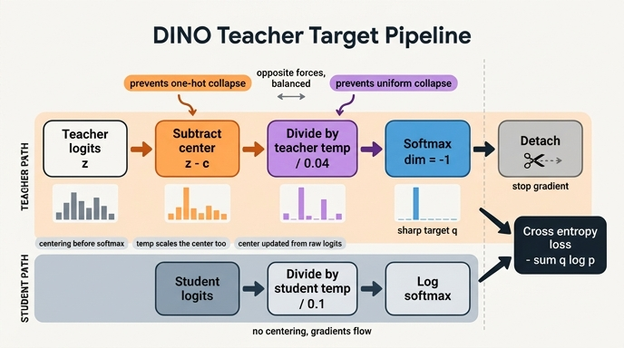

# teacher 출력 처리 순서: centering → sharpening → softmax → detach

## 문제의 한 줄

```python
# MiniDINOLoss.forward
center = self.center if self.use_center else 0.0
teacher_out = F.softmax((teacher_output - center) / self.teacher_temp, dim=-1)
teacher_out = teacher_out.detach().chunk(2)
```

원본 `main_dino.py`의 `DINOLoss.forward`도 동일하다.

```python
temp = self.teacher_temp_schedule[epoch]
teacher_out = F.softmax((teacher_output - self.center) / temp, dim=-1)
teacher_out = teacher_out.detach().chunk(2)
```

논문 Sec. 3의 의사코드도 같은 한 줄이다: `t = softmax((t - C) / tpt, dim=1)  # center + sharpen`.

---

## 1. 연산 단위로 분해

`teacher_output`은 head를 통과한 **로짓** $z \in \mathbb{R}^{B \times K}$ (원본은 $K = 65536$, 노트북 토이는 $K=8$ 또는 $32$)이다.

| # | 연산 | 코드 조각 | 하는 일 |
|---|---|---|---|
| 1 | **centering** | `teacher_output - self.center` | 배치 평균의 EMA $c$를 로짓에서 뺀다. 늘 큰 차원은 $c_i$도 커져 자기 자신을 상쇄한다 → **한 차원 지배(원-핫 붕괴) 방지** |
| 2 | **sharpening** | `/ self.teacher_temp` | 낮은 온도 $\tau_t = 0.04$로 나눠 로짓 격차를 벌린다 (student는 $\tau_s = 0.1$) → 분포가 뾰족해짐 → **균등 붕괴 방지** |
| 3 | **softmax** | `F.softmax(..., dim=-1)` | 로짓을 확률분포 $q$로. 이제부터 교차엔트로피의 타깃 역할 |
| 4 | **detach** | `.detach()` | stop-gradient. teacher는 EMA로만 갱신되고 gradient는 student로만 흐른다 |

즉 결과는

$$q_i = \frac{\exp\!\big((z_i - c_i)/\tau_t\big)}{\sum_j \exp\!\big((z_j - c_j)/\tau_t\big)}$$

이고, 붕괴 방지 장치 **두 개(centering, sharpening)** 가 이 한 줄에 나란히 들어 있다. 논문 표현으로 "centering prevents one dimension to dominate but encourages collapse to the uniform distribution, while the sharpening has the opposite effect."

---

## 2. 순서가 왜 중요한가 — centering은 반드시 softmax **앞**

### 확률 공간에서 빼면 깨진다

softmax 뒤 확률 $p$에서 무언가를 빼면 결과가 분포가 아니게 된다. 실제로 확인한 값:

```
p - softmax(c) = [ 0.114  0.097  0.022 -0.021 -0.043 -0.053 -0.063 -0.053]   합 = 0, 최솟값 = -0.063
```

합이 1이 아니고(0이 됨) 음수가 섞인다. $\log$를 씌우는 순간 NaN이고, 교차엔트로피 $-\sum q_i \log p_i$의 타깃으로 쓸 수도 없다.

### 로짓에서 빼는 것 = 확률 공간의 곱셈적 재가중

로짓 공간의 뺄셈은 확률 공간에서 **차원별 곱셈 후 재정규화**다:

$$\text{softmax}(z - c)_i = \frac{e^{z_i} e^{-c_i}}{\sum_j e^{z_j} e^{-c_j}} \;\propto\; p_i \, e^{-c_i}$$

python으로 확인하면 양변의 최대 절대오차가 $3 \times 10^{-8}$ (float32 오차)로 정확히 일치한다.

이게 centering이 하는 일의 본질이다. "평균적으로 큰 차원"은 $c_i$가 크므로 $e^{-c_i}$라는 **감쇠 계수**를 받는다. 항상 3번 차원이 이기는 상태가 되면 $c_3$이 커지고 $e^{-c_3}$이 작아져 3번을 끌어내린다. 로짓에서 빼야만 이 재가중이 "정규화된 분포를 유지하면서" 일어난다.

부수적 성질: softmax는 상수 이동에 불변이므로 $c$의 **균일 성분은 아무 효과가 없다**. `softmax((z-c)/τ) == softmax((z-(c-c.mean()))/τ)`가 성립함을 확인했다. 즉 centering이 실제로 하는 일은 "차원 간 상대적 편향 제거"뿐이다.

---

## 3. centering과 sharpening은 순서를 바꿀 수 없다

$(z - c)/\tau$ 와 $z/\tau - c$ 는 **다른 식**이다. 앞의 것은 center도 $\tau$로 나뉜다:

$$\frac{z - c}{\tau} = \frac{z}{\tau} - \frac{c}{\tau} \;\neq\; \frac{z}{\tau} - c$$

즉 코드가 쓰는 형태에서 **center의 실효 크기는 $c/\tau$** 로, $\tau_t = 0.04$면 center가 **25배 증폭**된다.

수치로 보면 차이가 극적이다. $z = [2.0, 1.5, 1.0, 0.5, 0, 0, 0, 0]$, $c = [0.9, 0.2, 0.1, 0, -0.1, 0, 0.1, 0]$, $\tau = 0.04$:

| 식 | 결과 분포 | argmax |
|---|---|---|
| `softmax((z-c)/τ)` (실제 코드) | `[0.0067, 0.9933, 0, 0, 0, 0, 0, 0]` | **1번 차원** |
| `softmax(z/τ - c)` (가상) | `[1.0, 0, 0, 0, 0, 0, 0, 0]` | 0번 차원 |

$z-c = [1.1, 1.3, 0.9, \dots]$ 이므로 centering이 승자를 0번에서 1번으로 **뒤집는다**. 그런데 $z/\tau - c$에서는 $z/\tau = [50, 37.5, \dots]$ 스케일 앞에서 $c \approx 1$이 무의미해 0번이 그대로 이긴다. 확인한 곱셈 계수 범위도 이 격차를 보여준다:

- $e^{-c}$ 범위: $0.41 \sim 1.11$ (거의 아무 일도 안 함)
- $e^{-c/\tau}$ 범위: $1.7\times10^{-10} \sim 12.2$ (차원을 실제로 죽이고 살림)

**실질적 의미**: sharpening 온도를 낮추면 centering도 함께 세진다. 두 장치가 독립 하이퍼파라미터가 아니라 $\tau_t$ 하나에 묶여 있다는 뜻이다. `--teacher_temp`를 낮추면 "더 뾰족하게" + "더 강하게 편향 제거"가 동시에 일어난다. 논문이 $\tau_t$ warmup(0.04 → 0.07을 30 epoch에 걸쳐)을 쓰는 이유도 여기에 있다 — 초기에 이 결합된 힘이 너무 세면 학습이 불안정해진다. (이 저장소 `main_dino.py`의 기본값은 `warmup_teacher_temp=0.04`, `teacher_temp=0.04`, `warmup_teacher_temp_epochs=0`으로, 사실상 상수 0.04다.)

참고로 `softmax(z/τ - c/τ)`는 `softmax((z-c)/τ)`와 정확히 같다(확인 완료). 즉 순서를 바꾸고 싶다면 center를 미리 $\tau$로 나눠야 한다.

---

## 4. `detach()` — 마지막에 오지만 위치는 사실 무관

`detach()`는 그래프를 끊는 연산이다. 체인 `z → (z-c) → /τ → softmax → q` 위 **어디에 걸어도** 그 지점 상류로 gradient가 못 간다는 결과는 같다. 세 위치를 실제로 비교해 봤다:

| detach 위치 | loss | student grad norm | teacher grad |
|---|---|---|---|
| `t.detach()` 직후 (softmax 전) | 27.463135 | 16.913750 | `None` |
| `((t-c)/τ).detach()` (중간) | 27.463135 | 16.913750 | `None` |
| `softmax(...).detach()` (실제 코드) | 27.463135 | 16.913750 | `None` |

완전히 동일하다. 그럼에도 **최종 타깃 `q`에 거는 것이 관용**인 이유:

- 의미가 코드에서 바로 읽힌다 — "이것은 상수 타깃(target)이다"가 한눈에 보인다. 논문 Fig. 2의 `sg` (stop-gradient) 상자도 teacher 출력 전체에 걸려 있다.
- 중간에 걸면 "이 지점 이후는 왜 gradient가 필요한가"라는 오해를 부른다.
- 방어적이다. 실제 학습 루프에서 teacher forward는 이미 `with torch.no_grad()` 안에서 돌지만, `self.center`는 buffer라도 어떤 경로로 grad를 물고 올 수 있다. 마지막에 한 번 끊어두면 상류 구성과 무관하게 안전하다.

`detach()`가 없으면 손실을 줄이는 가장 쉬운 길이 "teacher를 student 쪽으로 끌어내리기"가 되어 즉시 붕괴한다. 교차엔트로피 분해 $H(q,p) = h(q) + D_{KL}(q\|p)$에서 $h(q)$를 직접 깎는 경로가 열리기 때문이다.

---

## 5. `update_center`는 **centering 이전의 raw logits**를 받는다

`forward` 끝에서:

```python
self.update_center(teacher_output)     # teacher_out(centered/softmaxed) 이 아니라 원본 로짓
```

```python
@torch.no_grad()
def update_center(self, teacher_output):
    batch_center = teacher_output.mean(dim=0, keepdim=True)
    self.center = self.center * self.center_momentum + batch_center * (1 - self.center_momentum)
```

전달되는 것은 `teacher_output` — softmax도, centering도 적용되지 않은 원본 출력이다. 논문 Eq. 4도 raw $g_{\theta_t}(x_i)$에 대한 평균으로 정의되어 있다.

**왜 그래야 하나: 피드백이 이중으로 걸리는 것을 피하려고.**

center의 목표는 "로짓의 배치 평균"을 추적해서 그것을 빼면 평균이 0이 되게 하는 것이다. 목표 고정점은 $c^\star = \bar z$.

- (A) raw로 갱신: $c_{t+1} = m c_t + (1-m)\bar z$ → 고정점 $c^\star = \bar z$. 확인한 값: $\bar z = [1.0, 2.0, -0.5, 0.3]$일 때 $c \to [1.0, 2.0, -0.5, 0.3]$, 잔차 $\bar z - c = [0,0,0,0]$. **완전히 중심화된다.**
- (B) centered 출력으로 갱신(잘못된 버전): $c_{t+1} = m c_t + (1-m)(\bar z - c_t) = (2m-1)c_t + (1-m)\bar z$ → 고정점 $c^\star = \frac{1-m}{2-2m}\bar z = \frac{\bar z}{2}$. 확인한 값: $c \to [0.5, 1.0, -0.25, 0.15]$, 잔차 $\bar z - c = [0.5, 1.0, -0.25, 0.15]$. **절반밖에 못 지운다.**

즉 centered 출력을 다시 center 갱신에 먹이면 center가 자기 자신의 효과를 관측하게 되어(피드백 루프 이중 적용) 만성적으로 **과소보정**된다. $m$에 따라 이 계수가 달라지고, $2m-1 < 0$이 되는 $m < 0.5$ 구간에서는 진동까지 한다. raw 로짓을 쓰면 EMA가 순수한 "관측량 추적기"로 남는다.

softmax 이후 확률로 갱신하지 않는 이유도 같은 맥락이다. center는 **로짓 공간의 편향(bias)** 이고 (논문: "can be interpreted as adding a bias term $c$ to the teacher: $g_t(x) \leftarrow g_t(x) + c$"), 로짓에서 빼려면 로짓 통계여야 단위가 맞는다.

한 가지 더: `update_center`가 `forward`의 **끝**에 있으므로, 이번 스텝의 loss는 **이전 스텝까지의 center**로 계산된다. center 갱신은 다음 스텝부터 반영된다.

---

## 6. student 경로와의 비대칭

```python
student_out = (student_output / self.student_temp).chunk(self.ncrops)
...
loss = torch.sum(-q * F.log_softmax(student_out[v], dim=-1), dim=-1)
```

| 항목 | teacher ($q$, 타깃) | student ($p$, 예측) |
|---|---|---|
| centering | **있음** (`- self.center`) | 없음 |
| 온도 | $\tau_t = 0.04$ (sharpening) | $\tau_s = 0.1$ (고정) |
| 정규화 | `F.softmax` (확률값 필요 — 가중치 $q_i$로 곱해짐) | `F.log_softmax` (수치 안정적으로 $\log p_i$) |
| gradient | **끊김** (`.detach()`) | 흐름 (여기로만 학습) |
| crop 수 | global 2개만 (`chunk(2)`) | 전체 `ncrops` (global 2 + local 8) |
| 파라미터 갱신 | student의 EMA ($m = 0.99 \to 1$) | optimizer(AdamW) |

핵심은 $\tau_t < \tau_s$ 라는 것이다. teacher가 student보다 뾰족한 분포를 내므로 student는 항상 "더 확신 있는" 타깃을 따라가게 되고, 이것이 sharpening의 실질적 정의다. 노트북 5절의 `temp 0.1` 설정 두 개는 teacher와 student 온도가 같아 **sharpening이 없는** 상태를 만든 것이다.

`log_softmax`를 쓰는 이유는 순전히 수치 안정성이다. $\tau_s = 0.1$로 나눈 로짓에 `softmax` 후 `log`를 따로 걸면 작은 확률이 0으로 언더플로되어 $-\infty$가 나온다.

---

## 7. 노트북 미니 버전 vs 원본 `main_dino.py`

| | 노트북 `MiniDINOLoss` | 원본 `DINOLoss` |
|---|---|---|
| teacher temp | `self.teacher_temp` 상수 | `self.teacher_temp_schedule[epoch]` — `np.linspace(warmup_teacher_temp, teacher_temp, warmup_epochs)` 이후 상수. `forward(student_output, teacher_output, epoch)`처럼 `epoch` 인자를 더 받는다 |
| center 갱신 | `teacher_output.mean(dim=0, keepdim=True)` | `torch.sum(...)` → `dist.all_reduce(batch_center)` → `/ (len(teacher_output) * dist.get_world_size())` — 전 GPU 배치 평균 |
| 실험 스위치 | `use_center` (centering을 끄는 ablation용) | 없음 |
| 그 외 | centering/sharpening/softmax/detach 한 줄, `chunk(2)`, 같은 view 쌍 skip, `H(q,p)` 합산, `update_center` 호출 위치 — **모두 줄 단위로 동일** |

`dist.all_reduce`는 실전 함정이기도 하다. 프로세스 그룹이 초기화되지 않은 단일 GPU 폴백 경로에서는 centering이 깨진다. 또 `center_momentum=0.9`는 배치 통계의 EMA이므로, 배치가 아주 작으면 center가 노이즈에 흔들려 centering 효과가 약해진다.

---

## 한 줄 요약

`F.softmax((teacher_output - self.center) / self.teacher_temp, dim=-1).detach()` — **centering(로짓에서 빼기) → sharpening($\tau_t$로 나누기) → softmax → detach**. centering은 확률 공간의 곱셈적 재가중 $q_i \propto p_i e^{-c_i/\tau_t}$이라 반드시 softmax 앞이어야 하고, $\tau$로 함께 나뉘므로 두 장치의 세기가 서로 묶여 있다. `detach`는 어디에 걸어도 결과가 같지만 "이건 상수 타깃"이라는 의도를 드러내려 마지막에 건다. 그리고 `update_center`는 이 파이프라인을 타지 않은 **raw 로짓**을 받아야 center가 과소보정 없이 배치 평균에 수렴한다.

## 인포그래픽


