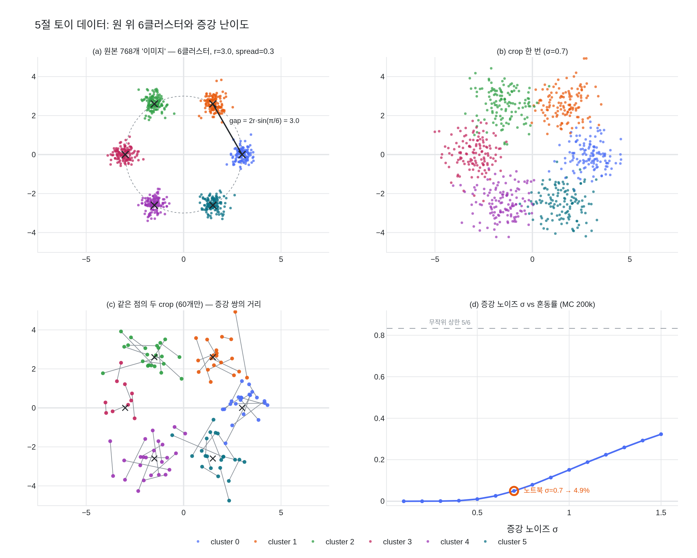

# 5절 토이 실험의 데이터는 어떻게 구성되는가?

2D 평면에 반지름 3.0의 원 위에 6개 클러스터를 배치하고 클러스터마다 128개 점(spread=0.3)을 만든다.
"이미지" 하나가 점 하나에 대응한다.

`expy.py`(jupyter percent 스크립트)에서 `make_data` / `augment`를 재현하고,
각 인자가 실험 난이도를 어떻게 결정하는지 계산으로 확인한다.

## 시각화

