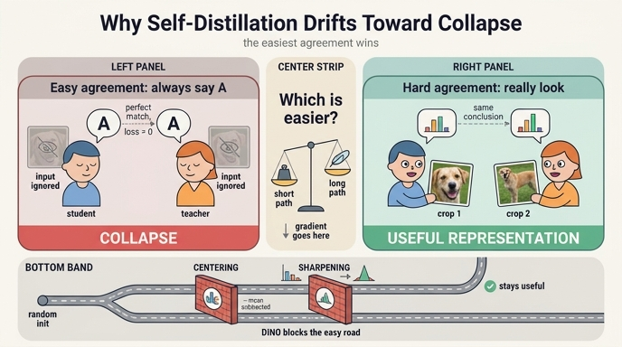

# 왜 self-distillation은 자연스럽게 붕괴로 끌리는가

> **Q.** 왜 self-distillation 학습은 자연스럽게 붕괴 쪽으로 끌리는가?
>
> **A.** 두 네트워크가 같은 이미지의 다른 crop을 보고 서로 맞추기만 하면 되므로, "아무것도 안 보고 항상 같은 답"이 가장 쉬운 합의점이기 때문이다.

이 답을 **최적화 지형(loss landscape)** 의 언어로 풀어 쓰면, "붕괴는 사고가 아니라 목적함수가 설계상 허용한 전역 최소점이고, 심지어 **가장 가까운** 전역 최소점"이라는 이야기가 된다. 아래에서 다섯 단계로 나눠 본다.

---

## 1. 문제 설정의 대칭성 — 상수 해는 데이터와 무관한 전역 최소점

DINO의 목적함수는 (논문 식 (3)의 형태를 그대로 쓰면)

$$
\min_{\theta_s}\ \mathbb{E}_{x,\ t_1,\ t_2}\Big[\, H\big(g_{\theta_t}(t_1 x),\ g_{\theta_s}(t_2 x)\big) \Big],
\qquad H(q,p) = -\sum_i q_i \log p_i
$$

이다. $t_1, t_2$는 같은 이미지 $x$에서 뽑은 서로 다른 crop/증강, $g_{\theta_t}$는 teacher(= student의 EMA), $g_{\theta_s}$는 student다.

여기서 결정적인 관찰: **이 식 어디에도 "출력이 입력에 따라 달라져야 한다"는 요구가 없다.**

$g$가 상수 함수라고 하자. 즉 어떤 입력 $u$에 대해서도 $g(u) = z_0$. 그러면

$$
H\big(g_t(t_1x),\, g_s(t_2x)\big) = H(q_0, p_0)
$$

이고, 이 값은 $x$가 무엇이든, $t_1, t_2$가 어떤 증강이든 **완전히 동일**하다. 게다가 $z_0$를 한 좌표에 몰아준 원-핫으로 잡으면 $H(q_0,p_0)=h(q_0)=0$ — **손실의 이론적 하한**이다.

두 가지가 따라 나온다.

- **상수 해는 전역 최소점이다.** 근사적으로 좋은 해가 아니라, 손실 하한 $0$을 정확히 달성하는 해다.
- **상수 해는 데이터에 완전히 독립이다.** 데이터셋을 ImageNet에서 위성사진으로 바꿔도, 증강 파이프라인을 통째로 갈아엎어도 이 최소점은 지형에 그대로 남는다. 데이터 분포가 만드는 지형의 "골짜기"들과 달리, 이 골짜기는 **목적함수의 구조 자체**가 만든 것이다.

노트북 4절이 이걸 코드 세 줄로 확인한다. 상수 로짓 `const[:, 2] = 50.0`을 student·teacher 양쪽에 넣으면 `loss = 0.0000`이고, 입력마다 다른 원-핫을 내는 "건강한" 출력의 loss도 똑같이 `0.0000`이다. **손실은 두 경우를 구분하지 못한다.**

> 그래서 "loss가 잘 떨어지고 있으니 학습이 잘 되고 있다"는 판단이 self-distillation에서는 통하지 않는다. 노트북 5절에서 `sharp only`(붕괴 중)의 loss $\approx 0.2$가 `both = DINO`(건강)의 $\approx 0.8$보다 **낮다**.

---

## 2. 왜 "쉬운"가 — 도달 비용의 비대칭

전역 최소점이 여러 개 있을 때 SGD가 어디로 가느냐는 "어느 쪽이 더 좋은가"가 아니라 **"어느 쪽이 더 가깝고, 초기 gradient가 어디를 가리키는가"** 로 결정된다. 여기서 비대칭이 심하다.

### (a) 파라미터 공간에서의 거리

상수 함수는 표현 비용이 거의 없다. 마지막 선형층 $W u + b$에서 $W \to 0$, $b \to z_0$ 이면 끝이다. 즉 상수 해의 집합은 파라미터 공간의 **저차원 부분다양체**이고, 랜덤 초기화 지점에서 거기까지 가는 경로는 짧다. "가중치를 줄인다"는 방향은 weight decay가 이미 밀고 있는 방향이기도 하다.

반면 유용한 해는 "crop 위치·색상 왜곡·해상도 변화에는 불변이면서 객체의 정체성에는 민감한" 함수를 12층 transformer 전체에 걸쳐 학습해야 한다. 훨씬 긴 최적화 경로다.

### (b) 초기 gradient가 가리키는 방향 — 정량적으로

student 로짓 $z$에 대한 교차엔트로피의 gradient는

$$
\frac{\partial H(q, p)}{\partial z} = \frac{1}{\tau_s}\big(\mathrm{softmax}(z/\tau_s) - q\big)
$$

즉 **"내 출력을 target $q$ 쪽으로 옮겨라"** 이다. 문제는 이 target $q$ 자체가 랜덤 초기화 네트워크의 출력이라 거의 정보가 없다는 것.

여기서 유용한 부등식이 하나 나온다. 최적의 **상수** 예측은 target의 평균 $\bar q = \mathbb{E}_x[q(x)]$이고, 그때의 기대 손실은

$$
\mathbb{E}_x\big[H(q(x), \bar q)\big] = -\sum_i \bar q_i \log \bar q_i = h(\bar q)
$$

한편 입력을 완벽히 반영하는 예측($p = q$)의 기대 손실은 $\mathbb{E}_x[h(q(x))]$이다. 둘의 차이가

$$
\underbrace{h(\bar q) - \mathbb{E}_x[h(q(x))]}_{\text{= 입력을 보는 것의 총 이득}} \;=\; I(x; \text{code}) \;\ge\; 0
$$

로, 이것이 **"입력을 열심히 봐서 얻을 수 있는 손실 감소의 전부"** 다. 그런데 랜덤 초기화 상태에서는 서로 다른 이미지에 대한 출력이 다 비슷비슷하므로 $q(x) \approx \bar q$, 즉 이 이득은 **거의 0에 가깝다.**

정리하면 학습 초기에:

- "상수 $\bar q$를 향해 출력을 평평하게 만드는" 방향 → gradient가 모든 샘플에서 **같은 부호로 누적**된다. 크고 일관된 신호.
- "입력에 따라 출력을 갈라놓는" 방향 → 얻을 수 있는 손실 감소가 애초에 미미하고, 샘플마다 방향이 달라 서로 상쇄된다. 작고 노이즈 같은 신호.

**두 crop의 출력 불일치를 가장 빠르게 줄이는 방법은 "무엇을 예측할지 알아내는 것"이 아니라 "출력을 입력에 둔감하게 만드는 것"이다.** 이것이 "쉬운 합의점"의 정확한 의미다.

---

## 3. EMA 피드백이 이를 가속한다 — self-distillation 고유의 구조

지도학습이라면 target이 외부에서 고정된 레이블이므로, 모델이 아무리 게을러져도 target은 그대로다. self-distillation에는 그런 **외부 앵커가 없다.** teacher는 student의 EMA다:

```python
param_k.mul_(m).add_((1 - m) * param_q)   # main_dino.py:346
```

여기서 양의 피드백 고리가 생긴다.

1. student 출력이 조금 평평해진다(= 입력 의존성이 줄어든다).
2. EMA를 통해 teacher도 따라서 평평해진다.
3. target $q$가 평평해지니 $I(x;\text{code})$가 더 줄어든다 → 입력을 볼 유인이 더 사라진다.
4. 맞추기가 더 쉬워지니 1로 돌아가 가속된다.

노트북 2절의 분해가 이 고리를 정확히 짚는다:

$$
H(q,p) = \underbrace{h(q)}_{\text{teacher 분포의 엔트로피}} + \underbrace{D_{KL}(q\|p)}_{\text{student가 teacher와 다른 정도}}
$$

손실을 낮추는 길이 **두 개** 있다. (a) $p \to q$ — 우리가 원하는 것. (b) $h(q) \downarrow$ — **teacher 자신이 뾰족해지는 것**. 지도학습에서는 $h(q)$가 상수(원-핫 레이블이면 0)라 (b)는 존재하지 않는 길이다. self-distillation에서는 teacher가 학습 가능한 대상이므로 (b)가 열려 있고, 이게 붕괴의 통로다. 논문 Fig. 7이 정확히 이 두 양($h$와 $D_{KL}$)을 학습 곡선으로 그려서, 장치가 하나라도 빠지면 $D_{KL} \to 0$(= 상수 출력 = 붕괴)로 수렴함을 보인다.

> **주의 — EMA는 가속기이자 동시에 브레이크다.** momentum $m$의 lag 때문에 teacher는 student를 즉시 따라오지 않고 "과거 student들의 평균"에 머문다. 이 지연이 폭주 속도를 늦춘다. 실제로 논문 Table 7의 row 2는 **momentum teacher를 빼면 DINO가 아예 작동하지 않고**, 붕괴를 막으려면 Sinkhorn-Knopp 같은 더 강한 장치가 필요함을 보인다. 즉 EMA는 상수 해라는 **끌개(attractor) 자체를 제거하지는 못하지만**, 거기로 굴러떨어지는 것을 늦추는 감쇠 역할을 한다. 붕괴 방지는 여전히 centering/sharpening의 몫이다.

또 하나: 상수 해는 self-distillation 동역학의 **자기일관적 고정점**이다. student가 상수면 teacher(그 EMA)도 상수, gradient는 0, 그대로 머문다. 한번 들어가면 스스로 빠져나올 신호가 없다.

---

## 4. 대조학습과의 결정적 차이 — 상수 해에 벌점이 있는가

InfoNCE는 이렇게 생겼다:

$$
\mathcal{L}_{\text{InfoNCE}} = -\log \frac{\exp(\mathrm{sim}(z_i, z_i^+)/\tau)}{\sum_{j} \exp(\mathrm{sim}(z_i, z_j)/\tau)}
$$

분모에 **negative pair**가 들어 있다. 모든 출력이 같아지면 분자와 분모의 모든 항이 같아져 손실이 $\log N$($N$ = 배치 내 후보 수)에서 **바닥을 친다** — 즉 상수 해는 최소점이 아니라 오히려 손실이 큰 지점이다. 대조학습에서는 붕괴에 **명시적 벌점**이 걸려 있다.

DINO에는 negative가 없다. 상수 해에 대한 벌점이 **아예 0**이다. 그래서 별도의 장치가 선택이 아니라 **필수**가 된다.

이 축("상수 해를 어떻게 막는가")으로 주요 방법들을 정리하면:

| 방법 | 붕괴 방지 장치 | 상수 해에 대한 취급 | 성격 |
|---|---|---|---|
| **SimCLR / MoCo** | InfoNCE의 negative pair (분모) | **명시적 벌점** — 손실이 $\log N$까지 올라감 | 손실 함수 자체가 막음 |
| **BYOL** | asymmetric predictor + stop-gradient + EMA target | 벌점 **없음** — 상수 해도 손실 0인 전역 최소점 | 최적화 **동역학**에 의존 |
| **SimSiam** | predictor + stop-gradient (EMA 없음) | 벌점 **없음** — 동일 | 동역학 (EMA 없이도 됨을 보임) |
| **SwAV** | Sinkhorn-Knopp 균등 분할 제약 | 배치 내 assignment가 균등해야 하므로 **제약 위반** | 하드 제약 |
| **Barlow Twins** | cross-correlation → identity (off-diagonal $\to 0$) | 분산이 0이 되면 정규화 상관이 무너짐 → **암묵적 금지** | 통계 제약 |
| **VICReg** | variance 항 (각 차원 std $\ge 1$ hinge) | **명시적 벌점** — 상수면 variance 항이 최대 | 통계 제약 |
| **DINO** | teacher 출력의 centering + sharpening | 벌점 **없음** — 대신 두 붕괴 방향을 서로 상쇄 | 출력 통계 조정 |

DINO의 접근이 특이한 점은, 상수 해에 벌점을 매기는 대신 **두 종류의 붕괴를 서로 밀어내게** 만든다는 것이다. 붕괴에는 방향이 반대인 두 형태가 있다:

| 붕괴 유형 | 출력 | $h(q)$ | 배치 평균의 엔트로피 |
|---|---|---|---|
| **원-핫 붕괴** (한 차원 지배) | 모든 입력 → 같은 차원 하나 | $\to 0$ | $\to 0$ |
| **균등 붕괴** | 모든 입력 → $1/K$씩 | $\to \log K$ | $\to \log K$ |
| 건강한 상태 | 입력마다 다른, 적당히 뾰족한 분포 | 중간 | 높음 |

- **centering**: teacher 로짓에서 배치 평균의 EMA를 뺀다 → 늘 큰 차원은 center도 커져 상쇄 → **원-핫 붕괴를 막고, 대신 균등 붕괴 쪽으로 민다.**
- **sharpening**: teacher 온도 $0.04$ < student 온도 $0.1$ → **균등 붕괴를 막고, 대신 원-핫 붕괴 쪽으로 민다.**

논문 표현대로 "centering prevents one dimension to dominate but encourages collapse to the uniform distribution, while the sharpening has the opposite effect." 벌점이 아니라 **두 힘의 균형점**으로 건강한 영역에 머무르게 하는 설계다. 그래서 하나만 쓰면 반대쪽으로 무너진다.

또 하나 눈여겨볼 점: centering은 논문에서 "teacher에 bias $c$를 더하는 것"($g_t(x) \leftarrow g_t(x) + c$)으로 해석된다. 2절에서 "상수 해는 마지막 층 bias만으로 표현된다"고 했는데, **centering은 바로 그 bias 자리를 미리 점유해서 학습이 그 방향으로 가는 걸 막는 장치**로 읽을 수 있다.

---

## 5. BYOL 논란 — 붕괴 방지 메커니즘은 미묘하고 논쟁적이다

위 표에서 BYOL 행을 보면 이상하다. negative도 없고 centering도 없고 명시적 벌점도 없는데 왜 안 무너지는가? 이건 실제로 커뮤니티에서 한 차례 논쟁이 붙었던 주제다.

- **2020년 8월, "BatchNorm이 암묵적 대조 역할을 한다"는 주장** — Generally Intelligent(현 Imbue)의 블로그 글 *Understanding self-supervised and contrastive learning with BYOL*이 ablation을 돌려, projection/prediction MLP에서 BatchNorm을 빼면 BYOL 성능이 **랜덤 수준으로 떨어진다**고 보고했다. 해석: BN은 미니배치의 공통 모드를 빼내므로, 배치의 다른 샘플들이 **암묵적 negative** 역할을 한다 — 즉 BYOL은 사실 위장한 대조학습이다.
- **2020년 10월, DeepMind의 반박** — Richemond et al., *BYOL works even without batch statistics* (arXiv:2010.10241). BatchNorm을 **GroupNorm + Weight Standardization**(배치에 독립적인 정규화)으로 바꿔도 vanilla BYOL과 비슷한 성능이 나오고, 정규화를 아예 다 빼도 초기화 스킴과 scaling 파라미터를 손보면 ImageNet linear probe **65.7%** 를 얻는다고 보였다. 즉 배치 통계는 **필수가 아니라 최적화를 쉽게 해주는 요소**라는 것.

교훈: **"이 방법은 왜 안 무너지는가"에 대한 답은 종종 손실 함수를 보는 것만으로는 안 나오고, 최적화 동역학·정규화·초기화가 뒤엉킨 결과다.** 논문에 적힌 장치가 진짜 이유가 아닐 수도 있다. DINO가 centering/sharpening이라는 **명시적이고 해석 가능한** 두 연산으로 붕괴를 다루고, Fig. 7에서 $h$와 $D_{KL}$을 직접 찍어 보여주는 것은 이런 모호함을 줄이려는 선택으로 읽을 수 있다.

참고로 DINO 논문도 이 지점을 건드린다(Appendix B, Table 14): BYOL에서 predictor를 빼면 붕괴하지만(rows 7, 8), **DINO의 teacher centering을 대신 넣으면 predictor 없이도 붕괴하지 않는다**(rows 7, 9). 다만 성능은 크게 떨어지는데, centering이 sharpening과 짝을 이뤄 쓰이도록 설계됐기 때문이다.

---

## 6. 노트북과의 연결 — 실증

`.fm/assets/dino_collapse_cross_entropy.py`가 위 논의를 손으로 만져 보게 만든다.

**4절 (자명해 시연)** — 1절의 "상수 해는 전역 최소점" 주장의 직접 확인:

```
one-hot collapse : loss = 0.0000   ← 0. 완벽한 점수
uniform collapse : loss = 2.0794   ← log 8, KL은 0
healthy one-hot  : loss = 0.0000   ← 이것도 0
```

붕괴한 모델과 건강한 모델의 loss가 **같다**. 손실은 "입력이 출력을 바꾸는가"를 전혀 보지 않는다.

**5절 (토이 학습)** — 2·3절의 "그래서 실제로 그쪽으로 끌려간다"의 확인. 2D 6-클러스터 데이터에 작은 MLP student/teacher(EMA $m=0.99$)를 놓고 centering/sharpening 4가지 조합을 돌린다. 핵심은 **`none` 설정(둘 다 없음)**:

- `h_each ≈ h_mean ≈ 2.9` — 분포는 퍼져 있는데,
- **`top_share ≈ 0.8`** — 전체 점의 80%가 **같은 차원**을 argmax로 고른다.
- `code_acc`는 chance($1/6 \approx 0.17$) 근처. 코드에 클러스터 정보가 없다.

아무 장치 없이 self-distillation만 돌리면, 아무도 시키지 않았는데 "거의 모든 입력에 같은 답"으로 끌려간다. 2절에서 말한 "출력을 입력에 둔감하게 만드는 방향으로 gradient가 일관되게 누적된다"의 눈에 보이는 결과다.

나머지 세 설정은 4절 표의 두 붕괴 방향을 각각 보여준다.

| 설정 | 결과 | 해석 |
|---|---|---|
| `none` | `top_share ≈ 0.8`, `code_acc` ≈ chance | 장치 없음 → 상수 해 쪽으로 끌려감 |
| `center only` | `h_each → log K`, loss가 $\log K$에서 정체 | **균등 붕괴** |
| `sharp only` | `h_each = 0`, `top_share = 0.5`, 코드 ~4개로 병합 | **원-핫 붕괴**의 초기 모습 |
| `both = DINO` | `top_share = 1/6`, `code_acc = 1.0`, 코드 6개 ↔ 클러스터 6개 1:1 | 균형점 |

`both`에서 레이블을 한 번도 안 보고 클러스터링이 정확히 끝난다는 점, 그런데 그 loss(≈0.8)가 붕괴 중인 `sharp only`의 loss(≈0.2)보다 **높다**는 점 — 이 두 가지가 이 노트북의 결론이다. **붕괴는 손실이 벌하지 않는 방향이고, 그래서 손실 밖에서 막아야 한다.**

---

## 한 줄 요약

self-distillation의 목적함수는 "두 view의 출력이 서로 일치할 것"만 요구하고 "출력이 입력을 반영할 것"은 요구하지 않는다. 상수 함수는 그 요구를 데이터와 무관하게 완벽히 만족하는 전역 최소점이며, 파라미터 공간에서 가깝고, 초기 gradient가 일관되게 그쪽을 가리키고, EMA 피드백이 그 방향을 자기강화한다. 대조학습과 달리 벌점이 없으므로, centering/sharpening 같은 **손실 밖의 장치**가 필수다.

## 참고

- DINO 논문 §5.3 "Avoiding collapse", Fig. 7, Appendix B Table 14 — `/home/sungwoo/projects/swcho/dino/paper/2104.14294v2.md`
- 노트북 `.fm/assets/dino_collapse_cross_entropy.py` 4절·5절
- [Understanding self-supervised and contrastive learning with "Bootstrap Your Own Latent" (BYOL) — Imbue](https://imbue.com/blog/2020-08-24-understanding-self-supervised-contrastive-learning)
- [BYOL works even without batch statistics (arXiv:2010.10241)](https://arxiv.org/pdf/2010.10241)

## 인포그래픽


