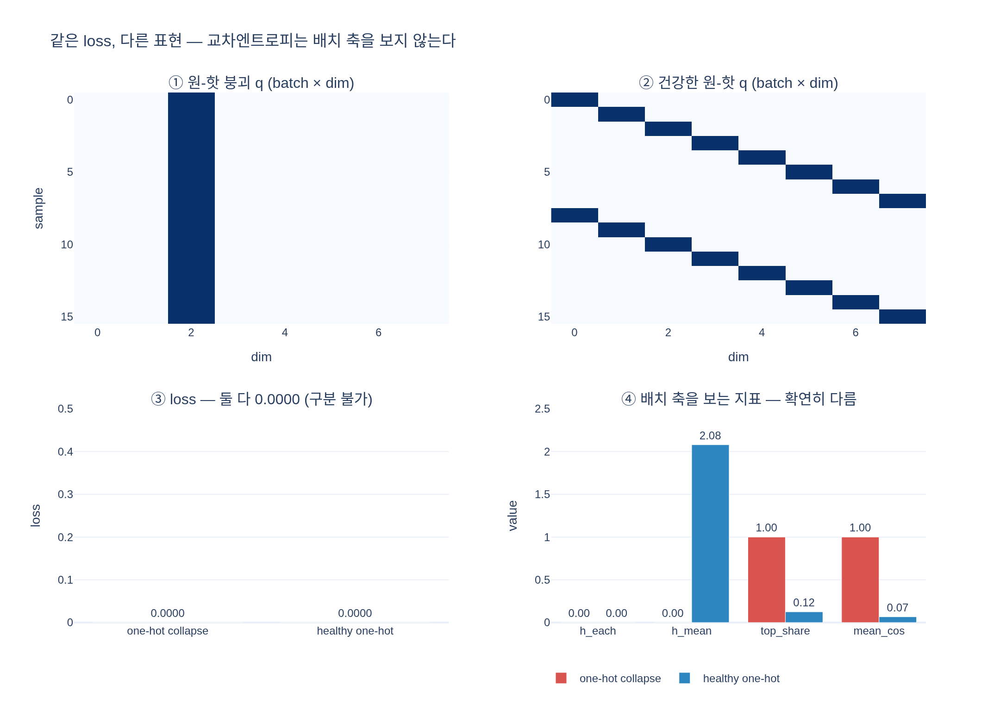

# 건강한 원-핫 vs 붕괴한 원-핫 — loss는 똑같이 0이다

**Q.** 입력마다 다른 원-핫을 내는 '건강한' 경우의 loss는 붕괴한 경우와 어떻게 다른가?

**A.** **똑같이 0이다.** `F.one_hot(torch.arange(B) % out_dim, out_dim) * 50.0`인 건강한 출력과
상수 원-핫 붕괴 출력이 **같은 loss**를 낸다.

이 카드의 핵심은 한 문장으로 줄일 수 있다:

> **손실 함수가 보지 않는 축이 존재한다.** 그 축은 배치 축이고, 붕괴는 정확히 그 축에서 일어난다.

---

## 1. 두 텐서를 나란히 놓고 loss 계산을 추적한다

### 입력

asset 노트북 4절이 만드는 두 텐서다 (`B=16`, `out_dim=8`).

```python
# (1) 원-핫 붕괴 — 모든 샘플이 같은 차원 2
const = torch.zeros(B, out_dim); const[:, 2] = 50.0

# (3) 건강 — 샘플 b가 차원 (b mod K)
healthy = F.one_hot(torch.arange(B) % out_dim, out_dim).float() * 50.0
```

```
collapsed                        healthy
[[ 0,  0, 50,  0,  0,  0,  0,  0],   [[50,  0,  0,  0,  0,  0,  0,  0],
 [ 0,  0, 50,  0,  0,  0,  0,  0],    [ 0, 50,  0,  0,  0,  0,  0,  0],
 [ 0,  0, 50,  0,  0,  0,  0,  0],    [ 0,  0, 50,  0,  0,  0,  0,  0],
 [ 0,  0, 50,  0,  0,  0,  0,  0],    [ 0,  0,  0, 50,  0,  0,  0,  0],
 ...                                  ...
```

눈으로 보면 완전히 다른 텐서다. 왼쪽은 세로줄 하나, 오른쪽은 대각선. 그런데:

```
one-hot collapse : loss = 0.0000
healthy one-hot  : loss = 0.0000
```

### 왜 같은가 — 배치 축이 처리되는 방식

`DINOLoss.forward`의 핵심 두 줄:

```python
loss = torch.sum(-q * F.log_softmax(student_out[v], dim=-1), dim=-1)   # ① dim=-1 : 차원 축만 합
total_loss += loss.mean()                                              # ② 배치 축은 마지막에 평균
```

수식으로:

$$\mathcal{L} \;=\; \frac{1}{B}\sum_{b=1}^{B}\underbrace{\Big(-\sum_{k=1}^{K} q_{bk}\,\log p_{bk}\Big)}_{\ell_b:\ \text{샘플 } b \text{ 하나만의 loss}}$$

**$\ell_b$의 정의에 등장하는 인덱스는 $b$ 하나뿐이다.** $b' \neq b$인 다른 샘플의 출력은
$\ell_b$의 계산에 **문법적으로 들어갈 자리가 없다**. 그리고 배치 축은 마지막에 단순 평균으로 뭉개진다.

즉 loss는 다음 형태다 — **샘플별 함수의 평균**:

$$\mathcal{L}(Q, P) = \frac{1}{B}\sum_b f(q_b, p_b)$$

이런 형태의 함수는 **행을 아무렇게나 치환해도, 심지어 모든 행을 같은 값으로 바꿔도**
각 행의 $f$ 값만 유지되면 전혀 변하지 않는다. 다양성은 이 함수의 **정의역에조차 없다**.

실제로 배치 평균을 취하기 *전*의 per-sample 벡터까지 완전히 같다 (`expy.py` 2절):

```
one-hot collapse   per-sample = [0. 0. 0. 0. 0. 0. 0. 0.] ...
healthy one-hot    per-sample = [0. 0. 0. 0. 0. 0. 0. 0.] ...
```

두 경우 모두 각 샘플에서 "teacher가 지목한 차원 = student가 확신하는 차원"이므로
$-\log p_{b,\text{argmax}} \approx 0$. 어느 차원인지, 샘플마다 다른지는 아무도 묻지 않는다.

> **일반화**: `h_each`(샘플별 엔트로피의 평균)도 정확히 같은 이유로 실패한다.
> 두 경우 모두 0.0이다. **"먼저 샘플별로 계산하고 나중에 평균"하는 모든 양은
> 배치 축의 다양성을 볼 수 없다.** 순서를 바꿔 **먼저 배치로 평균한 뒤 계산**해야
> (`h_mean`) 비로소 보인다.

---

## 2. 어떤 손실이라면 이걸 볼 수 있는가

배치 축을 **가로지르는** 항이 필요하다. 자기지도학습의 주요 방법들은 모두 이 항을 어떤 형태로든 갖고 있다.

| 방법 | 배치를 보는 방식 | 붕괴 시 |
|---|---|---|
| **InfoNCE / SimCLR** | 분모의 **negative pair** $\sum_{b'} \exp(z_b\cdot z_{b'}/\tau)$ — 다른 샘플과 가까우면 벌점 | 모두 같은 벡터 → 분모 최대 → loss $\to \log B$ |
| **Barlow Twins** | 배치 축으로 표준화한 **cross-correlation 행렬** $C_{ij}$ — 대각은 1, 비대각은 0으로 | 배치 분산이 죽어 $C_{ii}=0$ → 대각 항 $\sum_i (1-C_{ii})^2$ 폭발 |
| **VICReg** | **variance term** — 배치 축 표준편차가 임계값 아래면 hinge 벌점 | $\text{std}_b(z) = 0$ → 벌점 최대 |
| **SwAV** | Sinkhorn-Knopp으로 배치 내 코드 할당을 **균등 분할하도록 강제** | 균등 제약이 애초에 한 코드 독점을 금지 |
| **DINO** | **centering** — 배치 평균을 EMA로 추적해 teacher 로짓에서 뺌 | 늘 큰 차원은 center도 커져 상쇄됨 |

`expy.py` 4절에서 실제로 확인한 값:

```
                     DINO CE   InfoNCE  VICReg var  Barlow diag  Barlow off
one-hot collapse      0.0000    2.7726      0.0000       1.0000      0.0000
healthy one-hot       0.0000    0.6935      0.3416       0.0039      0.0179
```

**DINO CE만 두 상태를 구분하지 못한다.** InfoNCE는 $\log 16 = 2.77$ vs $\log 2 = 0.69$,
VICReg variance는 0 vs 0.34, Barlow 대각 항은 1.0 vs 0.004 — 모두 확연히 갈린다.

### DINO의 설계가 흥미로운 지점

다른 방법들은 배치 통계를 **손실 항**으로 넣었다. DINO는 그러지 않았다.

```python
teacher_out = F.softmax((teacher_output - self.center) / self.teacher_temp, dim=-1)
#                                         └─ centering: 배치 평균의 EMA
```

배치 통계가 들어가는 곳은 **target(정답지)을 만드는 전처리**다.
손실 식 자체는 끝까지 샘플별 교차엔트로피 하나뿐이고, 여기엔 배치를 보는 항이 없다.

이것이 왜 중요한가:

1. **loss 값을 아무리 들여다봐도 붕괴 방지 장치의 상태가 보이지 않는다.**
   붕괴를 막는 힘은 loss 곡선 *바깥*에 있다. 그래서 loss가 잘 떨어지는데 모델은 붕괴할 수 있다.
   (asset 노트북 5절: `sharp only`의 loss ≈ 0.2가 정상 DINO의 0.8보다 **낮다**.)
2. `center`는 학습되는 파라미터가 아니라 `register_buffer`다. 그래디언트가 흐르지 않는다.
   즉 최적화 문제의 목적함수가 아니라 **아키텍처적 제약**이다.
3. 이 설계는 배치 크기에 대한 요구가 상대적으로 느슨하다는 장점이 있다 (SimCLR의 대형 배치 의존 대비).
   대신 `center_momentum=0.9` EMA가 배치 노이즈를 흡수해야 하므로, 배치가 아주 작으면 centering이 약해진다.

---

## 3. 표현 학습의 목표와 손실의 괴리

우리가 표현 $Z = f(X)$에 원하는 것은 두 가지다.

$$\max_f \; \underbrace{I(X; Z)}_{\text{(A) 입력 정보를 담을 것}} \quad \text{s.t.} \quad \underbrace{Z(t_1(X)) \approx Z(t_2(X))}_{\text{(B) 증강에 불변할 것}}$$

- **(B) 불변성**만 최적화하면 → **상수 함수**가 완벽한 해다. $I(X;Z) = 0$. 이것이 붕괴다.
- **(A) 정보량**만 최적화하면 → 항등 함수가 최적. 증강에 취약하고 추상화가 없다.

**DINO loss는 (B)만 직접 최적화한다.** 교차엔트로피 $H(q_{t_1}, p_{t_2})$는 두 view의 출력을
맞추라는 항일 뿐이며, (A)에 대해서는 한 마디도 하지 않는다. 그 결과가 이 카드의 현상이다 —
(A)가 0인 붕괴 출력과 (A)가 최대인 건강한 출력이 (B) 점수에서 동점을 받는다.

(A)는 어디서 확보되는가? **centering과 sharpening이라는 아키텍처적 제약**에서다.

| 장치 | 미는 방향 | 막는 붕괴 | 혼자 두면 |
|---|---|---|---|
| **centering** (배치 평균 EMA를 뺌) | 엔트로피 ↑ | 원-핫 붕괴 (한 차원 지배) | **균등 붕괴**로 감 |
| **sharpening** (teacher temp 0.04 < student 0.1) | 엔트로피 ↓ | 균등 붕괴 | **원-핫 붕괴**로 감 |

두 장치가 반대 방향으로 밀면서 만드는 좁은 틈 — "샘플별로는 뾰족하지만($h_{\text{each}}$ 낮음),
배치 전체로는 차원을 골고루 쓰는($h_{\text{mean}}$ 높음)" 상태 — 이것이 사실상
$I(X;Z)$를 대리(proxy)하는 제약이다. 명시적으로 최적화되는 것이 아니라,
**최적화가 갈 수 있는 자명해를 막아 남은 길로 몰아넣는** 방식이다.

$H(q,p) = h(q) + D_{KL}(q\|p)$ 분해로 보면 더 명확하다.
loss를 낮추는 길이 두 개 — (a) $p \to q$ (원하는 것), (b) $h(q) \downarrow$ (붕괴 통로).
teacher가 student의 EMA이므로 (b)가 열려 있고, centering이 정확히 (b)를 막는다.

---

## 4. 실전 진단 — loss 하나로는 부족하다

teacher가 전체 데이터에 대해 낸 분포 $q$로 계산한다. $q$의 argmax를 그 샘플의 **코드**라 부른다.

| 지표 | 정의 | 배치를 보나 | 원-핫 붕괴 | 균등 붕괴 | 건강 |
|---|---|---|---|---|---|
| `loss` | $\frac1B\sum_b H(q_b, p_b)$ | ❌ | → 0 | → $\log K$ | 중간 |
| `h_each` | $\frac1B\sum_b h(q_b)$ | ❌ | → 0 | → $\log K$ | 낮음 |
| `h_mean` | $h\!\left(\frac1B\sum_b q_b\right)$ | ✅ | → 0 | → $\log K$ | **높음** ≈ $\log(\text{클래스 수})$ |
| `top_share` | 최다 사용 코드의 샘플 비율 | ✅ | → 1.0 | 노이즈 | ≈ 1/(클래스 수) |
| 코드 히스토그램 | 코드별 사용 횟수 분포 | ✅ | 막대 하나 | 평평 | 고르게 여러 개 |
| `rank` / `mean_cos` | $Q$의 랭크 / 쌍별 코사인 평균 | ✅ | 1 / 1.0 | 1 / 1.0 | 높음 / 낮음 |
| k-NN 정확도 | `eval_knn.py` | ✅ | 급락 | 급락 | 높음 |

**`h_each`와 `h_mean`은 반드시 짝으로 본다.**

| $h_{\text{each}}$ | $h_{\text{mean}}$ | 해석 |
|---|---|---|
| 낮음 | 낮음 | **원-핫 붕괴** — 모두 같은 차원을 확신 |
| 높음 | 높음 | **균등 붕괴** — 아무도 아무것도 확신 못 함 |
| 낮음 | **높음** | **건강** — 샘플마다 *다른* 차원을 확신 |
| 높음 | 낮음 | (거의 안 나타남) |

`expy.py` 3절의 실측:

```
scenario              loss  h_each  h_mean  top_share  rank  mean_cos  n_codes
------------------------------------------------------------------------------
one-hot collapse    0.0000  0.0000  0.0000     1.0000     1    1.0000        1
uniform collapse    2.0794  2.0794  2.0794     1.0000     1    1.0000        1
healthy one-hot     0.0000  0.0000  2.0794     0.1250     8    0.0667        8
```

1행과 3행이 이 카드가 묻는 두 상태다. `loss`와 `h_each`는 둘 다 0.0000으로 동점,
`h_mean`부터 0.0 vs 2.0794로 갈라진다.

### 로깅 체크리스트

1. **loss 곡선만 보지 말 것.** 낮은 loss가 좋은 표현의 증거가 아니다 — 붕괴가 더 낮은 loss를 낼 수 있다.
2. teacher 출력의 `h_each` / `h_mean`을 **매 스텝 함께** 찍는다. 두 값의 *간격*이 건강 신호다.
3. 코드 사용 히스토그램(`argmax` 빈도)을 주기적으로 본다. `out_dim=65536` 중 몇 개가 실제로 쓰이는가.
4. **k-NN 정확도를 주기적으로 돌린다.** 손실이 보지 않는 축을 직접 측정하는 유일한 방법.
5. `update_center`가 `dist.all_reduce`를 쓴다. 프로세스 그룹이 안 잡히면 centering이 깨져 원-핫 붕괴로 간다 — 단일 GPU 폴백 경로를 반드시 확인.

---

## 5. 한 줄 요약

건강한 출력과 붕괴한 출력의 loss는 **0으로 같다**. per-sample 값까지 같다.
교차엔트로피가 각 샘플에 대해 독립적으로 계산된 뒤 평균되기 때문에,
"샘플들끼리 서로 다른가"는 이 손실의 정의역에 아예 존재하지 않는다.
붕괴를 보려면 **배치 축을 가로지르는 양**(`h_mean`, `top_share`, k-NN)을 따로 봐야 한다.

## 시각화



왼쪽 위/오른쪽 위: 두 출력의 배치×차원 확률 히트맵 — 세로줄 하나 vs 대각선, 육안으로 완전히 다르다.
왼쪽 아래: loss 막대 — 둘 다 정확히 0.0000, 구분 불가.
오른쪽 아래: 배치 축을 보는 지표 — `h_each`는 여전히 동점(0.00 vs 0.00)이지만,
`h_mean`(0.00 vs 2.08), `top_share`(1.00 vs 0.12), `mean_cos`(1.00 vs 0.07)에서 확연히 갈린다.
