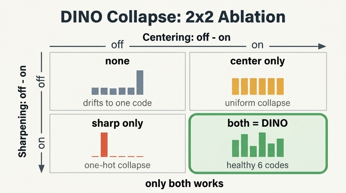

# 5절의 네 가지 설정 — centering × sharpening 2×2 ablation

노트북 `dino_collapse_cross_entropy.py` 5절이 비교하는 네 설정은 `configs` 딕셔너리 한 곳에 다 들어 있다.

```python
configs = {
    "none        (center off, temp 0.1)":  dict(use_center=False, teacher_temp=0.1),
    "center only (center on,  temp 0.1)":  dict(use_center=True,  teacher_temp=0.1),
    "sharp only  (center off, temp 0.04)": dict(use_center=False, teacher_temp=0.04),
    "both = DINO (center on,  temp 0.04)": dict(use_center=True,  teacher_temp=0.04),
}
```

바뀌는 인자는 `use_center`와 `teacher_temp` **두 개뿐**이고, 나머지(데이터·모델·EMA `m=0.99`·`lr`·`batch`·`seed=0`·`steps=1500`)는 전부 고정이다.

---

## 1. 왜 하필 이 네 가지인가 — 2×2 요인 설계

DINO의 붕괴 방지 장치는 `MiniDINOLoss.forward`의 **한 줄** 안에 나란히 들어 있다.

```python
teacher_out = F.softmax((teacher_output - center) / self.teacher_temp, dim=-1)
#                                       └ centering ┘   └── sharpening ──┘
```

두 장치가 한 줄에 붙어 있으니, "각각이 정말 필요한가"를 묻는 방법은 하나씩 빼 보는 것 — **ablation**이다. 그런데 요인이 두 개이므로 하나씩 빼는 것만으로는 부족하다.

- centering만 빼 보면 → "centering이 없으면 망한다"까지만 안다.
- sharpening만 빼 보면 → "sharpening이 없으면 망한다"까지만 안다.
- **둘 다 뺀 칸이 없으면**, 두 장치가 서로 다른 일을 하는지, 아니면 같은 일을 중복으로 하는지 구분할 수 없다.

그래서 두 이진 요인의 **모든 조합** $2 \times 2 = 4$를 다 도는 완전요인설계(full factorial design)를 쓴다. 이 설계가 주는 것은 세 가지다.

| 얻는 것 | 어느 칸의 비교에서 나오는가 |
|---|---|
| centering의 **주효과** | `none` → `center only`, 그리고 `sharp only` → `both` |
| sharpening의 **주효과** | `none` → `sharp only`, 그리고 `center only` → `both` |
| 둘의 **상호작용** | 위 두 주효과의 합으로 `both`가 설명되는가? |

5절의 결론은 정확히 이 상호작용 항에 있다. centering 단독도, sharpening 단독도 붕괴를 못 막는데 둘을 합치면 막힌다 — 즉 효과가 더해지는(additive) 관계가 아니라 **서로 반대 방향으로 밀어서 균형을 잡는** 관계다. 한쪽씩만 봤다면 절대 못 보는 그림이다.

논문도 같은 말을 한다(§5.3):

> The centering avoids the collapse induced by a dominant dimension, but encourages an uniform output. Sharpening induces the opposite effect. ... Applying both operations balances these effects.

그리고 `both = DINO`라는 이름이 붙은 이유 — 네 칸 중 하나는 **원본 DINO의 기본 설정 그대로**다. ablation의 기준점(baseline)은 항상 "원래 그대로"여야, 나머지 세 칸이 "무엇을 잃었는가"로 읽힌다.

---

## 2. `use_center`는 스위치지만, "sharpening off"는 스위치가 아니다

이 4칸 표에서 가장 헷갈리는 지점이자, 카드가 묻는 핵심이다. 두 요인이 **끄는 방식이 서로 다르다.**

### centering: 진짜 불리언 스위치

```python
center = self.center if self.use_center else 0.0
```

`use_center=False`면 뺄 값이 그냥 `0.0`이 된다. 로짓에서 아무것도 안 뺀다. 켜고 끄는 데 아무 애매함이 없다.

### sharpening: 온도 자체가 아니라 **온도의 비(ratio)**

sharpening은 "teacher를 뾰족하게 만든다"인데, **무엇에 비해** 뾰족한가? 답은 student다. loss는 teacher 분포 $q$를 target으로 student 분포 $p$를 채점한다.

$$q = \mathrm{softmax}\!\left(\frac{z_t - c}{\tau_t}\right), \qquad p = \mathrm{softmax}\!\left(\frac{z_s}{\tau_s}\right)$$

`MiniDINOLoss.__init__`의 기본값이 `student_temp=0.1`이고, teacher는 student의 EMA이므로 로짓 자체는 $z_t \approx z_s$다. 그러면 $q$가 $p$보다 뾰족한지는 오로지 **온도비**가 결정한다.

$$\frac{\tau_s}{\tau_t} = \frac{0.1}{\tau_t}$$

- $\tau_t = 0.04$ → 비 $= 2.5$ → teacher가 student보다 2.5배 뾰족 → **sharpening ON**
- $\tau_t = 0.1$ → 비 $= 1$ → teacher와 student가 **똑같은** 온도 → 뾰족해질 이유가 없음 → **sharpening OFF**

**그래서 "sharpening off"가 `teacher_temp=0.1`이다.** 0이 아니라 0.1인 이유는, 온도는 0이 될 수 없고(softmax가 argmax로 발산) sharpening의 "없음"에 해당하는 중립점이 `student_temp`와 같은 값이기 때문이다. 노트북도 표 바로 아래에 이 한 줄을 붙여 둔다.

> `temp 0.1`인 두 설정은 teacher와 student의 온도가 같다 — 즉 **sharpening이 없는** 상태다.

이 비대칭을 정리하면:

| 요인 | OFF | ON | 끄는 방식 |
|---|---|---|---|
| centering | `use_center=False` | `use_center=True` | 불리언 — 항을 통째로 제거 |
| sharpening | `teacher_temp=0.1` | `teacher_temp=0.04` | 연속값 — `student_temp`와 **같게 맞춰** 중립화 |

즉 sharpening은 실제로는 연속적인 노브이고, 우리는 그 위에서 "중립"과 "논문 기본값" 두 점만 찍어 이진 요인처럼 다루고 있는 것이다. 논문 부록 D도 이 노브를 스캔한다.

> we observe that a temperature lower than 0.06 is required to avoid collapse. When the temperature is higher than 0.06, the training loss consistently converges to $\ln(K)$. ... note that $\tau \rightarrow 0$ (extreme sharpening) correspond to the `argmax` operation and leads to one-hot hard distributions.

읽으면 노브의 양끝이 보인다. $\tau_t \to 0$은 원-핫 붕괴, $\tau_t \gtrsim 0.06$은 균등 붕괴($\ln K$). 0.04는 그 사이에서 고른 값이고, 노트북의 0.1은 균등 붕괴 쪽으로 확실히 넘어간 값이다.

---

## 3. 네 칸의 예측과 실측

### 먼저 예측

두 붕괴는 방향이 반대다(4절 표). centering은 균등 쪽으로, sharpening은 원-핫 쪽으로 민다. 그러면 각 칸에서 남는 힘은:

| 설정 | 균등 쪽 압력 | 원-핫 쪽 압력 | 예상 |
|---|---|---|---|
| `none` | 없음 | 없음 | 밀어 주는 힘이 없음 — **표류** |
| `center only` | 있음 | 없음 | **균등 붕괴** ($h \to \log K$) |
| `sharp only` | 없음 | 있음 | **원-핫 붕괴** ($h \to 0$) |
| `both` | 있음 | 있음 | 균형 — **건강** |

### 실측 (`python3`로 5절 그대로 재실행, `steps=1500`, `seed=0`)

```
config                                   loss  h_each  h_mean  top_share  code_acc  n_codes
none        (center off, temp 0.1)       2.91    2.90    3.01       0.83      0.33        2
center only (center on,  temp 0.1)       3.37    3.36    3.46       0.33      0.83        6
sharp only  (center off, temp 0.04)      0.22    0.00    1.24       0.50      0.67        4
both = DINO (center on,  temp 0.04)      0.82    0.59    2.38       0.17      1.00        6

log K = log 32 = 3.47,  log 6 = 1.79,  log 4 = 1.39,  1/6 = 0.17
```

칸별로 읽으면:

| 설정 | `loss` | `h_each` | `h_mean` | `top_share` | `code_acc` | 코드 수 | 판정 |
|---|---:|---:|---:|---:|---:|---:|---|
| **none** | 2.91 | 2.90 | 3.01 | **0.83** | 0.33 | **2** | 표류 → 상수 출력 |
| **center only** | 3.37 | **3.36** ≈ $\log K$ | **3.46** = $\log K$ | 0.33 | 0.83 | 6 | **균등 붕괴** |
| **sharp only** | **0.22** | **0.00** | 1.24 ≈ $\log 3.5$ | 0.50 | 0.67 | **4** | **원-핫 붕괴(부분)** |
| **both** | 0.82 | 0.59 (낮음) | 2.38 (높음) | **0.17** = 1/6 | **1.00** | **6** | **건강** |

예측이 그대로 맞았다.

- `center only`: `h_each`가 3.36으로 $\log 32 = 3.466$에 붙었다. 점 하나하나의 분포가 32차원에 거의 균등하게 퍼져 있다는 뜻. centering이 "한 차원 지배"는 막아 줘서 `top_share`는 0.33으로 낮지만, teacher가 아무 말도 안 하는 상태라 정보가 없다.
- `sharp only`: `h_each = 0.00`, 즉 모든 점이 완벽한 원-핫이다. 그런데 `h_mean = 1.24` $\approx \log 3.5$ 이고 코드가 4개뿐 — 6개 클러스터가 4개 코드로 뭉개졌고 그중 하나가 데이터 절반(`top_share=0.50`)을 먹었다. 한 차원 지배가 진행 중인 원-핫 붕괴다.
- `both`: `h_each` 낮고(0.59, 확신 있음) `h_mean` 높고(2.38, 차원을 골고루 씀), `top_share`가 정확히 $1/6$, `code_acc = 1.00`. **6개 코드가 6개 클러스터에 1:1로 붙었다.** 레이블을 한 번도 안 보고 클러스터링이 끝났다.

### loss 열의 함정

`sharp only`의 loss(**0.22**)가 `both`(**0.82**)보다 **낮다**. 표현 품질은 `code_acc` 1.00 대 0.67로 `both`의 완승인데 loss는 반대로 말한다. 4절에서 상수 출력으로 보여준 "loss는 붕괴를 못 잡는다"가 실제 학습에서도 그대로 재현된 것 — 이게 실전에서 `eval_knn.py`를 따로 돌리는 이유다.

---

## 4. `none` 칸의 미묘함 — 둘 다 없으면 어디로 가나?

예측표에서 `none` 칸만 답을 비워 뒀다. 실측이 이상하기 때문이다.

```
none:  h_each 2.90,  h_mean 3.01,  top_share 0.83,  code_acc 0.33,  코드 2개
```

- `h_each ≈ 2.9`는 **높다**(균등 쪽). 각 점의 분포가 뾰족하지 않다.
- 그런데 `top_share ≈ 0.83`은 **한 코드가 지배**한다는 뜻이다(원-핫 붕괴의 증상).

"퍼져 있으면서 동시에 다들 같은 데를 조금 더 가리키는" 혼합 상태다. 어느 쪽 순수 붕괴도 아니다.

### 왜 순수한 한쪽 붕괴가 아닌가

두 방향의 **압력이 모두 없기** 때문이다. centering이 없으니 한 차원이 커지는 걸 되돌리는 힘이 없고, sharpening이 없으니($\tau_s/\tau_t = 1$) 분포를 뾰족하게 만드는 힘도 없다. 남는 것은 "student와 teacher가 서로 같은 답을 내면 된다"는 압력 하나뿐이고, 그 압력은 **어떤 상수 출력이든** 만족시킨다. 그래서 모델은 초기화가 우연히 놓인 자리에서 가장 가까운 상수로 **표류**한다. 그 상수의 뾰족함은 아무도 정해 주지 않는다.

이걸 $H = h(q) + D_{KL}(q\|p)$ 분해로 확인해 보면 명확하다. 학습 후 fresh batch 512개에서 실제로 재 본 값:

| 설정 | $H(q,p)$ | $h(q)$ | $D_{KL}$ |
|---|---:|---:|---:|
| none | 2.910 | 2.904 | **0.007** |
| center only | 3.368 | 3.361 | **0.007** |
| sharp only | 0.252 | 0.051 | 0.202 |
| both | 0.837 | 0.588 | 0.249 |

`none`은 **KL이 0.007로 사실상 0**이다. 즉 student가 teacher를 완벽히 따라잡았고, loss 2.91은 전부 $h(q)$다 — 남은 게 없다. 논문이 말하는 "KL이 0이면 상수 출력, 곧 붕괴"에 정확히 해당한다. 다만 그 상수 분포의 엔트로피가 0도 $\log K$도 아닌 애매한 2.9라서, 지표만 보면 균등 붕괴처럼 보이는 것뿐이다.

### 더 오래 돌리면?

토이의 1500 step은 짧다. 실제로 `steps`만 늘려서 같은 설정을 다시 돌려 봤다.

```
'none' trajectory (steps=10000)
  step   loss  h_each  h_mean  top_share  code_acc  n_codes
     0   2.72    2.50    3.03       0.44      0.70       10
  1000   2.87    2.84    3.01       0.67      0.50        3
  2000   2.94    2.94    3.01       0.83      0.33        2
  3000   2.97    2.97    3.01       1.00      0.17        1   ← 코드 1개
  5000   3.00    3.00    3.01       1.00      0.17        1
  9999   3.01    3.01    3.01       1.00      0.17        1
```

3000 step쯤에서 **코드가 1개로 수렴한다.** 768개 점 전부가 같은 prototype을 고르고, `code_acc`는 정확히 chance($1/6 = 0.17$)로 떨어진다. 그리고 `h_each = h_mean = loss = 3.01`로 **세 값이 완전히 같아진다** — 모든 점이 문자 그대로 동일한 하나의 분포를 내고 있다는 뜻이다(입력 무관 상수 출력).

즉 `none`은 **"엔트로피 3.01짜리 상수 분포로의 붕괴"**다. 1500 step의 애매한 그림은 붕괴가 진행 중이던 스냅샷이었다. 흥미로운 건 최종 엔트로피 3.01이 0($\log$ 원-핫)도 3.47($\log K$)도 아닌 중간값이라는 점 — 어느 쪽으로 미는 힘도 없으므로, 붕괴는 일어나되 **어느 높이에서 굳을지는 초기화 운**이라는 이야기다. 참고로 `center only`는 5000 step에서 `h_each = 3.46`으로 $\log 32$에 **정확히** 도달하고, `sharp only`는 4개 코드에서 10000 step까지 그대로 굳어 있으며, `both`는 10000 step 내내 `top_share = 0.17`, `code_acc = 1.00`을 유지한다.

---

## 5. 논문 Fig. 7과의 대응

이 2×2는 노트북 저자가 만든 게 아니라 **논문 §5.3 "Avoiding collapse"의 축소판**이다.

> **Figure 7: Collapse study. (left):** evolution of the teacher's target entropy along training epochs; **(right):** evolution of KL divergence between teacher and student outputs.

논문이 쓰는 분해는 노트북 2절의 항등식과 글자 그대로 같다.

$$H(P_t, P_s) = h(P_t) + D_{KL}(P_t \| P_s) \tag{5}$$

그리고 결과:

> A KL equal to zero indicates a constant output, and hence a collapse. In Fig. 7, we plot the entropy and KL during training with and without centering and sharpening. If one operation is missing, the KL converges to zero, indicating a collapse. However, the entropy $h$ converges to different values: **0 with no centering** and **$-\log(1/K)$ with no sharpening**, indicating that both operations induce different form of collapse.

$-\log(1/K) = \log K$이므로, ImageNet 규모($K = 65536$)에서의 결론을 토이($K = 32$) 실측과 나란히 놓으면:

| 설정 | 논문 Fig. 7 (ImageNet, $K=65536$) | 노트북 토이 ($K=32$, 1500 step) |
|---|---|---|
| no centering (= `sharp only`) | $h \to 0$, KL $\to 0$ | `h_each = 0.00` ✓ |
| no sharpening (= `center only`) | $h \to \log K$, KL $\to 0$ | `h_each = 3.36` vs $\log 32 = 3.47$ ✓ |
| both (= DINO) | 둘 다 유한한 값에서 균형 | `h_each = 0.59`, KL $= 0.25$ ✓ |

**엔트로피 축은 토이가 정성적으로 완전히 재현했다.** 왼쪽 패널의 두 갈래 — 하나는 바닥(0)으로, 하나는 천장($\log K$)으로 — 이 노트북 그림의 `h_each` 패널에서 그대로 보인다.

**KL 축은 절반만 재현된다.** 토이에서 `none`(0.007)과 `center only`(0.007)는 KL이 0으로 갔지만, `sharp only`는 0.202로 남아 있다. 원인은 토이가 너무 작아 `sharp only`가 **완전한** 상수 출력까지 못 갔기 때문이다 — 10000 step까지 4개 코드에서 굳어 있다(§4). 코드가 4개 남아 있으면 입력에 따라 출력이 달라지므로 KL이 0이 될 수 없다. 논문 규모에서는 이게 1개까지 진행되어 KL이 0으로 떨어진다. 노트북도 이 한계를 미리 밝혀 둔다.

> 토이가 작아서 붕괴가 "완전히" 일어나지는 않지만, 네 설정이 **어느 방향으로 끌려가는지**는 분명하다.

부록 D의 sharpening 스캔도 같은 그림을 보강한다. $\tau_t > 0.06$이면 "the training loss consistently converges to $\ln(K)$" — 노트북의 `center only`가 loss 3.37로 $\log 32 = 3.47$ 근처에서 멈춘 것이 바로 이 현상이다. 실전 DINO가 `--teacher_temp`를 0.04에서 0.07로 30 epoch에 걸쳐 warmup하는 것도, 초기에 sharpening이 너무 세면 원-핫 쪽으로 밀려 불안정해지기 때문이다.

---

## 6. 실험 설계의 교훈 — ablation을 하려면 코드에 스위치를 심어야 한다

노트북은 3절 서두에 이렇게 적어 뒀다.

> 원본 `main_dino.py:363-416`에서 두 가지만 뺐다: `dist.all_reduce`, teacher temp warmup 스케줄. 그 외 로직은 줄 단위로 같다. **`use_center` 스위치만 실험용으로 추가했다.**

원본 `DINOLoss.forward`에는 `use_center`가 없다. 해당 줄은 조건 없이 이렇게 되어 있다.

```python
teacher_out = F.softmax((teacher_output - self.center) / temp, dim=-1)
```

`self.center`를 빼는 것이 알고리즘의 일부이지, 켜고 끄는 옵션이 아니기 때문이다. 그래서 "centering을 뺐을 때 뭐가 되나"를 물으려면 **코드를 고쳐야 한다.** 실무적 관찰 세 가지:

1. **ablation 가능성은 설계 시점에 결정된다.** 어떤 요소를 나중에 실험적으로 떼어 볼 생각이라면, 그 요소를 지금 플래그 뒤에 두는 게 값싸다. `if self.use_center else 0.0`은 한 줄이지만, 이 한 줄이 없으면 5절 실험 자체가 성립하지 않는다.
2. **끄는 방법이 요인마다 다르다는 걸 미리 정해 둬야 한다.** §2에서 봤듯 centering은 불리언이고 sharpening은 "student와 같은 값으로 맞추기"다. `use_sharpening=False` 같은 플래그를 만들었다면 내부에서 `teacher_temp = student_temp`로 대입해야 했을 텐데, 노트북은 그 대신 `teacher_temp`를 그냥 노출해서 **끄는 것과 세기를 조절하는 것을 같은 인자로** 다룬다. 나중에 0.06이나 0.07을 찍어 보기가 쉬워진다는 이점이 있다.
3. **평가 지표도 같이 심어야 한다.** 5절이 성립하는 건 `code_metrics`와 `teacher_dist`가 학습 루프 안에서 25 step마다 `h_each`/`h_mean`/`top_share`/`code_acc`를 `hist`에 쌓기 때문이다. loss만 로깅했다면 `sharp only`(0.22)가 `both`(0.82)보다 좋아 보였을 것이다. 붕괴는 loss로는 안 보이니, **붕괴를 보는 지표를 따로 로깅하는 것**이 ablation 코드의 절반이다.

`use_center`가 `False`일 때도 `update_center`는 매 step 호출된다는 점도 눈여겨볼 만하다 — `forward` 끝에서 조건 없이 `self.update_center(teacher_output)`을 부르기 때문에 center 버퍼는 계속 갱신되고, 스위치는 그 값을 **쓸지 말지**만 가른다. 덕분에 네 설정에서 center의 궤적 자체는 비교 가능한 상태로 남는다.

---

## 한 줄 요약

`use_center` on/off $\times$ `teacher_temp` $\in \{0.1, 0.04\}$의 네 조합 — `none` / `center only` / `sharp only` / `both = DINO`. `temp 0.1`이 "sharpening off"인 이유는 그것이 `student_temp`와 같은 값이라 온도비 $\tau_s/\tau_t = 1$이 되기 때문이며, 실측에서 `center only`는 $h \to \log K$(균등 붕괴), `sharp only`는 $h \to 0$(원-핫 붕괴), `none`은 중간 엔트로피 상수로의 붕괴, `both`만 6코드 $\times$ `code_acc=1.00`으로 살아남는다.

## 인포그래픽


