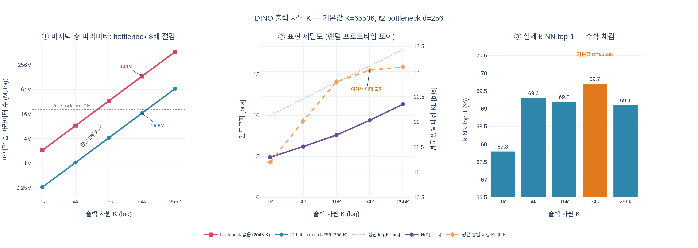

# 출력 차원 $K$의 영향과 기본값

## 한 줄 요약

DINO 프로젝션 헤드의 마지막 층 출력 차원 $K$는 **클래스 수가 아니라 프로토타입(prototype) 개수**다. $K$가 클수록 k-NN 성능이 좋아지고, $\ell_2$ bottleneck($d = 256$) 덕분에 파라미터 증가를 8배 줄인 채로 큰 $K$를 쓸 수 있다. 논문 기본값은 **$K = 65536$, $d = 256$**.


---

## 1. $K$가 정확히 무엇인가

프로젝션 헤드 $h$의 구조 (논문 4절 + 부록 C, `vision_transformer.py`의 `DINOHead`):

```
backbone f  →  [Linear 384→2048, GELU]
               [Linear 2048→2048, GELU]
               [Linear 2048→256]          ← MLP 3층, hidden 2048
            →  ℓ2 normalize (d = 256 bottleneck)
            →  weight-normalized Linear 256→K (bias 없음)
            →  softmax(· / τ)  →  K차원 확률분포 P
```

- 마지막 층은 bias 없는 weight-normalized 선형층이므로, 그 가중치 행렬의 **행 $K$개가 각각 단위구 위의 프로토타입 벡터**다. $\ell_2$ 정규화된 특징 $z$와의 내적 $\langle z, w_k\rangle$은 곧 코사인 유사도이므로, 출력은 "이 이미지가 $K$개 프로토타입 각각에 얼마나 가까운가"의 **soft 클러스터 할당**이 된다. 이 설계는 SwAV의 "prototype layer"에서 온 것이다.
- **레이블이 없다**는 점이 핵심이다. 각 차원 $k$에는 "고양이", "자동차" 같은 의미가 미리 부여되지 않는다. 학습 중 데이터가 스스로 이 $K$개 축을 나눠 쓰면서 의미가 사후적으로 생긴다.
- 따라서 $K$는 ImageNet의 1000 클래스와 아무 관계가 없다. $K = 65536 \gg 1000$이어도 "클래스보다 출력이 많아서 이상하다"는 문제가 생기지 않고, 오히려 하나의 클래스가 여러 프로토타입에 걸쳐 세분되어 표현이 더 미세해진다. (반대로 $K$를 1000으로 맞출 이유도 전혀 없다.)

---

## 2. 부록 C의 $K$ ablation 표 (재현)

**Output dimension.** ViT-S/16, 100 epoch 사전학습, ImageNet top-1 $k$-NN 평가($k = 20$).

| $K$ | 1024 | 4096 | 16384 | **65536** | 262144 |
|---|---|---|---|---|---|
| $k$-NN top-1 (%) | 67.8 | 69.3 | 69.2 | **69.7** | 69.1 |

논문 서술: *"We observe that a large output dimensionality improves the performance. (…) Our default is to use $K$ equals to 65536 and $d = 256$ for the bottleneck."*

읽는 법:

- $1024 \to 4096$에서 **+1.5%p**라는 가장 큰 점프가 나온다. 즉 $K$가 너무 작은 것이 실제로 병목이다.
- $4096 \to 65536$ 구간은 69.3 / 69.2 / 69.7로 **거의 평평하다(수확 체감)**. 65536이 최고점이지만 4096 대비 +0.4%p뿐이다.
- $K = 262144$에서는 69.1로 **오히려 소폭 하락**한다. 무한정 키우면 좋아지는 단조 증가가 아니라, 넓은 고원(plateau)의 정점이 65536 부근이라는 뜻.
- 참고로 같은 100-epoch ViT-S 세팅의 다른 부록 C 표들도 기본 설정에서 69.7을 보고한다(heads w/o BN: 69.7 vs w/ BN 68.6; GELU: 69.7 vs ReLU 68.9). $K = 65536$ 행이 그 기본 설정과 일치한다.

---

## 3. 왜 큰 $K$가 좋은가 (해석)

### (a) 타깃 분포의 정보량이 커진다

DINO의 손실은 teacher가 만든 확률분포 $P_t$를 student가 맞추는 것이다.

$$\min_{\theta_s} \; -\sum_{k=1}^{K} P_t^{(k)}(x) \log P_s^{(k)}(x)$$

$K$차원 분포가 담을 수 있는 정보의 상한은 균등분포일 때의 엔트로피다.

$$H_{\max} = \log_2 K \quad\Rightarrow\quad
\begin{cases}
K = 1024 & \to 10\ \text{비트} \\
K = 4096 & \to 12\ \text{비트} \\
K = 65536 & \to \mathbf{16}\ \text{비트} \\
K = 262144 & \to 18\ \text{비트}
\end{cases}$$

즉 $K$를 키우면 teacher가 한 이미지에 대해 전달할 수 있는 "설명"이 10비트에서 16비트로 늘어난다. 게다가 DINO는 centering으로 분포를 균등에 가깝게 유지하려 하고(한 차원 독점 방지) sharpening으로 뾰족하게 만드려 하므로, 실제 사용되는 엔트로피는 상한 근처에서 균형을 잡는다 — 즉 이 비트 예산이 실제로 쓰인다.

### (b) 더 미세한 구별을 강제한다

두 view $x_1, x_2$는 **같은 프로토타입 패턴**을 내야 한다. 프로토타입이 1024개일 때는 "대충 개과 동물" 수준의 거친 클러스터만 일치시키면 손실이 낮아진다. 65536개일 때는 "털이 곱슬한 소형 테리어를 이 각도에서 본 것"에 해당하는 훨씬 세분된 프로토타입 조합까지 두 view가 일치해야 한다. 결과적으로 backbone은 augmentation에 불변이면서도 **인스턴스 수준에 가까운 미세한 특징**을 학습하게 된다. 이것이 k-NN 성능(레이블 없이 특징 공간의 이웃 구조만 쓰는 평가)에서 특히 잘 드러나는 이유다.

### (c) 그런데 왜 수확 체감인가

프로토타입 수가 데이터의 실제 세분 구조(ImageNet 1.28M장 안의 의미 있는 시각적 모드 수)를 충분히 덮고 나면, 더 늘려도 새로 표현할 구별이 없다. 남는 프로토타입은 중복되거나 거의 안 쓰이는 축이 되고, 대신 마지막 층의 학습 신호가 $K$개로 더 얇게 흩어져 각 프로토타입이 받는 그래디언트가 희박해진다. 262144에서의 소폭 하락이 이 지점이다.

---

## 4. 파라미터 비용과 $\ell_2$ bottleneck의 역할

마지막 층은 bias 없는 $\text{Linear}(d \to K)$이므로 파라미터는 정확히 $d \times K$개다.

**bottleneck 있음 ($d = 256$):**

$$256 \times 65536 = 16{,}777{,}216 \approx \mathbf{16.8\text{M}}$$

**bottleneck 없음 (hidden 2048에서 바로 $K$로):**

$$2048 \times 65536 = 134{,}217{,}728 \approx \mathbf{134.2\text{M}}$$

정확히 **8배** 차이($2048/256 = 8$)다. 참고로 ViT-S/16 backbone은 약 21M 파라미터이므로:

| 구성 | 마지막 층 | 헤드 전체 | backbone 대비 |
|---|---|---|---|
| $d = 256$ bottleneck | 16.8M | 약 22.3M | ≈ 1.1× |
| bottleneck 없음 (2048→K) | 134.2M | 약 139.2M | ≈ 6.6× |

(헤드 전체 = $384{\times}2048 + 2048{\times}2048 + 2048{\times}256 + 256{\times}K$ ≈ 22.3M)

bottleneck이 없으면 프로젝션 헤드만으로 backbone의 6배가 넘는 파라미터를 짊어져야 하고, 이 거대한 층이 student·teacher 양쪽에 존재한다. 논문 표현대로 *"the use of $\ell_2$-normalization bottleneck permits to use a large output dimension with a moderate increase in the total number of parameters."* 즉 **bottleneck은 큰 $K$를 실현 가능하게 만드는 장치**다.

덧붙여 bottleneck의 이득은 파라미터 수만이 아니다. 같은 부록 C의 다른 표에서, $\ell_2$ bottleneck이 없으면 프로젝션 헤드를 깊게 쌓을 때 학습이 아예 실패한다:

| # proj. head 선형층 수 | 1 | 2 | 3 | 4 |
|---|---|---|---|---|
| w/ $\ell_2$-norm bottleneck | − | 62.2 | 68.0 | **69.3** |
| w/o $\ell_2$-norm bottleneck | 61.6 | 62.9 | 61.1 | 61.0 |

($K = 4096$, ViT-S/16 100 epoch, $k$-NN top-1. 기본값은 선형층 총 4개 = MLP 3층 + bottleneck 뒤 1층.)

---

## 5. 코드에서 확인

`main_dino.py`:

```python
parser.add_argument('--out_dim', default=65536, type=int, help="""Dimensionality of
    the DINO head output. For complex and large datasets large values (like 65k) work well.""")
```

`vision_transformer.py`의 `DINOHead`:

```python
def __init__(self, in_dim, out_dim, use_bn=False, norm_last_layer=True,
             nlayers=3, hidden_dim=2048, bottleneck_dim=256):   # ← d = 256
    ...
    self.last_layer = nn.utils.weight_norm(nn.Linear(bottleneck_dim, out_dim, bias=False))

def forward(self, x):
    x = self.mlp(x)
    x = nn.functional.normalize(x, dim=-1, p=2)   # ← ℓ2 bottleneck
    x = self.last_layer(x)
    return x
```

`DINOLoss`도 `center` 버퍼를 `torch.zeros(1, out_dim)`으로 잡으므로, centering 역시 $K$차원 전체에 대해 이뤄진다.

---

## 6. 암기 포인트

- $K$ = **프로토타입 개수**, 클래스 수 아님. 레이블 없으므로 각 축은 사전 의미 없음.
- **기본값 $K = 65536$, bottleneck $d = 256$**.
- 클수록 좋다 (67.8 → 69.7) 하지만 **수확 체감**, 262144에서 69.1로 하락.
- $\log_2 65536 = 16$비트의 타깃 정보량 → 더 미세한 soft 클러스터 할당.
- 파라미터: $256K$ = 16.8M vs $2048K$ = 134M (**8배 절감**) → bottleneck이 큰 $K$를 가능하게 함.

## 시각화


