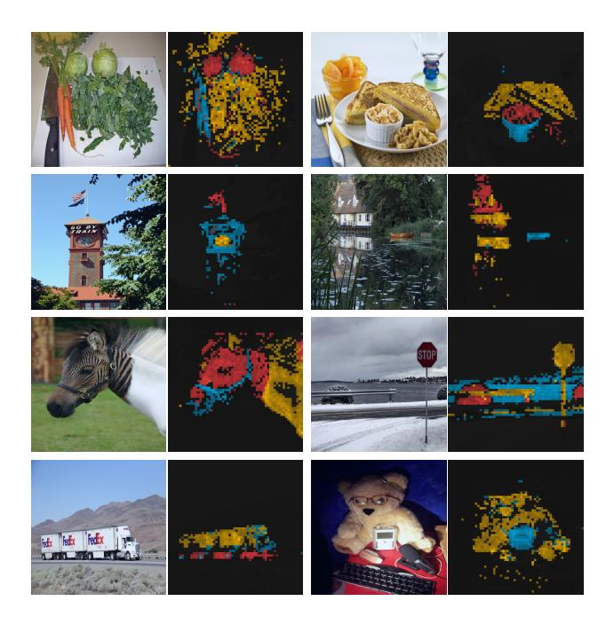

# ViT-S/16 vs ViT-S/8 — 같은 21M 파라미터, 5.6배 느린 처리량

## 1. 논문의 근거 수치 (Table 1)

DINO 논문(arXiv:2104.14294) Table 1 "Networks configuration"은 $224^2$ 해상도 입력, V100 GPU, forward당 128 샘플 기준으로 다음을 보고한다.

| model | blocks | dim | heads | # tokens | # params | im/s |
|---|---|---|---|---|---|---|
| ResNet-50 | – | 2048 | – | – | 23M | 1237 |
| **ViT-S/16** | 12 | 384 | 6 | **197** | **21M** | **1007** |
| **ViT-S/8** | 12 | 384 | 6 | **785** | **21M** | **180** |
| ViT-B/16 | 12 | 768 | 12 | 197 | 85M | 312 |
| ViT-B/8 | 12 | 768 | 12 | 785 | 85M | 63 |

즉 ViT-S/16과 ViT-S/8은 블록 수(12), 채널 차원(384), 헤드 수(6), 파라미터(21M)가 **완전히 동일**하고 오직 패치 크기만 $16\times16$ vs $8\times8$로 다르다. 그런데 토큰은 197 → 785로 약 4배, 처리량은 1007 → 180 im/s로 약 5.6배 떨어진다.

## 2. 토큰 수 계산

입력 해상도 $224\times224$를 패치 크기 $p$로 자르면 한 변에 $224/p$개의 패치가 생기고, 여기에 [CLS] 토큰 1개가 더해진다.

$$N = \left(\frac{224}{p}\right)^2 + 1$$

- $p=16$: $224/16 = 14 \Rightarrow N = 14^2 + 1 = 196 + 1 = 197$
- $p=8$: $224/8 = 28 \Rightarrow N = 28^2 + 1 = 784 + 1 = 785$

패치 변의 길이를 절반으로 줄이면 패치 개수는 $2^2 = 4$배가 된다. $785/197 \approx 3.98$로 정확히 4배에 가깝다.

> 참고: 논문은 480p 이미지로 attention을 시각화할 때 ViT-S/8의 시퀀스가 **3601 토큰**이 된다고 언급한다($480/8=60$, $60^2+1=3601$). 해상도까지 올리면 토큰이 얼마나 폭증하는지 보여주는 예다.

## 3. 왜 파라미터는 그대로인데 속도만 무너지는가

### 3-1. 파라미터는 토큰 수와 무관하다

Transformer 블록의 가중치는 **채널 차원 $d$의 함수일 뿐 시퀀스 길이 $N$과 무관**하다. 블록 하나당

- QKV 투영 + 출력 투영: $4d^2$
- MLP (확장비 4): $2 \times 4d^2 = 8d^2$

합쳐서 $\approx 12d^2$. $d=384$, 12블록이면

$$12 \times 12 d^2 = 144 \times 384^2 \approx 21.2\text{M}$$

이것이 두 모델이 공통으로 21M인 이유다. $N$은 이 식 어디에도 등장하지 않는다.

$N$에 의존하는 파라미터는 **패치 임베딩 층과 위치 임베딩**뿐이고, 그나마 서로 상쇄된다.

| | 패치 임베딩 $3p^2 d$ | 위치 임베딩 $Nd$ |
|---|---|---|
| /16 | $3\cdot 256\cdot 384 \approx 0.295\text{M}$ | $197 \cdot 384 \approx 0.076\text{M}$ |
| /8 | $3\cdot 64\cdot 384 \approx 0.074\text{M}$ | $785 \cdot 384 \approx 0.301\text{M}$ |

/8은 패치 임베딩에서 약 0.22M을 잃고 위치 임베딩에서 약 0.23M을 얻어 총합이 거의 그대로다. 그래서 표에는 둘 다 21M으로 찍힌다. 논문 본문도 이를 명시한다.

> "While reducing the patch size do **not add parameters**, it still leads to a significant reduction of running time, and larger memory usage." (Sec. 4.1, Comparing across architectures)

### 3-2. 계산량은 토큰 수에 강하게 의존한다

블록 하나의 FLOPs를 두 항으로 나누면

$$\underbrace{O(N d^2)}_{\text{QKV·투영·MLP (토큰별 선형변환)}} \;+\; \underbrace{O(N^2 d)}_{\text{self-attention (}QK^\top\text{, }AV\text{)}}$$

- 선형변환 항은 $N$에 **선형** → 4배
- attention 항은 $N$에 **제곱** → $4^2 = 16$배

상수까지 넣어 블록당 FLOPs를 $12Nd^2 + 4N^2d$로 계산하면($d=384$):

| | 선형변환 항 | attention 항 | 블록당 합 |
|---|---|---|---|
| $N=197$ | $12 \cdot 197 \cdot 384^2 \approx 0.349$ GFLOP | $4 \cdot 197^2 \cdot 384 \approx 0.060$ GFLOP | $\approx 0.408$ GFLOP |
| $N=785$ | $12 \cdot 785 \cdot 384^2 \approx 1.389$ GFLOP | $4 \cdot 785^2 \cdot 384 \approx 0.947$ GFLOP | $\approx 2.336$ GFLOP |

$$\frac{2.336}{0.408} \approx 5.7$$

12블록 전체로는 대략 4.9 GFLOPs → 28 GFLOPs다. 그리고 실제 측정된 처리량 비율은

$$\frac{1007}{180} \approx 5.6$$

**이론상 5.7배, 실측 5.6배로 거의 정확히 일치한다.** 핵심은 두 항의 비중 변화다. $N=197$에서는 attention이 전체의 약 15%에 불과해 모델이 사실상 "$O(Nd^2)$ 선형 비용"처럼 동작하지만, $N=785$에서는 attention이 전체의 약 41%까지 올라온다. 그래서 순수 선형 스케일링(4배)보다 더 나쁜 5.6배가 나온다. 만약 $N$을 더 키우면(예: 5×5 패치 → 44 im/s, 480p 입력 → 3601 토큰) attention의 $N^2$ 항이 지배하면서 감소폭은 더 가팔라진다.

### 3-3. 메모리도 같이 터진다

파라미터는 그대로지만 활성값은 $O(N)$, attention 행렬은 레이어·헤드당 $O(N^2)$로 저장된다. $197^2 \to 785^2$는 **약 16배**다. 논문이 "larger memory usage"라고 적은 것이 이 부분이며, Appendix의 시간·메모리 표(Tab. 8)에서도 DINO 학습의 병목이 GPU 피크 메모리로 나타난다(ViT-S/16 기준 멀티크롭 설정에서 9.3G vs 15.4G). 즉 /8 모델은 "파라미터가 작아서 가벼운 모델"이 아니라 **시퀀스 길이 때문에 비싼 모델**이다.

## 4. 그럼에도 작은 패치를 쓰는 이유 (Fig. 5)

Figure 5는 x축이 로그 스케일 처리량(im/s), y축이 ImageNet top-1(k-NN 평가)이고, 300 epoch로 학습한 DeiT-S(파랑)와 ViT-B(주황) 곡선을 보여준다. 그림에서 실제로 읽히는 것들:

- **DeiT-S 곡선(파랑)이 오른쪽 아래에서 왼쪽 위로 가파르게 상승한다.** 16×16(약 1000 im/s, ~73.4) → 8×8(180 im/s, ~76.8) → 5×5(44 im/s, ~77.3). 파라미터를 하나도 늘리지 않고 정확도만 +3.4%p 넘게 올린다.
- **두 곡선이 중간에서 교차한다.** ViT-S/8(180 im/s, ~76.8)이 4배 큰 ViT-B/16(312 im/s, ~76.0)보다 정확도가 **높다**. 파라미터를 21M→85M으로 키우는 것보다 패치를 16→8로 줄이는 쪽이 이득이 크다는 뜻이다.
- **5×5 구간에서 곡선이 평평해진다.** 8×8 → 5×5는 처리량이 180 → 44 im/s로 4배 더 떨어지는데 정확도 이득은 0.5%p 남짓이라 수익 체감이 뚜렷하다.

정량 결과도 같은 방향이다(Table 2, 완전 학습 기준).

| | Param. | im/s | Linear | k-NN | DAVIS $(\mathcal{J\&F})_m$ |
|---|---|---|---|---|---|
| DINO ViT-S/16 | 21M | 1007 | 77.0 | 74.5 | 61.8 |
| DINO ViT-S/8 | 21M | 180 | 79.7 | **78.3** | **69.9** |

k-NN이 +3.8%p, DAVIS 비디오 인스턴스 분할이 +8.1%p 오른다. 특히 ViT-S/8은 21M 파라미터로 586M짜리 SwAV RN50w5(78.5 linear)를 앞선다.

## 5. 왜 작은 패치가 k-NN·분할 품질을 크게 올리나

Figure 3은 DINO로 학습한 **ViT-S/8**의 마지막 층에서 [CLS] 쿼리에 대한 헤드별 self-attention을 색으로 구분해 그린 것이다. 그림에서 보이듯 서로 다른 헤드(빨강/노랑/파랑)가 얼룩말의 머리·목·배경 말, 트럭의 차체·컨테이너, 곰인형과 키보드처럼 **서로 다른 물체나 부위**에 각각 붙는다. 주목할 점은 마스크의 해상도다. 이 지도는 $28\times28$ 격자 위에서 그려진 것이라 물체 경계가 꽤 촘촘히 따라간다 — /16이었다면 $14\times14$ 격자, 즉 픽셀 하나가 원본 16×16 블록을 통째로 덮어 얇은 깃대나 다리 같은 구조는 아예 표현할 수 없다.

이것이 성능 향상의 메커니즘이다.

1. **공간 해상도가 곧 특징의 세밀도다.** 패치 토큰 하나가 담당하는 영역이 $16^2=256$ 픽셀에서 $8^2=64$ 픽셀로 줄어들어, 최종 출력 특징 맵이 $14\times14$에서 $28\times28$로 4배 촘촘해진다. DAVIS처럼 프레임 간 최근접 이웃으로 마스크를 전파하는 dense task는 이 해상도에 직접 비례해 좋아진다(논문: /8 변형이 ViT-B에서 $+9.1\%$ $(\mathcal{J\&F})_m$).
2. **양자화 오차 감소.** 큰 패치는 물체 경계를 가로질러 전경과 배경을 한 토큰에 섞어 넣는다. 작은 패치는 경계 근처 토큰의 비율을 줄여 [CLS]가 모으는 표현이 덜 오염된다.
3. **k-NN이 특히 민감한 이유.** k-NN 분류는 선형 프로브처럼 새 가중치를 학습하지 않고 **특징 공간의 거리 구조만** 사용한다. 따라서 표현이 더 정밀하고 물체 중심적일수록 이득이 크게 나타난다. 실제로 linear는 +2.7%p인데 k-NN은 +3.8%p로, 패치 축소의 효과가 k-NN 쪽에서 더 크게 나온다.

## 6. 한 줄 정리

- 토큰 수: $(224/p)^2+1$ → /16은 **197**, /8은 **785** (약 4배)
- 처리량: **1007 im/s → 180 im/s** (약 5.6배 감소), 파라미터는 **둘 다 21M**
- 이유: 파라미터는 $O(d^2)$로 $N$과 무관하지만, 연산량은 $O(Nd^2) + O(N^2d)$라 $N$이 4배면 선형 항 4배·attention 항 16배 → 합계 약 5.7배. 메모리는 attention 행렬 때문에 약 16배.
- 교환 조건: 공짜 파라미터로 정확도를 사는 대신 시간과 메모리를 지불한다. dense/k-NN 계열에서 이득이 가장 크다.
