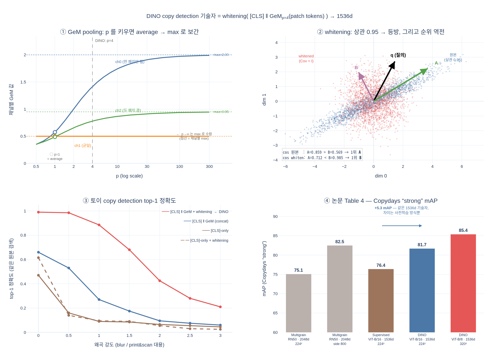

# copy detection에서 DINO 기술자(descriptor)의 구성

## 한 줄 요약

DINO는 사전학습된 ViT를 **그대로 얼려둔 채(off-the-shelf)** 특징만 뽑아 코사인 유사도로 copy detection을 수행한다. 이때 쓰는 기술자는

```
descriptor = whitening( concat( [CLS]_out ,  GeM_p(patch tokens_out) ) )
                        └── 768d ──┘  └────────── 768d ──────────┘
                        = 1536d  (ViT-B, embed dim 768)
```

즉 **① 출력 [CLS] 토큰**과 **② 출력 patch 토큰들을 GeM pooling한 벡터**를 연결해 1536차원을 만들고, **③ whitening** 선형변환을 적용한다. whitening 행렬은 평가에 쓰이는 Copydays 이미지나 10K distractor와 **겹치지 않는** YFCC100M의 별도 20K 랜덤 이미지로 학습한다.

논문(§4.2.1, Copy detection) 원문:

> The features are obtained as the concatenation of the output [CLS] token and of the GeM pooled [54] output patch tokens. This results in a 1536d descriptor for ViT-B. Following [5], we apply whitening on the features. We learn this transformation on an extra 20K random images from YFCC100M, distincts from the distractors.

평가 설정: INRIA Copydays의 "strong" subset(blur, insertion, print&scan 등으로 강하게 왜곡된 사본 찾기) + YFCC100M에서 랜덤 샘플한 10k distractor. 학습·파인튜닝 없이 **코사인 유사도만으로** 검색한다.

---

## 1. GeM pooling (Generalized Mean pooling)

Radenović, Tolias, Chum, *"Fine-tuning CNN Image Retrieval with No Human Annotation"* (TPAMI 2018) — 논문 참조 [54].

집합 $\mathcal{X}$(여기서는 한 이미지의 patch 토큰들, ViT-B/16 @ 224²이면 $14\times14=196$개)에 대해 채널 $c$별로

$$
f^{(c)} \;=\; \Bigl(\frac{1}{|\mathcal{X}|}\sum_{x \in \mathcal{X}} x_c^{\,p}\Bigr)^{1/p}
$$

- $p = 1$ → **average pooling**과 정확히 같다.
- $p \to \infty$ → **max pooling**으로 수렴한다 ($\max_x x_c$).
- $p \to 0^+$ → 기하평균으로 수렴한다.
- 즉 GeM은 average와 max 사이를 $p$ 하나로 **연속 보간**하는 pooling이며, 검색(retrieval) 문헌에서는 보통 $p \approx 3$ 근처를 쓴다(Radenović et al.은 $p$를 학습 가능한 스칼라로도 둔다). DINO 공식 구현 `eval_copy_detection.py`는 $p = 4$ 를 하드코딩한다:

```python
cls_output_token = feats[:, 0, :]                      # [CLS] token, 768d
feats = feats[:, 1:, :].reshape(b, h, w, d)            # patch tokens
feats = feats.clamp(min=1e-6).permute(0, 3, 1, 2)      # 음수 클램프
feats = nn.functional.avg_pool2d(feats.pow(4), (h, w)).pow(1./4).reshape(b, -1)  # GeM, p=4
feats = torch.cat((cls_output_token, feats), dim=1)    # 1536d
```

**직관**: average는 배경까지 포함한 전체 평균이라 두드러진 국소 반응이 희석된다. max는 가장 강한 한 패치만 남겨 잡음에 민감하다. $p>1$인 GeM은 큰 활성값에 더 큰 가중치를 주면서도 여러 패치의 정보를 함께 남긴다 — "가장 특징적인 국소 패턴을 강조하되 하나에 몰아주지 않는" 절충이다. 그래서 특정 객체/텍스처 검색에 잘 맞는다.

주의: 음수 입력에 대해 $x^p$가 정의되지 않거나 부호가 뒤집히므로, 실제 구현은 $\max(x,\epsilon)$으로 클램프한 뒤 거듭제곱한다(CNN에서는 ReLU 뒤라 자연히 비음수, ViT 출력은 음수가 있으므로 클램프가 필수).

## 2. 왜 [CLS] 단독이 아니라 [CLS] + GeM(patch)를 연결하는가

ViT의 마지막 층 출력은 두 종류의 토큰으로 나뉜다.

| 구성요소 | 차원(ViT-B) | 성격 |
|---|---|---|
| 출력 `[CLS]` 토큰 | 768 | **전역 요약**. self-attention으로 전체 이미지를 집약한 의미(semantic) 수준 표현. DINO 학습 손실이 직접 걸리는 토큰이라 "무엇이 찍혀 있는가"에 최적화됨 |
| GeM$_p$(출력 patch 토큰들) | 768 | **국소 패치 통계**. 각 패치 위치의 텍스처·구조 반응을 GeM으로 집약. 공간적으로 어디에 무엇이 있는지에서 나온 신호 |
| concat | **1536** | 전역 의미 + 국소 텍스처를 모두 담은 기술자 |

**왜 합치는가**: copy detection은 "의미적으로 비슷한 다른 이미지"를 찾는 태스크가 아니라 **동일 이미지의 변형(near-duplicate)** 을 찾는 태스크다. 질의와 정답은 같은 원본에서 나온 blur/crop/print&scan 버전이므로, 결정적인 단서는 카테고리 수준 의미가 아니라 **저수준·국소 텍스처와 구조의 일치**다.

- `[CLS]`만 쓰면: 의미 수준 요약에 치우쳐 "같은 종류의 다른 사진"과 "같은 사진의 변형"을 잘 구분하지 못한다. distractor 중 같은 장면 카테고리 이미지가 쉽게 끼어든다.
- GeM(patch)만 쓰면: 국소 정보는 풍부하지만 전역 배치/맥락 정보가 약해 강한 왜곡(insertion, print&scan)에서 흔들린다.
- 두 벡터를 concat하면 서로 보완적인 두 축을 모두 유사도에 반영할 수 있다. 이것이 DINO가 **retrieval 전용으로 학습된** MultiGrain을 같은 해상도에서 이기는 이유의 큰 부분이다.

참고로 DINO 논문의 다른 실험들도 이 이원 구조를 뒷받침한다. DAVIS video instance segmentation(§4.2.2)에서는 **patch 토큰만** 써서 좋은 성능을 냈고("출력 patch 토큰이 공간 정보를 유지하고 있다"), ImageNet k-NN(§4.1)은 **[CLS]만** 써서 74.5%를 냈다. 둘은 서로 다른 정보를 들고 있다.

## 3. whitening

concat으로 만든 1536차원 벡터는 차원 간 **상관이 크고 분산 스케일이 제각각**이다. 특히 [CLS] 블록과 GeM 블록은 통계 규모가 다르므로, 그대로 코사인 유사도를 재면 분산이 큰 소수 차원이 유사도를 지배한다.

whitening은 이를 없애는 선형 변환이다. 학습 집합의 평균 $\mu$와 공분산 $\Sigma$에 대해

$$
\hat{x} \;=\; \Sigma^{-1/2}\,(x - \mu),
\qquad
\operatorname{Cov}(\hat{x}) = I
$$

$\Sigma = U \Lambda U^{\top}$ 고유분해를 쓰면 $\Sigma^{-1/2} = U \Lambda^{-1/2} U^{\top}$ (ZCA whitening) 또는 $\Lambda^{-1/2}U^{\top}$ (PCA whitening)로 구현한다. 실무에서는 작은 고윳값 방향이 폭발하는 것을 막기 위해 $(\Lambda + \epsilon I)^{-1/2}$ 형태로 정규화하거나 고윳값을 잘라낸다.

DINO 공식 구현(`eval_copy_detection.py`)은 PCA whitening 쪽이다: whitening 이미지들의 평균을 query/database에서 빼고, 그 특징들의 공분산 $\Sigma$로 `utils.PCA(dim=1536, whit=0.5)`를 학습해 $\Lambda^{-0.5}U^{\top}$ 를 적용한다(지수 0.5가 곧 $\Sigma^{-1/2}$). 그 다음 L2 정규화 → 내적(=코사인 유사도)으로 top-k 검색.

**왜 성능이 오르는가**

1. **차원 간 상관 제거**: 서로 중복된 차원들이 같은 정보를 여러 번 세면 유사도가 그 방향으로 편향된다. whitening 후에는 각 방향이 독립적으로 기여한다.
2. **분산 균등화**: 모든 방향의 분산이 1이 되어, "모든 이미지에서 값이 큰" 흔한 방향(내적을 무의미하게 부풀리는 성분)의 지배력이 사라진다. 검색에서 이는 흔한 패턴을 눌러주고 이미지를 실제로 구별하는 방향을 살리는 효과 — 정보검색의 IDF 가중과 같은 취지다.
3. **코사인 유사도와의 궁합**: 코사인은 방향만 보므로 좌표계가 왜곡되어 있으면 순위 자체가 잘못 나온다. whitening은 데이터 분포를 등방(isotropic)으로 만들어 각도가 곧 유의미한 차이가 되게 한다(마할라노비스 거리를 유클리드 거리로 바꾸는 것과 동일).

**왜 학습 데이터를 따로 고르는가 (정보 누설 방지)**

whitening 행렬은 데이터로부터 추정하는 **학습된 파라미터**다. 만약 이를 평가 대상(Copydays query/database)이나 10k distractor에서 추정하면, 평가 집합의 통계가 변환에 스며들어 성능이 낙관적으로 부풀려진다 — 테스트 집합에 튜닝하는 것과 같다. 그래서 논문은 MultiGrain[5]의 관행을 따라 **distractor와 겹치지 않는 YFCC100M의 별도 20K 랜덤 이미지**로 학습한다. 이렇게 하면 whitening은 "일반적인 자연 이미지 통계"만 반영하는, 태스크와 독립적인 전처리가 된다. 레이블이 전혀 필요 없다는 점도 SSL 파이프라인과 잘 맞는다.

---

## 논문 Table 4: Copy detection (Copydays "strong" subset, mAP)

| Method | Arch. | Dim. | Resolution | mAP |
|---|---|---|---|---|
| Multigrain [5] | ResNet-50 | 2048 | 224² | 75.1 |
| Multigrain [5] | ResNet-50 | 2048 | largest side 800 | 82.5 |
| Supervised [6] | ViT-B/16 | 1536 | 224² | 76.4 |
| **DINO** | ViT-B/16 | 1536 | 224² | **81.7** |
| **DINO** | ViT-B/8 | 1536 | 320² | **85.4** |

읽는 법:

- **DINO vs Supervised, 같은 아키텍처·같은 1536차원·같은 해상도**: 76.4 → 81.7 (+5.3). 기술자 구성 방식이 동일하므로 이 차이는 순수하게 **DINO 자기지도 학습이 만든 특징의 질** 때문이다.
- **DINO ViT-B/16 @224² (81.7) vs MultiGrain @224² (75.1)**: retrieval 전용으로 학습된 모델을 동일 해상도에서 +6.6 앞선다. MultiGrain이 800까지 해상도를 올려 82.5로 겨우 앞선다.
- **DINO ViT-B/8 @320² = 85.4**가 전체 최고. 패치를 8×8로 줄이면 patch 토큰 수가 크게 늘어(320²/8² = 1600개) GeM에 들어가는 국소 통계가 훨씬 정밀해진다. 차원은 여전히 1536으로 동일하다는 점이 중요하다 — 이득은 차원 증가가 아니라 **더 촘촘한 국소 정보**에서 온다.
- Dim. 열이 ViT 계열 모두 1536인 것이 바로 `768 × 2 = [CLS] + GeM(patch)` concat 구조의 흔적이다.

## 정리: 파이프라인

1. 이미지를 얼린 DINO ViT에 통과 → 출력 토큰 $\{z_{\text{[CLS]}}, z_1, \dots, z_N\}$, 각 768차원
2. $g = \bigl(\frac{1}{N}\sum_i \max(z_i,\epsilon)^p\bigr)^{1/p}$ (채널별 GeM, 768차원)
3. $d = [\,z_{\text{[CLS]}} \;\Vert\; g\,]$ → 1536차원
4. $\hat{d} = \Sigma^{-1/2}(d - \mu)$ — $\mu,\Sigma$는 YFCC100M 별도 20K 이미지에서 추정
5. L2 정규화 후 코사인 유사도(내적)로 database 검색 → mAP 평가

## 시각화


