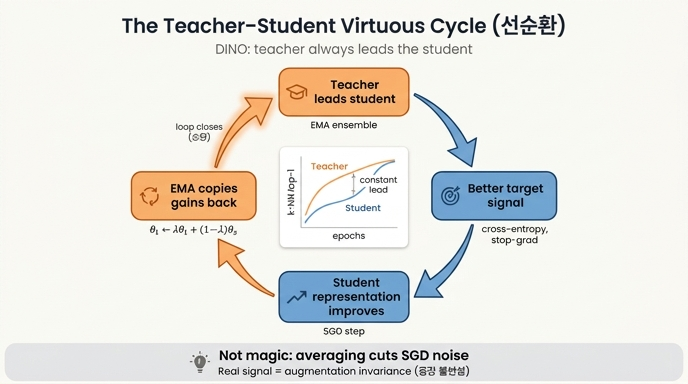

# teacher가 student보다 낫다는 사실이 만드는 선순환

## 한 줄 요약

DINO의 momentum teacher는 학습 내내 student보다 성능이 높다. student는 그 "더 나은" teacher를 타깃으로 학습하므로 표현이 개선되고, teacher는 다시 그 개선된 student 가중치의 EMA로 만들어지므로 teacher도 함께 올라간다. 이 두 방향이 맞물려 서로를 끌어올리는 고리가 된다.

## 선순환의 4단계 인과 고리

1. **teacher가 student보다 앞선다.** teacher $g_{\theta_t}$ 는 student 가중치의 지수이동평균이므로 Polyak–Ruppert 평균 = 사실상 "여러 시점 student의 앙상블"이다. 앙상블은 개별 모델보다 낫다. 논문 §5.2: *"A key observation is that this teacher constantly outperforms the student during the training."*
2. **student가 그 앞선 teacher를 타깃으로 학습한다.** 손실은 teacher 출력에 대한 cross-entropy이고, teacher 쪽에는 stop-gradient가 걸려 있다.
   $$\min_{\theta_s} \sum_{x \in \{x_1^g, x_2^g\}} \sum_{\substack{x' \in V \\ x' \neq x}} H\!\left(P_t(x), P_s(x')\right)$$
   타깃 자체가 자기보다 품질 높은 신호이므로 student는 "위쪽"을 향해 끌려간다. §3: *"guides the training of the student by providing target features of higher quality."*
3. **student가 실제로 개선된다.** SGD 스텝이 $\theta_s$ 를 더 좋은 표현 쪽으로 움직인다.
4. **개선분이 EMA를 통해 teacher로 흘러 들어간다.**
   $$\theta_t \leftarrow \lambda\,\theta_t + (1-\lambda)\,\theta_s,\qquad \lambda: 0.996 \to 1 \ (\text{cosine})$$
   teacher는 student로부터 *직접* 만들어지므로, student가 좋아진 만큼 teacher도 좋아진다. 그리고 앙상블 이득 때문에 teacher는 갱신 후에도 다시 student보다 조금 앞선 자리를 유지한다 → 1단계로 복귀.

즉 고리는 **teacher 우위 → 더 나은 타깃 → student 개선 → EMA 반영 → teacher 개선 → 다시 teacher 우위**로 닫힌다. 카드의 답이 두 문장으로 압축한 것이 정확히 이 왕복이다.

## 근거 그림: teacher는 항상 student 위에 있다

논문 Figure 6 (§5.2). 왼쪽 패널이 이 카드의 직접적 증거다.

- 두 곡선(주황 = Teacher, 파랑 = Student)이 **300 에폭 전 구간에서 교차하지 않는다.** 주황이 위, 파랑이 아래로 나란히 상승한다. 어느 한 시점의 우연이 아니라 지속적(constant) 격차라는 것이 요점이다.
- 둘 다 **단조 상승**한다. teacher가 앞선다는 사실이 student를 정체시키지 않고, 오히려 함께 올라간다 — 선순환의 시각적 모습이다.
- 격차는 학습 후반에 **좁아진다.** $\lambda \to 1$ 로 teacher 갱신이 느려지고 student도 수렴하면서 앙상블 이득이 줄어들기 때문이다. 즉 격차는 "영구적 우월"이 아니라 학습이 진행되는 동안 유지되는 리드다.
- 오른쪽 표는 이 리드가 **momentum teacher에서만 생긴다**는 점을 보여준다: student copy 0.1%, previous iteration 0.1% (완전 붕괴), previous epoch 66.6%, momentum 72.8%. 논문은 이 dynamic이 momentum을 쓰는 기존 연구(BYOL, MoCo)에서도, previous-epoch teacher에서도 관찰되지 않았다고 명시한다.

## 왜 무한 부트스트랩 역설이 아닌가

"자기보다 나은 것을 타깃으로 삼아 자기가 좋아지고, 그게 다시 타깃을 좋게 한다"는 말은 무에서 정보를 만들어내는 영구기관처럼 들린다. 그렇지 않은 이유는 세 가지다.

**(1) teacher는 새 정보를 담고 있지 않다.** teacher 가중치는 student 과거 가중치들의 가중평균일 뿐이다. EMA를 펼치면
$$\theta_t^{(T)} = (1-\lambda)\sum_{k=0}^{T-1} \lambda^{k}\,\theta_s^{(T-k)} + \lambda^{T}\theta_t^{(0)}$$
로, student 궤적의 볼록결합이다. teacher가 접근한 데이터도 student가 본 것과 같다. 따라서 "더 낫다"는 것은 **더 많이 안다**는 뜻이 아니다.

**(2) 이득의 정체는 분산 감소다.** minibatch SGD의 각 스텝은 (참 기울기 + 노이즈)로 움직이므로 $\theta_s$ 는 좋은 영역 안에서 흔들린다. 시간축 평균은 이 노이즈를 상쇄해 편향은 거의 그대로 두고 분산만 줄인다 — 이것이 Polyak–Ruppert 평균이 표준 관행인 이유이고, 논문이 이 dynamic을 *"applying Polyak-Ruppert averaging during the training to constantly build a model ensembling that has superior performances"*로 해석하는 근거다. 정보가 창조된 게 아니라, 이미 SGD가 획득했지만 노이즈에 묻혀 있던 신호가 드러난 것이다. 그리고 이 이득은 **공짜지만 유한하다**: 노이즈를 다 상쇄하면 더 줄일 게 없어 격차가 좁아진다(Fig. 6 왼쪽의 후반부).

**(3) 실제 학습 신호는 외부 제약에서 온다.** 표현을 좋아지게 만드는 힘은 teacher가 아니라 손실의 구조다. Eq. (3)은 *한 이미지의 서로 다른 증강/크롭* 사이에 같은 출력을 요구한다 — 특히 local crop(96²)의 student 출력을 global crop(224²)의 teacher 출력에 맞추는 "local-to-global" 대응. 색·크기·위치·가림이 바뀌어도 불변인 표현만 이 제약을 만족하므로, 데이터 증강 불변성이라는 **외부에서 주입된 사전지식**이 실제 정보원이다. teacher는 그 제약을 안정적으로 전달하는 저잡음 통로일 뿐이다. teacher를 완전히 없애고 student copy를 쓰면(0.1%) 통로가 망가지고, 제약만으로는 붕괴를 못 막는다.

논문 Figure 2. 이 그림에서 선순환의 배선을 그대로 읽을 수 있다: 같은 이미지 $x$ 에서 갈라진 두 증강 $x_1, x_2$ (외부 제약), 오른쪽 teacher 경로의 `sg`(기울기 역류 차단 — 학습은 student만 받는다), 그리고 student → teacher로 향하는 `ema` 화살표(개선분의 환류). 정보 흐름이 gradient로는 한 방향(teacher→student), 가중치로는 반대 방향(student→teacher)으로 분리되어 있다는 점이 핵심이다.

## 붕괴하지 않는 이유와의 연결

선순환이 성립하려면 고리가 **엉뚱한 고정점으로 수렴하지 않아야** 한다. teacher와 student가 서로를 참조하므로 "모든 입력에 같은 출력"이라는 자명해도 손실을 완벽히 만족한다. DINO는 두 축으로 이를 막는다. 첫째, teacher 출력의 **centering**($g_t(x) \leftarrow g_t(x)+c$, $c$ 도 EMA로 갱신)은 한 차원이 지배하는 붕괴를 막지만 균일분포로 밀고, 낮은 온도의 **sharpening**($\tau_t \approx 0.04\text{–}0.07$)은 반대로 민다. 둘의 상반된 압력이 균형을 이뤄 타깃이 "선명하지만 한쪽으로 치우치지 않은" 분포로 유지된다(§5.3: 한쪽만 빼면 $D_{KL} \to 0$, 즉 상수 출력). 둘째, **teacher의 느린 갱신**($\lambda \ge 0.996$)이 시간 규모를 분리한다. teacher가 student를 즉시 따라가면 (student copy / previous iteration = 0.1%) 타깃과 예측이 같은 것을 뒤쫓으며 서로를 증폭시켜 발산·붕괴한다. teacher가 뒤처져 움직이면 타깃이 사실상 준정적(quasi-static)이어서 student가 "고정된 문제"를 푸는 형태가 되고, 앙상블 효과로 리드도 유지된다. §5.3의 표현대로 centering+sharpening만으로 붕괴를 피할 수 있는 것은 **momentum teacher가 있을 때**이며, momentum이 없으면 Sinkhorn-Knopp 같은 더 강한 정규화가 필요하다(§5.1 Table 7, Appendix Table 15). 요약하면 느린 EMA는 선순환의 *엔진*이면서 동시에 붕괴 방지의 *브레이크*다.

## 오해 방지 체크리스트

- teacher는 사전학습된 큰 모델이 아니다 — student와 **완전히 같은 아키텍처**(predictor도 없음)이고, 학습 중 동적으로 만들어진다.
- codistillation과 다르다: codistillation은 teacher도 student로부터 *증류*하지만, DINO의 teacher는 student의 *평균*이다(§2).
- 격차가 벌어지는 것이 목표가 아니다. 목표는 student의 표현 품질이며, 격차는 그 과정에서 나타나는 앙상블 이득의 지표다.

## 참고

- 논문 §3 "Teacher network", §5.2 "Impact of the choice of Teacher Network" (Figure 6), §5.3 "Avoiding collapse" (Figure 7)
- Caron et al., *Emerging Properties in Self-Supervised Vision Transformers* (DINO), arXiv:2104.14294v2

## 인포그래픽

