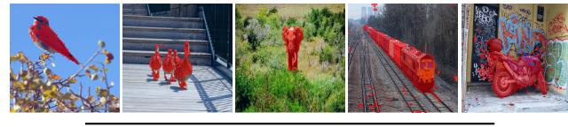

# ViT의 성공이 "제한적"이었던 이유에 대한 저자들의 가설

> **Q.** 저자들이 ViT의 성공이 제한적이었던 이유로 제기한 가설은?
>
> **A.** ViT 사전학습에 **감독(supervision)** 을 사용했기 때문이라는 가설이다. NLP에서 Transformer의 성공은 BERT의 cloze나 GPT의 language modeling 같은 **자기지도(self-supervised) 사전학습**이 핵심이었다는 점에서 착안했다.

---

## 1. 논문의 원문 근거

DINO 논문(*Emerging Properties in Self-Supervised Vision Transformers*, Caron et al., 2021) 서론 1절의 핵심 두 문단이다.

> "The resulting Vision Transformers (ViT) are competitive with convnets but, **they have not yet delivered clear benefits over them**: they are computationally more demanding, require more training data, and their features do not exhibit unique properties."
>
> "In this paper, we **question whether the muted success of Transformers in vision can be explained by the use of supervision in their pretraining**. Our motivation is that one of the main ingredients for the success of Transformers in NLP was the use of self-supervised pretraining, in the form of cloze procedure in BERT or language modeling in GPT. **These self-supervised pretraining objectives use the words in a sentence to create pretext tasks that provide a richer learning signal than the supervised objective of predicting a single label per sentence.** Similarly, in images, image-level supervision often reduces the rich visual information contained in an image to a single concept selected from a predefined set of a few thousand categories of objects."

여기서 "muted success(제한적/시들한 성공)"의 구체적 증상 세 가지를 저자들이 먼저 열거한다는 점이 중요하다.

| ViT의 당시 한계 | 설명 |
|---|---|
| 계산량이 더 크다 | convnet 대비 computationally more demanding |
| 데이터가 더 많이 필요하다 | JFT-300M 같은 초대형 데이터 없이는 convnet을 못 이김 |
| 특징(feature)에 고유한 성질이 없다 | convnet을 대체할 만한 "이것 때문에 ViT를 쓴다"는 이유가 없음 |

즉 저자들의 문제 제기는 "ViT 아키텍처가 나쁘다"가 아니라 **"ViT를 학습시키는 방식(감독 사전학습)이 아키텍처의 잠재력을 못 끌어내고 있는 것 아닌가"** 이다. 원인을 아키텍처가 아니라 **학습 목표(objective)** 에 돌린 것이 이 가설의 핵심이다.

---

## 2. NLP에서의 착안: 왜 cloze / language modeling이 "더 풍부한 학습 신호"인가

저자들이 근거로 든 것은 NLP의 역사다. Transformer가 NLP를 장악한 결정적 계기는 아키텍처 그 자체가 아니라, **문장 자체를 정답으로 쓰는 사전학습 과제(pretext task)** 였다.

### 2.1 두 가지 자기지도 목표

- **BERT의 cloze(빈칸 채우기) = Masked Language Modeling**
  입력 문장의 토큰 약 15%를 `[MASK]`로 가리고, 좌우 문맥 전체를 보고 가려진 원래 단어를 맞춘다. ("cloze procedure"는 심리언어학에서 온 용어로, 빈칸 뚫린 문장을 채우게 하는 검사 방식을 가리킨다.)
- **GPT의 language modeling = 다음 토큰 예측**
  `w_1 ... w_{t-1}`가 주어졌을 때 `w_t`를 맞춘다. 문장의 모든 위치가 하나씩 예측 대상이 된다.

두 방식 다 **레이블을 사람이 붙일 필요가 없다.** 원문 텍스트 자체가 정답을 내장하고 있다.

### 2.2 "풍부한 신호"의 정체를 단계적으로 뜯어보기

**(1) 신호의 양(bit 수) 차이**

문장 분류 같은 감독 목표는 문장 하나당 **레이블 1개**를 출력한다. 클래스가 예컨대 2개면 학습 신호는 문장당 최대 1비트 수준이다.
반면 길이 `L`인 문장에 대해 language modeling은 **위치마다** 어휘 크기 `V`(수만 개) 중 하나를 맞춰야 한다. 문장 하나에서 나오는 예측 문제가 `L`개이고, 각 문제의 정보량은 `log2(V)` ≈ 15비트 이상이다. 같은 데이터 한 문장으로부터 수백 배의 감독 신호가 나온다.

**(2) 신호의 종류 차이 — 무엇을 배우도록 강요하는가**

"이 문장은 긍정/부정" 하나만 맞추면 되는 과제는 감정 단어 몇 개에만 반응하는 지름길(shortcut)을 허용한다. 반대로 빈칸을 정확히 채우려면 모델은 어쩔 수 없이

- 문법(어순·일치·품사),
- 통사 구조(어떤 단어가 어떤 단어에 걸리는가),
- 상식·세계 지식("파리는 __의 수도" → "프랑스"),
- 장거리 의존(앞 문단의 대명사 지시 대상)

을 전부 표현으로 encode해야 한다. **과제 자체가 데이터의 내부 구조를 남김없이 모델링하도록 강제**한다는 뜻에서 "richer"이다.

**(3) 정보 손실(압축)의 차이**

감독 목표는 입력의 방대한 정보를 **하나의 미리 정해진 라벨 집합**으로 사영(projection)한다. 라벨 집합에 없는 정보는 학습 신호에 아예 나타나지 않으므로, 모델이 그 정보를 유지할 유인이 없다. 자기지도 목표는 라벨 집합이라는 병목이 없다.

**(4) 데이터 규모의 차이(부수 효과)**

레이블이 필요 없으니 인터넷 규모의 원시 데이터를 그대로 쓸 수 있다. Transformer처럼 inductive bias가 약하고 파라미터가 많은 모델은 데이터가 많을수록 유리한데, 자기지도는 그 데이터 병목마저 없앤다.

---

## 3. 같은 논리를 이미지로 옮기면

저자들의 유추(analogy)는 다음과 같이 1:1로 대응한다.

| | NLP | Vision |
|---|---|---|
| 감독 목표 | 문장 하나 → 라벨 1개 | 이미지 하나 → 라벨 1개 |
| 라벨 집합 | 소수의 클래스 | ImageNet 기준 미리 정해진 수천 개 물체 카테고리 |
| 버려지는 정보 | 문법·구조·세계 지식 | 장면 배치(scene layout), 물체 경계, 여러 물체의 공존, 배경, 부분-전체 관계, 질감 |
| 자기지도 대안 | cloze / next-token | 이미지 자체로 pretext task 구성 (증강 뷰 매칭 등) |

논문 표현대로, **"image-level supervision often reduces the rich visual information contained in an image to a single concept selected from a predefined set of a few thousand categories."**
사진 한 장에는 픽셀 수십만 개 분량의 정보가 있는데, `"개"`라는 라벨 하나를 맞추도록 학습시키면 나머지는 학습 신호에 전혀 반영되지 않는다. 개의 윤곽선이 어디인지, 배경에 무엇이 있는지 모델이 굳이 표현할 이유가 없어진다.

### 3.1 단, 그대로 옮길 수는 없다

저자들은 곧바로 단서를 단다.

> "While the self-supervised pretext tasks used in NLP are **text specific**, many existing self-supervised methods have shown their potential on images with convnets."

텍스트는 이산 토큰의 유한 어휘라서 "빈칸의 정답 단어"가 자연스럽게 정의되지만, 이미지는 연속적인 픽셀이라 "빈칸의 정답 패치"를 그대로 분류 문제로 만들기 어렵다. 그래서 DINO는 cloze를 직접 옮기는 대신, convnet 계열 SSL(BYOL, SwAV, MoCo 등)에서 검증된 **증강 뷰 간 표현 일치(view-matching)** 구조를 가져와 ViT에 적용한다. 그 결과물이 라벨 없는 자기증류(self-distillation), 즉 **DI**stillation with **NO** labels = **DINO** 이다.

---

## 4. 가설이 실제로 검증된 방식

가설이므로 논문 전체가 그 검증이다. 서론에서 저자들은 "supervised ViT에서도, convnet에서도 나타나지 않는" 성질 두 가지를 자기지도 ViT에서 발견했다고 선언한다.

1. **명시적 장면 구조 / 물체 경계**가 마지막 블록의 self-attention에 직접 담긴다 (Figure 1).
2. **finetuning·linear classifier·데이터 증강 없이** 단순 k-NN만으로 ImageNet top-1 78.3%를 낸다.

특히 1번은 "감독이 정보를 라벨 하나로 압축해 버린다"는 가설의 직접적인 반대 증거다. Figure 4가 이를 같은 아키텍처(ViT-S/8)에서 **감독 학습 vs DINO**로 통제 비교한다. self-attention map을 질량 60% 기준으로 임계화한 마스크를 시각화한 것이다.

같은 아키텍처인데 감독 학습 쪽은 어텐션이 물체 위에 흩뿌려진 점처럼 산만하고, DINO 쪽은 새·볼링핀·코끼리·기차·오토바이의 실루엣을 통째로 덮는다. PASCAL VOC12 검증셋 기준 Jaccard 유사도는 다음과 같다.

| | Random init. | Supervised | DINO |
|---|---|---|---|
| ViT-S/16 | 22.0 | 27.3 | **45.9** |
| ViT-S/8 | 21.8 | 23.7 | **44.7** |

감독 학습은 랜덤 초기화 대비 개선폭이 미미(+5.3, +1.9)한 반면 DINO는 두 배 가까이 뛴다. 어텐션 맵은 마스크를 만들도록 최적화된 적이 없는데도 그렇다. **"감독이 문제였다"는 가설의 가장 시각적인 근거**다.

보조 증거들:

- **전이 학습(Table 6)**: 동일 ViT 아키텍처에서 DINO 사전학습이 감독 사전학습보다 다운스트림 전이 성능이 좋다.
- **ImageNet 분류(Table 11)**: 랜덤 초기화 대비 DINO 사전학습은 +1%. 반면 **감독 사전학습으로 바꾸면 개선이 없다** — 즉 개선의 원인은 "학습을 더 오래 해서"가 아니라 "자기지도라서"임을 통제한 실험이다. (참고로 같은 표의 MPP는 *Masked Patch Prediction*, ViT 원논문이 시도한 cloze의 이미지 버전인데 JFT-300M에서 79.9로 감독 84.2에 못 미쳤다 — cloze를 이미지에 그대로 옮기는 게 왜 어려운지 보여주는 사례다.)

---

## 5. 암기 포인트 정리

- **가설 한 줄**: ViT가 기대만큼 못 한 건 아키텍처 탓이 아니라 **감독 사전학습** 탓일 수 있다.
- **착안의 출처**: NLP Transformer의 성공 = **BERT cloze + GPT language modeling**, 즉 자기지도 사전학습.
- **핵심 대비 문구**: 자기지도 목표는 "문장당 라벨 하나"를 예측하는 감독 목표보다 **richer learning signal**을 준다.
- **이미지 버전 문장**: image-level supervision은 이미지의 풍부한 시각 정보를 **미리 정해진 수천 개 카테고리 중 하나의 개념**으로 축소해 버린다.
- **주의할 단서**: NLP의 pretext task는 text specific이라 그대로 못 옮긴다 → convnet SSL 구조를 빌려 DINO를 설계.
- **혼동 주의**: 저자들이 지목한 원인은 "데이터 부족"이나 "ViT의 약한 inductive bias"가 **아니다**. 그건 증상(more training data 필요) 쪽에 열거된 항목이고, 원인 가설로 제시된 것은 **supervision** 이다.
