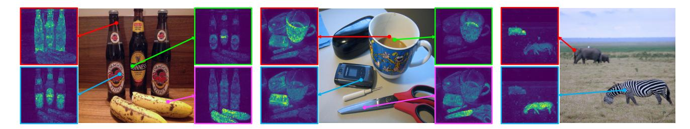

# DAVIS-2017 비디오 객체 분할 평가 (DINO §4.2.2)

## 0. 한 문장 요약

**얼려둔(frozen) DINO ViT의 출력 patch 토큰만 꺼내서, 첫 프레임의 정답 마스크를 "특징 공간의 최근접 이웃"을 타고 뒤 프레임으로 전파(label propagation)한다.** 특징 위에 헤드를 붙여 학습하지도 않고, 백본을 finetuning하지도 않으며, 480p 해상도를 쓴다.

> "In Tab. 5, we evaluate the output patch tokens on the DAVIS-2017 video instance segmentation benchmark [52]. We follow the experimental protocol in Jabri *et al.* [37] and segment scenes with a nearest-neighbor between consecutive frames; we thus **do not train any model on top of the features, nor finetune any weights** for the task." — 논문 §4.2.2

> "We report mean region similarity $\mathcal{J}_m$ and mean contour-based accuracy $\mathcal{F}_m$. ... **Image resolution is 480p.**" — Table 5 캡션

---

## 1. DAVIS-2017 semi-supervised VOS 설정

### 태스크 정의

DAVIS-2017(Pont-Tuset et al., *The 2017 DAVIS Challenge on Video Object Segmentation*, [52])의 **semi-supervised** 트랙은 이름이 오해를 부르기 쉽다. "준지도 학습"이 아니라 **추론 시에 힌트가 얼마나 주어지는지**를 뜻한다.

| 구분 | 주어지는 것 | 요구되는 것 |
|---|---|---|
| **semi-supervised** (DINO가 쓰는 설정) | 비디오의 **첫 프레임 $t=0$의 인스턴스별 정답 마스크** | $t=1,\dots,T$ 전 프레임의 인스턴스 마스크 |
| unsupervised / zero-shot | 아무것도 없음 | 객체를 스스로 발견해 분할 |
| interactive | 사람의 클릭/스크리블 | 반복 교정 |

즉 이 태스크의 본질은 "무엇이 객체인가"를 알아내는 것이 아니라 — 그건 첫 프레임에서 이미 알려준다 — **첫 프레임의 마스크를 시간축으로 정확히 옮기는(propagate) 것**이다. 그래서 이 벤치마크는 사실상 **시공간 대응(space-time correspondence) 능력 측정기**로 쓰인다. DINO가 이 태스크를 고른 이유가 바로 이것이다.

DAVIS-2017은 DAVIS-2016의 단일 객체 설정을 **다중 인스턴스**로 확장한 것이라, 마스크는 $C$개 인스턴스(+배경)에 대한 라벨 맵이 된다. 검증 세트는 30개 시퀀스이며, 프레임당 여러 객체가 등장한다. DINO 저장소의 평가 스크립트도 정확히 이 val 목록을 읽는다.

```
video_list = open(os.path.join(args.data_path, "ImageSets/2017/val.txt")).readlines()
video_dir  = os.path.join(args.data_path, "JPEGImages/480p/", video_name)   # ← 480p 폴더
```
(`/home/sungwoo/projects/swcho/dino/eval_video_segmentation.py`)

그리고 채점은 공식 평가 코드에 `--task semi-supervised`로 넘긴다.

```
python $HOME/davis2017-evaluation/evaluation_method.py --task semi-supervised \
    --results_path /path/to/saving_dir --davis_path $HOME/davis-2017/DAVIS/
```
(`/home/sungwoo/projects/swcho/dino/README.md`)

### 평가 지표

DAVIS는 **영역**과 **경계**를 따로 재고, 그 둘을 평균한다.

**(a) $\mathcal{J}$ — region similarity (= mask IoU / Jaccard index)**

예측 마스크 $M$과 정답 $G$에 대해

$$\mathcal{J} = \frac{|M \cap G|}{|M \cup G|}$$

"객체 영역을 얼마나 맞췄나"를 픽셀 집합 단위로 본다. $\mathcal{J}_m$은 모든 인스턴스·프레임에 대한 평균(mean).

**(b) $\mathcal{F}$ — contour accuracy**

마스크의 **경계선**을 점 집합 $c(M)$, $c(G)$로 보고, 이분 매칭(bipartite matching)으로 대응시켜 경계 precision $P_c$와 recall $R_c$를 구한 뒤 F-measure를 취한다.

$$\mathcal{F} = \frac{2 P_c R_c}{P_c + R_c}$$

$\mathcal{J}$는 큰 덩어리를 맞추면 높아지지만 경계가 뭉개져도 잘 안 떨어진다. $\mathcal{F}$는 그 반대로 **경계의 날카로움**에 민감하다. 그래서 두 지표는 상호 보완적이다.

**(c) $(\mathcal{J\&F})_m$ — 주 지표**

$$(\mathcal{J\&F})_m = \frac{\mathcal{J}_m + \mathcal{F}_m}{2}$$

Table 5의 DINO ViT-S/8을 직접 검산해 보면: $(66.6 + 73.1)/2 = 69.85 \approx 69.9$ ✓.

### Table 5의 숫자

| Method | Data | Arch. | $(\mathcal{J\&F})_m$ | $\mathcal{J}_m$ | $\mathcal{F}_m$ |
|---|---|---|---|---|---|
| ImageNet **supervised** | INet | ViT-S/8 | 66.0 | 63.9 | 68.1 |
| STM [48] (*지도학습 전용 VOS 모델*) | I/D/Y | RN50 | **81.8** | 79.2 | 84.3 |
| CT [71] | VLOG | RN50 | 48.7 | 46.4 | 50.0 |
| MAST [40] | YT-VOS | RN18 | 65.5 | 63.3 | 67.6 |
| STC [37] (= Jabri et al.) | Kinetics | RN18 | 67.6 | 64.8 | 70.2 |
| DINO | INet | ViT-S/16 | 61.8 | 60.2 | 63.4 |
| DINO | INet | ViT-B/16 | 62.3 | 60.7 | 63.9 |
| DINO | INet | ViT-S/8 | 69.9 | 66.6 | 73.1 |
| DINO | INet | ViT-B/8 | **71.4** | 67.9 | 74.9 |

읽는 포인트:

- **DINO ViT-B/8 (71.4) > STC (67.6)**: 비디오로 학습한(Kinetics) 대응 전용 self-supervised 모델보다, **이미지(ImageNet)만 보고 학습한** DINO가 같은 프로토콜에서 더 낫다.
- **DINO ViT-S/8 (69.9) > 지도학습 ViT-S/8 (66.0)**: 동일 아키텍처·동일 프로토콜에서 라벨 지도학습보다 DINO 특징이 낫다.
- **패치 크기가 지배적**: `/16 → /8`에서 ViT-B가 $62.3 \to 71.4$, 즉 **+9.1 $(\mathcal{J\&F})_m$**. 논문이 직접 강조하는 수치다("+9.1% ($\mathcal{J\&F}$)$_m$ for ViT-B"). 반면 `/16`에서 S→B로 모델을 키운 효과는 +0.5뿐. 밀집(dense) 태스크에서는 **모델 크기보다 토큰 해상도**가 중요하다는 뜻.
- STM(81.8)은 DAVIS/YouTube-VOS로 **지도학습된 전용 VOS 아키텍처**라 직접 비교 대상이 아니다. 논문 표현대로 DINO는 "학습 목적함수도 아키텍처도 dense task용이 아닌데도 competitive"하다는 정도의 주장.

---

## 2. Jabri et al. [37]의 label propagation 프로토콜

**Allan Jabri, Andrew Owens, Alexei A. Efros, "Space-Time Correspondence as a Contrastive Random Walk", NeurIPS 2020** (논문 표에서는 **STC**로 표기). 원 논문은 비디오를 시공간 그래프로 보고 팰린드롬(순방향→역방향) 경로의 contrastive random walk로 대응을 학습하지만, **DINO가 빌려온 것은 그 학습 방법이 아니라 추론 시 평가 절차뿐**이다. 이 절차는 특징 추출기를 블랙박스로 취급하므로 어떤 표현에도 그대로 꽂아 쓸 수 있다 — 그래서 표현 품질 비교의 공용 자(ruler)로 쓰인다.

### 절차

**Step 0. 마스크를 one-hot으로, 토큰 해상도로 내려놓기**

첫 프레임 정답 마스크를 인스턴스 채널 $C$개의 one-hot으로 바꾸고, patch 격자 해상도로 nearest-neighbor 다운샘플한다(`read_seg(seg_path, args.patch_size)` → `resize((_tw // factor, _th // factor), 0)`). 전파는 픽셀이 아니라 **토큰 격자에서** 일어난다.

**Step 1. 특징 추출 — patch 토큰, [CLS] 버림**

```
out = model.get_intermediate_layers(frame.unsqueeze(0).cuda(), n=1)[0]
out = out[:, 1:, :]  # we discard the [CLS] token
```

마지막 블록의 출력 patch 토큰을 $h \times w$ 격자로 놓고 $\ell_2$ 정규화한다. 카드의 "출력 patch 토큰을 평가한다"가 바로 이 줄이다. 이미지 분류(k-NN, linear)에서는 [CLS]를 쓰지만, 여기서는 **위치별 특징이 필요하므로 [CLS]를 버리고 patch 토큰만** 쓴다.

**Step 2. 문맥(context) 프레임 집합 구성**

프레임 $t$의 마스크를 정할 때 참조하는 소스는 "직전 한 프레임"이 아니다.

$$\mathcal{S}_t = \{\,0\,\} \cup \{\,t-1, t-2, \dots, t-n\,\},\qquad n = 7$$

즉 **정답을 아는 첫 프레임(앵커) + 직전 $n=7$개 프레임의 예측 마스크**. 큐로 관리된다.

```
que = queue.Queue(args.n_last_frames)           # n_last_frames = 7
used_frame_feats = [frame1_feat] + [pair[0] for pair in list(que.queue)]
used_segs        = [first_seg]   + [pair[1] for pair in list(que.queue)]
```

첫 프레임을 항상 유지하는 이유: 예측 마스크만 연쇄적으로 참조하면 오차가 누적되어(drift) 마스크가 녹아버린다. 유일하게 신뢰할 수 있는 정답을 앵커로 남겨 drift를 억제한다.

**Step 3. affinity 계산 + 공간 이웃 제한(radius)**

타깃 프레임의 토큰 $i$와 소스 프레임 $s$의 토큰 $j$ 사이

$$A^{(s)}_{ij} \;=\; \exp\!\Big(\frac{\langle \tilde f^{\,t}_i,\ \tilde f^{\,s}_j\rangle}{\tau}\Big)\cdot \mathbb{1}\big[\,\|p_i - p_j\|_\infty \le r\,\big],\qquad \tau = 0.1,\ r = 12$$

$\tilde f$는 $\ell_2$ 정규화된 토큰이므로 내적은 코사인 유사도다. 지시함수가 **radius 제한**(= "local attention")이다.

```
aff = torch.exp(torch.bmm(feat_tar, feat_sources) / 0.1)
if args.size_mask_neighborhood > 0:            # default 12
    aff *= mask_neighborhood                   # restrict_neighborhood(h, w)
```
```
def restrict_neighborhood(h, w):
    # We restrict the set of source nodes considered to a spatial
    # neighborhood of the query node (i.e. ``local attention'')
```

radius를 두는 이유는 두 가지다. (i) 객체는 프레임 간에 조금씩만 움직이므로 화면 반대편의 "겉보기 유사한" 패치(다른 얼룩말, 다른 병)로 마스크가 순간이동하는 것을 막는다. (ii) $hw \times hw$ affinity 행렬의 유효 항을 줄여 계산·메모리를 감당 가능하게 만든다. 참고로 $r$은 **토큰 단위**라서 `/8`에서는 $12\times 8 = 96\,\mathrm{px}$, `/16`에서는 $192\,\mathrm{px}$에 해당한다 — 같은 $r$이 작은 패치에서는 물리적으로 더 좁은 이웃을 뜻한다.

**Step 4. top-$k$ 최근접 이웃만 남기고 정규화**

모든 소스 토큰($|\mathcal{S}_t| \cdot hw$개)을 통틀어 상위 $k=5$개만 살리고 나머지는 0으로 만든 뒤, 쿼리별로 합이 1이 되게 정규화한다.

```
tk_val, _ = torch.topk(aff, dim=0, k=args.topk)   # topk = 5
tk_val_min, _ = torch.min(tk_val, dim=0)
aff[aff < tk_val_min] = 0
aff = aff / torch.sum(aff, keepdim=True, axis=0)
```

$$\bar A_{ij} = \frac{A_{ij}\,\mathbb{1}[A_{ij} \ge \theta_i^{(k)}]}{\sum_{s,j'} A^{(s)}_{ij'}\mathbb{1}[\cdot]}$$

이것이 카드의 "**최근접 이웃**"이다. 정확히는 hard 1-NN이 아니라 **top-$k$ soft-NN**: 유사도로 뽑은 $k$개 이웃의 마스크 값을 유사도 가중 평균한다.

**Step 5. 마스크 전파**

$$m^{\,t}_i \;=\; \sum_{s \in \mathcal{S}_t} \sum_{j} \bar A^{(s)}_{ij}\; m^{\,s}_j$$

```
seg_tar = torch.mm(segs, aff)     # (C x nmb_context*hw) @ (nmb_context*hw x hw)
```

인스턴스별 soft score가 나온다. 이 soft 마스크를 큐에 넣어 다음 프레임의 문맥으로 재사용한다(argmax된 하드 마스크가 아니라 soft 값을 넘기는 것이 정보 손실을 줄인다).

**Step 6. 업샘플 → 정규화 → argmax → indexed PNG 저장**

```
frame_tar_avg = F.interpolate(frame_tar_avg, scale_factor=args.patch_size, mode='bilinear', ...)
frame_tar_avg = norm_mask(frame_tar_avg)
_, frame_tar_seg = torch.max(frame_tar_avg, dim=0)
```

토큰 격자를 patch_size배로 bilinear 업샘플 → 채널별 min-max 정규화 → 채널 argmax로 인스턴스 라벨 확정 → 원 해상도로 되돌려 DAVIS 팔레트 PNG로 저장. 이후 공식 `davis2017-evaluation`이 $\mathcal{J}$, $\mathcal{F}$를 계산한다.

### 하이퍼파라미터 요약 (`eval_video_segmentation.py` 기본값)

| 인자 | 값 | 의미 |
|---|---|---|
| `n_last_frames` | 7 | 참조하는 직전 프레임 수(+첫 프레임 앵커) |
| `size_mask_neighborhood` | 12 | 토큰 단위 공간 이웃 반경 $r$ |
| `topk` | 5 | 마스크를 누적할 최근접 이웃 개수 |
| affinity 온도 | 0.1 | 코드에 하드코딩 (`/ 0.1`) |
| `scale_size` | [480] | 짧은 변 480 = **480p** |

> 참고: DINO 구현의 헤더는 "Some parts are taken from https://github.com/Liusifei/UVC"라고 밝힌다. UVC/MAST/STC 계열이 공유하는 표준 label-propagation 평가 코드를 재사용했고, 논문은 그 계보의 대표로 Jabri et al.[37]을 인용한 것이다.

---

## 3. 왜 이것이 "표현 품질"을 직접 재는 강한 평가인가

### (a) 학습 가능한 파라미터가 0개다

```
for param in model.parameters():
    param.requires_grad = False
model.eval()
```

- 특징 위에 붙는 **헤드도 없다**: linear probing조차 하지 않는다. 즉 학습 가능한 선형 변환이 특징의 결함을 보정해 줄 여지가 전혀 없다.
- **finetuning도 없다**: 백본 가중치는 ImageNet self-supervised 사전학습 상태 그대로.
- **비디오 데이터로의 적응도 없다**: DINO는 정지 이미지만 봤고, DAVIS의 시간 구조를 학습한 적이 없다.

따라서 남는 변수는 오직 하나 — **patch 토큰들의 코사인 유사도 구조가 "같은 물체의 같은 부위"를 얼마나 잘 짝지어 주는가**. 성능 차이는 100% 표현의 차이로 귀속된다. linear probe는 "선형 분리 가능성"을, k-NN은 "전역 특징의 metric 구조"를 재지만, 이 평가는 **위치별(dense) 특징의 대응 능력**을 잰다.

### (b) 공간 정보가 살아 있다는 증거

> "Since the network is not finetuned, the output of the model must have retained some **spatial information**." — §4.2.2

전역 이미지 수준 목적함수(DINO의 [CLS] cross-entropy)로만 학습했는데도 patch 토큰이 "어디의 무엇"을 유지한다는 것이 이 실험의 발견이다. 논문은 이를 §4.2.2의 다른 절반(self-attention 맵 thresholding, PASCAL VOC12 Jaccard)과 함께 "장면의 semantic layout이 특징에 들어 있다"는 주장의 정량적 근거로 배치한다.

### (c) 그림으로 본 대응 능력



Figure 8(부록 G). ViT-S/8의 마지막 블록에서 **특정 참조점 하나를 쿼리로** 놓았을 때의 attention이다. 그림에서 실제로 관찰되는 것:

- 병 사진에서 **빨간 점(병 몸통)**은 화면의 **세 병 모두**에 불이 들어오고, **하늘색 점(바나나)**은 바나나에만 반응한다. 서로 침범하지 않는다.
- 컵/열쇠/가위 사진에서 초록 점(컵), 하늘색 점(휴대폰), 분홍 점(가위)이 각각 자기 물체만 골라낸다.
- 얼룩말 사진에서 얼룩말 몸통을 찍으면 얼룩말만, 배경 초지 쪽 점은 배경만 반응한다.

label propagation이 하는 일이 바로 이 그림의 연산이다: "프레임 $t$의 이 토큰과 가장 닮은 토큰이 앞 프레임 어디인가?" 위 그림처럼 **동일 인스턴스/부위끼리만 강하게 반응**하는 특징이라면 마스크가 정확히 따라가고, 물체 경계를 넘나들며 뭉개지는 특징이라면 $\mathcal{F}$가 먼저 무너진다. 세 번째 예처럼 같은 범주의 여러 개체(세 병)가 동시에 켜지는 성질은 다중 인스턴스를 구별해야 하는 DAVIS-2017에서 위험 요소인데, 이것이 Step 3의 **radius 제한**이 필요한 이유이기도 하다.

---

## 4. 480p와 패치 크기 → 토큰 수 계산

### 논문이 명시한 계산: 480p 정사각 입력, ViT-S/8

> "Visualizations are obtained with **480p images, resulting in sequences of 3601 tokens for ViT-S/8**." — §4.2.2

$$\frac{480}{8} \times \frac{480}{8} + 1 = 60 \times 60 + 1 = 3600 + 1 = \mathbf{3601}$$

마지막 $+1$이 [CLS] 토큰이다. (DAVIS 평가에서는 이 [CLS]를 버리고 3600개 patch 토큰만 쓴다.) 비교하려면 학습 시 설정을 보면 된다 — Table 1 기준 $224^2$ 입력의 ViT-S/16은 $(224/16)^2 = 196$ 토큰. 즉 이 시각화·평가 설정은 학습 때보다 토큰 수가 **약 18배** 많은, 훨씬 촘촘한 격자에서 ViT를 돌리는 셈이다(ViT는 위치 임베딩 보간으로 임의 해상도를 받는다).

### DAVIS 실제 프레임에서의 토큰 수

DAVIS 480p 프레임은 보통 $854 \times 480$이고, 코드는 짧은 변을 480으로 맞춘 뒤 긴 변을 **64의 배수로 내림**한다.

```
th = scale_size[0]                  # 480
tw = (th * ori_w) / ori_h
tw = int((tw // 64) * 64)           # 854 → 832
```

$$854 \times 480 \;\longrightarrow\; 832 \times 480$$

| 모델 | 격자 $h \times w$ | patch 토큰 수 |
|---|---|---|
| ViT-*/16 | $30 \times 52$ | 1,560 |
| ViT-*/8 | $60 \times 104$ | **6,240** |

`/8`은 `/16`보다 토큰이 **4배** 많다. 이것이 Table 5의 +9.1 $(\mathcal{J\&F})_m$을 만드는 직접적 원인이다: 마스크가 전파되는 격자가 $30\times52$냐 $60\times104$냐에 따라, 업샘플 전 마스크의 최소 표현 단위가 16px냐 8px냐가 갈리고 — 경계 지표 $\mathcal{F}$가 특히 민감하게 반응한다($\mathcal{J}_m$ +7.2 vs $\mathcal{F}_m$ +11.0, ViT-B 기준).

### 비용

affinity는 문맥 프레임당 $hw \times hw$다. `/8`이면 $6240^2 \approx 3.9 \times 10^7$ 항 $\times$ 8개 문맥 프레임. 여기서 **radius 제한($r=12$)과 top-$k$($k=5$) 희소화, 그리고 480p로의 다운스케일**이 없으면 계산이 감당되지 않는다. 논문이 "Image resolution is 480p"를 캡션에 못 박아 둔 것은 단순한 디테일이 아니라 **결과 재현에 필수인 조건**이다(해상도를 바꾸면 격자·radius·토큰 수가 모두 달라져 점수가 움직인다).


Figure 3. 480p 입력·ViT-S/8(3601 토큰) 설정에서 마지막 층 여러 헤드의 [CLS] attention을 색으로 구분해 겹쳐 그린 것이다. 그림에서 관찰되는 두 가지가 위 계산과 직결된다.

- **모자이크 알갱이의 크기가 곧 토큰 격자**다. 오른쪽 맵들의 사각형 하나가 $8\times8$ 픽셀 패치 하나이며, 480p에서 한 변에 60개가 놓인다. `/16`이었다면 알갱이가 두 배 굵어져 얼룩말 다리나 시계탑 같은 얇은 구조를 표현할 수 없다.
- **서로 다른 헤드(빨강/노랑/하늘색)가 서로 다른 물체·부위를 잡는다** — 얼룩말의 머리와 목, 정지 표지판과 기차, 트럭의 컨테이너와 캡. 즉 하나의 patch 토큰 안에 "이 위치가 어떤 물체의 어떤 부위인지"가 인코딩되어 있고, 그 정보가 label propagation의 최근접 이웃 매칭을 가능하게 한다.

---

## 5. 암기 포인트

| 질문 | 답 |
|---|---|
| 무엇을 평가? | frozen 모델의 **출력 patch 토큰** ([CLS] 버림) |
| 프로토콜 출처 | **Jabri et al. [37]** (Space-Time Correspondence as a Contrastive Random Walk, NeurIPS 2020; 표에서 STC) |
| 방법 | 연속 프레임 간 **최근접 이웃**으로 첫 프레임 마스크를 전파 (top-$k$=5, radius=12, 첫 프레임+직전 7프레임, 온도 0.1) |
| 학습량 | 특징 위 모델 학습 **없음**, 가중치 finetuning **없음** |
| 해상도 | **480p** (짧은 변 480, 긴 변은 64 배수로 내림) |
| 지표 | $\mathcal{J}_m$(region IoU), $\mathcal{F}_m$(contour F-measure), $(\mathcal{J\&F})_m$ = 둘의 평균 |
| 핵심 결과 | DINO ViT-B/8 = **71.4** $(\mathcal{J\&F})_m$; `/16 → /8`로 **+9.1**; 지도학습 ViT-S/8(66.0) 및 STC(67.6) 상회 |
| 함의 | finetuning이 없는데도 되므로 patch 토큰이 **공간 정보를 보존**한다는 증거 |
