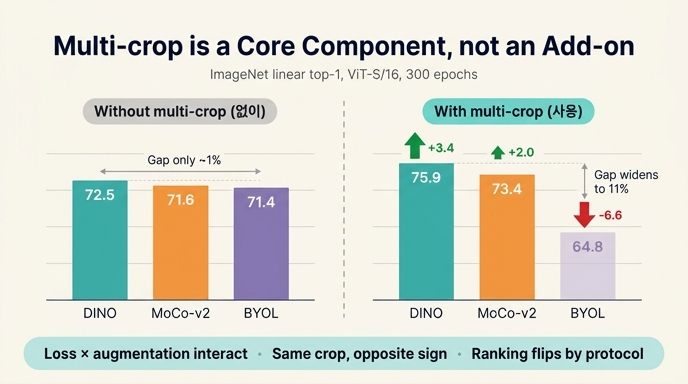

# multi-crop은 "add-on"이 아니라 core component다

**Q.** multi-crop을 "add-on"이 아니라 core component로 봐야 하는 이유는?

**A.** 프레임워크마다 multi-crop의 효과가 크게 다르기 때문이다. multi-crop 없이는 DINO의 우위가 약 1%에 불과하지만, multi-crop을 쓰면 격차가 크게 벌어지고 프레임워크 간 순위도 평가 프로토콜에 따라 달라진다.

출처: DINO 논문(arXiv 2104.14294v2) **부록 E. Multi-crop** — "Multi-crop in different self-supervised frameworks" 절, 그리고 부록 B의 **Table 14**.

논문 원문의 결론 문장:

> The effectiveness of multi-crop depends on the considered framework, which **positions multi-crop as a core component of a model and not a simple "add-ons"** that will boost any framework the same way.

---

## 1. 부록 E 핵심 표 재현

모두 **ViT-S/16, 300 epoch** 사전학습. 왼쪽은 multi-crop 없음(global crop 2장만), 오른쪽은 multi-crop($2\times224^2 + 6\times96^2$). ImageNet top-1.

| crops → | $2\times224^2$ (w/o MC) | | $2\times224^2 + 6\times96^2$ (w/ MC) | |
|---|---|---|---|---|
| **eval** | **k-NN** | **linear** | **k-NN** | **linear** |
| BYOL | 66.6 | 71.4 | 59.8 | 64.8 |
| SwAV | 60.5 | 68.5 | 64.7 | 71.8 |
| MoCo-v2 | 62.0 | 71.6 | 65.4 | 73.4 |
| **DINO** | **67.9** | **72.5** | **72.7** | **75.9** |

multi-crop 도입에 따른 변화량 $\Delta = (\text{w/ MC}) - (\text{w/o MC})$:

| | $\Delta$ k-NN | $\Delta$ linear | 방향 |
|---|---|---|---|
| BYOL | **−6.8** | **−6.6** | 크게 **하락** |
| SwAV | +4.2 | +3.3 | 상승 |
| MoCo-v2 | +3.4 | +1.8 | 상승 |
| **DINO** | **+4.8** | **+3.4** | 가장 크게 상승 |

한 표 안에서 **부호가 갈린다**는 점이 이 카드의 전부다. 동일한 증강 레시피가 어떤 프레임워크에는 +3~4%, 다른 프레임워크에는 −7%다. 증강이 "누구에게나 같은 만큼 주는 보너스"라면 이런 일은 일어날 수 없다.

## 2. "multi-crop 없이는 DINO 우위가 약 1%"가 정확히 어느 비교인가

논문 문장: *"Without multi-crop, DINO has better accuracy than other frameworks, though by a moderate margin (1%)."*

왼쪽 절반(w/o MC)에서 DINO를 **2등 프레임워크**와 비교한 수치다. 평가마다 2등이 다르다는 점까지 같이 봐야 한다.

| 프로토콜 | DINO | 2등 | 격차 |
|---|---|---|---|
| linear | 72.5 | MoCo-v2 71.6 | **+0.9** |
| k-NN | 67.9 | BYOL 66.6 | **+1.3** |

즉 "약 1%"는 linear의 +0.9, k-NN의 +1.3을 뭉친 표현이다. **multi-crop을 빼고 보면 DINO는 MoCo-v2·BYOL과 사실상 오차 범위 안**이며, "loss 함수가 뛰어나서 이겼다"고 말할 근거가 별로 없다.

multi-crop을 켜면 같은 격차가 이렇게 벌어진다.

| 프로토콜 | DINO | vs MoCo-v2 | vs SwAV | vs BYOL |
|---|---|---|---|---|
| linear | 75.9 | +2.5 | +4.1 | +11.1 |
| k-NN | 72.7 | +7.3 | +8.0 | +12.9 |

k-NN에서 1% → **7.3%**. DINO의 대표 셀링포인트인 "features are excellent k-NN classifiers"는 multi-crop을 뺀 상태에서는 성립하지 않는다. 그러니 multi-crop은 DINO의 성능을 설명하는 **주요 변수**이고, 비교에서 빼도 되는 곁가지가 아니다.

## 3. "평가 프로토콜에 따라 순위가 달라진다" — 수치로 확인

논문: *"we also observe that the ranking of the frameworks depends on the evaluation protocol considered."*

**w/o multi-crop 설정에서 실제로 순위가 뒤집힌다.**

| 순위 | linear 기준 | k-NN 기준 |
|---|---|---|
| 1 | DINO 72.5 | DINO 67.9 |
| 2 | **MoCo-v2 71.6** | **BYOL 66.6** |
| 3 | **BYOL 71.4** | **MoCo-v2 62.0** |
| 4 | SwAV 68.5 | SwAV 60.5 |

- linear에서 MoCo-v2(71.6)와 BYOL(71.4)은 **0.2% 차이로 MoCo-v2가 위**.
- k-NN에서는 BYOL(66.6)이 MoCo-v2(62.0)를 **4.6%** 앞선다 — 순위가 뒤바뀌고 격차도 20배 이상 커진다.
- 즉 linear probing만 봤다면 "두 방법은 동급"이라고 결론 냈겠지만, k-NN을 보면 표현 공간의 성질(거리 구조가 의미론적으로 정렬되었는지)이 전혀 다르다.

w/ multi-crop 설정에서는 두 프로토콜 순위가 일치한다(DINO > MoCo-v2 > SwAV > BYOL). 그래서 **"어떤 증강을 쓰느냐"가 "어떤 프로토콜에서 누가 이기느냐"까지 바꾼다.** 순위표는 (loss, 증강, 프로토콜) 삼중조합의 함수이지, loss만의 함수가 아니다.

## 4. Table 14 — 컴포넌트를 교차시켜 본 결과

Table 14는 DINO/MoCo-v2/BYOL이 서로 다른 요소(loss, multi-crop, centering, BN, predictor)를 격자로 놓고 ablation한 표다. ViT-S/16, 300 epoch, **ImageNet linear top-1**.

| # | Method | Loss | multi-crop | Center. | BN | Pred. | Top-1 |
|---|---|---|---|---|---|---|---|
| 1 | DINO | CE | ✓ | ✓ | | | **76.1** |
| 2 | – | MSE | ✓ | ✓ | | | 62.4 |
| 3 | – | CE | ✓ | ✓ | | ✓ | 75.6 |
| 4 | – | CE | | ✓ | | | **72.5** |
| 5 | MoCo-v2 | INCE | | | ✓ | | **71.4** |
| 6 | – | INCE | ✓ | | ✓ | | **73.4** |
| 7 | BYOL | MSE | | | ✓ | ✓ | **71.4** |
| 8 | – | MSE | | | ✓ | | 0.1 (collapse) |
| 9 | – | MSE | | ✓ | | | 52.6 |
| 10 | – | MSE | ✓ | | ✓ | ✓ | **64.8** |

읽는 법:

- **(1 vs 4)** DINO: multi-crop 제거 → 76.1 → 72.5, **−3.6**.
- **(6 vs 5)** MoCo-v2: multi-crop 추가 → 71.4 → 73.4, **+2.0**. 논문의 "removing it hurts performance by $2\!-\!4\%$"가 이 두 쌍이다.
- **(7 vs 10)** BYOL: multi-crop 추가 → 71.4 → 64.8, **−6.6**. *"Adding multi-crop to BYOL does not work out-of-the-box."*
- 참고로 표 1행의 76.1은 DINO 기본 설정($2\times224^2+10\times96^2$, 10개 local crop)이고, 부록 E 표의 75.9는 비교 통일을 위해 local crop을 **6개**로 맞춘 값이다. 같은 실험의 crop 수 차이일 뿐 모순이 아니다(Table 8: 6→10 crop은 +0.2%).

여기서 **loss와 증강이 서로 독립적이지 않다**는 게 격자 형태로 드러난다. multi-crop을 고정하고 loss만 바꿔도(1 vs 2: CE 76.1 → MSE 62.4) 결과가 무너지고, loss를 고정하고 multi-crop만 바꿔도(7 vs 10) 결과가 무너진다. 두 축의 효과가 더해지지 않는다.

## 5. 왜 BYOL에서는 multi-crop이 역효과인가 — 학습 곡선

ViT-S에서 BYOL을 multi-crop으로 학습한 k-NN val top-1 곡선이다(파란 = w/o mc, 주황 = w/ mc).

- **초반 ~70 epoch까지는 주황(w/ mc)이 파란 곡선보다 위**다. 즉 multi-crop이 처음에는 실제로 도움이 된다.
- 그러나 주황 곡선은 성장률이 둔화되다가 **약 200 epoch 지점에서 꺾여 하락**한다(≈59.5 → ≈57). 파란 곡선은 300 epoch까지 단조 상승해 ≈65.5에 도달한다.
- 이 "break point"는 하이퍼파라미터 사고가 아니다. 논문은 learning rate $\{1e^{-5},3e^{-5},1e^{-4},3e^{-4},1e^{-3},3e^{-3}\}$, weight decay $\{0.02,0.05,0.1\}$, local crop 개수 $\{2,4,6\}$를 전부 스윕했고 **모든 조합에서 같은 패턴**을 관찰했다. lr을 아주 낮추면 꺾임은 사라지지만 최종 정확도가 낮았다. ResNet-50에서도 같았다.

그림이 말해주는 것: multi-crop과 BYOL의 조합은 **일정 학습량 이후 표현이 서서히 망가지는 동역학**을 만든다. 그래서 "300 epoch 시점의 단일 숫자"만 보면 −6.6%라는 결과가 나오지만, 그 숫자는 조합의 학습 동역학이 만들어낸 것이지 증강 자체의 품질이 아니다. 스냅샷 벤치마크가 상호작용을 얼마나 쉽게 오독하게 하는지를 보여주는 사례다.

## 6. 핵심 논지: "증강을 고정하고 loss만 비교"는 순위를 왜곡한다

DINO의 목적함수는 여러 view에 대한 local-to-global 교차 엔트로피다.

$$\min_{\theta_s} \sum_{x \in \{x_1^g,\, x_2^g\}} \; \sum_{\substack{x' \in V \\ x' \neq x}} H\big(P_t(x),\, P_s(x')\big), \qquad H(a,b) = -a \log b$$

여기서 $V$는 view 집합이고, multi-crop은 $V$에 저해상도 local view를 넣는 선택이다. 형식만 보면 손실 $H$와 view 집합 $V$는 분리된 설계 축처럼 보인다. **그런데 실측은 그렇지 않다.**

$$\text{Acc}(\text{loss},\, V) \;\neq\; f(\text{loss}) + g(V)$$

BYOL은 $\Delta = -6.6$, DINO는 $+3.4$이므로 $V$의 효과가 loss에 따라 부호까지 달라진다. 즉 **가법 분해가 성립하지 않는 상호작용항이 있다.** 직관적으로도 그렇다 — multi-crop은 "작은 local crop을 global crop의 타깃에 맞추라"는 강한 분포 불일치를 주입하는데, 그 불일치를 이득으로 바꾸려면 손실 쪽이 그것을 견딜 구조(sharpening + centering으로 조절되는 교차 엔트로피)를 갖고 있어야 한다. $\ell_2$-정규화 출력에 대한 MSE는 그 불일치를 흡수하지 못한다.

여기서 나오는 방법론적 결론:

1. **관행의 문제.** SSL 논문은 "증강 파이프라인을 통일하고 손실만 바꿔 비교"하는 방식을 자주 쓴다(논문은 특히 2-crop 설정만 보는 벤치마크 [16]을 지목한다: *"which has been ignored in benchmarks considering only the two crops setting"*). 이는 증강이 프레임워크에 중립적이라는 **가법성 가정**에 기대고 있다.
2. **그 가정이 깨진다.** 위 표들이 그 가정의 반례다. 2-crop만 보면 DINO는 겨우 1% 우위, 6-crop을 켜면 k-NN에서 7.3% 우위. **어떤 증강 설정에서 표를 만드느냐가 곧 어떤 방법이 SOTA인지를 결정한다.**
3. **그래서 취급을 바꿔야 한다.** multi-crop은 "공정 비교를 위해 끄고 볼 수 있는 부가 기능"이 아니라 프레임워크 정의의 일부(core component)다. SwAV를 multi-crop 없이 평가하면(68.5 linear, 최하위) SwAV를 평가한 게 아니다 — SwAV는 multi-crop을 전제로 설계된 방법이다. 마찬가지로 BYOL에 multi-crop을 억지로 붙인 64.8은 BYOL의 실력이 아니다.
4. **공정 비교의 올바른 형태.** 단일 증강 설정에 모두를 몰아넣는 게 아니라, **각 프레임워크를 그 방법이 의도한 증강 설정에서 최선으로 돌린 뒤** 비교하고, 증강 축도 ablation 격자에 명시적으로 넣는 것이다(Table 14가 하는 일). 그리고 프로토콜을 하나만 보고 순위를 매기지 말 것 — linear와 k-NN이 서로 다른 답을 준다.

## 7. 한 줄 요약

multi-crop의 효과는 프레임워크에 따라 $+4.8\%$에서 $-6.8\%$까지 부호가 뒤집힌다. 손실과 증강은 상호작용하므로 "증강 고정 · 손실만 비교"는 순위를 왜곡한다. multi-crop은 끄고 볼 수 있는 add-on이 아니라 **모델의 일부**다.

## 인포그래픽

