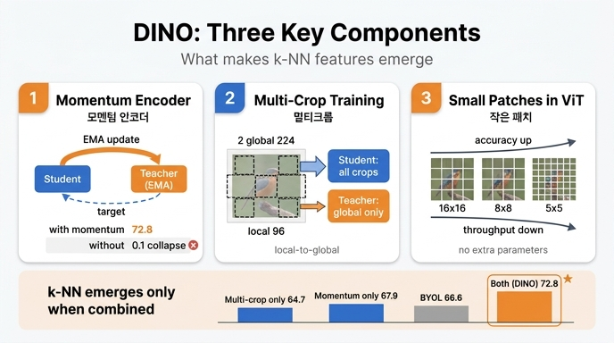

# 힌트: DINO가 강조한 세 가지 핵심 구성요소

**Q.** 논문이 강조하는, 좋은 성능을 위해 중요하다고 밝힌 세 가지 구성요소는?

**A.** **momentum encoder**, **multi-crop training**, 그리고 **ViT에서 작은 패치(small patches)의 사용**. 특히 k-NN 성능은 momentum encoder와 multi-crop이 **결합될 때만** 잘 나타난다.

---

## 1. 어디에 나오는 이야기인가

논문 초록에 그대로 박혀 있는 문장이다.

> "Our study also underlines the importance of **momentum encoder**, **multi-crop training**, and the use of **small patches with ViTs**."

그리고 서론(Sec. 1)에서 조건을 한 번 더 못 박는다.

> "The emergence of segmentation masks seems to be a property shared across self-supervised methods. However, **the good performance with k-NN only emerge when combining certain components such as momentum encoder and multi-crop augmentation**."

즉 세 요소는 "있으면 좋은 옵션"이 아니라, **DINO의 두 간판 성질 중 k-NN 쪽을 만들어내는 필수 조합**이라는 주장이다. 반대로 attention map에서 segmentation이 떠오르는 성질은 여러 SSL 방법이 공유하므로, 이 세 요소로 특별히 설명되는 것이 아니라는 대비도 함께 기억해 두면 좋다.

---

## 2. 요소별 근거

### (1) Momentum encoder — teacher를 EMA로 만드는 것

teacher를 student의 지수이동평균(EMA)으로 만든다: `θ_t ← λ·θ_t + (1−λ)·θ_s` (λ는 0.996 → 1 코사인 스케줄).

- **성능이 아니라 학습 자체가 걸려 있다.** Table 7 기준, momentum을 빼면(row 2) k-NN이 **0.1%** — 완전 붕괴(collapse)다. momentum 없이 학습하려면 Sinkhorn-Knopp 같은 더 무거운 정규화가 필요해지고(row 9, SwAV), 그렇게 해도 64.7%에 그친다. momentum이 있으면(row 3) 72.2%.
- 논문 표현: "these ablations highlight the importance of the momentum encoder, **not only for performance but also to stabilize training**, removing the need for normalization beyond centering."
- momentum teacher는 Polyak–Ruppert 평균에 해당하는 **모델 앙상블** 역할을 하므로, 학습 내내 student보다 성능이 좋고 더 질 좋은 타깃을 준다.

아래 Figure 6이 그 두 가지를 한 장에 담는다.

- **왼쪽 곡선**: 주황(Teacher)이 학습 전 구간에서 파랑(Student) 위에 있다. "teacher가 student를 끌고 간다"는 자기증류(self-distillation) 구도가 실제로 관찰된다.
- **오른쪽 표**: teacher를 어떻게 만드느냐에 따라 Top-1이 극단적으로 갈린다. student를 그대로 복사(Student copy) 0.1, 직전 iteration(Previous iter) 0.1 → **붕괴**. 직전 epoch(Previous epoch) 66.6은 붕괴는 면하지만 열등하고, **Momentum 72.8**이 압도적으로 최고다.

### (2) Multi-crop training

한 이미지에서 224² global view 2장 + 96² local view 여러 장(기본 6~10장)을 만들고, **local을 포함한 모든 crop은 student에**, **global만 teacher에** 통과시킨다. 그래서 "local-to-global" 대응을 학습하게 된다.

- Table 7에서 multi-crop을 빼면(row 4) k-NN 72.8 → **67.9**, linear 76.1 → **72.5**로 크게 떨어진다.
- 부록 E: 같은 ViT-S/16에서 multi-crop을 넣고 뺀 비교 — DINO는 k-NN 67.9 → **72.7**로 이득이 가장 크다(linear +3.4%). 반면 BYOL은 66.6 → 59.8로 **오히려 나빠진다**. 그래서 논문은 multi-crop을 "아무 프레임워크에나 붙이면 다 오르는 add-on이 아니라 **모델의 코어 컴포넌트**"라고 규정한다.
- 계산 효율도 좋다(Table 8): multi-crop 없이 46시간 학습해서 72.5%인데, `2×224² + 10×96²`로는 **24시간에 74.6%**. 다만 메모리는 9.3G → 15.4G로 늘어난다.

### (3) ViT의 작은 패치

패치 크기를 16×16 → 8×8 → 5×5로 줄이면 성능이 크게 오른다. **파라미터 수는 전혀 늘지 않는데** 성능이 오르는 것이 포인트다.

그림에서 실제로 읽히는 것:

- 두 곡선(주황 ViT-B, 파랑 DeiT-S) 모두 **오른쪽 아래 → 왼쪽 위**로 간다. x축은 throughput(im/s, 로그 스케일), y축은 ImageNet top-1이다. 즉 **패치를 줄일수록 정확도는 오르고 처리량은 떨어진다.**
- 파랑 ViT-S: 16×16(≈1000 im/s, 73.4) → 8×8(≈180 im/s, 76 부근) → 5×5(≈44 im/s, 77.3). 5×5까지 가면 throughput이 8×8 대비 **180 → 44 im/s**로 4배 느려진다.
- 두 곡선이 겹치는 지점이 흥미롭다. **ViT-S/8이 ViT-B/16보다 낫다** — 모델을 키우는 것보다 패치를 줄이는 편이 효과가 크다는 논문의 주장("reducing the size of the patches has a bigger impact than training a larger ViT")이 그림 한 장으로 보인다.
- 최종 성적으로 이어진다: ViT-S/8은 linear 79.7 / k-NN **78.3**, ViT-B/8은 linear **80.1** / k-NN 77.4. 밀집 예측(DAVIS video instance segmentation)에서도 "/8" 변형이 ViT-B 기준 +9.1 (J&F)m로 훨씬 낫다.

---

## 3. 근거가 되는 Table 7 (ViT-S/16, 300 epochs)

| # | Method | Mom. | SK | MC | Loss | Pred. | k-NN | Lin. |
|---|--------|:----:|:--:|:--:|------|:-----:|------|------|
| 1 | **DINO** | ✓ |  | ✓ | CE |  | **72.8** | **76.1** |
| 2 |  | ✗ |  | ✓ | CE |  | 0.1 | 0.1 |
| 3 |  | ✓ | ✓ | ✓ | CE |  | 72.2 | 76.0 |
| 4 |  | ✓ |  | ✗ | CE |  | 67.9 | 72.5 |
| 5 |  | ✓ |  | ✓ | MSE |  | 52.6 | 62.4 |
| 6 |  | ✓ |  | ✓ | CE | ✓ | 71.8 | 75.6 |
| 7 | BYOL | ✓ |  | ✗ | MSE | ✓ | 66.6 | 71.4 |
| 8 | MoCo-v2 | ✓ |  | ✗ | INCE |  | 62.0 | 71.6 |
| 9 | SwAV | ✗ | ✓ | ✓ | CE |  | 64.7 | 71.8 |

(SK: Sinkhorn-Knopp, MC: Multi-Crop, Pred.: Predictor / CE: Cross-Entropy)

읽는 법:

- **row 1 vs 2** → momentum 제거 = 붕괴.
- **row 1 vs 4** → multi-crop 제거 = k-NN −4.9%.
- **row 3 vs 9** → 둘 다 SK+MC를 쓰지만 momentum 유무만 다르다. 72.2 vs 64.7 → momentum의 순수 성능 기여.
- **row 1 vs 6** → predictor 추가는 −1.0으로 영향이 미미하다. BYOL에서는 붕괴 방지에 필수인 것과 대조된다.

### "k-NN은 둘이 결합될 때만" 을 표로 확인하기

카드의 뒷문장이 여기서 나온다. k-NN 숫자만 뽑아 보면:

| 구성 | k-NN |
|---|---|
| momentum ✗ + MC ✓ (SwAV, row 9) | 64.7 |
| momentum ✓ + MC ✗ (row 4) | 67.9 |
| momentum ✓ + MC ✗ (BYOL, row 7) | 66.6 |
| **momentum ✓ + MC ✓ (DINO, row 1)** | **72.8** |

한쪽만 있으면 60대 중후반에 머물고, **둘이 함께일 때만 70대로 점프**한다. 논문은 부록에서 동시기 연구 CsMI도 "momentum network + multi-crop"을 결합했고 역시 k-NN이 강하다는 점을 들어, 이 결합이 우연이 아니라고 덧붙인다.

---

## 4. 대비해서 기억할 것: "중요하지 않다"고 밝힌 것들

세 요소가 왜 특별한지는, 논문이 **덜 중요하다**고 정리한 것들과 짝지어 외우면 선명해진다.

| 중요하다 | 별 영향 없다 / 불필요하다 |
|---|---|
| momentum encoder (EMA teacher) | Sinkhorn-Knopp 같은 고급 정규화 (row 3: −0.6) |
| multi-crop training | student predictor (row 6: −0.5, BYOL에서는 필수인데도) |
| 작은 패치 (ViT /8, /5) | projection head의 batch normalization (DINO는 BN-free) |
| — | contrastive loss / 큰 메모리 큐 |

DINO에 실제로 남은 붕괴 방지 장치는 teacher 출력의 **centering + sharpening** 둘뿐이다. 단, centering만으로 붕괴를 막는 것도 momentum이 있을 때 이야기다(Table 15 row 4: momentum 없이 centering만 = 0.1).

---

## 인포그래픽

