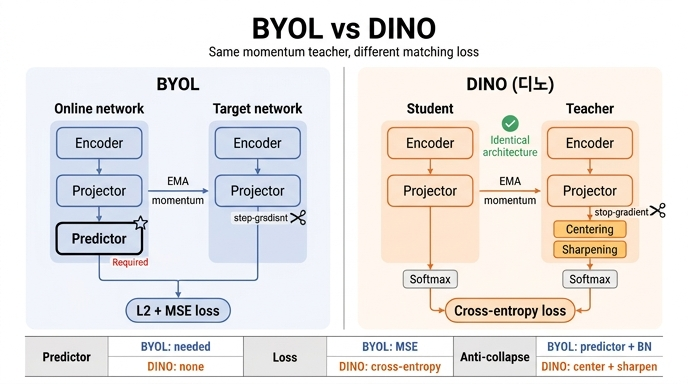

# BYOL의 핵심 아이디어와 DINO와의 차이

## 한 줄 요약

BYOL은 **momentum(EMA) encoder가 만든 표현에 student의 특징을 회귀시키는 metric-learning** 방식이고, DINO는 그 아이디어를 물려받되 **유사도 측정 손실을 cross-entropy로 바꾸고, predictor를 없애 student와 teacher가 완전히 동일한 아키텍처를 쓰도록** 만든 방법이다.

DINO 논문 Related work에 그대로 적혀 있다.

> Grill *et al.* propose a metric-learning formulation called BYOL, where features are trained by matching them to representations obtained with a momentum encoder. ... **Our approach takes its inspiration from BYOL but operates with a different similarity matching loss and uses the exact same architecture for the student and the teacher.**

---

## 1. BYOL(Bootstrap Your Own Latent)의 핵심 아이디어

BYOL의 발상은 "**negative pair 없이도 무너지지 않는 self-supervised learning**"이다.

- 같은 이미지의 서로 다른 두 augmentation view를 두 네트워크에 넣는다.
  - **online network**: encoder → projector → **predictor** (이 predictor가 BYOL 고유의 비대칭 요소)
  - **target network**: encoder → projector. online의 파라미터를 EMA(momentum)로 따라간다. 즉 **momentum encoder**.
- target 쪽에는 **stop-gradient**를 걸고, online의 predictor 출력이 target의 projector 출력에 가까워지도록 학습한다.
- 손실은 **L2 정규화된 두 벡터 사이의 mean squared error(MSE)** (= 코사인 유사도 최대화와 동치). 두 view를 서로 바꿔 대칭화한다.

여기서 중요한 점은 두 가지다.

1. **negative sample도, contrastive loss도, memory queue도 없다.** 오직 "positive끼리 맞추기"만 한다.
2. 그런데도 모든 입력에 같은 출력을 뱉는 **collapse**가 일어나지 않는다. 이를 막아주는 장치가 **predictor(비대칭성) + momentum target + projection head 안의 batch normalization** 조합이다. DINO 논문도 "in the case of BYOL, the predictor is **critical** to prevent collapse"라고 명시한다(Appendix Table 14, row 7 vs 8: predictor를 빼면 71.4% → **0.1%**로 완전 붕괴).

즉 BYOL은 "표현 벡터 자체를 target 표현 벡터에 **회귀(regression)**시키는" metric-learning 형태이며, 붕괴 방지를 **아키텍처의 비대칭성(predictor)과 정규화(BN)**에 의존한다.

---

## 2. DINO는 무엇을 물려받고 무엇을 바꿨나


논문 Figure 2다. 그림에서 카드의 답과 직접 연결되는 요소를 짚으면:

- 아래쪽 하나의 이미지 `x`에서 두 view `x1`, `x2`가 갈라져 나온다 → BYOL과 동일한 "같은 이미지 두 view" 구도.
- 왼쪽 `student g_θs`, 오른쪽 `teacher g_θt` **두 상자의 모양·이름이 동일**하고, 그 사이 화살표에 `ema`가 적혀 있다 → **momentum encoder를 BYOL에서 물려받았다**는 부분. teacher는 `θ_t ← λθ_t + (1−λ)θ_s` (λ는 0.996→1 cosine schedule, BYOL의 스케줄을 그대로 따름).
- teacher 쪽 위에 `sg`(stop-gradient) 이중 사선 → gradient는 student로만 흐른다. 이것도 BYOL과 공통.
- **양쪽 모두 `softmax`로 끝난다**. 출력이 벡터가 아니라 K차원 **확률분포** `p1`, `p2`이고, 손실은 그림 상단의 `-p2 log p1`, 즉 **cross-entropy**다. → 이것이 "different similarity matching loss"의 실체. BYOL은 여기가 L2 정규화 후 MSE였다.
- teacher 경로에만 `centering` 블록이 하나 더 있고, teacher softmax는 낮은 온도 `τ_t`를 쓴다(=**sharpening**). → BYOL의 predictor/BN이 하던 붕괴 방지 역할을 DINO에서는 이 **centering + sharpening**이 대신한다.
- 그림에 **predictor 상자가 아예 없다**. student와 teacher 경로의 블록 구성이 완전히 대칭이다. → "uses the **exact same architecture** for the student and the teacher".

논문 3.1절 표현 그대로: "We do not use a predictor, resulting in the **exact same architecture in both student and teacher networks**." 게다가 ViT에는 BN이 없으므로 projection head에서도 BN을 빼서 **entirely BN-free** 시스템이 된다. BYOL은 head의 BN에 의존한다는 점과 대비된다.

### 의사코드로 본 차이의 핵심 3줄

```python
t = t.detach()                        # stop-gradient (BYOL과 공통)
s = softmax(s / tps, dim=1)           # student 분포
t = softmax((t - C) / tpt, dim=1)     # center + sharpen (DINO 고유)
return - (t * log(s)).sum(dim=1).mean()   # cross-entropy (BYOL은 여기가 MSE)
```

center `C`는 teacher 출력의 배치 평균을 EMA로 추적한 값이다: `C ← mC + (1−m)·mean(teacher outputs)`. 배치의 1차 통계량만 쓰기 때문에 배치 크기 의존성이 작다(배치 8까지도 학습된다).

---

## 3. centering과 sharpening이 predictor를 대신하는 방식


논문 Figure 7. teacher 타깃 분포의 **entropy(왼쪽)**와 **KL divergence(오른쪽)**를 학습 중에 그린 것이다. cross-entropy를 `H = h + D_KL`로 분해해서 보는 그림이다.

- 파란 선(sharpening만): entropy가 **0으로** 붕괴 → 한 차원이 지배하는 형태의 collapse.
- 빨간 점선(centering만): entropy가 **log K(≈8.3)**에 붙어 있음 → 균등분포로의 collapse.
- 두 경우 모두 오른쪽 KL이 **0**으로 떨어진다. KL=0은 출력이 입력과 무관하게 상수라는 뜻, 즉 붕괴했다는 신호다.
- 주황 선(both): entropy가 중간값에 수렴하고 KL이 0보다 크게 유지된다 → 붕괴하지 않는다.

정리하면 **centering은 특정 차원 지배를 막지만 균등분포로 밀고, sharpening은 반대로 민다. 둘을 같이 쓰면 상쇄되어 momentum teacher만으로 안정적으로 학습된다.** BYOL이 predictor라는 아키텍처 비대칭으로 풀었던 문제를, DINO는 teacher **출력에 대한 두 개의 후처리 연산**으로 푼 셈이다.

---

## 4. 논문 실험이 뒷받침하는 근거 (Table 7 / Table 14)

카드에서 "Table 8"로 알고 있다면 주의: 프레임워크 구성요소를 비교하는 표는 **본문 Table 7**이고, MoCo-v2/BYOL과의 상세 비교는 **Appendix Table 14**다(Table 8은 시간·메모리 표).

**Table 7** (ViT-S/16, 300 epochs, ImageNet):

| # | Method | Mom. | SK | MC | Loss | Pred. | k-NN | Lin. |
|---|--------|------|----|----|------|-------|------|------|
| 1 | DINO   | ✓ | ✗ | ✓ | **CE** | **✗** | 72.8 | 76.1 |
| 5 |        | ✓ | ✗ | ✓ | **MSE** | ✗ | 52.6 | 62.4 |
| 6 |        | ✓ | ✗ | ✓ | CE | **✓** | 71.8 | 75.6 |
| 7 | **BYOL** | ✓ | ✗ | ✗ | **MSE** | **✓** | 66.6 | 71.4 |
| 8 | MoCov2 | ✓ | ✗ | ✗ | INCE | ✗ | 62.0 | 71.6 |
| 9 | SwAV   | ✗ | ✓ | ✓ | CE | ✗ | 64.7 | 71.8 |

읽는 법:

- **row 1 vs row 5**: 손실만 CE → MSE로 바꾸면 76.1 → 62.4. "다른 유사도 매칭 손실"이 성능의 핵심임을 보여준다. (MSE를 쓸 때는 sharpening을 적용하지 않는다.)
- **row 1 vs row 6**: DINO에 predictor를 **추가해도** 76.1 → 75.6으로 거의 변화가 없다. DINO에서 predictor는 불필요하다.
- **Table 14 row 7 vs 8**: 반대로 BYOL에서 predictor를 **빼면** 71.4 → 0.1로 완전 붕괴. 같은 부품이 한쪽에선 생존 필수, 다른 쪽에선 있으나 마나다.
- **Table 14 row 9**: BYOL(MSE)에 predictor·BN 대신 DINO의 centering을 넣으면 붕괴는 면하지만 52.6에 그친다 → centering은 sharpening과 짝을 이룰 때 제 역할을 한다.
- **Table 7 row 2**: DINO에서 momentum encoder를 빼면 0.1로 붕괴. **momentum encoder는 BYOL에서 물려받은, 버릴 수 없는 부분**이다.
- **Table 14 row 7 vs 10**: BYOL에 multi-crop을 붙이면 71.4 → 64.8로 오히려 나빠진다(Appendix E: lr/wd/crop 수를 다 쓸어봐도 같은 패턴). 반면 DINO는 multi-crop으로 72.5 → 76.1. multi-crop과의 궁합도 두 방법을 가르는 실질적 차이다.

---

## 5. 공통점과 차이점 한눈에

| | BYOL | DINO |
|---|---|---|
| 타깃을 만드는 주체 | momentum(EMA) encoder | momentum(EMA) teacher (**동일**) |
| stop-gradient | 있음 | 있음 (**동일**) |
| negative pair / queue | 없음 | 없음 (**동일**) |
| augmentation | color jitter, blur, solarization | BYOL 것을 그대로 채택 (**동일**) |
| 출력 형태 | L2 정규화된 **임베딩 벡터** | K차원 **확률분포**(softmax) |
| 손실 | **MSE** (metric learning / 회귀) | **cross-entropy** (분포 매칭 / 자기증류) |
| predictor | **필수** (없으면 붕괴) | **없음** (넣어도 이득 없음) |
| student·teacher 아키텍처 | predictor 때문에 **비대칭** | **완전 동일** |
| 붕괴 방지 장치 | predictor + BN + momentum | **centering + sharpening** + momentum |
| BN 의존 | 있음 | ViT에서 **BN-free** |
| multi-crop | 잘 안 붙음 | 핵심 구성요소 |
| ViT-S/16 300ep 성능 | 66.6 (k-NN) / 71.4 (linear) | 72.8 / 76.1 |

---

## 6. 해석: 왜 이 차이가 중요한가

- BYOL은 자신을 **metric learning**(표현 벡터 사이 거리 맞추기)으로 정의했다. DINO는 같은 구도를 **레이블 없는 knowledge distillation / Mean Teacher self-distillation**으로 재해석한다. teacher가 내놓은 "소프트 분포"를 student가 따라 배우는 그림이 되면, 손실이 자연히 cross-entropy가 된다.
- 이 재해석 덕분에 K차원 출력이 일종의 **soft pseudo-label(암묵적 클러스터 할당)**처럼 작동하고, 여기에 centering/sharpening이라는 **분포 수준의 조작**을 걸 수 있게 된다. 벡터 회귀(MSE)에는 "sharpening"이라는 개념 자체가 없다.
- predictor를 없애 student/teacher를 동일하게 만든 결과, DINO는 convnet과 ViT 모두에 **아키텍처를 고치지 않고** 얹을 수 있다. 논문이 강조하는 유연성(BN-free, 배치 크기에 둔감)이 여기서 나온다.
- 부수적으로 DINO에서는 teacher가 학습 내내 student보다 성능이 좋아(Polyak-Ruppert averaging 형태의 앙상블) 더 좋은 타깃을 제공하는데, 논문은 "This dynamic was not observed in previous works [BYOL 포함]"이라고 적는다.

## 암기 포인트

- **물려받은 것**: momentum(EMA) teacher, stop-gradient, negative 없음, augmentation.
- **바꾼 것 두 가지**: (1) 유사도 매칭 손실 **MSE → cross-entropy**(+ centering/sharpening), (2) predictor 제거 → **student·teacher 아키텍처 완전 동일**.

## 인포그래픽


