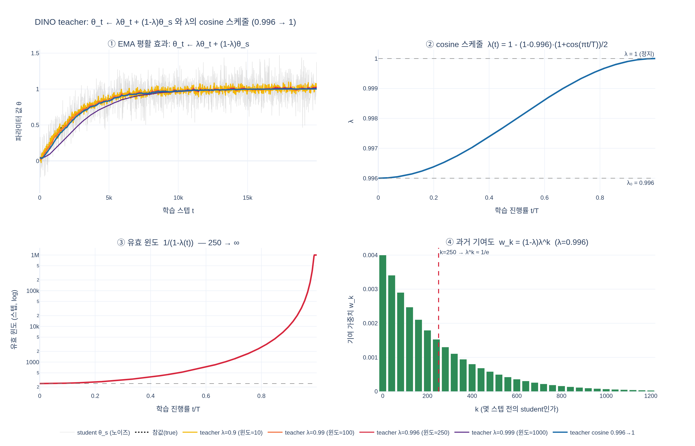

# DINO의 teacher 갱신 규칙과 $\lambda$ 스케줄은?

$$\theta_t \leftarrow \lambda\theta_t + (1-\lambda)\theta_s$$

teacher는 학습되는 네트워크가 아니라 student 가중치의 **지수이동평균(EMA, momentum encoder)** 이다.
$\lambda$는 고정값이 아니라 학습 중 $0.996$에서 $1$까지 **cosine 스케줄**을 따라 증가한다.

- 상세 설명: [hi.md](hi.md)
- 실행 가능한 예제: [expy.py](expy.py)

## 시각화

