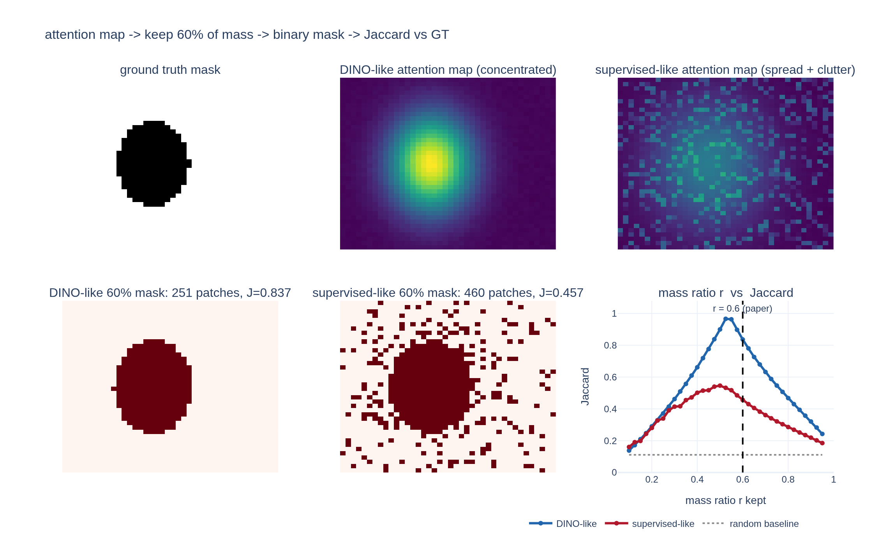

# self-attention 마스크의 품질은 어떤 지표로 측정했는가?

**한 줄 답**: self-attention map을 **질량(mass)의 60%를 유지하는 임계값**으로 이진화해 마스크를 만들고, 정답(ground truth)과의 **Jaccard similarity(=IoU)** 를 측정한다. PASCAL VOC12 validation 이미지 기준이며, ViT-S/16에서 random 22.0 / supervised 27.3 / DINO **45.9** 로 큰 격차가 난다.

논문 원문(§4.2.2 "Probing the self-attention map"):

> We report the Jaccard similarity between the ground truth and segmentation masks obtained by **thresholding the self-attention map to keep 60% of the mass**. Note that the self-attention maps are **smooth and not optimized to produce a mask**. Nonetheless, we see a clear difference between the supervised or DINO models with a significant gap in terms of Jaccard similarities.

---

## 0. 왜 이런 지표가 필요했는가

DINO의 대표 주장은 "self-supervised ViT의 [CLS] self-attention이 **레이블 없이** 물체 분할 정보를 담고 있다"는 것이다. 문제는 attention map이 분할 마스크가 아니라는 점이다.

![DINO의 [CLS] self-attention map (Figure 1)](fig-1.jpeg)

Figure 1에서 오른쪽 열들이 attention map인데, 실제로 관찰되는 성질은:

- **이진 마스크가 아니라 연속값 히트맵**이다. 새·자전거·기린 몸통에서 밝은 노란색(강한 attention)부터 어두운 보라색(거의 0)까지 그라데이션이 있다.
- 물체 **윤곽선/고주파 부위에 값이 집중**된다. 기린은 몸통 실루엣, 자전거는 프레임 선, 국회의사당은 첨탑 부분이 밝다.
- 값의 **절대 스케일에는 의미가 없다**. softmax 출력이므로 전체 합이 1이고, 토큰 수(=이미지 해상도/패치 크기)에 따라 개별 값의 크기가 달라진다.

즉 "눈으로 보면 물체가 보인다"를 정량화하려면 (a) 연속 히트맵을 이진 마스크로 바꾸는 규칙, (b) 두 마스크의 일치도를 재는 수치가 각각 필요하다. 그게 각각 **질량 60% 임계값**과 **Jaccard similarity**다.

---

## 1. "질량의 60%를 유지하는 임계값"의 정확한 절차

attention map을 $A \in \mathbb{R}^{H\times W}$ (패치 격자), 유지 비율을 $r=0.6$ 이라 하자.

1. **모든 패치 값을 내림차순으로 정렬**한다. 정렬된 값을 $a_1 \ge a_2 \ge \dots \ge a_M$ ($M=HW$).
2. **누적합**을 만든다: $S_k = \sum_{i=1}^{k} a_i$.
3. 누적합이 전체 합의 $r$ 배에 **처음 도달하는 개수** $k^\*$ 를 찾는다.
   $$k^\* = \min\Big\{ k : S_k \ \ge\ r \cdot S_M \Big\}$$
4. 그 지점의 값을 임계값으로 삼는다: $\tau_r = a_{k^\*}$.
5. 마스크는 $\;\hat{M}_{ij} = \mathbb{1}[A_{ij} \ge \tau_r]\;$ — 즉 **상위 $k^\*$ 개 패치만 전경**.

풀어 말하면 *"attention이 가장 센 패치부터 차례로 켜 나가다가, 켠 패치들의 attention 합이 전체의 60%가 되면 멈춘다"* 이다. 켜지는 **패치의 개수(면적)가 아니라 attention 값의 합**이 60%라는 점이 핵심이다.

### 왜 고정 임계값(예: 0.5)이 아니라 질량 비율인가

| | 고정 임계값 $A_{ij} \ge 0.5$ | 질량 비율 $r$ |
|---|---|---|
| 스케일 의존성 | 값을 상수배 하면 마스크가 완전히 달라짐 | 정렬 순서·누적 **비율**이 불변 → 마스크 동일 |
| 토큰 수 의존성 | ViT-S/8 480p는 3601 토큰 → 평균값이 1/3601 ≈ 0.0003, 0.5는 절대 안 넘음 | 자동으로 적응 |
| head·모델 간 비교 | 불가 (head마다 peak 크기가 다름) | 가능 |

attention은 softmax 출력이라 **합이 1로 고정**된다. 따라서 토큰 수가 많아지면 개별 값은 자동으로 작아지고, head가 얼마나 뾰족한지에 따라 peak 값도 천차만별이다. ViT-S/16과 ViT-S/8, supervised와 DINO를 **같은 규칙으로 비교**하려면 절대 값이 아니라 분포에 대한 **스케일 불변(scale-invariant) 기준**이 필요하다. 질량 비율은 정확히 그 성질을 갖는다 (아래 `expy.py`에서 map을 1000배 해도 마스크가 비트 단위로 동일함을 확인했다).

부수 효과로 **적응적 마스크 크기**를 얻는다. 뾰족한 attention은 적은 패치로 60%를 채우고(작은 마스크), 퍼진 attention은 많은 패치가 필요하다(큰 마스크). 이것이 아래 격차의 직접적 원인이 된다.

---

## 2. Jaccard similarity (IoU)

두 이진 마스크 $A$(예측), $B$(정답)에 대해

$$J(A,B) \;=\; \frac{|A \cap B|}{|A \cup B|} \;=\; \frac{TP}{TP + FP + FN}$$

성질:

- 범위는 $0 \le J \le 1$ (완전 일치 = 1, 겹침 없음 = 0). 논문 표는 100배 한 백분율.
- 분모가 합집합이므로 **거짓양성(FP)과 거짓음성(FN)을 동등하게 벌점**한다. Dice/F1($\frac{2TP}{2TP+FP+FN}$)보다 엄격하다.
- **마스크 크기 차이에 민감**하다. 예측이 정답을 완전히 포함하지만 2배 크면 $J=0.5$ 가 상한이다. 반대로 정답의 절반만 정확히 맞혀도 $J=0.5$.
- 무작위 마스크의 기대값은 $\dfrac{|A||B|/N}{|A|+|B|-|A||B|/N}$ 로, 마스크 크기에 따라 결정된다. 즉 **0이 바닥선이 아니다** — 이래서 random weight 기준선(22.0)을 함께 보고해야 한다.

---

## 3. Figure 4에서 실제로 관찰되는 것

논문 Figure 4의 두 행은 동일한 5장의 이미지(새, 소화전 3개, 코끼리, 기차, 오토바이)에 대해 **동일한 60% 질량 규칙**으로 만든 마스크다(ViT-S/8, 각 모델의 best head).

**supervised 행**에서 눈에 보이는 것:

- 물체 위에도 빨간 마스크가 있지만, **배경 전체에 자잘한 빨간 점(speckle)이 흩뿌려져** 있다. 계단 사진에서는 계단 판 전체에, 코끼리 사진에서는 풀·수풀 전체에, 기차 사진에서는 배경 나무들에, 그래피티 사진에서는 벽 낙서 무늬에 점이 퍼져 있다.
- 물체 자체의 **커버리지가 불완전**하다 — 오토바이는 앞부분 일부만, 코끼리도 몸 전체가 채워지지 않았다.
- 즉 supervised attention은 **clutter(어수선한 배경 텍스처)에 상당한 질량을 나눠준다**. 60% 질량을 담으려면 물체 밖 패치까지 켜야 하므로 합집합이 커지고 Jaccard가 떨어진다.

**DINO 행**에서 눈에 보이는 것:

- 마스크가 **하나의 연결된 덩어리**로 물체에만 놓인다. 새는 부리·꼬리까지, 소화전은 3개 모두 개별적으로, 코끼리는 실루엣 그대로, 기차는 앞칸부터 뒤로, 오토바이는 바퀴·핸들까지 채워진다.
- 배경 speckle이 **거의 없다**. 그래피티 벽처럼 텍스처가 강해 supervised가 크게 흔들린 이미지에서도 오토바이 형태만 남는다.
- 놀라운 점은 이 마스크가 **분할 레이블을 한 번도 본 적 없다**는 것이다. 그럼에도 물체 경계를 따라간다.

정량 결과 (PASCAL VOC12 val, Jaccard %):

| 가중치 | ViT-S/16 | ViT-S/8 |
|---|---|---|
| Random | 22.0 | 21.8 |
| Supervised | 27.3 | 23.7 |
| **DINO** | **45.9** | **44.7** |

읽는 법:

- **supervised는 random 대비 +5.3 뿐**이다 (27.3 vs 22.0). 분류 레이블로 학습한 ViT의 [CLS] attention은 분할 정보를 거의 담지 않는다는 뜻이다.
- **DINO는 +23.9** (45.9 vs 22.0), supervised 대비 **1.68배**다.
- ViT-S/8에서 supervised는 오히려 떨어지지만(23.7) DINO는 유지된다(44.7). 패치를 잘게 쪼개면 supervised는 더 산만해지지만 DINO는 여전히 물체에 집중한다.

Appendix에도 같은 실험이 있는데(80% mass 언급, 표 수치는 Fig. 4와 동일한 22.0/27.3/45.9), MoCo-v2 46.3, BYOL 47.8, SwAV 46.8, DINO w/o multicrop 45.1 로 **모든 self-supervised 방법이 supervised를 크게 앞선다**. 논문의 결론은 "분할 정보의 창발은 DINO 고유가 아니라 self-supervised ViT 전반의 성질"이다 (한편 $k$-NN 성능은 momentum encoder·multi-crop 같은 특정 요소에서만 나온다).

---

## 4. 이 지표의 한계 (논문도 직접 인정하는 부분)

논문 문장 *"Note that the self-attention maps are smooth and not optimized to produce a mask"* 는 세 가지 한계를 압축한 것이다.

1. **attention map은 soft(부드럽다)**. 연속값 히트맵이라 물체 경계에서 값이 급격히 끊기지 않고 서서히 감쇠한다. 어디서 잘라도 경계가 정확할 수 없다.
2. **분할용으로 최적화된 적이 없다**. DINO의 손실 함수는 view 간 출력 분포 일치일 뿐, 마스크 IoU를 올리도록 학습된 부분이 전혀 없다. 전용 방법(예: post-hoc 분할 헤드, TokenCut/LOST류 그래프 분할)을 쓰면 같은 feature에서 훨씬 높은 점수가 나온다.
3. **60%라는 값 자체가 임의적**이다. 왜 50%나 80%가 아닌지에 대한 근거는 없다(실제로 Appendix에서는 80%로 언급된다). 게다가 Jaccard는 마스크 크기에 민감하므로, 비율을 바꾸면 절대 점수가 통째로 움직인다.

**그럼에도 결론은 흔들리지 않는다.** 22.0 / 27.3 / 45.9 라는 격차는 지표 선택으로 설명되지 않는다:

- 세 모델 모두 **완전히 동일한 파이프라인**(같은 $r$, 같은 Jaccard, 같은 GT, 같은 아키텍처)을 통과했다. 지표가 거칠다면 세 숫자 모두 똑같이 거칠어지고, 순위와 격차는 남는다.
- random 22.0이라는 **바닥선이 함께 보고**되므로 "지표가 후해서 높게 나왔다"는 설명이 봉쇄된다. supervised는 그 바닥선에서 +5.3밖에 못 갔다.
- $r$ 을 바꿔도 순위가 뒤집히지 않는다. 아래 `expy.py`에서 $r$ 을 0.10~0.95로 훑어봤는데, 각 모델의 **최적 $r$ 을 따로 골라줘도** 격차가 그대로 남는다 (DINO풍 0.967 vs supervised풍 0.546). 즉 격차의 원인은 "60%"가 아니라 **attention 질량이 물체에 모여 있는지 배경에 흩어져 있는지**라는 구조적 차이다.

한 줄 요약: **지표는 거칠지만, 거친 지표를 똑같이 통과했는데도 1.68배 차이가 났다는 것이 논거다.**

---

## 5. 관련 지표와의 관계

같은 §4.2.2에서 논문은 두 번째 지표도 함께 쓴다.

- **DAVIS-2017 video instance segmentation** (Table 5): output patch token을 프레임 간 nearest-neighbor로 전파해 분할. mean region similarity $\mathcal{J}_m$ 과 mean contour accuracy $\mathcal{F}_m$ 을 보고한다. 여기서 $\mathcal{J}$ 도 Jaccard지만, **attention map이 아니라 patch token feature**를 평가하며 모델을 전혀 학습/파인튜닝하지 않는다. ViT-B에서 "/8" 변형이 "/16"보다 $(\mathcal{J\&F})_m$ +9.1 높다.
- 이 카드의 지표(Figure 4)는 **[CLS] token의 attention** 자체를 평가한다. 둘은 "표준 벤치마크로 재기"와 "attention에서 만든 마스크를 직접 재기"라는 상보적인 두 축이다.

또한 논문은 self-supervised convnet도 분할 정보를 담고 있지만 **가중치에서 그것을 뽑아내려면 전용 방법이 필요하다**고 지적한다(참조 [31]). ViT는 attention map이라는 형태로 그 정보를 **그냥 읽을 수 있게** 노출한다는 것이 아키텍처 차원의 차별점이다.

---

## 시각화

`expy.py`는 이 절차를 합성 데이터로 처음부터 구현해 검증한다: 정답 타원 하나에 대해 (1) 집중된 "DINO풍" attention과 (2) 퍼진 blob + 배경 clutter의 "supervised풍" attention을 만들고, 질량 비율 임계값 함수를 직접 구현해 60% 마스크를 계산한 뒤, $r$ 을 0.10~0.95로 훑어 Jaccard 곡선을 그린다.

그림에서 확인되는 것:

- 아래 왼쪽/가운데 두 마스크는 **똑같이 질량 60%** 인데 켜진 패치 수가 **251 vs 460** 이다. 퍼진 attention은 같은 질량을 담으려고 배경까지 켜야 하고, 그 결과 Figure 4의 supervised 행과 똑같은 **배경 speckle 패턴**이 나타난다. Jaccard는 0.837 vs 0.457 (약 1.83배 — 논문의 1.68배와 같은 크기).
- 오른쪽 곡선은 뒤집힌 U자다. $r$ 이 작으면 peak만 덮어 교집합이 작고, 크면 배경을 삼켜 합집합이 커진다. $r=0.6$(점선)은 최적($\approx 0.5$)이 아니라 **근처의 임의 선택**임이 그대로 보인다.
- 그러나 $r$ 전 구간에서 파란 곡선(DINO풍)이 빨간 곡선(supervised풍) 위에 있고, 회색 점선(random 기준선 $\approx 0.11$)과도 명확히 떨어져 있다. **지표 파라미터를 어떻게 조정해도 격차가 사라지지 않는다**는 §4의 논지를 재현한다.
