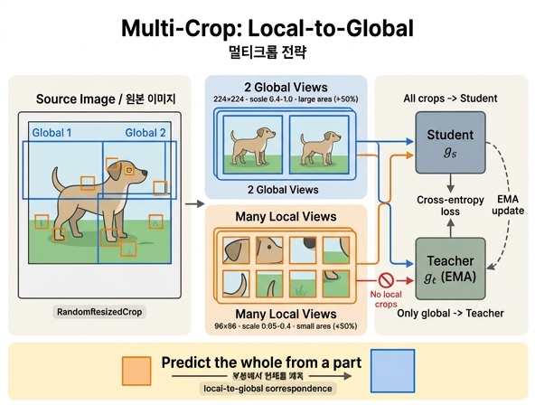

# multi-crop: global view와 local view의 구성

## 한 줄 요약

한 장의 이미지에서 **큰 영역을 덮는 $224^2$ global view 2개**와 **작은 영역만 덮는 $96^2$ local view 여러 개**를 잘라내고, **모든 crop은 student로, global view만 teacher로** 보낸다. 이 비대칭이 "local-to-global correspondence"를 학습시키는 장치다.

---

## 1. 논문 §3.1의 정의

DINO 논문(§3.1, SwAV[10]의 multi-crop을 차용)은 이렇게 서술한다.

> from a given image, we generate a set $V$ of different views. This set contains two *global* views, $x_1^g$ and $x_2^g$ and several *local* views of smaller resolution. **All crops are passed through the student while only the global views are passed through the teacher**, therefore encouraging "local-to-global" correspondences.

그리고 표준 세팅을 명시한다.

> we follow the standard setting for multi-crop by using **2 global views at resolution $224^2$ covering a large (for example greater than 50%) area** of the original image, and **several local views of resolution $96^2$ covering only small areas (for example less than 50%)** of the original image.

정리하면:

| 항목 | global view | local view |
|---|---|---|
| 개수 | 2개 ($x_1^g$, $x_2^g$) | 여러 개 (기본 6~10개) |
| 해상도 | $224^2$ | $96^2$ |
| 원본에서 덮는 면적 | 큰 영역 (예: 50% 초과) | 작은 영역 (예: 50% 미만) |
| student 통과 | O | O |
| teacher 통과 | **O** | **X** |

전체 view 집합은 $V = \{x_1^g, x_2^g, x_1^\ell, \dots, x_n^\ell\}$ 이다.

## 2. 식 (3) — 비대칭이 손실함수에 박혀 있다

$$\min_{\theta_s} \sum_{x \in \{x_1^g,\, x_2^g\}} \sum_{\substack{x' \in V \\ x' \neq x}} H\big(P_t(x),\, P_s(x')\big)$$

- **바깥 합의 인덱스가 $\{x_1^g, x_2^g\}$ 로 제한**되어 있다는 점이 핵심이다. teacher 분포 $P_t$ 는 오직 global view에 대해서만 계산된다.
- 안쪽 합은 $V$ 전체(= global 2개 + local 전부)를 돈다. student 분포 $P_s$ 는 모든 crop에 대해 계산된다.
- $x' \neq x$ 조건: teacher와 student가 **동일한 crop**을 보는 조합은 제외한다(자기 자신을 맞추는 자명한 항 제거).
- 따라서 손실 항의 개수는 local crop이 $n$개일 때 $2 \times (n + 2 - 1) = 2(n+1)$ 개다. 예: local 8개 → 18개 항.

공식 구현(`main_dino.py`)이 이 구조를 그대로 보여준다.

```python
teacher_output = teacher(images[:2])  # only the 2 global views pass through the teacher
student_output = student(images)      # 모든 crop
```

```python
for iq, q in enumerate(teacher_out):        # teacher: global 2개만
    for v in range(len(student_out)):       # student: 전체 crop
        if v == iq:
            continue                        # x' != x
        loss = torch.sum(-q * F.log_softmax(student_out[v], dim=-1), dim=-1)
```

## 3. 왜 teacher에는 global view만 넣는가 — "local-to-global"

teacher가 항상 **큰 영역(문맥이 충분한 view)** 을 보고 target 분포를 만들고, student는 그중 **일부 조각만 보이는 작은 crop**으로 그 target을 맞춰야 한다. 즉 학습 신호가 이렇게 형성된다.

> "강아지 귀 한 조각만 보고도, 전체 강아지를 본 teacher와 같은 답을 내라."

- **부분 → 전체 추론 능력**: 국소 패치의 표현이 전역 의미와 정렬되도록 강제된다. 이것이 DINO에서 self-attention map이 객체 경계를 잡아내는 성질과도 맞닿아 있다.
- **방향의 비대칭이 중요**: 반대로 teacher에 local crop을 넣으면, 정보가 부족한 view가 target(정답)이 되어 노이즈가 큰 목표를 학습하게 된다. teacher는 EMA로 누적된 "더 좋은 모델"(논문 §5.2: teacher가 학습 내내 student를 앞선다)이므로, 그 입력을 정보량이 많은 global view로 고정하는 편이 target 품질 면에서 유리하다.
- **비용**: local crop은 $96^2$ 이라 $224^2$ 대비 토큰 수가 훨씬 적다(ViT/16 기준 196 → 36 패치). view 수를 크게 늘려도 계산량 증가가 완만하다.


그림은 설명을 위해 **view 쌍 하나** $(x_1, x_2)$ 만 그린 단순화된 버전이다. 여기에 multi-crop을 얹어 읽으면:

- 아래 $x$ 하나에서 두 갈래로 뻗는 화살표 → 실제로는 $2 + n$ 갈래로 뻗어 나가는 crop 생성이다.
- 왼쪽 $x_1$ 자리(student 입력)에는 **global 2개 + local 전부**가 들어간다.
- 오른쪽 $x_2$ 자리(teacher 입력)에는 **global 2개만** 들어간다. teacher 쪽 가지에만 centering과 `sg`(stop-gradient)가 붙어 있고, teacher는 ema로만 갱신된다.
- 손실 `-p2 log p1` 은 식 (3)의 항 하나에 해당하며, 실제로는 위에서 센 $2(n+1)$ 개 항의 평균이다.

## 4. 실제 하이퍼파라미터

crop 생성은 torchvision의 `RandomResizedCrop`(scale 범위 지정)으로 한다. **면적 비율(scale)** 로 "큰 영역/작은 영역"을 제어한다는 점에 주의 — 논문 본문의 "50% 초과/미만"은 예시적 표현이고, 실제로는 아래 범위를 쓴다.

**논문 부록 E (scale 범위 실험)**

- global 2개: scale $\sim (s, 1)$ → $224^2$ 로 resize
- local 6개: scale $\sim (0.05, s)$ → $96^2$ 로 resize
- $s$ 를 sweep한 결과 **최적은 $s \approx 0.3$ 부근**. (SwAV의 0.14보다 큰 값)
- global/local의 scale 구간을 겹치지 않게 나눈 것은 SwAV의 원래 설계를 따른 임의 선택이며, 겹치게 해도 된다고 논문이 명시한다.

**공식 구현 `main_dino.py` 기본값** — 부록 표기와 정확히 대응한다($s = 0.4$):

| 인자 | 기본값 |
|---|---|
| `--global_crops_scale` | `(0.4, 1.0)` |
| `--local_crops_scale` | `(0.05, 0.4)` |
| `--local_crops_number` | `8` |

즉 기본 학습은 **$2 \times 224^2 + 8 \times 96^2$ = 총 10개 crop**이다. (multi-crop을 끄려면 `--local_crops_number 0` 과 함께 `--global_crops_scale 0.14 1.` 처럼 global 범위를 넓히라고 코드가 권고한다.)

**crop별 augmentation도 조금씩 다르다** (BYOL[30] 방식 계승):

| crop | RandomResizedCrop | Gaussian blur | Solarization |
|---|---|---|---|
| global #1 | 224, (0.4, 1.0) | p = 1.0 | 없음 |
| global #2 | 224, (0.4, 1.0) | p = 0.1 | p = 0.2 |
| local × 8 | 96, (0.05, 0.4) | p = 0.5 | 없음 |

(공통으로 horizontal flip p=0.5, color jitter p=0.8, grayscale p=0.2.) 두 global view도 blur/solarize가 달라 **서로 대칭이 아니다**. 또한 ViT의 position embedding은 bicubic interpolation으로 각 해상도에 맞춰 보간한다.

## 5. multi-crop이 얼마나 중요한가 (근거 표)

**Table 7 (component ablation, ViT-S/16, 300 epochs)** — MC(Multi-Crop) 열만 끈 경우:

| 설정 | $k$-NN | Linear |
|---|---|---|
| DINO (기본, MC O) | 72.8 | 76.1 |
| MC 제거 (row 4) | **67.9** | **72.5** |

→ multi-crop 제거만으로 $k$-NN −4.9%p, linear −3.6%p. momentum encoder와 함께 DINO의 핵심 구성요소다.

**Table 8 (계산 비용 대비 성능, ViT-S/16, 2×8-GPU)**

| crop 구성 | 100ep top-1 | 300ep top-1 | 300ep 시간 | peak mem |
|---|---|---|---|---|
| $2\times224^2$ | 67.8 | 72.5 | 45.9h | 9.3G |
| $2\times224^2 + 2\times96^2$ | 71.5 | 74.5 | 51.0h | 10.5G |
| $2\times224^2 + 6\times96^2$ | 73.8 | 75.9 | 60.9h | 12.9G |
| $2\times224^2 + 10\times96^2$ | 74.6 | 76.1 | 72.6h | 15.4G |

읽을 점:

- $2\times224^2$ 로 46시간 학습 → 72.5%. 반면 $2\times224^2 + 10\times96^2$ 는 **24시간에 74.6%** 도달. 시간은 절반, 정확도는 +2%p (메모리는 9.3G → 15.4G로 증가).
- crop 없이 더 오래 돌려도 이 격차를 따라잡지 못한다 → "local-to-global" augmentation 자체의 가치.
- local view를 계속 늘리는 이득은 체감한다(300ep 기준 $6\times$ → $10\times96^2$ 는 +0.2%p뿐). 그래서 기본값 8이 합리적 절충.

**부록 E (프레임워크별 multi-crop 효과, $2\times224^2$ vs $2\times224^2+6\times96^2$, linear)**

| 방법 | multi-crop 없음 | multi-crop 있음 | 변화 |
|---|---|---|---|
| DINO | 72.5 | 75.9 | **+3.4** |
| MoCo-v2 | 71.6 | 73.4 | +1.8 |
| SwAV | 68.5 | 71.8 | +3.3 |
| BYOL | 71.4 | 64.8 | **−6.6** |

multi-crop은 아무 프레임워크에나 붙이면 좋아지는 "add-on"이 아니라 **모델의 핵심 구성요소**다. DINO가 가장 크게 이득을 보고, BYOL은 오히려 무너진다(부록 E에서 lr/wd/crop 수 sweep에도 동일 패턴 관찰).

---

## 암기 포인트

- **2 / $224^2$ / 큰 영역** ↔ **여러 개 / $96^2$ / 작은 영역**
- **all crops → student, only global → teacher**
- 그 비대칭의 이름이 **local-to-global correspondence**
- 실전 기본값: $2\times224^2$ scale (0.4, 1.0) + $8\times96^2$ scale (0.05, 0.4)

## 인포그래픽


