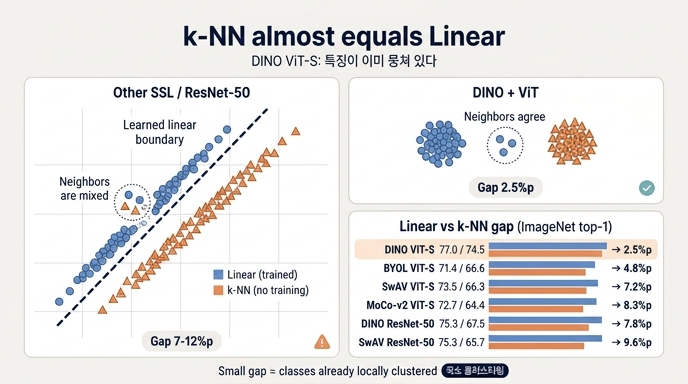

# DINO ViT-S에서 특히 놀라운 관찰: k-NN이 linear를 거의 따라잡는다

## 한 줄 요약

DINO로 학습한 ViT-S의 frozen feature에 **아무 학습도 하지 않는 단순 weighted k-NN 분류기**를 붙였을 때 ImageNet top-1 **74.5%** 가 나왔고, 이는 같은 feature 위에 **linear classifier를 따로 학습해서 얻은 77.0%** 와 불과 **2.5%p** 차이다. 논문은 이를 "More surprisingly"라고 표현하며, 이 성질이 **DINO를 ViT에 적용했을 때만 나타나고 다른 SSL 방법이나 ResNet-50에서는 나타나지 않는다**고 못 박는다.

> "More surprisingly, the performance with a simple k-NN classifier is almost on par with a linear classifier (74.5% versus 77.0%). This property emerges only when using DINO with ViT architectures, and does not appear with other existing self-supervised methods nor with a ResNet-50." (§4.1)

---

## 1. 두 평가 프로토콜의 차이부터

| | linear evaluation | k-NN evaluation |
|---|---|---|
| 추가 학습 | frozen feature 위에 **linear layer를 새로 학습** | **없음** (파라미터 0개) |
| 데이터 증강 | random resize crop + horizontal flip 사용 | 사용 안 함 |
| 하이퍼파라미터 | lr 등에 매우 민감, run 간 분산 큼 | 사실상 없음 (k=20으로 고정, τ=0.07) |
| 비용 | 수십 epoch 학습 필요 | downstream 데이터 **1-pass**면 끝 |
| 측정 대상 | 클래스가 **선형 분리 가능한가** | 같은 클래스가 **국소 이웃으로 뭉쳐 있는가** |

k-NN 구현 (Appendix F.1): frozen 모델로 train set feature를 전부 저장 → test 이미지의 [CLS] 토큰 표현(ViT-S는 d=384, ViT-B는 d=768)을 저장된 feature와 비교 → 상위 k개 이웃이 `α_i = exp(T_i·x / τ)` 가중치로 투표. τ=0.07, k=20(모든 run에서 일관되게 최적).

논문이 k-NN을 도입한 원래 동기는 "linear/finetune 평가가 하이퍼파라미터에 너무 민감해서 feature 품질을 재는 지표로 불안정하다"는 실용적 이유였는데, 결과적으로 **feature 공간의 기하 구조를 드러내는 진단 도구**가 되어버렸다.

---

## 2. Table 2 실측: method별 linear − k-NN 격차

### ViT-Small (21M, 1007 im/s) — 논문의 핵심 비교

| Method | Arch. | Linear | k-NN | **격차 (Linear − k-NN)** |
|---|---|---|---|---|
| Supervised | ViT-S | 79.8 | 79.8 | (0.0)\* |
| BYOL\* | ViT-S | 71.4 | 66.6 | **4.8%p** |
| MoCo-v2\* | ViT-S | 72.7 | 64.4 | **8.3%p** |
| SwAV\* | ViT-S | 73.5 | 66.3 | **7.2%p** |
| **DINO** | **ViT-S** | **77.0** | **74.5** | **2.5%p** |

\* 표시는 DINO 저자들이 직접 돌린 결과. Supervised 행은 k-NN 칸에 linear 수치를 그대로 옮겨 적은 참조값이라 격차 비교 대상이 아니다.

### ResNet-50 (23M, 1237 im/s) — 같은 DINO라도 convnet이면?

| Method | Arch. | Linear | k-NN | **격차** |
|---|---|---|---|---|
| SimCLR | RN50 | 69.1 | 60.7 | 8.4%p |
| MoCo-v2 | RN50 | 71.1 | 61.9 | 9.2%p |
| InfoMin | RN50 | 73.0 | 65.3 | 7.7%p |
| Barlow Twins | RN50 | 73.2 | 66.0 | 7.2%p |
| OBoW | RN50 | 73.8 | 61.9 | **11.9%p** |
| BYOL | RN50 | 74.4 | 64.8 | 9.6%p |
| DeepCluster-v2 | RN50 | 75.2 | 67.1 | 8.1%p |
| SwAV | RN50 | 75.3 | 65.7 | 9.6%p |
| **DINO** | **RN50** | **75.3** | **67.5** | **7.8%p** |

**결정적 관찰**: DINO를 ResNet-50에 붙이면 linear는 SwAV와 동률(75.3)이고 격차도 7.8%p로 다른 convnet SSL과 별 차이가 없다. 즉 **DINO라는 손실 함수만으로는 이 성질이 안 나온다**. ViT로 갈아탄 순간에만 격차가 2.5%p로 붕괴한다 — 이것이 논문이 "synergy between DINO and ViTs"라고 부르는 것이다.

같은 ViT-S 위에서 DINO는 다른 SSL 대비 **linear +3.5%, k-NN +7.9%** 를 얻는다. 이득이 k-NN 쪽에 두 배 이상 쏠려 있다는 것 자체가 신호다.

### 더 큰 아키텍처로 확장해도 유지 (Table 2 하단)

| Method | Arch. | Param. | Linear | k-NN | **격차** |
|---|---|---|---|---|---|
| SimCLR | RN50w4 | 375M | 76.8 | 69.3 | 7.5%p |
| SwAV | RN50w2 | 93M | 77.3 | 67.3 | 10.0%p |
| **DINO** | **ViT-B/16** | 85M | 78.2 | 76.1 | **2.1%p** |
| SwAV | RN50w5 | 586M | 78.5 | 67.1 | **11.4%p** |
| BYOL | RN200w2 | 250M | 79.6 | 73.9 | 5.7%p |
| **DINO** | **ViT-S/8** | 21M | 79.7 | **78.3** | **1.4%p** |
| SimCLR-v2 | RN152w3+SK | 794M | 79.8 | 73.1 | 6.7%p |
| **DINO** | **ViT-B/8** | 85M | **80.1** | 77.4 | **2.7%p** |

ViT-S/8은 21M 파라미터로 **k-NN만으로 78.3%** — 586M짜리 SwAV RN50w5의 k-NN 67.1%보다 11%p 이상 높다. 초록(abstract)에서 "excellent k-NN classifiers, reaching 78.3% top-1 with a small ViT"라고 자랑하는 숫자가 이것이다.

---

## 3. 이 격차가 뜻하는 것 — 특징 공간의 기하학

두 평가 프로토콜은 서로 **다른 종류의 구조**를 묻는다.

- **linear가 높다** = 클래스들이 **전역적으로 초평면(hyperplane)으로 분리 가능**하다. 하지만 그 초평면은 라벨을 보고 학습해서 찾은 것이다. 즉 "정보는 feature 안에 들어 있다"는 것까지만 보장한다.
- **k-NN이 높다** = 라벨 없이 **코사인 거리만으로도** 같은 클래스 샘플이 서로 최근접 이웃이 된다. 즉 클래스가 특징 공간에서 이미 **국소적으로 뭉쳐 있고(locally clustered)**, 거리 자체가 의미론적으로 정렬(semantically aligned)되어 있다.

따라서:

| 상황 | 특징 공간의 모습 | 해석 |
|---|---|---|
| **격차가 크다** (SwAV RN50w5, 11.4%p) | 클래스가 선형 경계로는 나뉘지만, 각 클래스가 길게 늘어져 있거나 여러 조각으로 흩어져 있고 이웃 반경 안에 다른 클래스가 섞여 있다 | 정보는 있으나 **국소 이웃 구조가 뒤섞여 있다**. "선형 판별 가능 ≠ 뭉쳐 있음" |
| **격차가 작다** (DINO ViT-S, 2.5%p) | 클래스가 조밀하고 잘 분리된 덩어리를 이룬다. 거리 = 의미 유사도 | 학습된 결정 경계가 거의 필요 없다. **표현 자체가 이미 분류기** |

핵심은 **"linear가 얼마나 높은가"가 아니라 "k-NN이 linear를 얼마나 따라붙는가"** 다. BYOL RN200w2는 linear 79.6%로 DINO ViT-S/8(79.7%)과 사실상 동률이지만, k-NN은 73.9% vs 78.3%로 4.4%p 벌어진다. 두 모델은 "선형 분리 가능성"에서는 같은 급인데 **국소 이웃 구조의 품질에서 전혀 다른 모델**이라는 뜻이다. 격차는 성능 지표라기보다 **표현 기하 구조의 진단 지표**로 읽어야 한다.

---

## 4. 왜 DINO + ViT 조합에서만 나타나는가 — 논문의 논의

논문은 §1과 Appendix에서 원인을 두 축으로 정리한다.

### (a) momentum encoder + multi-crop의 **결합**

> "The emergence of segmentation masks seems to be a property shared across self-supervised methods. However, the good performance with k-NN only emerge when combining certain components such as momentum encoder [33] and multi-crop augmentation [10]." (§1)

Table 7(ViT-S/16, 300 epoch) 은 이 결합이 k-NN에 얼마나 결정적인지 보여준다. 여기서도 격차(Lin. − k-NN)를 같이 보면 그림이 선명하다.

| # | Method | Mom. | MC | Loss | k-NN | Lin. | **격차** |
|---|---|---|---|---|---|---|---|
| 1 | **DINO (default)** | ✓ | ✓ | CE | **72.8** | 76.1 | **3.3%p** |
| 2 | momentum 제거 | ✗ | ✓ | CE | 0.1 | 0.1 | (붕괴) |
| 4 | multi-crop 제거 | ✓ | ✗ | CE | 67.9 | 72.5 | 4.6%p |
| 5 | CE → MSE | ✓ | ✓ | MSE | 52.6 | 62.4 | 9.8%p |
| 7 | BYOL | ✓ | ✗ | MSE | 66.6 | 71.4 | 4.8%p |
| 8 | MoCo-v2 | ✓ | ✗ | INCE | 62.0 | 71.6 | **9.6%p** |
| 9 | SwAV | ✗ | ✓ | CE | 64.7 | 71.8 | 7.1%p |

- **momentum만 있고 multi-crop 없음** (MoCo-v2, BYOL) → 격차 4.8~9.6%p
- **multi-crop만 있고 momentum 없음** (SwAV) → 격차 7.1%p
- **둘 다 있음** (DINO) → 격차 3.3%p

한쪽만으로는 안 되고 **둘의 결합에서만** k-NN이 붙는다. 각각의 역할은:

- **momentum encoder (EMA teacher)**: DINO에서는 contrastive queue의 대체물이 아니라 **Polyak–Ruppert averaging 식 model ensembling**으로 작동한다. 논문은 "teacher가 학습 내내 student보다 성능이 좋고, 더 높은 품질의 target feature를 제공해 student를 이끈다"고 관찰한다(아래 Figure 6 왼쪽). 시간축으로 평균된 안정적 타깃이 표현의 **분산을 줄이고 클러스터를 조이는** 역할을 한다. Figure 6(오른쪽, teacher 종류 비교)에서 momentum 72.8 vs previous-epoch 66.6 vs student-copy 0.1(붕괴)로 격차가 크다.
- **multi-crop (local-to-global)**: 224² 글로벌 뷰 2개는 teacher에만, 96² 로컬 뷰 여러 개는 student에만 통과시켜 "**작은 부분 crop → 이미지 전체의 의미**"를 맞추게 강제한다. 이 local-to-global 대응이 **같은 객체의 부분/전체 뷰를 특징 공간의 같은 지점으로 끌어당겨** 클러스터를 조밀하게 만든다. Table 16에서 DINO는 multi-crop으로 k-NN 67.9 → 72.7 (+4.8), linear 72.5 → 75.9 (+3.4)로 **k-NN 쪽 이득이 더 크다**. 반대로 BYOL은 multi-crop을 붙이면 오히려 66.6 → 59.8로 떨어진다 — multi-crop은 아무 프레임워크에나 꽂으면 되는 add-on이 아니라 **프레임워크의 핵심 부품**이라는 것이 논문의 주장이다.

*(Figure 6: 왼쪽 — momentum teacher가 학습 내내 student보다 높은 k-NN 정확도를 유지. 오른쪽 — teacher 구성별 k-NN top-1: student copy 0.1 / previous iter 0.1 / previous epoch 66.6 / **momentum 72.8**.)*

Appendix의 관련 논의도 같은 결론을 뒷받침한다: 동시기 연구 CsMI 역시 convnet으로도 강한 k-NN 성능을 내는데, **CsMI도 momentum network + multi-crop을 결합**했다는 점을 논문이 명시적으로 지적한다.

### (b) [CLS] 토큰이 **의미적 요약자**가 된다

ViT 쪽 요인은 아키텍처 자체다.

- k-NN에 쓰이는 표현은 **출력 [CLS] 토큰 하나**다 (Appendix F.1). ViT의 [CLS]는 라벨에 붙어 있지 않고, self-attention을 통해 모든 패치 토큰을 **자기가 선택한 가중치로 집계**한다. DINO의 학습 목표(로컬 뷰 → 글로벌 뷰 분포 매칭)는 이 토큰을 **이미지 전체를 대표하는 단일 의미 요약 벡터**가 되도록 직접 압박한다.
- 반면 ResNet-50의 표현은 마지막 feature map의 **global average pooling** — 공간 전체를 무차별 평균 내므로 배경·잡음이 그대로 섞여 들어간다. 같은 객체라도 배경이 다르면 벡터가 밀려나고, 그 결과 **국소 이웃 구조가 배경에 의해 오염**된다. 선형 분류기는 배경 방향 성분을 학습으로 죽여버릴 수 있지만, 라벨 없는 k-NN은 그럴 수 없다. 이것이 ResNet에서 격차가 항상 7~12%p로 남는 이유를 잘 설명한다.
- 논문의 다른 관찰들도 [CLS]가 의미적 요약자라는 해석과 일관된다: DINO ViT의 마지막 층 **[CLS] query self-attention map이 객체의 semantic segmentation을 그대로 담고** 있고(Figure 1, 3), 서로 다른 head가 서로 다른 객체/부위에 주목하며(Figure 3), supervised ViT에서는 이런 성질이 훨씬 흐리다(Figure 4). 즉 DINO ViT의 [CLS]는 "이미지에 무엇이 있는가"에 잘 정렬되어 있고, 그 벡터들 사이의 코사인 거리가 곧 의미 유사도가 된다.
- 부가 요인으로 **작은 패치**가 있다. Figure 5에서 패치를 16×16 → 8×8 → 5×5로 줄이면 k-NN이 단조 상승한다(ViT-S는 대략 73.4 → 77 근방까지). 파라미터를 하나도 늘리지 않고 얻는 이득이며, 대신 throughput이 1007 → 180 → 44 im/s로 급락한다.

---

## 5. 왜 중요한가 — downstream에서의 값어치

"k-NN이 linear에 근접한다"는 건 벤치마크 자랑이 아니라 **실전에서 쓰는 방식이 달라진다**는 뜻이다.

- **학습 없는 분류·라벨링**: 새 도메인에서 라벨 몇 장만 있으면 feature를 뽑아 저장하고 최근접 이웃 투표로 끝. 학습도, 증강도, 하이퍼파라미터 탐색도 없다. 클래스가 추가돼도 재학습 없이 벡터만 넣으면 된다.
- **이미지 검색 (Table 3)**: 검색은 본질적으로 최근접 이웃 문제다. off-the-shelf DINO ViT-S/16 feature가 supervised ViT-S/16을 크게 앞서고(𝑅Oxford-M 41.8 vs 33.5), 라벨 없이 GLDv2로 사전학습하면 51.5로 뛰어올라 기존 off-the-shelf 최고 기법(RN101+R-MAC, 49.8)을 넘는다.
- **copy detection (Table 4)**: 사전학습된 feature에 **코사인 유사도만** 걸어서 수행. DINO ViT-B/8이 mAP 85.4로, 이 과제 전용으로 학습된 Multigrain(82.5)과 supervised ViT-B/16(76.4)을 모두 앞선다.
- **비디오 객체 분할 (Table 5, DAVIS 2017)**: 프레임 간 **nearest-neighbor 전파**로 세그먼트를 옮기는 방식이라, 모델을 전혀 학습/파인튜닝하지 않는다. DINO ViT-B/8이 (J&F)ₘ 71.4로 self-supervised 기법 중 최상위권.
- **저비용 평가·모니터링**: linear probe는 lr에 따라 run 간 분산이 커서 모델 비교가 흔들린다. k-NN은 1-pass에 하이퍼파라미터가 없어 **재현 가능한 진단 지표**로 쓸 수 있다 — 논문 자체가 대부분의 ablation을 k-NN으로 돌린다.

한마디로, 격차가 작다는 것은 표현이 **거리 기반 시스템(검색, 중복 탐지, 클러스터링, 추적, 라벨 전파)에 그대로 꽂아 쓸 수 있는 상태**임을 뜻한다. DINOv2 이후 foundation model들이 "frozen feature + k-NN"을 기본 평가로 채택한 흐름이 여기서 출발한다.

---

## 6. 암기 포인트

- 숫자: **k-NN 74.5% vs linear 77.0%, 격차 2.5%p** (DINO ViT-S/16, ImageNet)
- 대조군: 같은 ViT-S에서 BYOL 4.8 / SwAV 7.2 / MoCo-v2 8.3%p, ResNet-50 계열은 7~12%p
- 반례: **DINO + ResNet-50은 7.8%p** — 손실함수가 아니라 **DINO×ViT의 시너지**
- 최고 기록: DINO **ViT-S/8은 k-NN만으로 78.3%** (격차 1.4%p), 21M 파라미터
- 원인: **momentum encoder(EMA teacher, Polyak 평균) + multi-crop(local-to-global)의 결합**, 그리고 [CLS] 토큰이 의미적 요약자 역할
- 의미: 같은 클래스가 특징 공간에서 **이미 국소적으로 뭉쳐 있다** → 검색·copy detection·NN 전파에 바로 쓸 수 있다

---

## 인포그래픽

