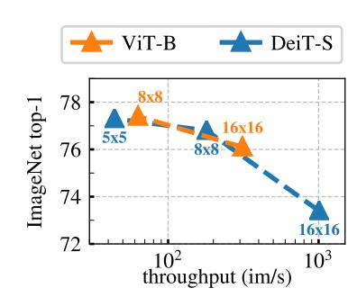

# 아키텍처 확대 vs 패치 축소 — 무엇이 더 효과적인가

**한 줄 답**: 패치 크기를 줄이는 것(`/8` 변형)이 더 크다. 패치 축소는 **파라미터를 한 개도 늘리지 않으면서** 성능을 더 많이 올리지만, 대신 **실행 시간이 크게 늘고 메모리도 더 먹는다.**

> 논문 원문 (Sec. 4.1, Comparing across architectures):
> "While training a larger ViT with DINO improves the performance, **reducing the size of the patches ("/8" variants) has a bigger impact on the performance.** While reducing the patch size do not add parameters, it still leads to a significant reduction of running time, and larger memory usage."

---

## 1. 두 축의 정확한 수치 비교 (Table 1 + Table 2)

ImageNet, DINO 사전학습. `im/s`는 V100 GPU, 128 samples/forward 기준 추론 처리량. `#tokens`는 $224^2$ 입력 기준.

| 변형 | #tokens | #params | im/s | Linear | $k$-NN |
|---|---|---|---|---|---|
| ViT-S/16 (기준) | 197 | 21M | 1007 | 77.0 | 74.5 |
| ViT-B/16 (**모델 확대**) | 197 | 85M | 312 | 78.2 | 76.1 |
| ViT-S/8 (**패치 축소**) | 785 | 21M | 180 | 79.7 | 78.3 |
| ViT-B/8 (둘 다) | 785 | 85M | 63 | 80.1 | 77.4 |

### 기준점(ViT-S/16) 대비 이득 / 비용

| 축 | 바꾼 것 | Linear 이득 | $k$-NN 이득 | 파라미터 비용 | 처리량 비용 |
|---|---|---|---|---|---|
| **모델 확대** S/16 → B/16 | dim 384→768, heads 6→12 | **+1.2** (77.0→78.2) | **+1.6** (74.5→76.1) | 21M → 85M (**+64M, 4.0배**) | 1007 → 312 (**3.2배 느려짐**) |
| **패치 축소** S/16 → S/8 | patch 16→8 | **+2.7** (77.0→79.7) | **+3.8** (74.5→78.3) | 21M → 21M (**+0M, 그대로**) | 1007 → 180 (**5.6배 느려짐**) |

**결론(성능/비용 관점)**: 패치 축소가 이득 자체가 2배 이상 크고(Linear +2.7 vs +1.2, $k$-NN +3.8 vs +1.6), 그 이득을 **파라미터 증가 0**으로 얻는다. 결정적으로 **ViT-S/8(21M, 79.7/78.3)이 ViT-B/16(85M, 78.2/76.1)을 4배 적은 파라미터로 이긴다.** 저장·배포·메모리 상주 비용이 문제라면 패치 축소가 압도적으로 유리하다.

단, **비용의 종류가 다르다**는 점이 핵심 뉘앙스다. 모델 확대는 "파라미터 + 속도" 둘 다 비싸고, 패치 축소는 "파라미터는 공짜, 속도·활성값 메모리는 더 비싸다". 실제로 처리량 손실은 패치 축소 쪽이 더 크다(5.6배 vs 3.2배). 즉 **파라미터 예산이 병목이면 패치 축소, 지연시간(latency) 예산이 병목이면 모델 확대**가 낫다.

파라미터 효율의 극단적 사례: ViT-B/8은 80.1% linear / 77.4% $k$-NN을 이전 SOTA(SimCLRv2 RN152w3+SK, 794M, 46 im/s) 대비 **파라미터 10배 적고 실행 시간 1.4배 빠르게** 달성한다.

---

## 2. Figure 5 — 패치 크기 ablation 곡선을 직접 읽기

가로축은 **로그 스케일 처리량(im/s)**, 세로축은 ImageNet $k$-NN top-1. 300 epochs 학습. 그림에서 실제로 읽히는 점들:

| 점 | 처리량 | $k$-NN top-1 (그래프 판독) |
|---|---|---|
| DeiT-S(ViT-S) **16x16** | ~1007 | ~73.4 |
| DeiT-S(ViT-S) **8x8** | ~180 | ~76.1 |
| DeiT-S(ViT-S) **5x5** | 44 | ~77.3 |
| ViT-B **16x16** | ~312 | ~76.0 |
| ViT-B **8x8** | 63 | ~77.4 |

그림에서 관찰되는 것:

1. **두 곡선(파랑 ViT-S, 주황 ViT-B) 모두 왼쪽 위로 단조 상승한다.** 패치를 줄일수록 정확도는 계속 오르고 처리량은 계속 떨어진다. ViT-S는 16→8→5로 가며 73.4 → 76.1 → 77.3, 즉 **+3.9점을 파라미터 21M 고정으로** 얻는다.
2. **패치 한 단계 축소(16→8)의 이득(+2.7)이, 모델 한 단계 확대(S→B, 같은 16x16)의 이득(+2.6)과 최소한 대등하거나 더 크다.** 그런데 전자는 파라미터가 그대로다.
3. **파랑 8x8 점(~180 im/s, ~76.1)과 주황 16x16 점(~312 im/s, ~76.0)이 거의 같은 높이에 있다.** 즉 21M짜리 ViT-S/8이 85M짜리 ViT-B/16과 같은 정확도를 낸다 — 파라미터 4배를 패치 축소로 완전히 대체한 셈. (800 epochs로 오래 학습한 Table 2에서는 아예 ViT-S/8이 ViT-B/16을 앞선다.)
4. **정직한 단서**: 처리량 축만 놓고 보면 주황(ViT-B) 곡선이 파랑(ViT-S) 곡선보다 위에 있다. 같은 속도 예산에서는 큰 모델이 유리하다. 논문이 말하는 "더 큰 영향"은 **파라미터당 이득**과 **절대 성능 상한**에 관한 것이다.
5. **수확 체감**: 8x8 → 5x5는 정확도 +1.2를 위해 처리량을 180 → **44 im/s**로 4배 더 깎는다. 논문이 명시적으로 지적하는 대목이다 — "the performance gain from using smaller patches comes at the expense of throughput".

---

## 3. 왜 작은 패치가 더 효과적인가 — 메커니즘

### (a) 파라미터가 아니라 "입력 해상도"를 올린 것이다

ViT의 파라미터는 거의 전부 Transformer 블록(dim, heads, MLP)에 있고, **패치 임베딩 레이어를 제외하면 토큰 개수 $N$과 무관**하다. 패치를 $16\times16 \to 8\times8$로 줄여도:

$$\#\text{params}: 21\text{M} \to 21\text{M} \quad (\text{동일})$$

$$N = \left(\frac{224}{16}\right)^2 + 1 = 197 \;\longrightarrow\; N = \left(\frac{224}{8}\right)^2 + 1 = 785 \quad (\approx 4\times)$$

즉 모델의 **표현력(capacity)을 키운 게 아니라, 모델이 보는 입력의 공간 해상도를 키운 것**이다. 그리드가 $14\times14 \to 28\times28$로 조밀해진다. 이것이 "파라미터 없이 성능이 오른다"는 현상의 정체다.

### (b) 공간 해상도 = 작은 객체·경계가 개별 토큰을 갖는다

- $16\times16$ 패치에서는 이미지의 1/196만 한 영역이 최소 단위다. 작은 물체(깃발, 표지판, 새)는 배경과 **한 토큰 안에 섞여** 표현이 희석된다. 물체 경계도 패치 내부를 가로질러 잘려, 경계 토큰이 "물체 반 + 배경 반"이 된다.
- $8\times8$이면 같은 물체가 4배 많은 토큰으로 쪼개진다. 작은 물체가 **자기 전용 토큰**을 얻고, 경계는 토큰 경계에 훨씬 잘 정렬된다. self-attention이 "물체 토큰 집합"을 하나의 그룹으로 묶기 쉬워진다.
- DINO의 학습 신호가 [CLS]를 통한 전역 이미지 매칭이므로, 세밀한 토큰은 **더 세밀한 부분(part) 단위 대응**을 학습할 여지를 준다.

### (c) attention map / dense task 품질이 직접 좋아진다

![Figure 3: DINO ViT-S/8 마지막 층의 헤드별 [CLS] self-attention](fig-2.jpeg)

Figure 3은 **ViT-S/8**의 마지막 블록에서 [CLS] 쿼리의 헤드별 attention을 색으로 구분해 시각화한 것이다. 그림에서 보이는 것:

- 서로 다른 헤드(빨강/노랑/파랑)가 **서로 다른 객체 또는 객체의 부분**에 붙는다. 얼룩말 행에서는 얼룩말과 옆 말이 다른 색으로, 곰인형 행에서는 곰·안경·키보드가 다른 색으로 분리된다.
- 2행 시계탑 이미지의 **작은 성조기**, 반사된 보트처럼 **작고 잘린 대상**까지 개별적으로 잡힌다. 이런 미세 구조는 $16\times16$ 그리드($14\times14$ 셀)로는 표현 단위 자체가 부족하다.
- 마스크가 눈에 띄게 "픽셀 그리드"처럼 보이는데, 그 그리드 한 칸이 곧 하나의 패치 토큰이다. 논문은 480p 입력에서 ViT-S/8이 **3601개 토큰**을 만든다고 밝히고 있으며, 이 조밀함이 곧 마스크 해상도다.

정량적 뒷받침 — **DAVIS 2017 비디오 객체 분할** (frozen feature, 학습·파인튜닝 없음, Table 5):

| Arch. | $(\mathcal{J}\&\mathcal{F})_m$ |
|---|---|
| DINO ViT-S/16 | 61.8 |
| DINO ViT-B/16 | 62.3 (모델 확대: **+0.5**) |
| DINO ViT-S/8 | 69.9 (패치 축소: **+8.1**) |
| DINO ViT-B/8 | 71.4 (B/16 대비 **+9.1**) |

**공간 정보가 필요한 dense task에서 격차가 극단적으로 벌어진다.** 모델을 4배 키워도 +0.5인데, 패치를 반으로 줄이면 +8~9다. 이것이 "패치 축소는 표현력이 아니라 해상도를 산 것"이라는 해석의 가장 강한 증거다.

> 세부 주의: Figure 4의 PASCAL VOC12 Jaccard(attention mass 60% 임계)는 ViT-S/16 45.9 vs ViT-S/8 44.7로 오히려 비슷하거나 살짝 낮다. 이 지표는 "supervised vs DINO"(27.3 vs 45.9 / 23.7 vs 44.7)를 대비하려고 만든 것이고, 마스크의 세밀함보다 mass 분포 형태에 좌우된다. 패치 축소의 dense 이득은 DAVIS 쪽 수치로 판단하는 편이 맞다.

---

## 4. 비용은 왜 그렇게 커지는가 — $O(N^2)$

$224^2$ 입력에서 토큰 수가 $197 \to 785$로 약 **4배**가 된다. 계층별 비용은:

| 연산 | 복잡도 | 16→8 배수 |
|---|---|---|
| MLP / QKV 투영 (토큰별 선형) | $O(N d^2)$ | **약 4배** |
| self-attention score $QK^\top$, $\text{softmax}\cdot V$ | $O(N^2 d)$ | **약 16배** |
| attention 행렬 메모리 (헤드당) | $O(N^2)$ | **약 16배** |

$$N \to 4N \;\Longrightarrow\; \text{attention 연산·메모리} \sim O(N^2) \to 16\times$$

실측 처리량은 이 둘이 섞인 결과다:

- ViT-S: **1007 → 180 im/s** (5.6배 느려짐)
- ViT-B: **312 → 63 im/s** (5.0배 느려짐)
- ViT-S 5x5: **44 im/s** (기준 대비 23배 느려짐, $N \approx 2026$)

메모리 쪽도 마찬가지다. 파라미터는 21M 그대로여서 **가중치 메모리는 변하지 않지만**, 활성값(activation)과 특히 attention 행렬이 학습 중 피크 메모리를 지배한다 — 논문이 "larger memory usage"라고 적은 부분. 참고로 Table 8은 ViT-S/16 기준 multi-crop 설정만으로도 GPU당 피크 메모리가 9.3G → 15.4G로 움직임을 보여준다. 여기에 $N$ 4배가 겹치면 부담이 어떻게 커지는지 짐작할 수 있다.

---

## 5. 실무적 정리

- **정확도 상한을 밀어붙이고 싶다** → 패치 축소가 우선. `/8` 변형이 DINO의 최고 성능(80.1 linear / 78.3 $k$-NN)을 만든다.
- **파라미터·모델 크기가 병목(엣지 배포, 메모리 상주)** → 패치 축소. ViT-S/8은 21M으로 85M ViT-B/16을 이긴다.
- **지연시간·처리량이 병목(대량 추론 서빙)** → 큰 모델 + 큰 패치가 낫다. 같은 im/s 예산에서는 Fig. 5의 ViT-B 곡선이 ViT-S 곡선 위에 있다.
- **분할·추적 등 dense/공간 과제** → 패치 축소가 사실상 유일한 지렛대. DAVIS에서 모델 확대는 +0.5, 패치 축소는 +8~9.
- **수확 체감 지점**: $8\times8$까지가 현실적 스위트스팟. $5\times5$는 +1.2점에 처리량 4배(180→44)를 더 지불한다.

## 관련 원문 위치

- Table 1 (Networks configuration): 토큰 수·파라미터·im/s
- Table 2 (Linear & $k$-NN classification of ImageNet), 특히 "Comparison across architectures" 하단 패널
- Sec. 4.1 "Comparing across architectures" 문단 — 카드의 정답 문장 그 자체
- Sec. 5.1 "Importance of the patch size" + Figure 5
- Table 5 (DAVIS 2017), Figure 3 (attention maps), Figure 4 (Jaccard)
