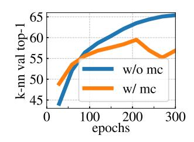

# multi-crop의 비대칭: 왜 student와 teacher가 보는 view가 다른가

**Q.** multi-crop에서 student와 teacher에 전달되는 view가 다른 이유는?

**A.** 모든 crop은 student를 통과하지만 **global view만 teacher를 통과**한다. 이를 통해 "local-to-global" 대응 관계를 학습하도록 유도한다.

---

## 1. 무엇이 비대칭인가 (DINO §3.1)

한 장의 이미지 $x$ 에서 view 집합 $V$ 를 만든다.

- **global view 2개**: $x_1^g, x_2^g$ — 해상도 $224^2$, 원본 면적의 큰 부분(예: 50% 이상)을 덮음
- **local view 여러 개**: 해상도 $96^2$, 원본 면적의 작은 부분(예: 50% 미만)만 덮음
- 논문 본문 표현 그대로: *"All crops are passed through the student while only the global views are passed through the teacher, therefore encouraging 'local-to-global' correspondences."*

손실은 다음과 같다 (Eq. 3):

$$\min_{\theta_s} \sum_{x \in \{x_1^g,\, x_2^g\}} \ \sum_{\substack{x' \in V \\ x' \neq x}} H\big(P_t(x),\, P_s(x')\big)$$

여기서 $H(a,b) = -a \log b$ 이고, $P_t, P_s$ 는 각각 teacher/student 출력의 temperature softmax 분포다.

이 이중 합의 **바깥쪽은 global view에만** ($x \in \{x_1^g, x_2^g\}$, 2개), **안쪽은 전체 view 집합** ($x' \in V$)에 걸린다. 즉 항의 개수는 $2 \times (|V| - 1)$ 이고, 그 중 대부분은 "teacher가 본 global 분포"를 타깃으로 "student가 본 local 조각"을 맞추는 항이다. 이것이 **부분 → 전체 예측**을 강제하는 구조적 장치다.

$x' \neq x$ 조건은 teacher와 student가 **완전히 같은 crop**을 볼 때를 배제한다. 그 경우는 (augmentation까지 동일하므로) 아무 정보도 주지 않는 자명한 항이 된다.


Figure 2는 view가 1쌍인 단순화된 경우다. 그림에서 읽어야 할 것:

- 왼쪽 가지(student)에는 $x_1$ 이, 오른쪽 가지(teacher)에는 $x_2$ 가 들어간다 → **입력이 애초에 서로 다르다**. multi-crop은 이 오른쪽 가지의 입력 자리를 **global view로만 제한**하고, 왼쪽 가지의 입력 자리를 **모든 crop으로 확장**한 것에 해당한다.
- teacher 가지에는 `sg`(stop-gradient)가 걸려 있다 → teacher는 **타깃 생성기**이지 학습되는 쪽이 아니다. 타깃의 품질이 곧 학습 신호의 품질이므로, 어떤 view를 teacher에 넣느냐가 결정적이다.
- teacher는 `ema`로만 갱신된다 → teacher는 student의 Polyak–Ruppert 평균이고, 논문 Fig. 6(left)에서 **학습 내내 student보다 성능이 높다**. "더 잘 보는 쪽에 더 좋은 입력을 준다"는 설계다.

---

## 2. 왜 teacher에는 global만 넣는가

### (1) 타깃이 "전체 장면"을 담은 고품질 신호가 된다

teacher 출력 $P_t(x^g)$ 는 이미지의 큰 영역을 본 상태에서 나온 분포다. 여기에 centering + sharpening이 적용되어 "이 장면은 무엇인가"에 대한 비교적 신뢰할 수 있는 soft label이 된다. student는 $96^2$ 짜리 작은 조각(개의 귀, 배경 풀밭 일부)만 보고 이 분포를 재현해야 한다.

즉 student가 풀어야 하는 문제는 **"이 작은 조각이 속한 전체 장면은 무엇인가"** 가 된다. 조각만 보고 전체를 맞히려면, 부분과 전체를 잇는 의미적/맥락적 표현을 배울 수밖에 없다. 이것이 "local-to-global correspondence"다. teacher가 만든 전체 시야의 타깃이 일종의 **닻(anchor)** 역할을 하고, 여러 개의 local view가 모두 같은 닻으로 끌려온다.

이 효과는 DINO에서 관찰된 성질과도 자연스럽게 이어진다. 부분 패치가 전체 장면의 표현으로 매핑되도록 훈련되므로, 자기지도 ViT의 self-attention이 객체 경계를 잡아내는 semantic segmentation 성질이 드러나는 데 유리한 압력이 된다.

### (2) local view를 teacher에 넣으면 타깃 자체가 빈약해진다

만약 $96^2$ local view도 teacher에 통과시켜 타깃으로 쓴다면:

- 타깃 분포가 **원본 면적의 5~30%만 본 상태**에서 만들어진다. 객체가 잘려 나갔거나 배경만 잡힌 crop이 흔하다.
- 그런 타깃은 노이즈가 크고 이미지 정체성과의 상관이 약하다. student는 **"빈약한 조각 → 또 다른 빈약한 조각"** 을 맞추게 되어, 학습 신호가 나빠진다. 부분→전체라는 방향성도 사라진다(local↔local 대응은 전체 맥락을 요구하지 않는다).
- teacher는 EMA로 만들어진 "더 나은 모델"인데, 굳이 그 모델에 가장 정보량이 적은 입력을 넣어 타깃 품질을 떨어뜨릴 이유가 없다.

정리하면 비대칭은 **"타깃은 정보가 많은 쪽에서, 예측은 정보가 적은 쪽에서"** 라는 원칙의 구현이다. 해상도/시야의 격차 자체가 학습 과제를 만들어 낸다. 대칭으로 만들면 그 격차, 즉 과제가 사라진다.

참고로 global과 local의 scale 구간은 겹치지 않게 잡는다: global은 `RandomResizedCrop` scale $(s, 1)$, local은 $(0.05, s)$ 로 샘플링하며 논문에서 최적 $s \approx 0.3$ 을 찾았다(부록 E; 공개 코드 기본값은 `--global_crops_scale 0.4 1.`). 두 구간을 분리하는 것도 "local은 확실히 작게" 만들어 격차를 보장하기 위한 장치다.

### (3) 계산 비용: teacher forward는 항상 view 2개뿐

비대칭은 공짜가 아니라 오히려 **비용을 아낀다**. student는 $2 + n_{\text{local}}$ 개(기본 설정에서 8~10개)의 crop을 forward하지만, teacher는 **언제나 $224^2$ 두 장만** forward한다. 게다가 local view는 해상도가 $96^2$ 이라 ViT 토큰 수가 $224^2$ 대비 약 $(96/224)^2 \approx 0.18$ 배 수준이어서, crop을 늘려도 추가 비용이 완만하다.

Table 8(ViT-S/16, 8-GPU × 2)이 그 이득을 보여준다.

| crops | 100ep top-1 | 100ep time | 300ep top-1 | 300ep time | mem. |
|---|---|---|---|---|---|
| $2\times224^2$ | 67.8 | 15.3h | 72.5 | 45.9h | 9.3G |
| $2\times224^2 + 2\times96^2$ | 71.5 | 17.0h | 74.5 | 51.0h | 10.5G |
| $2\times224^2 + 6\times96^2$ | 73.8 | 20.3h | 75.9 | 60.9h | 12.9G |
| $2\times224^2 + 10\times96^2$ | 74.6 | 24.2h | 76.1 | 72.6h | 15.4G |

multi-crop 없이 45.9시간 학습해 72.5%인 반면, $2\times224^2 + 10\times96^2$ 는 **24.2시간에 74.6%** 로 도달한다. 시간은 절반, 정확도는 +2%다(메모리는 9.3G→15.4G로 증가). 논문은 "multi-crop 없는 설정에서 더 오래 학습해도 이 이득을 따라잡지 못한다"고 명시하며, 이를 **local-to-global augmentation의 가치**의 근거로 든다. 다만 view를 더 늘릴수록 이득은 체감한다($6\times \to 10\times 96^2$ 에서 +0.2%).

---

## 3. 근거: Table 7의 multi-crop ablation

Table 7 (ViT-S/16, 300 epochs). MC = Multi-Crop.

|  | Method | Mom. | SK | MC | Loss | Pred. | k-NN | Lin. |
|---|---|---|---|---|---|---|---|---|
| 1 | DINO | ✓ | ✗ | **✓** | CE | ✗ | **72.8** | **76.1** |
| 4 |  | ✓ | ✗ | **✗** | CE | ✗ | **67.9** | **72.5** |

row 1 vs row 4가 multi-crop만 뺀 비교다. **k-NN −4.9%p, linear −3.6%p**. 논문은 momentum encoder와 함께 multi-crop을 "좋은 feature를 얻기 위한 핵심 구성요소"로 규정한다. 특히 k-NN 성능(하이퍼파라미터 튜닝 없이 feature 품질을 직접 재는 지표)이 크게 떨어진다는 점이, 비대칭 multi-crop이 만들어내는 표현의 질적 차이를 잘 보여준다.

부록 E는 여기에 두 가지를 덧붙인다.

- 프레임워크별 multi-crop 효과($2\times224^2$ → $2\times224^2+6\times96^2$, linear eval): DINO 72.5 → 75.9 (**+3.4**), MoCo-v2 71.6 → 73.4, SwAV 68.5 → 71.8, **BYOL 71.4 → 64.8 (−6.6)**. multi-crop은 아무 프레임워크에나 붙이면 되는 "add-on"이 아니라 **모델의 핵심 구성요소**이며, DINO가 그 이득을 가장 크게 본다.
- BYOL에 multi-crop을 적용하면 초반에는 좋다가 특정 시점 이후 성능이 꺾인다(아래 그림). lr/wd/crop 수를 폭넓게 sweep해도 같은 패턴이었다.



파란 곡선(w/o mc)은 단조 상승해 300 epoch에서 65% 부근에 이르지만, 주황 곡선(w/ mc)은 60 epoch 부근까지만 앞서다가 200 epoch 이후 꺾여 57% 근처로 내려온다. **"local view를 어떻게 다루느냐"가 손실 함수·타깃 생성 방식과 맞물려야 한다**는 뜻이고, DINO의 cross-entropy + centering/sharpening 타깃이 그 조합을 잘 맞춘 사례다.

---

## 4. 구현으로 확인하기

공식 구현(`main_dino.py`)에서 비대칭은 딱 두 줄로 드러난다.

```python
teacher_output = teacher(images[:2])  # only the 2 global views pass through the teacher
student_output = student(images)      # 모든 crop (2 global + local_crops_number)
```

`DINOLoss.forward`는 Eq. (3)을 그대로 옮긴다.

```python
student_out = student_out.chunk(self.ncrops)          # 2 + local_crops_number
teacher_out = teacher_out.detach().chunk(2)           # global 2개뿐
for iq, q in enumerate(teacher_out):                  # x ∈ {x_1^g, x_2^g}
    for v in range(len(student_out)):                 # x' ∈ V
        if v == iq:
            continue                                  # x' ≠ x
        loss = torch.sum(-q * F.log_softmax(student_out[v], dim=-1), dim=-1)
```

- `chunk(2)` vs `chunk(ncrops)`: teacher 쪽 타깃이 2개라는 것이 코드 레벨의 비대칭 그 자체다.
- `detach()`: teacher 가지에 gradient가 흐르지 않는다(Figure 2의 `sg`). 그래디언트는 오직 student를 통해서만 흐르므로, 학습되는 것은 "local 조각을 global 타깃으로 사상하는 능력"이다.
- 기본값 `--local_crops_number 8` → 총 10개 crop, 손실 항 수는 $2 \times (10-1) = 18$ 개. 그 중 **16개가 local→global 항**이고 global→global 항은 2개뿐이다. 학습 신호의 대부분이 부분→전체 방향이라는 점이 수치로 확인된다.

---

## 한 줄 요약

teacher에는 전체 장면을 담은 global view만 넣어 **고품질 타깃**을 만들고, student에는 모든 crop을 넣어 **작은 조각으로 그 전체를 예측**하게 한다. 이 정보 격차가 곧 학습 과제(local-to-global)이며, 대칭으로 바꾸면 타깃이 빈약해져 신호가 망가진다. 덤으로 teacher forward가 2회로 고정되어 계산 효율까지 좋아진다.
