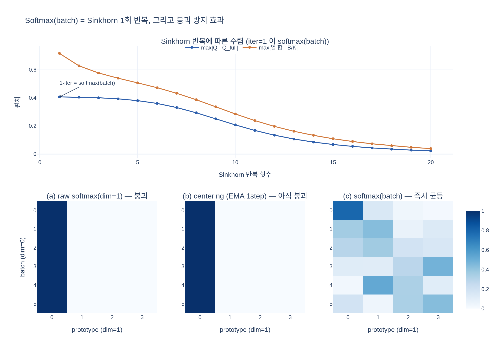

# Softmax(batch) 변형 — Sinkhorn-Knopp 1회 반복으로 유도하기

## 한눈에 요약

DINO 논문(부록 B, "Relation to SwAV")은 teacher 출력에 붕괴 방지 연산으로
**centering / Sinkhorn-Knopp / Softmax(batch)** 세 가지를 비교한다.
그중 **Softmax(batch)** 는 SwAV가 쓰는 Sinkhorn-Knopp 알고리즘을
**단 1회만 반복(`num_iters=1`)** 했을 때 얻어지는 단순화된 형태이며, 두 줄이면 끝난다.

```python
x = softmax(x / tau, dim=0)            # 배치 축 softmax
x /= sum(x, dim=1, keepdim=True)       # 샘플별 합 = 1
```

> "Intuitively, the softmax operation on the batch axis allows to select for each
> dimension (or 'cluster') its best matches in the batch." — DINO 부록 B

---

## 1단계: 배경 — 엔트로피 정규화 최적 수송과 Sinkhorn

SwAV는 teacher(또는 자기 자신) 출력을 그냥 쓰지 않고, **배치 안에서 균형 잡힌 할당**
$Q$ 를 최적 수송(optimal transport) 문제로 풀어 타깃으로 삼는다.
배치 크기 $B$, 프로토타입 수 $K$, 유사도 점수 $S \in \mathbb{R}^{B\times K}$ 에 대해

$$
\max_{Q \in \mathcal{Q}} \ \langle Q, S\rangle + \varepsilon H(Q),
\qquad H(Q) = -\sum_{b,k} Q_{bk}\log Q_{bk}
$$

$$
\mathcal{Q} = \Big\{\, Q \in \mathbb{R}_+^{B\times K}\ \Big|\ Q\mathbf{1}_K = r,\ \ Q^\top\mathbf{1}_B = c \,\Big\}
$$

- $r$: 행(샘플) 마진 — "각 샘플의 할당은 확률분포"
- $c$: 열(프로토타입) 마진 — "각 프로토타입이 배치에서 받는 총 질량은 균등"

이 문제의 해는 **닫힌 형태의 스케일링 구조**를 가진다. Lagrangian의 KKT 조건에서
행 제약의 승수가 $\log u$, 열 제약의 승수가 $\log v$ 로 나오므로

$$
\boxed{\;Q^\star = \mathrm{diag}(u)\;K\;\mathrm{diag}(v), \qquad K = \exp\!\big(S/\varepsilon\big)\;}
$$

즉 커널 $K$ 의 **행을 $u$ 로, 열을 $v$ 로 스케일한 것**이 최적해다.
남은 일은 두 마진 제약을 만족하는 $u, v$ 를 찾는 것인데, 이는 닫힌 형태가 없어서
**번갈아 갱신**한다(Sinkhorn-Knopp, Cuturi 2013):

$$
v \leftarrow \frac{c}{K^\top u}, \qquad u \leftarrow \frac{r}{K v}
$$

한 번의 $v$ 갱신 = **열 방향 정규화 한 번**, 한 번의 $u$ 갱신 = **행 방향 정규화 한 번**.
$\varepsilon$(= 코드의 `tau`)은 엔트로피 정규화 세기이자 온도다. 작으면 해가 하드해진다.

논문 부록의 PyTorch 스타일 의사코드가 정확히 이 구조다.

```python
# x is n-by-K
# tau is Sinkhorn regularization param
x = exp(x / tau)                      # K = exp(S / eps)
for _ in range(num_iters):            # 1 iter of Sinkhorn
    # total weight per dimension (or cluster)
    c = sum(x, dim=0, keepdim=True)
    x /= c                            # <- v 갱신 (열 = 배치 축 방향 합)
    # total weight per sample
    n = sum(x, dim=1, keepdim=True)
    x /= n                            # <- u 갱신 (행 = 프로토타입 축 방향 합)
# x sums to 1 for each sample (assignment)
```

---

## 2단계: `num_iters=1` 을 대입하면 두 줄이 된다

루프를 딱 한 번만 돈다고 하자. 그러면 연산은 전부 다음 세 개뿐이다.

1. `x = exp(x / tau)`
2. `x /= sum(x, dim=0, keepdim=True)` (열 = 배치 축 합으로 나누기)
3. `x /= sum(x, dim=1, keepdim=True)` (행 = 프로토타입 축 합으로 나누기)

여기서 **1 + 2 는 정의상 배치 축 softmax** 다.

$$
\frac{\exp(x_{bk}/\tau)}{\sum_{b'=1}^{B}\exp(x_{b'k}/\tau)}
\;=\; \big[\mathrm{softmax}(x/\tau,\ \mathrm{dim}=0)\big]_{bk}
$$

따라서 세 줄이 두 줄로 접힌다.

```python
x = softmax(x / tau, dim=0)
x /= sum(x, dim=1, keepdim=True)
```

| Sinkhorn 관점 | 코드 | 축 | 의미 |
|---|---|---|---|
| $K=\exp(S/\varepsilon)$ + $v$ 갱신 1회 | `softmax(x/tau, dim=0)` | `dim=0` = **배치(샘플) 축** | 각 프로토타입이 받는 질량을 균등화 |
| $u$ 갱신 1회 | `x /= sum(x, dim=1, keepdim=True)` | `dim=1` = **프로토타입 축** | 각 샘플의 할당을 확률분포로 정규화 |

### 축을 절대 혼동하지 말 것

- `dim=0` (배치 축) softmax → **프로토타입들 사이의 경쟁이 아니라, 한 프로토타입을 놓고 배치 내 샘플들이 경쟁**.
- `dim=1` (프로토타입 축) softmax → 그냥 평범한 분류 확률. **붕괴 방지 효과가 전혀 없다**
  (모든 샘플이 같은 프로토타입에 1.0을 줘도 각 행은 여전히 정상적인 확률분포다).

즉 Softmax(batch)의 마법은 전적으로 **`dim=0`** 이라는 한 글자에 들어 있다.
`dim`을 바꿔 쓰면 그냥 DINO의 student/teacher 일반 softmax가 되어 버려 의미가 완전히 달라진다.

또한 1회 반복이므로 **정확한 최적해는 아니다.** 마지막이 행 정규화이므로
행 제약(샘플별 합 = 1)은 정확히 만족하지만, 열 제약(프로토타입 균등)은 느슨하게만 만족한다.
반복을 늘리면 열 합이 목표 $B/K$ 로 수렴한다(아래 실험 참고).

---

## 3단계: "배치 축 softmax"의 직관 — 왜 붕괴를 막는가

행이 샘플, 열이 프로토타입인 행렬을 떠올리자.

- **행 방향 softmax(평소 하는 것)**: "샘플 $b$ 는 어느 프로토타입에 속할까?"
  → 모든 샘플이 프로토타입 0을 고를 수 있다. 이것이 바로 **한 차원이 지배하는 붕괴**.
- **열 방향 softmax(= batch 축)**: "프로토타입 $k$ 는 이 배치에서 **누구를 자기 것으로 데려갈까?**"
  → 각 열의 합이 정확히 1이 되므로, **모든 프로토타입이 배치에 대해 같은 크기의 예산**을 갖는다.
  한 프로토타입이 배치 전체를 독차지하려 해도, 그 열의 총 질량은 1로 고정되어 있어
  다른 프로토타입들도 각자 자기 몫만큼 샘플을 가져가야 한다.

이것이 논문 표현의 "each dimension selects its best matches in the batch"다.
프로토타입 관점의 **경쟁적 매칭**이므로, 결과적으로 프로토타입 사용량이 자동으로 균등해지고
"모든 샘플이 한 프로토타입으로 몰리는" 붕괴가 구조적으로 불가능해진다.

한편 이 연산은 균등화만 강제하므로 **sharpening(낮은 $\tau$)** 과 함께 봐야 한다.
너무 균등하면 반대쪽 붕괴(모든 출력이 uniform)가 되기 때문이다. DINO의 붕괴 분석 그림:


---

## 4단계: centering과의 대비 (배치-약함 vs 배치-강함)

DINO 기본 설정은 Sinkhorn 계열을 쓰지 않고 **centering + sharpening** 만 쓴다.
그림에서 teacher 쪽 `centering` 블록이 Softmax(batch)/SK가 들어갈 자리다.


centering은 EMA로 누적한 center $c$ 를 teacher 출력에 bias로 더하는 것뿐이다.

$$
g_t(x) \leftarrow g_t(x) + c,
\qquad
c \leftarrow m\,c + (1-m)\,\frac{1}{B}\sum_{i=1}^{B} g_{\theta_t}(x_i)
$$

| | centering | Softmax(batch) / Sinkhorn-Knopp |
|---|---|---|
| 쓰는 통계량 | 배치 **1차 통계량(평균)** 을 EMA로 누적 | 현재 배치의 **전체 점수 행렬** |
| 배치 의존도 | **약함** — 과거 배치들의 평균이라 현재 배치와 무관하게 동작. batch size 8까지도 학습 성공 | **강함** — 지금 이 배치 안에서 정규화가 완결. 배치가 작으면 통계가 부실 |
| 강제력 | 특정 차원이 지배하는 것을 "말리는" 정도(soft bias). 즉효성 없음(EMA가 따라잡아야 함) | 배치 내 균등 할당을 **직접 강제**. 한 스텝에 효과 |
| 붕괴 방지 | 단독으로는 부족 — momentum teacher와 결합해야 성립 (Table 15 row 4: 0.1%) | momentum 없이도 붕괴 방지 (row 5, 6: 72.2 / 71.8%) |
| 비용 | $O(K)$ bias 덧셈 | 배치 전체 정규화(분산 학습 시 all-reduce 필요) |

정리하면 DINO는 **"안정성을 조금 내주고 배치 의존도를 줄이는"** 선택을 했다.
momentum encoder가 있으면 centering만으로도 충분하고(76.1%), 그 대가로 아주 작은 배치에서도
학습이 가능해진다.

---

## 5단계: 논문 Table 15 재현 (Relation to SwAV)

ViT-S/16, 300 epochs, ImageNet linear evaluation top-1.
Momentum 열의 X 는 momentum encoder 사용, 빈칸은 stop-gradient를 건 student 하드 복사(SwAV 방식).

| | Method | Momentum | Operation | Top-1 |
|---|---|---|---|---|
| 1 | DINO | X | Centering | **76.1** |
| 2 | – | X | Softmax(batch) | 75.8 |
| 3 | – | X | Sinkhorn-Knopp | 76.0 |
| 4 | – | | Centering | **0.1** |
| 5 | – | | Softmax(batch) | 72.2 |
| 6 | SwAV | | Sinkhorn-Knopp | 71.8 |

읽는 법:

- **1 vs 2 vs 3 (momentum 있음)**: 76.1 / 75.8 / 76.0 — 세 연산이 거의 동등. 즉
  momentum teacher가 있으면 굳이 Sinkhorn을 돌릴 필요가 없고, 두 줄짜리 Softmax(batch)도
  full Sinkhorn과 사실상 같은 성능을 낸다.
- **4 (momentum 없음 + centering)**: 0.1% = **완전 붕괴**. centering은 momentum encoder 없이는
  붕괴를 못 막는다.
- **5 vs 6 (momentum 없음)**: 72.2 / 71.8 — momentum이 없을 때는 배치-강한 연산이 필수이고,
  이때도 1회 근사(Softmax(batch))가 full Sinkhorn(SwAV)보다 오히려 살짝 높다.
- **3 vs 6 / 2 vs 5**: 같은 연산에서 momentum encoder 유무가 4%p 이상 차이 → **momentum encoder가
  성능과 안정성의 핵심**이라는 것이 이 표의 결론이다.

---

## 시각화



- 위: Sinkhorn 반복을 늘리면 `max|Q - Q_full|` 과 열 마진 오차가 줄어든다. 왼쪽 끝 iter=1 지점이
  곧 Softmax(batch) — 근사는 거칠지만 열 방향 경쟁이라는 핵심 성질은 이미 들어 있다.
- 아래: 모든 샘플이 프로토타입 0에 높은 점수를 주는 붕괴 입력에 대해
  (a) raw softmax(dim=1)는 붕괴를 그대로 통과시키고,
  (b) centering은 EMA center가 아직 따라오지 못한 초기에 여전히 붕괴하며,
  (c) Softmax(batch)는 한 스텝에 배치 내 할당을 균등화한다.

실행 예제: [`expy.py`](expy.py) (jupyter percent 형식, `# 출력:` 주석에 실제 실행 결과 기록)
