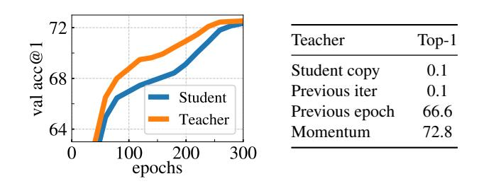
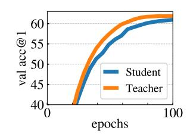

# DINO의 momentum teacher를 Polyak–Ruppert averaging으로 해석하는 이유

## 0. 한 줄 요약

DINO의 teacher는 student 가중치를 EMA로 누적한 것이다. 이는 확률적 근사(stochastic approximation)에서 SGD iterate를 평균내면 더 좋은 추정량이 된다는 **Polyak–Ruppert averaging**의 "지수 감쇠 버전"이고, 가중치 공간의 평균은 실질적으로 **여러 모델의 앙상블**처럼 작동한다. 그래서 teacher가 학습 내내 student보다 정확하고, 더 좋은 타깃을 주어 student를 끌어올린다.

---

## 1. DINO의 teacher 업데이트 규칙

논문 §3(Method)의 "Teacher network" 문단:

$$\theta_t \leftarrow \lambda\,\theta_t + (1-\lambda)\,\theta_s$$

- $\theta_s$: student 가중치(역전파로 갱신되는 쪽)
- $\theta_t$: teacher 가중치(gradient가 흐르지 않음, stop-gradient)
- $\lambda$: momentum. DINO는 학습 동안 **0.996 → 1** 로 코사인 스케줄을 따른다.

이 식을 시간 축으로 펼치면 teacher는 student의 **과거 전체 궤적에 대한 가중평균**임이 드러난다:

$$\theta_t^{(T)} = (1-\lambda)\sum_{k=0}^{T-1} \lambda^{k}\,\theta_s^{(T-k)} \;+\; \lambda^{T}\theta_t^{(0)}$$

즉 $k$스텝 전의 student에 $(1-\lambda)\lambda^k$ 라는 **지수적으로 감쇠하는 가중치**가 붙는다. $\lambda=0.996$이면 유효 평균 구간(effective window)은 대략

$$\frac{1}{1-\lambda} = \frac{1}{0.004} = 250 \ \text{iteration},$$

반감기는 $\ln 0.5/\ln 0.996 \approx 173$ iteration이다. 논문이 말하는 핵심은 이것이다 — **teacher는 "다른 네트워크"가 아니라 "최근 250 스텝쯤의 student들을 평균낸 것"**.

논문 원문:

> "we observe that this teacher performs a form of model ensembling similar to **Polyak-Ruppert averaging with an exponential decay** [51, 59]." (§3)

> "We propose to interpret the momentum teacher in DINO as a form of Polyak-Ruppert averaging [51, 59] with an exponentially decay. ... Our method can be interpreted as applying Polyak-Ruppert averaging **during** the training to constantly build a model ensembling that has superior performances." (§5.2, Analyzing the training dynamic)

---

## 2. Polyak–Ruppert averaging의 원래 맥락 (확률적 근사 이론)

여기가 이 카드의 진짜 배경 지식이다. 이 기법은 딥러닝에서 나온 게 아니라 **1988~1992년 확률적 근사(stochastic approximation) 이론**의 고전 결과다.

- Ruppert (1988), *Efficient estimations from a slowly convergent Robbins–Monro process* — 논문 참고문헌 [59]
- Polyak & Juditsky (1992), *Acceleration of stochastic approximation by averaging*, SIAM J. Control Optim. — 참고문헌 [51]

### 2.1 문제 설정

Robbins–Monro 형태의 확률적 경사법을 생각하자.

$$\theta_{k+1} = \theta_k - \gamma_k\big(\nabla F(\theta_k) + \xi_k\big),\qquad \mathbb{E}[\xi_k]=0$$

$\xi_k$는 미니배치 샘플링에서 오는 **노이즈**다. 고전적인 수렴 보장을 얻으려면 step size를 $\gamma_k \sim c/k$ 처럼 빠르게 줄여야 하는데, 이러면 수렴이 **느리고** 상수 $c$ 선택에 매우 민감하다.

### 2.2 Polyak–Ruppert의 아이디어

step size를 **더 천천히** 줄이고($\gamma_k \sim k^{-\alpha}$, $1/2<\alpha<1$ — 그래서 iterate가 최적점 주위를 크게 요동친다), 대신 **iterate 자체를 평균**낸다:

$$\bar\theta_T = \frac{1}{T}\sum_{k=1}^{T}\theta_k$$

### 2.3 결과 (왜 놀라운가)

Polyak–Juditsky의 정리는 이 단순 평균 $\bar\theta_T$가

$$\sqrt{T}\,(\bar\theta_T - \theta^\star) \;\xrightarrow{d}\; \mathcal{N}\!\big(0,\; H^{-1} S H^{-1}\big)$$

를 만족한다고 말한다($H$는 Hessian, $S$는 gradient 노이즈 공분산). 이 점근 공분산은 **문제의 정보 하한(Cramér–Rao 하한, 2차 방법이 달성할 수 있는 최적)과 같다.** 즉:

1. **최적 수렴률**: 개별 iterate $\theta_k$보다 빠른(=$O(1/\sqrt T)$의 최적 상수) 수렴.
2. **분산 감소**: 개별 iterate는 노이즈 때문에 $\theta^\star$ 주변에서 $O(\gamma_k)$ 크기로 진동하지만, 평균은 그 진동을 상쇄한다.
3. **하이퍼파라미터 둔감성**: Hessian $H$를 몰라도, learning rate를 정밀 튜닝하지 않아도 2차 방법급 효율을 얻는다("asymptotic optimality without preconditioning").

**핵심 직관**: SGD의 궤적 $\theta_1,\theta_2,\dots$은 "참값 $\theta^\star$ 주변을 노이즈와 함께 떠도는 표본"으로 볼 수 있다. 표본을 평균내면 노이즈(분산)는 상쇄되고 신호(평균 위치)는 남는다. 통계학의 표본평균 논리를 **최적화 궤적에 그대로 적용**한 것이다.

---

## 3. 왜 "지수 감쇠 버전"이어야 하는가

원래 Polyak–Ruppert는 **균등 평균**($1/T$)이고, 보통 **학습이 끝날 무렵**에 적용한다(수렴 근방에서만 이론이 성립하니까). 그런데 딥러닝 학습에서는 두 가지가 다르다.

| | 고전 Polyak–Ruppert | DINO의 EMA teacher |
|---|---|---|
| 가중치 | 균등 $1/T$ | $(1-\lambda)\lambda^k$ (최근 우대) |
| 적용 시점 | 학습 종료 후 1회 | 학습 **내내** 매 iteration |
| 대상 | 수렴한 궤적 | 아직 크게 움직이는 궤적 |
| 목적 | 최종 추정량 개선 | student의 **학습 타깃** 제공 |

균등 평균을 학습 초기부터 쓰면 **아주 나쁜 초기 가중치가 영원히 평균에 남아** teacher를 망친다. 지수 감쇠는 오래된 항을 $\lambda^k$로 잊어버리므로, "최근 $\approx 1/(1-\lambda)$ 스텝짜리 슬라이딩 윈도 평균"처럼 동작한다. 즉 **비정상(non-stationary) 궤적에 맞게 변형한 Polyak–Ruppert**다.

DINO가 $\lambda$를 0.996에서 1로 **키우는** 스케줄을 쓰는 것도 같은 논리다. 초기에는 student가 빠르게 좋아지므로 짧은 윈도(빠른 추종)가 낫고, 후기에는 윈도를 길게 늘려 더 많은 iterate를 평균 → 분산을 더 줄이는 쪽으로 간다. 이는 고전 이론의 "수렴 근방에서 긴 평균" 처방과 정확히 같은 방향이다.

---

## 4. "가중치 공간 평균 ≈ 함수 공간 앙상블"이 왜 성립하는가

카드의 답 "지수 감쇠를 동반한 가중치 평균이 **모델 앙상블과 유사한 효과**를 낸다"의 근거다. 엄밀히 말하면 신경망은 비선형이므로

$$f_{\bar\theta}(x) \;\ne\; \frac{1}{n}\sum_i f_{\theta_i}(x)$$

일반적으로 같지 않다. 그런데도 근사가 통하는 이유는 다음과 같다.

### 4.1 국소 선형 근사 (1차 논증)

평균점 $\bar\theta$ 주위에서 $\theta_i = \bar\theta + \delta_i$ ($\sum_i\delta_i = 0$)로 두고 테일러 전개하면

$$\frac{1}{n}\sum_i f_{\theta_i}(x) = f_{\bar\theta}(x) + \underbrace{\nabla_\theta f_{\bar\theta}(x)^\top \Big(\tfrac{1}{n}\sum_i\delta_i\Big)}_{=\,0} + \tfrac{1}{2n}\sum_i \delta_i^\top \nabla^2_\theta f_{\bar\theta}(x)\,\delta_i + \cdots$$

1차 항이 정확히 소거된다. 따라서 $\|\delta_i\|$가 작으면(=평균 대상들이 가중치 공간에서 서로 가까우면)

$$f_{\bar\theta}(x) \approx \frac{1}{n}\sum_i f_{\theta_i}(x) + O(\|\delta\|^2)$$

즉 **가중치 평균 모델의 출력 ≈ 앙상블 출력**. EMA는 최근 수백 스텝의 iterate만 평균하므로 이 "서로 가깝다"는 전제가 잘 성립한다(서로 다른 초기화로 독립 학습한 모델들을 가중치 평균하면 permutation symmetry 때문에 망가지는 것과 대조적이다 — EMA는 **같은 궤적** 위의 점들이라 안전하다).

### 4.2 손실 지형의 국소 볼록성 / 평평한 최소점 (2차 논증)

수렴 근방에서 손실을 2차로 근사하면 $L(\theta) \approx L(\theta^\star) + \tfrac12(\theta-\theta^\star)^\top H (\theta-\theta^\star)$, $H \succeq 0$. 이 볼록 근사 아래에서 SGD iterate들은 $\theta^\star$ 중심의 **타원형 노이즈 구름**을 이루고, 그 평균은 구름의 중심 = 더 낮은 손실 지점으로 간다. 게다가 평균은 곡률이 큰(가파른) 방향의 진동을 우선적으로 깎아내므로, 결과적으로 **더 평평한(flat) 최소점**에 놓인다. 평평한 최소점이 일반화가 좋다는 것은 널리 관찰된 사실이고, 이것이 "앙상블처럼 분산이 줄고 성능이 오른다"의 두 번째 설명이다.

### 4.3 경험적 증거

- **SWA (Stochastic Weight Averaging, Izmailov et al. 2018)**: 큰 learning rate 구간의 SGD iterate들을 단순 평균하면 개별 모델보다 일관되게 일반화가 좋아진다. 이는 Polyak–Ruppert의 딥러닝판 직접 검증이며, "가중치 평균이 더 평평한 해를 찾는다"는 해석을 실험으로 뒷받침한다.
- **Mean Teacher (Tarvainen & Valpola 2017, 논문 참고문헌 [65])**: 준지도학습에서 student의 EMA를 teacher로 써서 consistency 타깃을 만들면 성능이 크게 오른다. DINO 부록 D는 이 논문을 그대로 인용한다 — *"weight averaging usually produces a better model than the individual models from each iteration [51]"*.
- **Temporal Ensembling / EMA of weights vs. EMA of predictions**: 예측을 평균하는 진짜 앙상블(temporal ensembling)과 가중치를 평균하는 Mean Teacher가 비슷하거나 후자가 더 나은 결과를 낸다는 점이, 4.1의 근사가 실제로 잘 통한다는 방증이다.
- **BYOL/MoCo의 momentum encoder**: 같은 EMA를 쓰지만, 그 프레임워크들에서는 teacher가 student를 계속 앞선다는 현상이 관측되지 않았다(논문 §3, §5.2가 명시). DINO는 이 앙상블 이득이 **학습 내내** 나타난다는 점을 새로 보고한다.

---

## 5. 논문의 실험적 근거: teacher가 student를 계속 앞선다 (Fig. 6 left)

**왼쪽 그래프에서 실제로 관찰되는 것**(ViT-S/16, 300 epoch, ImageNet val, $k$-NN top-1):

- 주황색 **Teacher 곡선이 파란색 Student 곡선 위에 학습 처음부터 끝까지 계속 놓여 있다.** 어느 지점에서도 교차하지 않는다.
- 격차가 가장 큰 구간은 학습 중반(50~200 epoch)으로, 같은 epoch에서 teacher가 student보다 대략 1~2%p 높다. 예를 들어 100 epoch 부근에서 teacher는 68%를 넘는데 student는 아직 67% 근처다.
- 후반(≈300 epoch)에는 두 곡선이 72%대에서 거의 붙는다. $\lambda \to 1$이 되며 teacher가 student의 장기 평균으로 안정화되고, student도 수렴해 궤적의 진동 자체가 작아지므로 평균과 개별의 차이가 줄기 때문이다.

이 그림이 왜 "앙상블 해석"의 증거인가:

- teacher는 student로부터 **오로지 EMA로만** 만들어진다. 추가 데이터도, 추가 gradient도, 다른 구조도 없다(student와 teacher는 완전히 동일한 아키텍처). 그런데도 항상 더 좋다 → **성능 이득의 원천은 "평균 그 자체"밖에 없다.** 이것이 곧 앙상블 이득이다.
- 오른쪽 표는 대조군이다. teacher를 student **복사본**(Student copy)이나 **직전 iteration**으로 두면 top-1이 0.1%로 **완전 붕괴(collapse)** 한다. **직전 epoch**의 student를 쓰면 66.6%로 붕괴는 면하지만 momentum EMA의 72.8%에는 크게 못 미친다. 평균을 안 하면(복사) 무너지고, 거칠게(1 epoch 단위 스냅샷) 하면 이득이 작으며, **부드러운 지수 가중평균일 때 가장 좋다** — 4.1/4.2의 "평균 대상들이 서로 가까울수록 앙상블 근사가 잘 성립한다"는 논리와 일치한다.

부록 D의 이 그림은 ResNet-50(convnet)에서 반복한 결과로, **아키텍처와 무관하게** teacher 곡선(주황)이 student(파랑) 위에 유지된다. ViT 특유의 현상이 아니라 EMA 평균 자체의 성질임을 보인다.

---

## 6. 선순환(virtuous cycle): 왜 이것이 학습을 이끄는가

부록 D의 서술이 인과 고리를 명시한다:

> "By aiming a target obtained with a teacher better than the student, the student's representations improve. Consequently, the teacher also improves since it is built directly from the student weights."

$$\text{teacher}=\text{student 궤적의 평균} \;\Rightarrow\; \text{teacher가 더 우수} \;\Rightarrow\; \text{더 좋은 타깃} \;\Rightarrow\; \text{student 향상} \;\Rightarrow\; \text{평균도 향상}$$

여기서 결정적인 것은 **부호**다. 지식 증류(knowledge distillation)가 통하려면 teacher가 student보다 나아야 한다. DINO에는 사전 학습된 teacher가 없으므로, "student를 평균내면 student보다 낫다"는 Polyak–Ruppert의 성질이 **teacher 우위를 공짜로 보증하는 유일한 장치**다. 그래서 이 해석은 단순한 사후 비유가 아니라, DINO가 label 없이 self-distillation을 성립시키는 **메커니즘의 설명**이다.

또한 EMA는 안정성 측면의 역할도 한다. teacher가 천천히 움직이므로 타깃이 갑자기 바뀌지 않고, 이는 self-distillation에서 흔한 붕괴를 막는다. 실제로 Table 7(row 2)과 Table 15는 momentum이 없으면 프레임워크가 아예 동작하지 않고 Sinkhorn–Knopp 같은 더 강한 정규화가 필요해진다고 보고한다. 즉 momentum teacher는 **성능(앙상블 이득)과 안정성(느린 타깃)을 동시에** 준다.

---

## 7. 오해하기 쉬운 지점

- **"EMA는 그냥 학습을 부드럽게 하는 트릭"이 아니다.** 확률적 근사 이론에 근거가 있는 분산 감소 추정량이며, DINO는 그것을 최종 결과물이 아니라 **학습 중 타깃 생성기**로 쓴다는 점이 새롭다.
- **"가중치 평균 = 앙상블"은 등식이 아니라 근사다.** 4.1에서 보듯 $O(\|\delta\|^2)$ 오차가 있고, 평균 대상이 서로 멀면 깨진다. EMA가 잘 통하는 이유는 대상들이 같은 궤적 위의 인접한 점들이기 때문이다.
- **momentum encoder라는 이름은 MoCo(He et al., [33])에서 왔지만 역할이 다르다.** MoCo에서는 큐(queue)를 대체해 일관된 negative key를 만드는 장치였다. DINO에는 큐도 contrastive loss도 없으므로, 그 역할은 Mean Teacher([65])의 self-training teacher 쪽에 가깝다 — 논문 §3이 이 구분을 명시한다.
- **비용은 거의 공짜다.** EMA는 gradient를 흘리지 않는 in-place 갱신이라 순전파 1회분과 파라미터 1벌의 메모리만 더 든다. 진짜 앙상블(모델 $n$개 독립 학습)과 비교하면 훨씬 싸다.

---

## 8. 핵심 정리

| 질문 | 답 |
|---|---|
| 왜 "Polyak–Ruppert"인가? | teacher가 student **iterate들의 가중평균**이기 때문 (고전 확률적 근사의 iterate averaging과 동일한 형태) |
| 왜 "지수 감쇠 버전"인가? | 균등 평균 대신 $(1-\lambda)\lambda^k$ 가중치를 써서, 나쁜 초기 iterate를 잊고 **학습 내내** 적용 가능하게 만들었기 때문 |
| 왜 앙상블 효과가 나오는가? | 노이즈 낀 iterate 평균 → 분산 감소·평평한 해; 국소적으로 $f_{\bar\theta}\approx \frac1n\sum f_{\theta_i}$ (SWA·Mean Teacher가 실증) |
| 결과는? | teacher가 학습 내내 student보다 우수(Fig. 6 left, 부록 D) → **더 높은 품질의 타깃 특징**으로 student를 이끄는 선순환 |

**참고**: 논문 §3(Teacher network), §5.2(Analyzing the training dynamic), Fig. 6, 부록 D / 참고문헌 [51] Polyak & Juditsky 1992, [59] Ruppert 1988, [65] Tarvainen & Valpola 2017.
