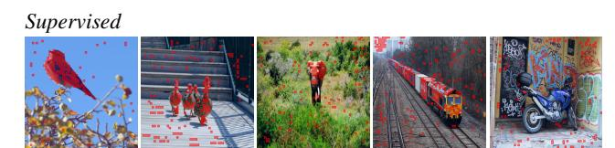

# 80% 질량 임계값 마스크의 Jaccard 비교가 시사하는 것

> 출처: Caron et al., *Emerging Properties in Self-Supervised Vision Transformers* (DINO, arXiv:2104.14294v2), **Appendix D. Additional Ablations — "Self-attention maps from supervised versus self-supervised learning"**

## 1. 한 줄 요약

self-attention map을 임계값 처리해 얻은 마스크의 품질(PASCAL VOC12 val 기준 Jaccard)은 **DINO만 높은 것이 아니라 MoCo-v2 / BYOL / SwAV까지 자기지도 방법 전반이 45~48 구간에 몰려 있다.** 반면 supervised는 27.3으로, **random weights(22.0)보다 겨우 5.3 높다.** 즉 "attention이 장면 레이아웃·객체 경계를 담는다"는 성질의 원인은 *DINO라는 특정 알고리즘*이 아니라 **자기지도 목적함수 일반 + ViT 아키텍처의 조합**이다.

논문 부록의 결론 문장 그대로:

> "The properties that self-attention maps from ViT explicitly contain the scene layout and, in particular, object boundaries **is observed across different self-supervised methods**."

Abstract도 이 층위에서 서술한다("**self-supervised ViT features** contain explicit information about the semantic segmentation of an image, which does not emerge as clearly with supervised ViTs, nor with convnets") — DINO features라고 쓰지 않았다는 점이 중요하다.

## 2. 부록 표 전체 재현 (질량 80%, ViT-S/16, VOC12 val)

| ViT-S/16 weights | Jaccard |
|---|---|
| Random weights | 22.0 |
| Supervised | 27.3 |
| **DINO** | **45.9** |
| DINO w/o multicrop | 45.1 |
| MoCo-v2 | 46.3 |
| **BYOL** | **47.8** ← 최고값 |
| SwAV | 46.8 |

읽어야 할 세 가지:

1. **DINO가 1위가 아니다.** BYOL 47.8 > SwAV 46.8 > MoCo-v2 46.3 > DINO 45.9. 차이(약 2점)가 유의한지에 대한 오차 분석은 논문에 없으므로 "사실상 동급"으로 읽는 것이 안전하다.
2. **supervised는 랜덤 초기화와 큰 차이가 없다.** 27.3 vs 22.0. 라벨 하나로 압축된 감독 신호가 attention을 객체 마스크로 정렬시키지 못한다는 뜻. (Introduction의 논지: "image-level supervision often reduces the rich visual information contained in an image to a single concept".)
3. **multi-crop 때문이 아니다.** DINO w/o multicrop 45.1로 거의 그대로다. multi-crop은 k-NN 정확도에는 크게 기여하지만(부록 E: linear +3.4%), attention의 분할 성질에는 결정적이지 않다.

## 3. 측정 방식 (Jaccard = IoU)

attention map $a \in \mathbb{R}^{N}$(패치 토큰별 [CLS] query attention)을 내림차순 정렬해, **누적 질량이 전체의 $\rho$가 될 때까지의 패치만 1로 켜서** 마스크 $M_\rho$를 만든다.

$$M_\rho=\Big\{\,i\;:\;\textstyle\sum_{j\in \text{top-}k} a_j \le \rho \sum_j a_j \Big\},\qquad \rho=0.8\ \text{(부록)} \;/\; 0.6\ \text{(Fig. 4)}$$

그 마스크와 정답 분할 $G$의 Jaccard 유사도:

$$J(M,G)=\frac{|M\cap G|}{|M\cup G|}$$

논문이 붙인 단서: "the self-attention maps are **smooth and not optimized to produce a mask**." 즉 45~48이라는 절대값은 분할 SOTA와 비교할 수치가 아니다. 의미는 **조건 간 상대 비교**에만 있다.

## 4. 본문 Figure 4와 조건이 어떻게 다른가

| | 본문 Fig. 4 (§5.1 앞) | 부록 D 표 |
|---|---|---|
| 질량 임계값 | **60%** | **80%** |
| 모델 | 표: ViT-S/16 **와** ViT-S/8 / 그림: ViT-S/8 | ViT-S/16 **만** |
| 비교 대상 | Random, Supervised, DINO **3개** | + MoCo-v2, BYOL, SwAV, DINO w/o multicrop |
| head 선택 | "we show the **best head** for both models" (그림 기준 명시) | 명시 없음 |
| 시각화 해상도 | 480p (ViT-S/8 → 3601 토큰) | 표만 있고 그림 없음 |
| 데이터셋 | PASCAL VOC12 val | 동일 |

**임계값을 바꿔도 순위가 유지되는가** — 논문은 임계값 민감도 실험을 따로 보고하지 않는다. 다만 Fig. 4 표(60% 캡션)의 ViT-S/16 행이 `22.0 / 27.3 / 45.9`이고, 부록 표(80% 캡션)의 같은 세 항목도 `22.0 / 27.3 / 45.9`로 **완전히 동일하다.** 두 캡션 중 하나가 오기이거나, 두 임계값에서 값이 같게 나온 것인데 논문은 이 일치를 설명하지 않는다(이 판단은 해석). 어느 쪽이든 결론으로 삼을 수 있는 것은 **random < supervised ≪ self-supervised 라는 순위가 두 캡션의 수치에서 동일하게 나타난다**는 사실까지다.

참고로 Fig. 4 표의 ViT-S/8 행은 `Random 21.8 / Supervised 23.7 / DINO 44.7`이다. 패치를 8로 줄여도 supervised는 오히려 랜덤에 더 가까워지고 DINO는 유지된다.

## 5. 그림에서 실제로 보이는 것

같은 5장(새, 붉은 조형물들, 코끼리, 기차, 오토바이)에 같은 60% 임계값을 적용한 결과다.

- **위(Supervised)**: 빨간 영역이 객체 위에도 조금 얹히지만 **하늘·계단·풀숲·낙서 벽 같은 배경 전체에 작은 점으로 흩뿌려진다.** 특히 3번째(풀숲 속 코끼리)와 5번째(그래피티 벽 앞 오토바이)처럼 **clutter가 심한 장면에서 붕괴**한다. 본문 표현: "a supervised ViT **does not attend well to objects in presence of clutter**."
- **아래(DINO)**: 마스크가 **객체 실루엣을 채우고 경계에서 끊긴다.** 코끼리는 풀 속에서도 몸통 윤곽이 잡히고, 기차는 선로/나무를 배제한 채 차량만, 오토바이는 배경 낙서를 무시하고 차체만 덮인다.
- 부록 표가 말하는 것은 **이 아래 그림 같은 결과가 MoCo-v2·BYOL·SwAV에서도 비슷한 Jaccard로 나온다**는 것이다(부록에는 대응 시각화가 없다 — 수치로만 뒷받침된다).

## 6. 그렇다면 DINO의 고유한 기여는 무엇인가

이 카드는 논문 해석의 **조정 포인트**다. §4.2.2/Fig. 4만 읽으면 "attention 분할 성질 = DINO의 발견"으로 오독하기 쉽지만, 부록은 그 성질을 **ViT + 자기지도 일반의 성질**로 되돌린다. 논문이 직접 DINO 고유의 것으로 주장하는 항목은 다음이다.

**(1) k-NN 성능 — 논문이 명시적으로 "DINO에서만 창발한다"고 말하는 유일한 성질**

> "DINO outperforms BYOL, MoCov2 and SwAV by +3.5% with linear classification and by **+7.9% with $k$-NN** evaluation. More surprisingly, the performance with a simple $k$-NN classifier is almost on par with a linear classifier (74.5% versus 77.0%). **This property emerges only when using DINO with ViT architectures**, and does not appear with other existing self-supervised methods nor with a ResNet-50." (§4.1)

| ViT-S (Table 2) | Linear | k-NN |
|---|---|---|
| Supervised | 79.8 | 79.8 |
| BYOL* | 71.4 | 66.6 |
| MoCo-v2* | 72.7 | 64.4 |
| SwAV* | 73.5 | 66.3 |
| **DINO** | **77.0** | **74.5** |

Jaccard에서는 47.8(BYOL) vs 45.9(DINO)로 사실상 동급인데, k-NN에서는 66.6 vs 74.5로 **8점 가까이 벌어진다.** 두 표를 나란히 놓는 것이 이 카드의 핵심이다.

**(2) 작은 패치와의 결합(“/8”)에서 나오는 세밀함**

Abstract가 꼽은 세 요소는 "momentum encoder, multi-crop training, and **the use of small patches with ViTs**"다. dense 성질에서 패치 크기 효과는 논문이 수치로 못 박는다: DAVIS-2017에서 ViT-B는 /16 → /8로 바꿀 때 $(\mathcal{J}\&\mathcal{F})_m$ **+9.1%**(62.3 → 71.4)이고, DINO ViT-S/8은 69.9로 **supervised ViT-S/8(66.0)을 앞선다.** Fig. 3의 head별 attention 시각화도 480p ViT-S/8(3601 토큰) 기준이다.

**(3) ResNet-50에서는 동급이라는 점까지 논문이 인정한다**

Tab. 13(300 epoch): ResNet-50에서 DINO 74.5/65.6 vs SwAV 74.1/65.4 — "when trained with ResNet-50 (convnet), DINO performs on par with SwAV and BYOL. However, **DINO unravels its potential with ViT**." 그리고 §4.2.2 각주 격 문장: "self-supervised convnets also contain information about segmentations but it **requires dedicated methods** to extract it from their weights." 즉 "attention을 그냥 꺼내 보면 마스크가 나온다"는 부분은 **ViT라는 아키텍처의 몫**이다.

> 정리(해석 포함): **분할 성질 = ViT + 자기지도 일반**, **k-NN 성능 = DINO 고유(논문 명시)**, **세밀함 = 작은 패치와의 결합(논문 수치로 뒷받침, 다만 "DINO만"이라는 주장은 아님)**. 이 삼분법 중 첫째·둘째는 논문 문장으로 직접 지지되고, "부록 결과 때문에 DINO의 기여가 k-NN·세밀함으로 좁혀진다"는 정리 방식 자체는 독자의 해석이다.

## 7. 확인되지 않는 것 / 조심할 점

- **학습 epoch 불일치 가능성**: 같은 부록 D의 바로 앞 항목이 "we report BYOL for 300 epochs in Tab. 2 while SwAV, MoCo-v2 and DINO are trained for **800 epochs**"라고 밝힌다(ViT-S BYOL은 300 epoch를 넘기면 성능이 떨어져서). Jaccard 표가 어느 체크포인트를 쓴 것인지는 **표에도 본문에도 명시가 없다.** Tab. 2와 같은 가중치라면 BYOL만 300 epoch, 나머지는 800 epoch로 비교된 셈이다(추정). 그럼에도 BYOL이 최고값이라는 점은, 이 지표가 학습량에 크게 좌우되지 않는다는 방향의 정황 증거다(해석).
- **head 선택 규약**: Fig. 4는 "best head"를 명시하지만 부록 표는 침묵한다. 동일 규약이라고 가정하는 것이 자연스럽지만 확인되지 않았다.
- **오차/분산 없음**: 45.9~47.8 사이 순위를 방법론 우열로 읽어서는 안 된다. seed·head 선택만으로 뒤집힐 폭이다(해석).
- **절대값의 의미**: attention map은 마스크 생성용으로 학습된 적이 없다. 45.9는 "분할 모델로 쓸 만하다"는 뜻이 아니라 "라벨 없이도 경계 정보가 들어 있다"는 존재 증명이다.

## 8. 암기 포인트

- `22.0 / 27.3` → random / supervised, **격차 5.3에 불과**
- `45.9 / 46.3 / 47.8 / 46.8` → DINO / MoCo-v2 / BYOL / SwAV, **모두 45~48, 최고는 BYOL**
- `45.1` → DINO w/o multicrop, **multi-crop 탓이 아님**
- 임계값 **80%**(부록) vs **60%**(Fig. 4), 모델은 부록이 **ViT-S/16 단일**
- 시사점: 분할 성질은 자기지도 일반 → DINO의 차별점은 **k-NN 74.5(차선 66.6, +7.9)** 와 **/8 패치의 세밀함(DAVIS +9.1)**
