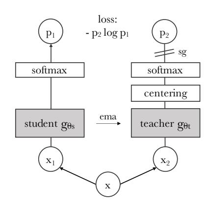
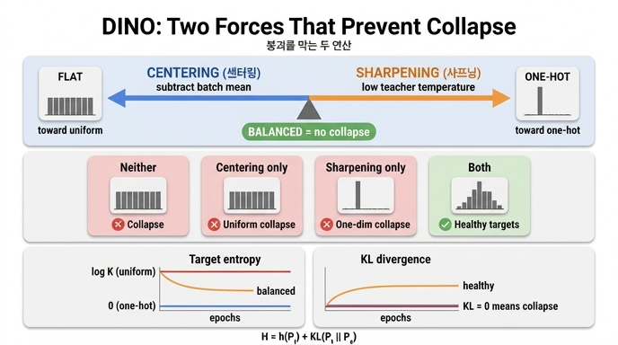

# DINO에서 붕괴를 막는 두 연산: centering과 sharpening

## 한 줄 요약

DINO는 **momentum teacher의 출력**에 **centering**(배치 평균 중심 c를 빼기)과 **sharpening**(teacher softmax 온도 $\tau_t$를 낮추기)을 함께 적용한다. 두 연산은 서로 **반대 방향**으로 밀기 때문에, 함께 쓰면 균형이 잡혀 붕괴를 막는 데 충분하다. contrastive loss, predictor, batch normalization, Sinkhorn-Knopp 같은 다른 안정화 장치가 필요 없다.

> "it can also work with only a centering and sharpening of the momentum teacher outputs to avoid model collapse. ... centering prevents one dimension to dominate but encourages collapse to the uniform distribution, while the sharpening has the opposite effect. Applying both operations balances their effects which is sufficient to avoid collapse in presence of a momentum teacher." — §3.1 "Avoiding collapse"

## 왜 붕괴가 문제인가

DINO는 라벨 없는 self-distillation이다. student $g_{\theta_s}$가 teacher $g_{\theta_t}$의 출력을 따라가도록 cross-entropy를 최소화한다.

$$\min_{\theta_s}\ H\big(P_t(x),\,P_s(x')\big),\qquad H(a,b) = -a\log b$$

여기서 "teacher를 따라 하기"만이 목적이므로, **모든 입력에 대해 양쪽이 똑같은 상수 출력을 내면 손실이 최소가 되어 버린다.** 이게 붕괴(collapse)다. 라벨도, 음성 쌍(negative pair)도 없으니 이 자명해(trivial solution)를 막을 장치가 따로 필요하다.

논문 §5.3은 붕괴가 **두 가지 형태**로 나타난다고 명시한다.

| 붕괴 형태 | 출력 분포 | teacher entropy $h(P_t)$가 수렴하는 값 |
|---|---|---|
| **한 차원 지배** (dominant dimension) | 입력과 무관하게 특정 한 차원만 1에 가까운 one-hot | $h \to 0$ |
| **균등분포** (uniform) | 입력과 무관하게 $K$개 차원이 모두 $1/K$ | $h \to -\log(1/K) = \log K$ |

## 두 연산이 각각 하는 일

### 1) Centering — "한 차원 지배"를 막는다

teacher 출력 logit에서 배치 통계로 얻은 중심 $c$(길이 $K$ 벡터)를 반영한다. 논문 본문은 bias 항을 더하는 형태 $g_t(x) \leftarrow g_t(x) + c$로 서술하고, Algorithm 1의 실제 구현은 빼는 형태다.

```python
t = softmax((t - C) / tpt, dim=1)   # center + sharpen
C = m*C + (1-m)*cat([t1, t2]).mean(dim=0)
```

$$c \leftarrow m\,c + (1-m)\,\frac{1}{B}\sum_{i=1}^{B} g_{\theta_t}(x_i)$$

- 항상 크게 나오는 차원은 $c$가 커져서 깎이므로, **특정 차원이 전체를 지배하지 못한다.**
- 대신 모든 차원을 평평하게 만드는 압력이 생기므로 **균등분포 쪽으로 붕괴를 유도**한다.
- 배치의 **1차 통계(평균)에만** 의존하고 EMA로 갱신되므로 배치 크기 의존성이 작다(배치 8까지도 학습 가능, §5.5). 다만 $m$이 너무 크면(=갱신이 너무 느리면) 붕괴한다: 부록 D에서 $m=0.999$일 때 k-NN top-1이 0.1%로 무너진다.

### 2) Sharpening — "균등분포"를 막는다

teacher softmax의 온도 $\tau_t$를 낮게 잡아 target 분포를 뾰족하게 만든다.

$$P_t(x)^{(i)} = \frac{\exp\!\big(g_{\theta_t}(x)^{(i)}/\tau_t\big)}{\sum_{k=1}^{K}\exp\!\big(g_{\theta_t}(x)^{(k)}/\tau_t\big)},\qquad \tau_t \ll \tau_s$$

- $\tau_t \to 0$이면 `argmax`, 즉 완전한 one-hot이 된다. 즉 **분포를 뾰족하게 밀어 균등분포 붕괴를 막는다.**
- 대신 그 자체로는 **한 차원 지배 쪽으로 붕괴를 유도**한다.
- 부록 D: $\tau_t > 0.06$이면 손실이 $\ln K$로 수렴하며 붕괴한다. 실전 설정은 첫 30 epoch 동안 $\tau_t$를 0.04 → 0.07로 선형 warm-up.

정리하면 **centering은 균등분포 쪽으로, sharpening은 one-hot 쪽으로 미는 반대 방향의 두 힘**이고, 둘을 함께 걸어야 어느 쪽으로도 무너지지 않는 지점에서 균형이 잡힌다.

## 근거: cross-entropy 분해와 Figure 7

논문은 두 연산의 상보성을 cross-entropy를 분해해서 보인다 (식 (5)).

$$H(P_t, P_s) = h(P_t) + D_{KL}(P_t \,\|\, P_s)$$

- $h(P_t)$: teacher target 분포의 **엔트로피** → 붕괴의 *형태*(one-hot인지 uniform인지)를 알려준다.
- $D_{KL}(P_t\|P_s)$: teacher와 student 출력의 **차이** → **KL이 0으로 수렴 = 출력이 입력과 무관한 상수 = 붕괴**의 신호.


그림에서 실제로 관찰되는 것(범례: 파란색 = sharpening만, 빨간 점선 = centering만, 주황색 = 둘 다):

- **오른쪽(KL) 패널**: 파란색과 빨간 점선 모두 학습 내내 **0에 붙어 있다.** 한 연산이라도 빠지면 teacher와 student가 똑같은 상수를 뱉는 붕괴 상태다. 반면 주황색만 초반에 1.5 근처까지 올라갔다가 1 부근을 유지한다 — student가 입력에 따라 다른, 아직 배울 게 남은 target을 받고 있다는 뜻.
- **왼쪽(target entropy) 패널**: 두 붕괴가 서로 **다른 값**으로 갈라진다.
  - 파란색(centering 없음)은 곧바로 **0**으로 떨어진다 → one-hot, 즉 **한 차원 지배 붕괴**.
  - 빨간 점선(sharpening 없음)은 위쪽 **≈8.2 = $\log K$** 선에 평평하게 붙어 있다 → **균등분포 붕괴**.
  - 주황색(둘 다)은 $\log K$에서 출발해 완만히 내려와 **1 부근**에 자리 잡는다. 0도 $\log K$도 아닌 중간 — 두 힘이 균형을 이룬 비자명(non-trivial) 상태다.

즉 "KL이 0이면 붕괴"라는 판정과 "엔트로피가 0이냐 $\log K$냐"라는 형태 구분이 한 그림에서 동시에 읽힌다.

## 파이프라인에서의 위치



teacher 가지에서만 `centering`이 `softmax` **앞**에 들어가고, 그 softmax가 낮은 온도 $\tau_t$를 쓰면서 sharpening 역할을 한다. teacher에는 `sg`(stop-gradient)가 걸려 gradient가 student로만 흐르고, teacher 파라미터는 student의 `ema`로 갱신된다.

## 놓치기 쉬운 포인트

- **"momentum teacher가 있을 때" 충분하다**는 단서가 붙는다. §5.2·부록 E(Table 15): momentum encoder 없이 student 복사본 + centering만 쓰면 top-1 0.1%로 붕괴하고, Sinkhorn-Knopp 같은 더 강한 연산이 필요하다. 즉 실제로는 **momentum teacher + centering + sharpening** 3자 조합이다.
- centering은 **teacher 출력에만** 적용된다. student는 자기 온도 $\tau_s$(0.1)로 softmax만 한다.
- 두 연산 모두 **온도/모멘텀이라는 스칼라 하이퍼파라미터 하나씩**으로 조절되고, 잘못 잡으면 붕괴한다($m=0.999$, $\tau_t>0.06$).
- centering은 배치의 1차 통계만 쓰므로 SwAV의 Sinkhorn-Knopp이나 batch 축 softmax보다 배치 의존성이 낮다. 안정성을 조금 내주고 배치 독립성을 얻는 트레이드오프다.

## 인포그래픽


