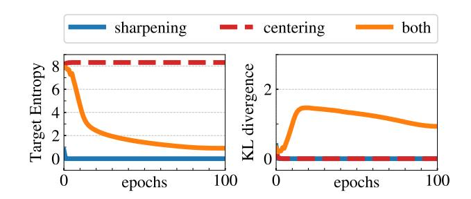
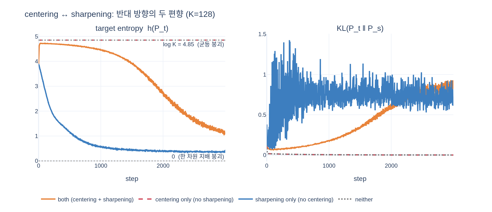

# centering과 sharpening은 각각 어떤 방향으로 편향을 만드는가?

> **답**: centering은 한 차원이 지배하는 것을 막지만 균등 분포로의 붕괴를 유도한다. sharpening은 그 반대 효과를 가진다.

DINO 논문(§3.1 *Avoiding collapse*, §5.3 *Avoiding collapse*)의 핵심 주장이다.

> *"centering prevents one dimension to dominate but encourages collapse to the uniform distribution, while the sharpening has the opposite effect. Applying both operations balances their effects which is sufficient to avoid collapse in presence of a momentum teacher."* (§3.1)

---

## 0. 두 연산이 붙는 자리


그림에서 보이듯 **centering도 sharpening도 teacher 가지에만** 들어간다. student는 그냥 softmax고,
teacher는 `centering → softmax` 순서를 거친 뒤 stop-gradient(sg)로 target이 된다.
논문의 의사코드로는 한 줄이다.

```python
t = softmax((t - C) / tpt, dim=1)   # center + sharpen
```

- `- C` 가 **centering**
- `/ tpt` (teacher temperature $\tau_t$ 를 아주 작게) 가 **sharpening**

두 연산 다 **teacher target 분포 $P_t$ 의 모양(shape)** 을 건드리는 조작이고, 서로 정반대 방향으로 민다.

---

## 1. DINO가 피해야 하는 붕괴는 두 종류다

논문 §5.3은 collapse가 **한 가지가 아니라 두 가지**라고 명시한다.

> *"There are two forms of collapse: regardless of the input, the model output is uniform along all the dimensions or dominated by one dimension."*

| 붕괴 종류 | 출력 모양 | target entropy $h(P_t)$ |
|---|---|---|
| **균등 붕괴** (uniform) | 입력과 무관하게 $(1/K, \dots, 1/K)$ | $\log K$ (논문 표기 $-\log(1/K)$) |
| **한 차원 지배 붕괴** (dominant dim) | 입력과 무관하게 one-hot | $0$ |

둘 다 "입력을 무시한 상수 출력"이라 쓸모없지만, **엔트로피 값이 정반대**라서 어떤 붕괴인지 구분할 수 있다.
이게 뒤에 나올 Figure 7의 읽는 법이다.

---

## 2. centering: 왜 "한 차원 지배"를 막는가 — 음성 피드백

centering은 teacher 로짓에 bias $c$ 를 더하는(= 빼는) 연산으로 해석된다.

$$g_t(x) \leftarrow g_t(x) + c, \qquad
c \leftarrow m\,c + (1-m)\,\frac{1}{B}\sum_{i=1}^{B} g_{\theta_t}(x_i) \quad \text{(4)}$$

$c$ 는 **배치 전체 teacher 로짓의 평균**을 EMA로 추적한 값이고, 그것을 softmax 직전에 빼준다.
따라서 다음의 **음성 피드백 루프**가 생긴다.

1. 어떤 차원 $k$ 가 배치 전체에서 계속 큰 로짓을 낸다 (지배 시작)
2. → 배치 평균 $\frac{1}{B}\sum_i g^{(k)}_{\theta_t}(x_i)$ 가 커진다
3. → EMA로 $c_k$ 가 따라 커진다
4. → 다음 스텝부터 그 차원의 로짓이 $c_k$ 만큼 **깎여서** softmax에 들어간다
5. → 지배가 억제된다

즉 **"튀는 차원을 자동으로 깎는 자기 억제 장치"** 다. 그래서 한 차원이 모든 입력을 독식하는 붕괴가 막힌다.

**그런데 왜 균등 붕괴를 유도하나?** 그 억제가 차원을 가리지 않기 때문이다.
$c$ 는 batch 전체가 공유하는 성분을 통째로 빼내므로, 남는 것은 샘플별 편차뿐이고 그 편차는 작다.
로짓들이 서로 비슷해진 상태에서 softmax를 통과하면 분포가 평평해진다.
극단적으로 모든 차원의 로짓이 같아지면 $P_t = (1/K,\dots,1/K)$, 즉 $h(P_t) = \log K$ 다.
centering은 "누구도 튀지 못하게" 만드는 힘이라, 방치하면 **아무도 튀지 않는 = 균등한** 지점으로 수렴한다.

또 하나 짚어둘 점: centering은 SwAV의 Sinkhorn-Knopp 같은 **하드 균등 제약이 아니라 1차 배치 통계만 쓰는 bias**다.
그래서 배치 크기 의존이 작고(§5.5, batch size 8까지 학습 가능) 대신 안정성을 조금 내주는 트레이드오프를 갖는다.

---

## 3. sharpening: 왜 반대 방향인가 — 차이의 증폭

sharpening은 teacher softmax의 온도 $\tau_t$ 를 **낮게** 두는 것이다.

$$P_t^{(k)}(x) = \frac{\exp\big((g_{\theta_t}^{(k)}(x) - c^{(k)})/\tau_t\big)}
{\sum_{j=1}^{K}\exp\big((g_{\theta_t}^{(j)}(x) - c^{(j)})/\tau_t\big)}$$

$\tau_t$ 로 나누는 것은 로짓 **차이를 $1/\tau_t$ 배로 뻥튀기**하는 것이다.
논문이 Appendix D에서 명시하듯 $\tau_t \to 0$ 은 `argmax` 연산, 즉 완전한 one-hot 분포에 해당한다.

- 작은 로짓 차이도 증폭 → 최댓값 차원이 확률을 거의 다 가져감 → $h(P_t) \to 0$
- 그리고 그 sharp한 target을 student가 따라가면, EMA teacher가 그것을 다시 따라가서 **양성 피드백**이 된다
- centering이 없으면 "배치가 공유하는 우세 차원"이 그대로 증폭되어 결국 **한 차원 지배 붕괴**로 간다

즉 centering이 로짓 차이를 **지우는** 힘이라면 sharpening은 로짓 차이를 **키우는** 힘이다. 정확히 반대 방향.

Appendix D의 온도 실험이 이 방향성을 수치로 보여준다: $\tau_t > 0.06$ 이면(= 충분히 sharp하지 않으면)
학습 loss가 일관되게 $\ln(K)$ 로 수렴한다 — 정확히 균등 붕괴의 값이다.
실제 구현은 첫 30에폭 동안 $\tau_t$ 를 0.04 → 0.07로 선형 warm-up 한다.
반대편 극단인 centering 쪽에서도 EMA rate $m = 0.999$ 처럼 center 갱신이 너무 느리면 붕괴한다.

---

## 4. 진단 도구: 식 (5)의 분해

논문은 cross-entropy를 두 항으로 쪼개서 두 힘을 분리해 관찰한다.

$$H(P_t, P_s) = h(P_t) + D_{KL}(P_t \Vert P_s) \quad \text{(5)}$$

- $h(P_t)$ — **teacher target 분포의 엔트로피**. 어느 방향으로 붕괴했는지를 알려준다
  ($0$ = 한 차원 지배, $\log K$ = 균등).
- $D_{KL}(P_t \Vert P_s)$ — teacher와 student의 불일치. **0이면 출력이 상수**라는 뜻이고 곧 붕괴 신호다.
  (*"A KL equal to zero indicates a constant output, and hence a collapse."*)

여기서 중요한 건 loss $H$ 를 줄이는 길이 두 가지라는 점이다.
정상적인 길은 $D_{KL}$ 을 줄여 student가 teacher를 배우는 것이고,
지름길은 $h(P_t)$ 를 뭉개서(= target을 퇴화시켜) loss를 공짜로 낮추는 것이다.
centering과 sharpening의 균형은 이 지름길을 양쪽에서 막는 장치다.

---

## 5. Collapse study (Figure 7) 읽기



논문 Figure 7은 100 에폭 동안 세 조건을 그린다 (여기서 $K = 4096$, 따라서 $\log K \approx 8.3$).

**왼쪽 패널 — target entropy $h(P_t)$**

| 곡선 | 조건 | 관찰 |
|---|---|---|
| **빨강 점선 "centering"** | centering만, sharpening 없음 | 처음부터 끝까지 **$\approx 8.3 = \log K$ 에 딱 붙어 평평** → **균등 붕괴** |
| **파랑 "sharpening"** | sharpening만, centering 없음 | 시작 직후 급락해 **0에 붙어 평평** → **한 차원 지배 붕괴** |
| **주황 "both"** | 둘 다 | 8 근처에서 출발해 20~30 에폭에 걸쳐 내려오다 **1 부근에서 완만히 유지**. 0에도 $\log K$ 에도 붙지 않는 **중간값** |

논문 문장 그대로다: *"the entropy $h$ converges to different values: 0 with no centering and $-\log(1/K)$ with no sharpening, indicating that both operations induce different form of collapse."*

**오른쪽 패널 — $D_{KL}(P_t\Vert P_s)$**

- 빨강 점선(centering만)과 파랑(sharpening만)은 **둘 다 0에 눌려 있다** → 출력이 상수, 즉 붕괴 확정.
  엔트로피가 정반대여도 KL이 0인 건 똑같다는 게 "**둘 다 붕괴지만 방향만 다르다**"는 증거다.
- 주황(both)만 0에서 떠올라 30에폭 부근 최대 $\approx 1.5$ 를 찍고 이후 $\approx 0.9$ 수준을 유지한다.
  **teacher target이 입력에 따라 실제로 달라지고, student가 아직 배울 게 남아 있다**는 뜻 — 살아 있는 학습 신호다.

**"둘 다 없음" 조건**은 논문 Figure 7에 별도 곡선으로 그려져 있지는 않다.
sharpening이 빠지면 target이 애초에 평평하므로 centering 유무와 무관하게 균등 붕괴로 가고,
빨강 점선과 사실상 겹친다 (아래 시뮬레이션에서 확인할 수 있다).

---

## 6. 정리 — 두 힘의 균형이 필요한 이유

| | 막아주는 것 | 대신 밀어붙이는 것 | $h(P_t)$ 방향 |
|---|---|---|---|
| **centering** | 한 차원 지배 | 균등 분포 | $\uparrow$ $\log K$ 쪽으로 |
| **sharpening** | 균등 분포 | 한 차원 지배 | $\downarrow$ $0$ 쪽으로 |

두 연산은 서로의 **부작용을 정확히 상쇄**한다. centering은 "누구도 독식하지 못하게" 하고,
sharpening은 "그래도 무언가는 골라내게" 한다. 한쪽만 쓰면 그 연산의 부작용 방향으로 붕괴하고,
같이 쓰면 $h(P_t)$ 가 $0$ 과 $\log K$ 사이의 중간값에서 안정되면서 $D_{KL} > 0$ 인 학습 신호가 유지된다.

단, 이 균형만으로 충분한 건 **momentum teacher가 있을 때**다.
논문은 Table 15에서 momentum encoder 없이 centering만 쓰면 top-1이 0.1%로 완전 붕괴하고
(Sinkhorn-Knopp 같은 더 강한 연산이 필요하다), momentum이 있으면 centering만으로도 76.1%가 나온다고 보고한다.
즉 **momentum teacher + centering + sharpening** 세 개가 한 세트다.

---

## 시각화

`expy.py` — $K=128$ 토이 문제에서 네 조건(both / centering only / sharpening only / neither)으로
teacher target 분포를 3000 스텝 갱신하며 $h(P_t)$ 와 $D_{KL}$ 궤적을 그린 것.
Figure 7의 정성적 패턴이 그대로 재현된다.



- **centering only(빨강 점선)·neither(회색 점선)** → $h(P_t) = 4.8520 = \log 128$ 에 정확히 고정, $D_{KL} \approx 0$ (균등 붕괴)
- **sharpening only(파랑)** → $h(P_t)$ 가 $0.37$ 까지 급락, 128개 차원 중 **6개**만 사용 (소수 차원 지배 붕괴)
- **both(주황)** → 논문 곡선처럼 완만히 내려와 $h(P_t) \approx 1.16$ ($\log K$ 의 24%)에서 버티고,
  32개 차원을 쓰며 $D_{KL} \approx 0.87 > 0$ 유지 (붕괴 없음)
