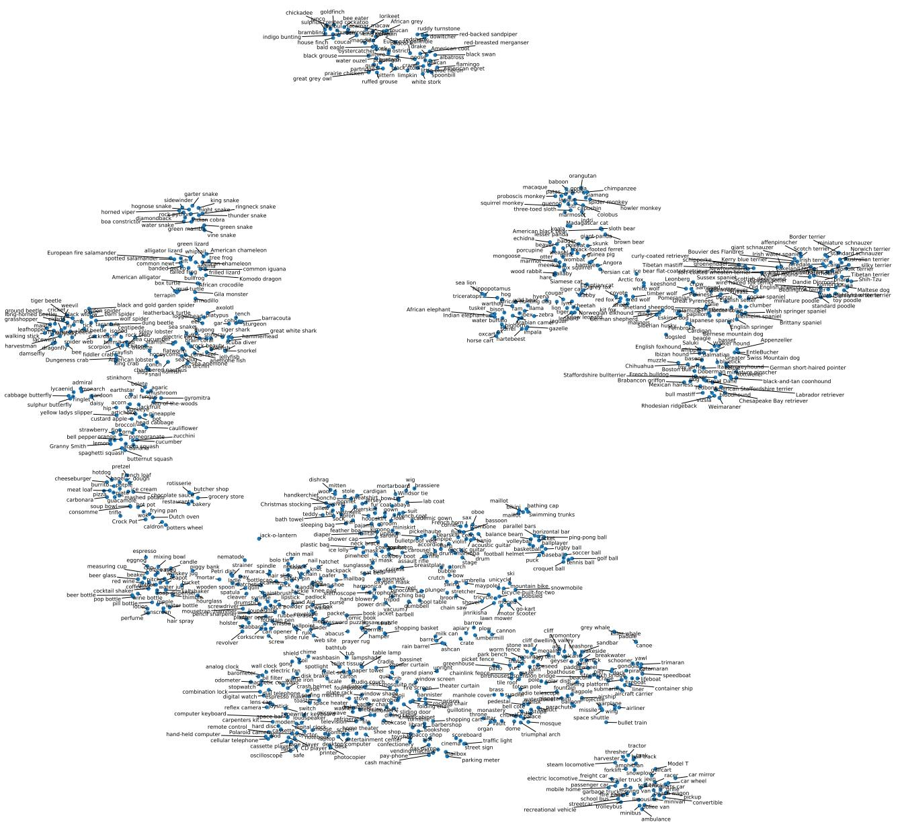
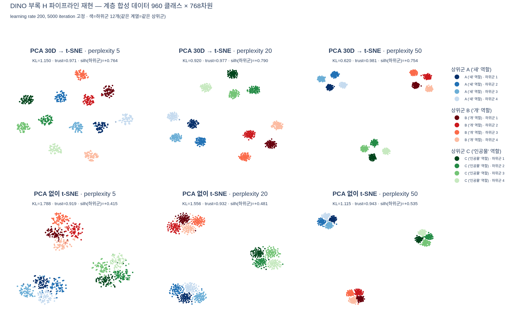

# H절 class representation 시각화는 어떻게 만들어졌는가

## 논문 원문 (부록 H)

> As a final visualization, we propose to look at the distribution of ImageNet concepts in the feature space from DINO. We represent each ImageNet class with **the average feature vector for its validation images**. We reduce the dimension of these features to **30 with PCA**, and run **t-SNE with a perplexity of 20, a learning rate of 200 for 5000 iterations**. We present the resulting class embeddings in Fig. 11. Our model recovers structures between classes: similar animal species are grouped together, forming coherent clusters of **birds (top)** or **dogs, and especially terriers (far right)**.

즉 파이프라인은 네 단계다.

```
ImageNet val 5만 장
  → DINO ViT [CLS] 특징 (클래스당 50장)
  → ① 클래스별 평균 → 1000개 점 × 768차원
  → ② PCA 30차원
  → ③ t-SNE (perplexity 20, lr 200, 5000 iter)
  → ④ 2D 산점도 + 클래스명 라벨
```

논문 본문의 실험이 아니라 **부록의 정성적 시각화**라는 점이 중요하다. 수치 벤치마크가 아니고, "라벨 없이 학습한 특징 공간에 개념 구조가 들어있다"는 주장을 눈으로 보여주기 위한 그림이다.

---

## 결과 그림 (Figure 11)



그림에서 실제로 읽히는 것들:

### 크게는 "생물 / 인공물"로 갈린다

- 위쪽·왼쪽·오른쪽 위 = **생물** (새, 파충류, 곤충, 해양생물, 균류·식물, 포유류)
- 아래쪽 절반 전체 = **인공물** (의복, 악기, 스포츠 용품, 공구, 전자기기, 가구, 건축물, 배, 차량)

두 영역이 거의 겹치지 않는다. 라벨을 한 번도 본 적 없는 모델이 만든 배치다.

### 새 — 위쪽의 독립된 섬 (논문이 말한 "birds (top)")

`chickadee, goldfinch, bee eater, lorikeet, African grey, macaw, sulphur-crested cockatoo, toucan, magpie, jay, indigo bunting, brambling, house finch, bald eagle, ostrich, black swan, albatross, pelican, flamingo, American egret, spoonbill, white stork, bittern, limpkin, great grey owl, ruffed grouse, prairie chicken, partridge, ptarmigan, red-backed sandpiper, ruddy turnstone, dowitcher, red-breasted merganser` …

새 클래스만 40개 이상이 지도 맨 위에 하나의 컴팩트한 덩어리로 뭉쳐 있고, 아래 본체와 눈에 보이는 간격으로 떨어져 있다. 안쪽을 더 보면 앵무류(lorikeet/macaw/cockatoo/African grey)가 서로 붙고, 물새류(swan/goose/drake/pelican/flamingo/heron/egret/stork)가 따로 붙는 **하위 계열까지** 보인다.

### 개 — 오른쪽 끝의 가장 크고 빽빽한 영역, 그 극단에 terrier (논문의 "dogs, and especially terriers (far right)")

지도 전체에서 점 밀도가 가장 높은 곳이 오른쪽 개 영역이다(ImageNet 1000 클래스 중 약 120개가 개 품종이니 당연하다). 그 안에서도 **가장 오른쪽 가장자리**에 terrier들이 몰려 있다.

`Border terrier, Norwich terrier, Norfolk terrier, Irish terrier, Scotch terrier, Lakeland terrier, Tibetan terrier, Yorkshire terrier, silky terrier, Kerry blue terrier` — 그리고 바로 옆에 `miniature schnauzer, giant schnauzer, standard schnauzer, affenpinscher, Shih-Tzu, Maltese dog, toy poodle, miniature poodle, standard poodle`.

terrier·슈나우저·푸들·시츄가 인접해 있는 건 우연이 아니다. 전부 **작고 털이 곱슬거나 거친 품종**이라 픽셀 통계가 비슷하다. 즉 t-SNE 지도가 잡아낸 건 순수한 계통 분류가 아니라 **시각적 외형의 유사성**이고, 그게 마침 품종 계열과 상당히 겹치는 것이다.

개 영역의 다른 쪽(왼/아래)에는 다른 계열이 따로 모인다: 사냥개·포인터 계열(`Labrador retriever, Chesapeake Bay retriever, German short-haired pointer, Weimaraner, vizsla, Rhodesian ridgeback`), 하운드(`beagle, basset, bloodhound, English foxhound, black-and-tan coonhound, whippet, Italian greyhound, borzoi, Saluki, Ibizan hound`), 마스티프·불독(`bull mastiff, Tibetan mastiff, French bulldog, Boston bull, Staffordshire bullterrier`), 스피츠·목양견(`Pomeranian, keeshond, chow, Eskimo dog, malamute, Siberian husky, Bernese mountain dog, Greater Swiss Mountain dog, EntleBucher, Appenzeller, Great Pyrenees`).

### 개로 이어지는 포유류 띠

개 영역 왼쪽으로 연속적인 포유류 대역이 있다. 위에서부터 영장류(`orangutan, gorilla, chimpanzee, gibbon, siamang, baboon, macaque, spider monkey, howler monkey, squirrel monkey, colobus, proboscis monkey, marmoset`), 곰·판다(`giant panda, lesser panda, brown bear, American black bear, ice bear, sloth bear`), 소형 포유류(`porcupine, hedgehog, echidna, mongoose, meerkat, otter, beaver, marmot, wombat, wallaby, skunk, badger, weasel, mink, polecat, guinea pig, fox squirrel`), 고양이(`Siamese cat, Persian cat, Egyptian cat, tabby, tiger cat`), 대형 고양이과(`cheetah, jaguar, leopard, snow leopard, lion, tiger, cougar, lynx`), 개과 야생종(`coyote, red wolf, white wolf, timber wolf, red fox, kit fox, Arctic fox, grey fox, dingo, dhole, African hunting dog, hyena`), 유제류(`zebra, hippopotamus, warthog, wild boar, ox, water buffalo, bison, ram, bighorn, ibex, hartebeest, impala, gazelle, Arabian camel, llama, Indian elephant, African elephant, tusker`).

**야생 개과가 집개 영역 바로 옆에 온다**는 것도 눈에 띈다.

### 그 밖의 눈에 띄는 군집

| 위치 | 군집 | 예시 |
|---|---|---|
| 왼쪽 위 | 뱀 | `garter snake, king snake, sidewinder, boa constrictor, Indian cobra, green mamba, vine snake, horned viper, diamondback` |
| 왼쪽 위-아래 | 양서류·도마뱀·거북 | `tree frog, bullfrog, common newt, European fire salamander, axolotl, American chameleon, Komodo dragon, common iguana, Gila monster, box turtle, terrapin, American alligator` |
| 왼쪽 중앙 | 곤충·거미·갑각류 | `tiger beetle, weevil, grasshopper, mantis, dragonfly, black widow, tarantula, scorpion, Dungeness crab, American lobster, crayfish, hermit crab` |
| 왼쪽 중앙 | 해양생물·수중 장면 | `great white shark, hammerhead, tiger shark, electric ray, anemone fish, lionfish, puffer, sea slug, jellyfish, starfish, sea anemone, brain coral, coral reef, snorkel, scuba diver` |
| 왼쪽 아래 | 균류 | `agaric, mushroom, bolete, coral fungus, earthstar, stinkhorn, hen-of-the-woods, gyromitra` |
| 왼쪽 아래 | 채소·과일 | `artichoke, cauliflower, broccoli, cabbage, zucchini, cucumber, bell pepper, butternut squash, spaghetti squash, Granny Smith, lemon, orange, fig, pineapple, banana, pomegranate, strawberry` |
| 왼쪽 아래 | 음식·조리도구 | `hotdog, cheeseburger, pizza, burrito, meat loaf, carbonara, guacamole, ice cream, French loaf, bagel, pretzel, trifle` → `frying pan, Dutch oven, Crock Pot, caldron, wok, coffeepot` → `bakery, grocery store, butcher shop, restaurant` |
| 아래 중앙 | 의복 | `cardigan, wool, stole, mitten, bow tie, Windsor tie, lab coat, suit, gown, mortarboard, brassiere, bikini, maillot, bathing cap, swimming trunks, kimono, poncho, fur coat, trench coat` |
| 아래 중앙 | 악기 | `oboe, bassoon, flute, French horn, trombone, sax, harmonica, accordion, violin, cello, banjo, acoustic guitar, electric guitar, drum, grand piano, marimba` |
| 아래 중앙 | 공·스포츠 용품 | `volleyball, basketball, rugby ball, soccer ball, golf ball, tennis ball, croquet ball, ping-pong ball, baseball, puck, parallel bars, balance beam, horizontal bar, football helmet, ski` |
| 아래 왼쪽 | 전자기기·시계 | `computer keyboard, cellular telephone, hand-held computer, oscilloscope, printer, photocopier, cash machine, cassette player, CD player, loudspeaker, remote control, hard disc, reflex camera, Polaroid camera, analog clock, wall clock, digital clock, stopwatch, odometer, barometer` |
| 아래 중앙-오른쪽 | 건축물·실내 | `wardrobe, bookcase, bookshop, library, barbershop, cinema, monastery, mosque, dome, triumphal arch, castle, palace, prison, greenhouse, picket fence, stone wall, tile roof, manhole cover, street sign, traffic light, mailbox, parking meter` |
| 아래 오른쪽 | 자연 경관 + 배 | `cliff, valley, promontory, alp, volcano, geyser, lakeside, seashore, sandbar, grey whale, killer whale` + `canoe, kayak, catamaran, trimaran, schooner, yawl, speedboat, gondola, lifeboat, fireboat, liner, container ship, aircraft carrier, submarine, pirate, drilling platform` |
| 아래 오른쪽 | 항공 | `airliner, warplane, airship, balloon, parachute, space shuttle, missile` |
| 오른쪽 아래 끝 | 바퀴 달린 것 | `tractor, thresher, harvester, forklift, snowplow, garbage truck, tow truck, fire engine, moving van, police van, ambulance, minivan, minibus, school bus, trolleybus, streetcar, jeep, limousine, convertible, racer, Model T, car wheel, car mirror, steam locomotive, electric locomotive, bullet train, freight car, passenger car, tank, half track` |

특히 재밌는 건 **의미적 다리(bridge)**들이다. 채소·과일 → 음식 → 조리도구 → 식당·상점이 한 줄로 이어지고, 자연 경관(해안·모래사장)과 배가 같은 구역을 공유한다. 배경 픽셀이 비슷하기 때문에(물, 바다) 자기지도 특징이 이런 **장면 단위 유사성**도 함께 잡는다는 뜻이다.

---

## 각 단계가 왜 필요한가

### ① 클래스 평균 특징 (class centroid)

$$\bar{f}_c = \frac{1}{|V_c|}\sum_{i \in V_c} f(x_i), \qquad |V_c| = 50$$

**왜 하나로 요약하나**

- **점의 수가 5만 → 1000으로 줄어든다.** t-SNE는 쌍별 이웃 확률을 다루므로 점이 적어야 5000 iteration을 돌릴 여유가 있다. 더 결정적인 이유는 **가독성**이다. Figure 11은 점마다 클래스명 텍스트를 달아야 의미가 있는 그림인데, 5만 개 점에 라벨을 달면 아무것도 읽을 수 없다. 1000개여야 "terrier가 여기 있다"를 사람이 확인할 수 있다.
- **노이즈가 $\sqrt{|V_c|}$ 배로 줄어든다.** 개별 이미지 특징은 포즈·배경·조명·크롭 때문에 크게 흔들린다. 같은 클래스 50장을 평균하면 그 무작위 성분이 $1/\sqrt{50} \approx 0.14$ 로 줄고, **클래스를 구분하는 신호만 남는다.** (`expy.py` 2단계에서 계열 kNN purity가 개별 이미지 0.41 → 클래스 평균 0.71로 오르는 것으로 확인했다.)

**대가 — 클래스 내 분산 정보를 완전히 잃는다**

- 그림은 "이 클래스가 특징 공간에서 얼마나 퍼져 있는지"를 말해주지 않는다.
- "어떤 두 클래스가 실제로 겹쳐서 서로 혼동되는지"도 말해주지 않는다. 두 중심점이 멀어도 각 클래스의 분포가 넓으면 실제로는 겹칠 수 있다.
- `Yorkshire terrier` 점 하나는 그 클래스의 **대표점**일 뿐, 그 클래스의 크기나 다양성이 아니다.
- 평균은 다봉(multi-modal) 클래스를 왜곡한다. 한 클래스에 시각적으로 아주 다른 두 유형이 있으면 평균은 **둘 중 어느 것도 아닌 중간 지점**에 놓인다.

### ② PCA 30차원 선축소

**t-SNE 원저자(van der Maaten)가 직접 권고하는 표준 관행**이다. sklearn 문서에도 "It is highly recommended to use another dimensionality reduction method (e.g. PCA for dense data) to reduce the number of dimensions to a reasonable amount (e.g. 50) if the number of features is very high"라고 적혀 있다. 이유는 셋이다.

1. **비용** — t-SNE의 첫 단계는 이웃 탐색/거리 계산이고 그 비용이 차원 $D$ 에 비례한다. 768 → 30 이면 이 단계가 통째로 싸진다. (`expy.py`: kNN 탐색 27.1 ms → 7.1 ms, 약 3.8배)
2. **노이즈 억제 — 이게 더 중요하다.** 유클리드 거리는 768개 축의 차이를 **전부 더한다**. 구조가 없는 수백 개 축의 잡음까지 합산되므로 거리 자체가 오염된다(차원의 저주: 고차원에서 모든 쌍의 거리가 비슷해지는 현상). 지배적 주성분 30개만 남기면 거리가 "구조가 있는 부분공간"에서 계산된다. (`expy.py`: 계열 kNN purity 0.71 → 0.96, t-SNE 최종 KL 1.556 → 0.920)
3. **역할 분담** — PCA는 선형·분산 최대화 축소라 **전역 구조**를 보존하고, t-SNE는 그 위에서 **국소 이웃 관계**를 비선형으로 펼친다. 순서를 바꿀 수 없는 조합이다.

30이라는 숫자는 이론값이 아니라 관행값이다(보통 30~50). 768 → 30 은 되돌릴 수 없는 손실이며, 지배적 분산 방향에 실려 있지 않은 미세 구조는 여기서 버려진다.

### ③ perplexity 20

t-SNE는 각 점 $i$ 의 가우시안 대역폭 $\sigma_i$ 를 이분탐색으로 정하는데, 그 목표값이 perplexity다.

$$p_{j|i}=\frac{\exp(-\lVert z_i-z_j\rVert^2/2\sigma_i^2)}{\sum_{k\neq i}\exp(-\lVert z_i-z_k\rVert^2/2\sigma_i^2)}, \qquad \mathrm{Perp}(P_i) = 2^{H(P_i)}, \quad H(P_i)=-\sum_j p_{j|i}\log_2 p_{j|i}$$

$\mathrm{Perp}(P_i)$ 는 **그 점이 이웃으로 고려하는 "유효 개수"**로 해석된다. 균등분포라면 perplexity는 정확히 그 이웃 개수와 같다.

- **작으면 (5)** — 아주 가까운 몇 점만 이웃으로 보므로 **국소 구조**를 강조한다. 그림이 잘게 부서지고 전역 배치는 무의미해진다.
- **크면 (50)** — 넓은 이웃을 보므로 **전역 구조**를 강조한다. 큰 덩어리로 뭉치고 미세한 하위 구조는 뭉개진다.

**1000개 점에 20은 국소 구조 쪽에 가까운 설정**이다(전체의 2%). 그래서 "개"라는 큰 덩어리 안에서 "terrier 계열"이 따로 갈라져 보이는 해상도가 나온다. perplexity를 50~100으로 올렸다면 개는 하나의 균질한 덩어리가 되어 부록의 주장("especially terriers")을 할 수 없었을 것이다.

권장 범위는 보통 5~50이고, perplexity는 점의 수보다 작아야 한다.

### ④ learning rate 200, 5000 iteration

t-SNE는 고차원 이웃 확률 $P$ 와 저차원 이웃 확률 $Q$ 사이의 KL 발산을 gradient descent로 최소화한다.

$$q_{ij}=\frac{(1+\lVert y_i-y_j\rVert^2)^{-1}}{\sum_{k\neq l}(1+\lVert y_k-y_l\rVert^2)^{-1}}$$

$$C=\mathrm{KL}(P\Vert Q)=\sum_{i\neq j}p_{ij}\log\frac{p_{ij}}{q_{ij}}, \qquad \frac{\partial C}{\partial y_i}=4\sum_{j}(p_{ij}-q_{ij})\,q_{ij}Z\,(y_i-y_j)$$

- **learning rate 200** — 위 gradient로 내려갈 때의 보폭. 너무 작으면 점들이 초기 뭉치에서 빠져나오지 못해 하나의 공처럼 압축된 그림이 나오고, 너무 크면 발산해 균등하게 흩어진 무의미한 구름이 된다. 200은 원 논문 계열의 관용값이다(sklearn의 현재 기본값은 `'auto'` $= \max(n/12,\,50)$, 1000점이면 약 83).
- **5000 iteration** — $C$ 는 **비볼록**이라 지역 최소점이 많고, 초반 250 iteration의 early exaggeration 구간(모든 $p_{ij}$ 를 인위적으로 부풀려 클러스터를 먼저 떼어놓는 단계)을 지난 뒤에도 배치가 오래 정착해야 한다. 1000점 규모에서 5000은 **수렴 여유를 충분히 준** 값이다. sklearn 기본 1000회로 끊으면 클러스터가 아직 다 분리되지 않은, 압축된 중간 상태가 나올 수 있다.

---

## ⚠️ t-SNE 그림 해석의 주의사항 (가장 흔한 오해)

t-SNE 결과에서 읽어도 되는 것은 **"어떤 점들이 함께 뭉치는가"** 하나뿐이다.

- **클러스터 사이의 거리는 의미가 없다.** t-SNE는 국소 이웃 확률만 맞추고 먼 거리는 전혀 보존하지 않는다. Figure 11에서 "새 클러스터가 개 클러스터보다 차량 클러스터에 가깝다" 같은 해석은 **근거가 없다.** (`expy.py`에서 시드만 바꿔 두 번 돌린 임베딩의 Procrustes disparity가 0.53에 달한다 — 같은 데이터인데 배치가 통째로 달라진다.)
- **클러스터의 크기(면적)도 의미가 없다.** t-SNE는 밀한 영역을 부풀리고 소한 영역을 압축한다. 개 영역이 넓은 건 개 클래스가 120개나 되기 때문이지, "개들이 특징 공간에서 넓게 퍼져 있다"는 뜻이 아니다. 게다가 각 점이 이미 클래스 평균이므로 클래스 내 분산 정보는 애초에 그림에 없다.
- **빈 공간도 의미가 없다.** 클러스터를 갈라놓는 틈은 최적화의 부산물일 수 있다.
- **하이퍼파라미터를 바꾸면 그림이 바뀐다.** perplexity 하나만 바꿔도 "무엇이 보이는 그림"인지가 달라진다.

그래서 논문이 부록 H에서 주장하는 것도 정확히 그 수준에 머문다 — "recovers structures", "grouped together", "forming coherent clusters". **뭉친다**는 사실만 말하고, 거리나 크기는 언급하지 않는다.

---

## 결과가 뜻하는 것

DINO는 **ImageNet 라벨을 단 한 번도 보지 않고** 자기지도로만 학습했다. 학습 신호는 같은 이미지의 서로 다른 crop을 teacher/student가 일치시키는 것뿐이다. 그런데도 특징 공간을 펼쳐보면:

1. **생물 분류 체계가 재현된다.** 새 / 파충류 / 곤충 / 해양생물 / 포유류가 각각 뭉치고, 포유류 안에서 영장류 / 고양이과 / 개과 / 유제류가 갈라지고, 개 안에서 terrier 계열 / 하운드 / 리트리버 / 마스티프가 다시 갈라진다. **3단 이상의 계층**이 하나의 2D 지도에 나타난다.
2. **인간의 의미 범주도 재현된다.** 악기, 스포츠 용품, 차량, 배, 건축물, 의복이 각각의 구역을 가진다.
3. **다만 그 근거는 "라벨 의미"가 아니라 "시각적 유사성"이다.** terrier·슈나우저·푸들이 붙는 것은 계통이 아니라 털 질감과 크기가 비슷해서다. 해안 경관과 배가 같은 구역인 것도 배경 픽셀이 같아서다. 자기지도 학습이 회복한 것은 **시각적 유사성의 위상 구조**이고, 인간의 분류 체계가 마침 시각적 유사성과 크게 겹치기 때문에 둘이 대응해 보인다.

이것이 DINO의 다른 결과들 — 단순 k-NN classifier만으로 ImageNet top-1 74.5%(ViT-S/16, 같은 특징의 linear 77.0%와 거의 대등), 작은 패치로는 78.3%, 그리고 라벨 없는 self-attention의 객체 분할 — 과 같은 이야기의 다른 얼굴이다. **선형 분류기나 미세조정 없이도 특징 자체가 이미 클래스 구조를 담고 있다.** kNN이 잘 되는 것과 t-SNE 지도에 계층이 보이는 것은 정확히 같은 성질이다. Figure 11은 그 성질을 숫자 대신 그림으로 보여주는 장치다.

---

## 시각화

`expy.py`는 계층 구조를 가진 합성 고차원 데이터(상위군 3 × 하위군 4 × 클래스 80 = 960 클래스 × 768차원)로 논문과 같은 파이프라인(그룹 평균 → PCA 30차원 → t-SNE)을 재현하고, perplexity 5/20/50 × PCA 유무를 교차해 6가지 결과를 비교한다.



위 줄이 논문 파이프라인(PCA 30D → t-SNE), 아래 줄이 PCA를 건너뛴 경우다. 색은 12개 하위군이고 같은 상위군은 같은 색 계열이다. 실측값:

| perplexity 20 | PCA 30D | PCA 없이 768D |
|---|---|---|
| kNN 탐색 (k=60) | **7.1 ms** | 27.1 ms |
| 전체 5000 iter | **3.97 s** | 4.19 s |
| 최종 KL | **0.920** | 1.556 |
| trustworthiness | **0.977** | 0.932 |
| 하위군 silhouette | **0.790** | 0.481 |
| 시드 간 disparity | 0.535 | **0.093** |

읽을 점 세 가지.

- **PCA가 품질을 올린다.** 위 줄은 12개 하위군이 또렷한 섬으로 갈라지는데(silhouette 0.79), 아래 줄은 하위군 4개가 서로 겹쳐 상위군 3덩어리로만 보인다(0.48). 768차원의 노이즈 축이 거리에 전부 합산된 결과다.
- **perplexity가 "보이는 층"을 결정한다.** PCA30 기준 상위군 silhouette이 perplexity 5에서 0.283, 20에서 0.653, 50에서 0.852로 오른다. 5는 국소 구조(12개 섬)만, 50은 전역 구조(3덩어리)를 강조한다. 20이 둘을 동시에 보여주는 지점이고, 이것이 논문에서 "개 덩어리 안의 terrier 계열"이 읽히는 이유다.
- **disparity가 낮은 게 좋은 게 아니다.** PCA 없는 쪽의 시드 간 disparity가 훨씬 작지만(0.093 vs 0.535), 이는 노이즈에 눌려 t-SNE가 거친 3덩어리 배치로 주저앉아 **배치의 자유도가 작기** 때문이다. PCA30은 12개 섬을 실제로 분해해내고 그것들을 평면에 늘어놓는 방법이 여러 가지라 시드마다 배열이 달라진다. **"재현성이 낮다"가 곧 "구조를 더 많이 드러냈다"일 수 있다** — 그리고 이 사실이 위의 경고("클러스터 간 거리는 의미가 없다")를 그대로 뒷받침한다.
