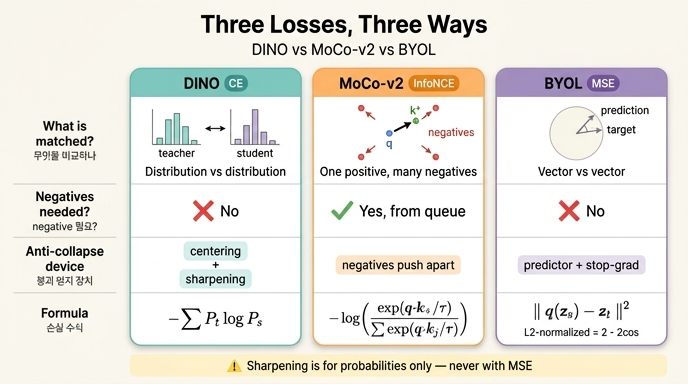

# DINO / MoCo-v2 / BYOL — 손실 함수의 차이

## 한 줄 요약

세 방법 모두 "두 뷰(view)의 표현을 맞춘다"는 목표는 같지만, **무엇을 무엇에 맞추는가**가 다르다.

| 방법 | 손실 | 비교 대상 | negative 필요? | 붕괴(collapse) 방지 장치 |
|---|---|---|---|---|
| **DINO** | CE (cross-entropy) | $K$차원 **확률분포** vs 확률분포 | ✗ | teacher 출력 **centering + sharpening** |
| **MoCo-v2** | INCE (InfoNCE) | positive 1개 vs queue의 **negative 다수** | ✓ | contrastive (negative가 밀어냄) |
| **BYOL** | MSE | $\ell_2$ 정규화 **벡터** vs 벡터 | ✗ | student **predictor** (+ head의 BN) |

DINO 논문 부록 B의 원문 표현:

> "The loss in DINO is a cross-entropy on sharpened softmax outputs (CE) while MoCo-v2 uses the InfoNCE contrastive loss (INCE) and BYOL a mean squared error on $\ell_2$-normalized outputs (MSE). **No sharpening is applied with the MSE criterion.**"

---

## 1. 수식으로 나란히 보기

### (a) DINO — sharpened softmax에 대한 cross-entropy

student/teacher 네트워크 $g_{\theta_s}, g_{\theta_t}$ 의 $K$차원 출력을 온도 softmax로 확률분포로 만든다.

$$
P_s^{(i)}(x) = \frac{\exp\!\big(g_{\theta_s}(x)^{(i)}/\tau_s\big)}{\sum_{k=1}^{K}\exp\!\big(g_{\theta_s}(x)^{(k)}/\tau_s\big)},
\qquad
P_t^{(i)}(x) = \frac{\exp\!\big((g_{\theta_t}(x)^{(i)} - c^{(i)})/\tau_t\big)}{\sum_{k=1}^{K}\exp\!\big((g_{\theta_t}(x)^{(k)} - c^{(k)})/\tau_t\big)}
$$

손실은 두 분포 사이의 cross-entropy $H(a,b) = -a\log b$:

$$
\boxed{\;\mathcal{L}_{\mathrm{DINO}} = H\big(P_t(x), P_s(x')\big) = -\sum_{i=1}^{K} P_t^{(i)} \log P_s^{(i)}\;}
$$

multi-crop을 포함한 실제 목적식 (논문 Eq. 3):

$$
\min_{\theta_s} \sum_{x \in \{x_1^g,\, x_2^g\}} \;\; \sum_{\substack{x' \in V \\ x' \neq x}} H\big(P_t(x),\, P_s(x')\big)
$$

- teacher에는 **centering** $c \leftarrow m c + (1-m)\frac{1}{B}\sum_{i=1}^{B} g_{\theta_t}(x_i)$ (Eq. 4) 와
  **sharpening**(낮은 $\tau_t$, 기본값 0.04 → 0.07로 warm-up; student는 $\tau_s = 0.1$)이 적용된다.
- teacher에는 stop-gradient(`sg`), 파라미터는 student의 EMA: $\theta_t \leftarrow \lambda\theta_t + (1-\lambda)\theta_s$, $\lambda: 0.996 \to 1$ (cosine).
- negative 샘플도, queue도, contrastive 항도 **없다**. "분포 대 분포"의 self-distillation.

붕괴 방지가 왜 되는지는 CE를 엔트로피 + KL로 쪼개면 보인다 (논문 §5.3):

$$
H\big(P_t, P_s\big) = h(P_t) + D_{\mathrm{KL}}\big(P_t \,\|\, P_s\big)
$$

- **centering** 없으면 → 한 차원이 지배 → $h \to 0$
- **sharpening** 없으면 → 균등분포로 붕괴 → $h \to -\log(1/K) = \log K$
- 둘 다 있으면 서로의 효과를 상쇄해 $D_{\mathrm{KL}} > 0$이 유지된다(= 붕괴 아님).

### (b) MoCo-v2 — InfoNCE contrastive loss

query $q$ (student/encoder 출력), positive key $k_+$ (momentum encoder 출력), 그리고 **queue에 저장된 negative** $k_1,\dots,k_N$:

$$
\boxed{\;\mathcal{L}_{\mathrm{INCE}} = -\log \frac{\exp\!\big(q\cdot k_+ / \tau\big)}{\displaystyle\sum_{j=0}^{N}\exp\!\big(q\cdot k_j / \tau\big)}\;}
$$

($j=0$이 $k_+$, 나머지는 negative. 모든 $q, k$는 $\ell_2$ 정규화되어 있어 $q\cdot k$는 코사인 유사도.)

- 이는 $(N+1)$개 클래스에 대한 softmax cross-entropy이며, 정답 인덱스가 항상 positive다.
- **negative가 필수**다. 분모의 negative 항이 표현을 서로 밀어내므로(uniformity) 붕괴가 막힌다.
- 대신 큰 negative 저장소가 필요하고(MoCo의 queue = 65536), queue의 key는 momentum encoder로 만들어 일관성을 유지한다.

### (c) BYOL — $\ell_2$ 정규화 출력에 대한 MSE

student 쪽에는 projection 뒤에 **predictor** $q_\theta$ 가 하나 더 붙는다. $\bar{v} \equiv v/\|v\|_2$ 로 쓰면:

$$
\boxed{\;\mathcal{L}_{\mathrm{BYOL}} = \big\|\, \overline{q_\theta(z_s)} - \overline{z_t} \,\big\|_2^2 \;}
$$

- negative 없음, queue 없음. 오직 "내 예측 벡터를 target 벡터에 맞춰라".
- $z_t$ 는 momentum(target) 네트워크 출력이며 stop-gradient.
- 실제로는 두 뷰를 뒤바꿔 대칭화한 $\mathcal{L} + \tilde{\mathcal{L}}$ 를 쓴다.

#### $\ell_2$ 정규화된 벡터의 MSE = 코사인 유사도 (유도)

$a = \overline{q_\theta(z_s)}$, $b = \overline{z_t}$ 라 하면 $\|a\|_2 = \|b\|_2 = 1$ 이므로

$$
\|a - b\|_2^2 = (a-b)\cdot(a-b) = \underbrace{\|a\|_2^2}_{=1} - 2\,a\cdot b + \underbrace{\|b\|_2^2}_{=1} = \boxed{\,2 - 2\,a\cdot b\,}
$$

그리고 단위벡터에서는 $a\cdot b = \cos\theta_{ab}$ 이므로

$$
\mathcal{L}_{\mathrm{BYOL}} = 2 - 2\cos\theta_{ab}
= 2 - 2\,\frac{\langle q_\theta(z_s),\, z_t\rangle}{\|q_\theta(z_s)\|_2 \cdot \|z_t\|_2}
$$

즉 **MSE 최소화 ≡ 코사인 유사도 최대화**이고, 두 손실은 상수배·상수합만큼만 다르므로 그래디언트 방향이 같다. (범위: $[0, 4]$ — 완전 일치 0, 정반대 4.)

- 그래서 BYOL의 MSE는 "회귀"라기보다 **방향 정렬(direction alignment)** 손실이다. 크기 정보는 정규화로 버려진다.
- negative가 없으므로 상수 출력(붕괴)이 자명한 해가 된다. 이를 막는 것이 **predictor + stop-gradient + momentum target**의 비대칭성이다. 논문 Table 14의 (7 vs 8)이 이를 직접 보여준다: predictor를 빼면 top-1이 **71.4 → 0.1**로 완전 붕괴.

---

## 2. "MSE를 쓸 때는 sharpening을 적용하지 않는다" — 왜?

핵심은 **sharpening이 확률분포 위에서만 정의되는 연산**이라는 점이다.

- sharpening의 정의는 softmax의 온도 $\tau$ 를 낮추는 것이다:
  $$
  P^{(i)} = \frac{\exp(g^{(i)}/\tau)}{\sum_k \exp(g^{(k)}/\tau)}, \qquad \tau \downarrow \;\Rightarrow\; \text{분포가 뾰족해짐}
  $$
  $\tau \to 0$ 이면 `argmax`, 즉 one-hot hard distribution이 된다 (논문 부록 D). 반대로 $\tau$ 가 크면 균등분포에 가까워진다.
- 즉 sharpening은 **"확률 질량을 어디에 얼마나 몰아줄지"를 조절하는 연산**이다. 대상이 $\sum_i P^{(i)} = 1,\ P^{(i)} \ge 0$ 인 simplex 위의 점이어야 "뾰족하다/평평하다"는 말 자체가 성립한다.
- 그런데 MSE 기준의 타깃은 **softmax 확률이 아니라 $\ell_2$ 정규화된 벡터**($\|z\|_2 = 1$, 성분에 음수 허용, 합이 1이 아님)다. 단위 구(sphere) 위의 방향 벡터에는 "확률 질량의 집중도"라는 개념이 없고, 온도로 나눈 뒤 다시 $\ell_2$ 정규화하면 $\overline{z/\tau} = \overline{z}$ 로 **$\tau$ 가 그대로 소거되어 아무 효과도 없다**. 정의되지 않을 뿐 아니라 적용해도 무의미하다.
- 같은 이유로 centering의 역할도 반쪽이 된다. centering은 sharpening과 짝을 이뤄야 균형이 잡히는 연산인데, sharpening을 못 쓰니 균형이 깨진다. 논문도 (7 vs 9)에서 centering만으로 BYOL의 붕괴는 막았지만 성능이 크게 떨어졌고, 이를 "our centering operator is designed to work in combination with sharpening"으로 설명한다.

정리하면: **CE 계열(softmax 확률) ↔ centering + sharpening**, **MSE 계열($\ell_2$ 벡터) ↔ predictor / negative** 라는 짝이 있고, 손실을 바꾸면 붕괴 방지 장치도 함께 갈아끼워야 한다.

---

## 3. 논문 부록 Table 14 재현 (구성요소 ablation)

> Table 14: Relation to MoCo-v2 and BYOL. 300 epochs, ViT-S/16, ImageNet linear evaluation top-1.
> ✓ = 사용, 빈칸 = 미사용. Center. = teacher 출력 centering, BN = projection head의 batch norm, Pred. = student predictor.

|  # | Method | Loss | multi-crop | Center. | BN | Pred. | Top-1 |
|---:|---|---|:---:|:---:|:---:|:---:|---:|
| 1 | **DINO** | CE | ✓ | ✓ | | | **76.1** |
| 2 | – | MSE | ✓ | ✓ | | | 62.4 |
| 3 | – | CE | ✓ | ✓ | | ✓ | 75.6 |
| 4 | – | CE | | ✓ | | | 72.5 |
| 5 | **MoCo-v2** | INCE | | | ✓ | | **71.4** |
| 6 | – | INCE | ✓ | | ✓ | | 73.4 |
| 7 | **BYOL** | MSE | | | ✓ | ✓ | **71.4** |
| 8 | – | MSE | | | ✓ | | **0.1** |
| 9 | – | MSE | | ✓ | | | 52.6 |
| 10 | – | MSE | ✓ | | ✓ | ✓ | 64.8 |

논문이 이 표에서 읽어내는 것:

1. **손실 교체의 대가** (1↔2: 76.1 → 62.4, 4↔9: 72.5 → 52.6). DINO는 CE를 MSE로 바꿔도 *놀랍게도 동작은 하지만* 성능이 크게 떨어진다. CE + sharpening 조합이 DINO 성능의 핵심.
2. **predictor는 DINO에서 거의 무의미** (1↔3: 76.1 → 75.6). 반면 **BYOL에서는 붕괴 방지에 필수** (7↔8: 71.4 → 0.1).
3. **centering은 predictor·BN 없이도 붕괴를 막는다** (7↔9: MSE에서 predictor+BN을 centering으로 대체 — 71.4 → 52.6). 붕괴는 안 하지만 성능 하락이 큰데, centering이 sharpening과 함께 쓰이도록 설계된 탓.
4. **multi-crop 궁합** — DINO(4↔1: 72.5 → 76.1)와 MoCo-v2(5↔6: 71.4 → 73.4)는 $2\text{–}4\%$ 이득. 반면 BYOL은 multi-crop을 그냥 붙이면 오히려 나빠진다(7↔10: 71.4 → 64.8). 부록 E에 따르면 학습률·weight decay·crop 수를 스윕해도 학습 도중 성능이 꺾이는 패턴이 반복됐다.

### 참고: 본문 Table 7 (같은 ablation의 축약판, k-NN 포함)

| # | Method | Mom. | SK | MC | Loss | Pred. | k-NN | Lin. |
|---:|---|:---:|:---:|:---:|---|:---:|---:|---:|
| 1 | DINO | ✓ | | ✓ | CE | | 72.8 | 76.1 |
| 2 | – | | | ✓ | CE | | 0.1 | 0.1 |
| 3 | – | ✓ | ✓ | ✓ | CE | | 72.2 | 76.0 |
| 4 | – | ✓ | | | CE | | 67.9 | 72.5 |
| 5 | – | ✓ | | ✓ | **MSE** | | 52.6 | 62.4 |
| 6 | – | ✓ | | ✓ | CE | ✓ | 71.8 | 75.6 |
| 7 | BYOL | ✓ | | | **MSE** | ✓ | 66.6 | 71.4 |
| 8 | MoCo-v2 | ✓ | | | **INCE** | | 62.0 | 71.6 |
| 9 | SwAV | | ✓ | ✓ | CE | | 64.7 | 71.8 |

(SK: Sinkhorn-Knopp, MC: Multi-Crop, Pred.: Predictor, Mom.: momentum encoder)

---

## 4. 외우기용 정리

- **DINO = CE**: $K$차원 확률분포끼리 맞춤. teacher는 centering + 낮은 $\tau_t$(sharpening). negative 없음.
- **MoCo-v2 = InfoNCE**: 하나의 positive를 queue의 수많은 negative 사이에서 골라내는 분류 문제. negative 필수.
- **BYOL = MSE**: $\ell_2$ 정규화 벡터끼리 맞춤 ($= 2 - 2\cos$, 코사인 최대화와 동등). negative 없음, predictor로 붕괴 방지.
- **sharpening은 확률분포 전용** → MSE(정규화 벡터)에는 정의되지 않으므로 안 쓴다. 온도로 나눠도 $\ell_2$ 정규화가 상쇄해 버린다.

## 인포그래픽

