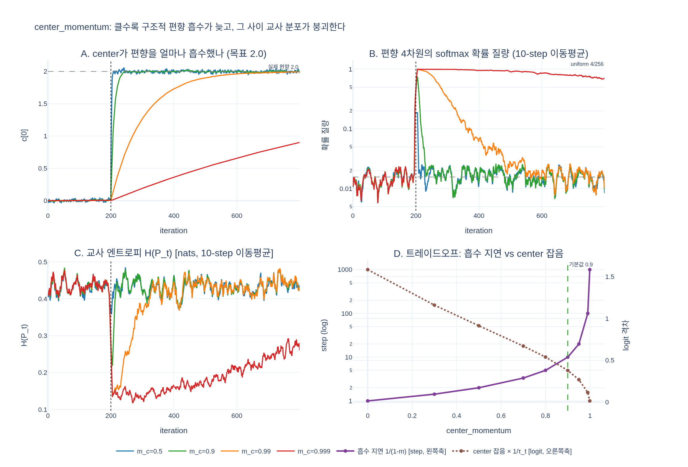

# `center_momentum`을 너무 크게 주면 어떤 문제가 생기는가?

**답**: center EMA가 배치 평균 변화를 너무 느리게 추적해 구조적 편향을 제때 흡수하지 못한다. 기본값은 `0.9`다.

---

## 1. `center`가 무엇을 하는 버퍼인가

DINO의 교사 분포는 **centering + sharpening** 두 단계를 거친다.

$$
P_t^{(u)}(k) \;=\; \frac{\exp\!\big((z_t^{(u)}(k) - c_k)/\tau_t\big)}{\sum_j \exp\!\big((z_t^{(u)}(j) - c_j)/\tau_t\big)},
\qquad \tau_t : 0.04 \to 0.07
$$

여기서 $c \in \mathbb{R}^{1 \times K}$ 가 `center`다. 이 값은 학습되는 파라미터가 아니라 **교사 출력 배치 평균의 EMA**로 매 iteration 갱신되는 버퍼다.

$$
c \;\leftarrow\; m_c\, c \;+\; (1 - m_c)\,\underbrace{\frac{1}{B\cdot W}\sum_{i=1}^{B\cdot W} z_t(i)}_{\text{이번 step 배치 평균}},
\qquad m_c = \texttt{center\_momentum} = 0.9
$$

`main_dino.py`의 구현(`DINOLoss.update_center`, 407-416행)이 정확히 이 식이다.

```python
def update_center(self, teacher_output):
    batch_center = torch.sum(teacher_output, dim=0, keepdim=True)
    dist.all_reduce(batch_center)                      # 전 GPU 합산 → W가 곱해지는 이유
    batch_center = batch_center / (len(teacher_output) * dist.get_world_size())
    # ema update
    self.center = self.center * self.center_momentum + batch_center * (1 - self.center_momentum)
```

- `register_buffer("center", torch.zeros(1, out_dim))` — 학습 대상이 아니고, state_dict에 실려 체크포인트에 저장된다.
- `all_reduce`가 있으므로 프로세스 그룹 초기화 없이는 `DINOLoss`가 돌지 않는다(walkthrough §6, 실전 함정 6번).

`center`의 역할은 하나다. **어떤 프로토타입 차원의 logit이 구조적으로(= 입력과 무관하게, 모든 샘플에서) 높아지려는 경향을 빼서 상쇄하는 것.** 그 편향을 방치하면 그 차원이 배치를 독식하는 **단일 프로토타입 붕괴**가 일어난다.

| 붕괴 유형 | 증상 | 막는 장치 |
|---|---|---|
| uniform collapse | $P_t \to 1/K$, $H(P_t) \to \log K$ | **sharpening** ($\tau_t < \tau_s$) |
| **단일 프로토타입 collapse** | $P_t \to$ 항상 같은 one-hot, $H(P_t) \to 0$ | **centering** ($z_t - c$) |

## 2. $m_c$가 정하는 것: EMA의 시간상수

EMA는 저역통과 필터다. 배치 평균이 갑자기 $\delta$ 만큼 계단식으로 튀었다고 하면, $t$ step 뒤 center에 반영된 양은

$$
c(t) \;=\; \big(1 - m_c^{\,t}\big)\,\delta
\qquad\Longrightarrow\qquad
\text{미흡수 잔여 편향} \;=\; m_c^{\,t}\,\delta
$$

시간상수는 $\tau \approx \dfrac{1}{1-m_c}$ step, 90% 흡수까지는 $t_{90} = \dfrac{\ln 0.1}{\ln m_c}$ step이다.

| $m_c$ | 시간상수 $1/(1-m_c)$ | $t_{90}$ | 10 step 뒤 잔여 편향 |
|---|---|---|---|
| 0.5 | 2 step | 4 step | 0.1% |
| **0.9 (기본값)** | **10 step** | **22 step** | **35%** |
| 0.99 | 100 step | 229 step | 90% |
| 0.999 | 1000 step | 2301 step | 99% |

`m_c = 0.999`면 center는 사실상 **1000 step 전의 배치 평균**을 들고 있다. 배치 크기 64 · 8 GPU 기준 1000 step은 ImageNet 반 epoch 가까이다. 그 사이에 head의 마지막 층이 특정 프로토타입 쪽으로 기울어져도 center는 여전히 옛날 평균을 빼고 있으니 **centering이 사실상 꺼진 것과 같다.**

## 3. 지연이 왜 단순한 "늦음"으로 끝나지 않는가

두 가지 증폭 요인이 붙는다.

**(a) sharpening이 잔여 편향을 25배로 키운다.** 교사 softmax는 $\tau_t = 0.04$로 나눈다. 미흡수 편향 $\delta_{\text{res}}$는 logit 차이로 $\delta_{\text{res}}/0.04 = 25\,\delta_{\text{res}}$ 만큼 벌어진다. $\delta_{\text{res}} = 0.5$만 남아도 exponent 차이가 12.5 — $e^{12.5} \approx 2.7\times10^5$ 배다. 편향 차원이 확률 질량을 전부 먹는다. 즉 "조금 늦게 흡수한다"가 "그동안 교사 분포는 이미 one-hot"을 뜻한다.

**(b) 붕괴는 자기강화 루프다.** 편향 차원이 교사 타겟에서 질량을 독식하면 → cross-entropy가 학생을 그 차원으로 밀고 → EMA 교사가 학생을 따라가므로 교사의 편향이 **더 커지고** → 다음 step의 배치 평균 편향이 더 커진다. center가 뒤늦게 따라잡으려는 목표 자체가 도망간다. 그래서 흡수 지연은 "$t_{90}$ step 뒤 정상화"가 아니라 "그 사이에 붕괴가 자리를 잡음"으로 끝날 수 있다.

$H(P_t, P_s) = H(P_t) + D_{\mathrm{KL}}(P_t \Vert P_s)$ 분해에서 보듯 붕괴는 **loss를 더 잘 낮춘다**. 사전학습에는 검증이 없으므로(walkthrough §11) loss 곡선만 보면 이걸 "학습이 잘 된다"로 오독한다.

## 4. 반대쪽: 너무 작게 주면?

$m_c \to 0$ 이면 $c \approx$ **이번 배치의 평균 그 자체**다.

- 지연은 사라지지만 center가 **배치 표집 노이즈를 그대로 물고 흔들린다.** 정상 상태 지터의 표준편차는 대략 $\sigma_{\text{center}} \approx \dfrac{\sigma}{\sqrt{B W}}\sqrt{\dfrac{1-m_c}{1+m_c}}$ 이다.
- 매 step 배치 평균을 통째로 빼는 것은 배치 단위 정규화에 가까워져, 같은 이미지의 교사 타겟이 **어떤 배치에 묶였는지에 따라 달라진다.** 타겟이 요동하면 EMA 교사가 주는 안정성이 무너지고, $\tau_t$로 25배 증폭되므로 노이즈도 25배로 들어온다.
- 또 배치 평균을 완전히 제거하는 방향은 uniform 쪽으로 미는 힘이라, sharpening과의 균형점이 흐트러진다.

그래서 $m_c$는 **지연(bias) ↔ 잡음(variance)의 트레이드오프**이고, 0.9 (시간상수 10 step)가 "배치 노이즈는 평균 내고 실제 편향 드리프트는 놓치지 않는" 지점으로 논문의 기본값이다. `--center_momentum`은 `main_dino.py`의 CLI 인자로 노출조차 되지 않는다 — 건드릴 파라미터로 상정되어 있지 않다.

## 5. `momentum_teacher`와 혼동하지 말 것

이름이 비슷한 EMA가 두 개 있다. 방향이 반대다.

| | `center_momentum` | `momentum_teacher` |
|---|---|---|
| 대상 | `DINOLoss.center` (교사 출력 배치 평균) | teacher **가중치** |
| 기본값 | 0.9 (고정) | 0.996 → 1.0 (cosine 상승) |
| 시간상수 | 10 step | 250 step → ∞ |
| 너무 크면 | 편향 추적 실패 → 단일 프로토타입 붕괴 | (스케줄상 의도된 방향) |
| 너무 작으면 | center 잡음 → 타겟 요동 | 타겟 요동 → 붕괴 |

`center`는 **빠르게 따라가야 하는** EMA(그래서 0.9), teacher 가중치는 **느리게 따라가야 하는** EMA(그래서 0.996↗1)다. 큰 momentum이 항상 안정성을 뜻하는 게 아니라는 점이 요지다.

## 6. 무엇을 보고 진단하는가

`center_momentum`이 커서 centering이 무력해졌는지는 loss로는 안 보인다. 봐야 하는 양들:

| 진단량 | 정의 | 붕괴 신호 |
|---|---|---|
| 교사 엔트로피 | $H(P_t) = -\sum_k P_t(k)\log P_t(k)$ | $\to 0$ (단일 프로토타입) |
| 교사 top-1 확률 | $\max_k P_t(k)$ | $\to 1$ |
| argmax 다양성 | 배치 내 서로 다른 argmax 개수 | $\to 1$ |
| `\|\|center\|\|` | $\lVert c \rVert_2$ | 정체(= 추적 실패) 또는 발산 |

특히 **배치 평균은 계속 커지는데 $\lVert c \rVert_2$ 는 거의 안 움직이는** 상황이 $m_c$ 과다의 직접 증거다.

## 참고

- 논문: [Emerging Properties in Self-Supervised Vision Transformers (arXiv:2104.14294)](https://arxiv.org/abs/2104.14294) — §3 "Avoiding collapse", Fig. 5
- 구현: `main_dino.py` `DINOLoss.__init__` / `DINOLoss.update_center`
- walkthrough: `dino_training_walkthrough.py` §6(수식·구현), §7(붕괴 두 방향 실험), §11(진단량), §12(하이퍼파라미터 표)
- [Review — DINO (Sik-Ho Tsang)](https://sh-tsang.medium.com/review-dino-emerging-properties-in-self-supervised-vision-transformers-cfddbb4d3549)
- [DINO as a von Mises-Fisher mixture model (arXiv:2405.10939)](https://arxiv.org/pdf/2405.10939)

## 시각화


