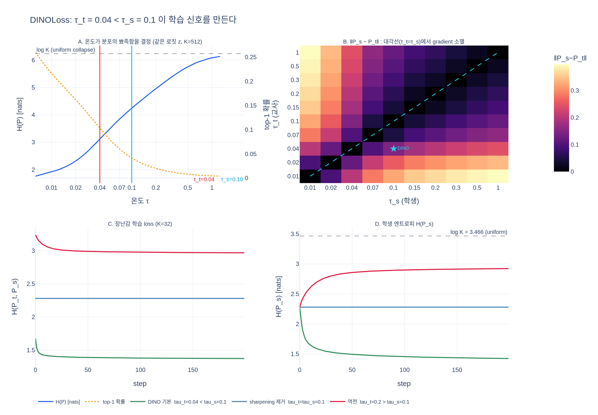

# DINOLoss의 `student_temp` / `teacher_temp` 기본값과 부등호

## 한 줄 답

$$
\tau_s = 0.1\ \text{(고정)},\qquad \tau_t = 0.04\ (\rightarrow \texttt{teacher\_temp})
$$

$\tau_t < \tau_s$ **여야** 교사가 학생보다 확신에 찬(뾰족한) 분포를 내고, 그래야 학습 신호가 생긴다.

---

## 1. 기본값이 코드 어디서 오는가

| 값 | 어디서 | 비고 |
|---|---|---|
| $\tau_s = 0.1$ | `main_dino.py:365` `DINOLoss.__init__(..., student_temp=0.1, ...)` | **CLI 인자가 없다.** 코드 기본값으로 사실상 고정 |
| $\tau_t$ 시작 = 0.04 | `main_dino.py:68` `--warmup_teacher_temp` default `0.04` | help: "0.04 works well in most cases" |
| $\tau_t$ 끝 = 0.04 | `main_dino.py:71` `--teacher_temp` default `0.04` | help: "anything above 0.07 is unstable" |
| warmup 길이 = 0 | `main_dino.py:74` `--warmup_teacher_temp_epochs` default `0` | docstring에는 "Default: 30" 이라 적혀 있지만 실제 default는 0 |

즉 **아무 인자도 안 주면 $\tau_t$ 는 전 구간 0.04 상수**다.
논문/`SAMPLES.md` 권장 설정은 `--teacher_temp 0.07 --warmup_teacher_temp_epochs 30`
(0.04 → 0.07 선형 warmup). 어느 쪽이든 $\tau_t \le 0.07 < 0.1 = \tau_s$ 로 부등호는 유지된다.

`DINOLoss.forward` 에서 실제로 쓰이는 자리:

```python
student_out = student_output / self.student_temp          # main_dino.py:384   (τ_s = 0.1)
temp = self.teacher_temp_schedule[epoch]                  # main_dino.py:388
teacher_out = F.softmax((teacher_output - self.center) / temp, dim=-1)   # :389  (τ_t)
teacher_out = teacher_out.detach().chunk(2)               # :390   ← gradient는 학생에게만
loss = torch.sum(-q * F.log_softmax(student_out[v], dim=-1), dim=-1)     # :399
```

$$
P_s^{(v)}(k) = \frac{\exp(z_s^{(v)}(k)/\tau_s)}{\sum_j \exp(z_s^{(v)}(j)/\tau_s)},
\qquad
P_t^{(u)}(k) = \frac{\exp\big((z_t^{(u)}(k) - c_k)/\tau_t\big)}{\sum_j \exp\big((z_t^{(u)}(j) - c_j)/\tau_t\big)}
$$

---

## 2. 온도가 하는 일: 로짓은 코사인이라 $[-1, 1]$ 밖에 안 된다

`DINOHead.forward`(`vision_transformer.py:287-291`)는

```python
x = self.mlp(x)
x = nn.functional.normalize(x, dim=-1, p=2)   # 특징을 단위벡터로
x = self.last_layer(x)                        # weight_norm, weight_g.fill_(1) → 행도 단위벡터
```

이므로 로짓 $z(k) = \cos(\text{feature}, w_k) \in [-1, 1]$ 이다.
**로짓 스케일이 이렇게 작기 때문에 온도가 유일한 sharpening 손잡이**가 된다.
$\tau = 1$ 이면 로짓 차이가 최대 2뿐이라 softmax는 거의 uniform이고, $H(P) \approx \log K$ 다.

같은 로짓 $z$ 하나(K=512, $\log K = 6.238$)에 온도만 바꿔 본 실측(→ `expy.py` §1):

| $\tau$ | $H(P)$ [nats] | $H/\log K$ | top-1 확률 | 유효 클래스 $e^{H}$ |
|---|---|---|---|---|
| 1.00 | 6.085 | 0.975 | 0.0045 | 439 |
| **0.10** ($\tau_s$) | 4.245 | 0.681 | 0.0415 | 70 |
| 0.07 | 3.839 | 0.615 | 0.0604 | 47 |
| **0.04** ($\tau_t$) | 3.113 | 0.499 | 0.1029 | 23 |
| 0.01 | 1.914 | 0.307 | 0.2166 | 7 |

온도 하나로 "유효 클래스 수"가 439 → 7 까지 움직인다.
노트북 §7 패널 A의 요지 — **$\tau_t$ 만으로 교사 엔트로피가 $0$ 과 $\log K$ 사이 어디든 갈 수 있다.**

---

## 3. 왜 부등호가 중요한가: gradient $\propto (P_s - P_t)$

DINO 손실 한 항은 $\mathcal{L} = -\sum_k P_t(k)\log P_s(k)$ 이고 $P_t$ 는 `.detach()` 되어 있다.
softmax-교차엔트로피의 표준 결과로, **학생 로짓**에 대한 gradient는

$$
\frac{\partial \mathcal{L}}{\partial z_s(k)} = \frac{1}{\tau_s}\Big(P_s(k) - P_t(k)\Big)
$$

여기가 핵심이다. 학습 초기 EMA 교사는 학생의 복사본($m \to 1$ 로 천천히 따라가지만 시작은 동일 파라미터)이라
**$z_t \approx z_s = z$ 로 로짓이 같다.** 그러면 $P_t$ 와 $P_s$ 를 구별하는 것은 **오직 온도**뿐이다.

| 관계 | $P_t$ vs $P_s$ | gradient | 결과 |
|---|---|---|---|
| $\tau_t < \tau_s$ | 교사가 더 **뾰족** | $\ne 0$, 학생을 교사 peak 쪽으로 | **정상 학습** (sharpening) |
| $\tau_t = \tau_s$ | **완전히 동일** | **정확히 0** | 학습 신호 소멸, 정지 |
| $\tau_t > \tau_s$ | 교사가 더 **평평** | $\ne 0$, 학생을 uniform 쪽으로 | **uniform 붕괴** |

같은 $z$ 로 $(\tau_t, \tau_s)$ 격자를 채워 $\lVert P_s - P_t \rVert_2$ 를 잰 결과(→ `expy.py` §2):

| $\tau_t \backslash \tau_s$ | 0.01 | 0.04 | **0.10** | 0.20 | 1.00 |
|---|---|---|---|---|---|
| 0.01 | **0.0000** | 0.2012 | 0.3231 | 0.3666 | 0.3969 |
| **0.04** | 0.2012 | **0.0000** | **0.1455** | 0.2008 | 0.2430 |
| **0.10** | 0.3231 | 0.1455 | **0.0000** | 0.0628 | 0.1217 |
| 0.20 | 0.3666 | 0.2008 | 0.0628 | **0.0000** | 0.0683 |
| 1.00 | 0.3969 | 0.2430 | 0.1217 | 0.0683 | **0.0000** |

**대각선이 전부 정확히 0** 이다. DINO 기본값 $(\tau_t, \tau_s) = (0.04, 0.1)$ 은 대각선에서 떨어져 있어
$\lVert P_s - P_t \rVert = 0.1455$, gradient 노름 $= 0.1455/0.1 = 1.455$ 를 만든다.

### 교차엔트로피 분해로 다시 보기

$$
H(P_t, P_s) = \underbrace{H(P_t)}_{\text{교사 분포 엔트로피}} + \underbrace{D_{\mathrm{KL}}(P_t \Vert P_s)}_{\text{두 view 정렬}}
$$

$\tau_t = \tau_s$ 이면 $P_t = P_s$ 라 $D_{\mathrm{KL}} = 0$ 이고 손실이 곧 $H(P_s)$ 다.
실제 DINO는 초기 코사인 로짓의 분산이 아주 작아 $H(P_s) \approx \log K$ 이므로,
**손실이 $\log K$ 평탄면에 앉아 있는데 gradient가 없는 상태**가 된다.

| $\tau_t$ | $H(P_t)$ | $D_{\mathrm{KL}}(P_t \Vert P_s)$ | $H(P_t,P_s)$ | 판정 |
|---|---|---|---|---|
| 0.01 | 1.914 | 1.30648 | 3.220 | 정상 (교사가 더 확신) |
| 0.04 | 3.113 | 0.40447 | 3.518 | **정상 — DINO 기본** |
| 0.07 | 3.839 | 0.06563 | 3.904 | 정상 (논문 권장 최종값) |
| **0.10** | 4.245 | **0.00000** | 4.245 | **신호 소멸** |
| 0.20 | 4.959 | 0.30967 | 5.268 | uniform 쪽으로 밀림 |
| 0.50 | 5.759 | 2.06264 | 7.821 | uniform 쪽으로 밀림 |

$\tau_t > \tau_s$ 에서 KL이 다시 커지는 것은 "신호가 있다"가 아니라
**학생을 더 평평하게 만드는 방향의 신호**라는 뜻이다. 방향이 반대다.

---

## 4. 노트북 §11 실측과의 연결

`dino_training_walkthrough.py` §11은 같은 미니 학습 루프를 세 설정으로 돌린다.

| 설정 | centering | $\tau_t$ | 결과 |
|---|---|---|---|
| DINO | O | 0.04 | loss는 $\log K$ 근처에 머물지만 $H(P_t)$ 가 확실히 그 아래에서 안정 |
| centering 제거 | X | 0.04 | loss가 **가장 많이** 떨어지는데 이게 단일 프로토타입 붕괴 |
| **sharpening 제거** | O | **0.10 ($=\tau_s$)** | **loss가 $8.332 \to 8.331$ 에서 꼼짝 안 함** |

$\log 65536 = 8.3178$ 이다. 세 번째 줄의 8.332는 그 $\log K$ 평탄면 자체이고,
0.001 만큼의 변화는 gradient가 아니라 EMA/수치 노이즈다.
**교사와 학생이 같은 온도라 gradient가 사라진, 정확히 §3 대각선의 상황.**

`expy.py` §3의 장난감(K=32, 고정 입력 $x$, 행이 단위벡터인 선형 학생, 교사 로짓은 초기 학생 로짓으로 고정)에서 200 step:

| 설정 | loss 처음→끝 | $H(P_s)$ 처음→끝 | step 0 gradient 노름 |
|---|---|---|---|
| $\tau_t=0.04 < \tau_s=0.1$ | 1.6775 → 1.3750 | 2.2806 → **1.4245** (sharpen) | 3.11e+00 |
| $\tau_t = \tau_s = 0.1$ | 2.2806 → **2.2806** | 2.2806 → **2.2806** | **2.41e-07** |
| $\tau_t=0.2 > \tau_s=0.1$ | 3.2397 → 2.9674 | 2.2806 → **2.9231** ($\log K = 3.466$ 쪽) | 1.54e+00 |

두 번째 줄은 소수점 6자리까지 **완전 정지**한다(전 구간 최대 gradient 노름 8.2e-07 = float 오차).
세 번째 줄은 학생 엔트로피가 $\log K$ 쪽으로 올라간다 — uniform 붕괴 방향이다.

---

## 5. 스케줄: 왜 0.04에서 시작해 0.07을 넘지 않나

```python
# main_dino.py:374-378
self.teacher_temp_schedule = np.concatenate((
    np.linspace(warmup_teacher_temp, teacher_temp, warmup_teacher_temp_epochs),
    np.ones(nepochs - warmup_teacher_temp_epochs) * teacher_temp
))
```

- **왜 낮은 온도에서 시작하나**: 초반 학생은 아무것도 모르니 교사도 아무 근거 없이 뾰족하다.
  그래도 낮은 $\tau_t$ 가 필요한 이유는 gradient 크기 때문이 아니라 **부등호를 확실히 벌려두기 위해서**다.
  $\tau_t$ 가 $\tau_s$ 에 가까울수록 신호가 약해지므로, 초기에 가장 크게 벌려 놓는다.
- **왜 올릴 때 0.07을 안 넘나**: `--teacher_temp` help가 "For most experiments, anything above 0.07 is unstable"
  이라고 못 박는다. 0.1에 도달하면 $\tau_t = \tau_s$ 가 되어 학습이 아예 멈춘다.
  즉 0.07은 "$\tau_s = 0.1$ 에 너무 가까워지지 않는 안전 마진"이기도 하다.
- **왜 나중엔 올리나**: 학습이 진행되면 교사가 실제로 의미 있는 프로토타입을 갖게 되므로
  타겟을 조금 부드럽게 해서 과도한 확신을 줄인다.

| | warmup 시작 | 최종 | $\tau_t/\tau_s$ 최대 |
|---|---|---|---|
| `main_dino.py` 기본값 | 0.04 | 0.04 (상수) | 0.40 |
| 논문 권장 | 0.04 | 0.07 (30 epoch warmup) | 0.70 |

---

## 6. sharpening과 centering은 짝이다

$\tau_t < \tau_s$ 는 **"sharpening" 장치의 본체**다. 그런데 sharpening만 있으면 반대쪽으로 붕괴한다.

| 붕괴 유형 | 증상 | 막는 장치 |
|---|---|---|
| uniform collapse | $P_t \to 1/K$, $H(P_t) \to \log K$ | **sharpening** ($\tau_t < \tau_s$) |
| 단일 프로토타입 collapse | $P_t \to$ 항상 같은 one-hot, $H(P_t) \to 0$ | **centering** ($z_t - c$, EMA $m_c=0.9$) |

두 힘은 **서로 반대 방향으로 민다** — sharpening은 one-hot 쪽, centering은 uniform 쪽.
DINO의 학습은 이 둘 사이 좁은 구간에 **매달려 있는** 상태다(논문 Fig. 5).
노트북 §7 패널 C가 보여주듯 centering은 엔트로피를 올려주지 않으므로
**두 장치는 서로를 대체하지 못한다.**

---

## 7. 외우는 법

> **낮은 온도 = 확신. 교사가 더 확신해야 학생이 배울 게 생긴다.**
> $\tau_t = 0.04 < \tau_s = 0.1$. 같으면 $P_t = P_s$ 라 gradient가 0이고,
> 뒤집히면 학생이 uniform으로 밀려 붕괴한다.

숫자만 기억한다면: **0.04 / 0.1**, 그리고 $\tau_s$ 는 **CLI 인자가 없다**는 것.

---

## 시각화



- **A** — 같은 로짓에 온도만 바꿔 엔트로피와 top-1 확률을 잰 곡선. $\tau_t=0.04$ 와 $\tau_s=0.1$ 세로선 사이의 간격이 곧 "교사가 학생보다 확신에 차 있는 정도"다.
- **B** — $(\tau_t, \tau_s)$ 격자의 $\lVert P_s - P_t \rVert$ 히트맵. **대각선(검은 띠)이 gradient 소멸 지대**이고, DINO 기본값(★)은 거기서 벗어나 있다.
- **C** — 장난감 학습의 loss 궤적. $\tau_t=\tau_s$(파랑)만 완전히 수평 — 노트북 §11의 "8.332 → 8.331"과 같은 현상.
- **D** — 학생 엔트로피 궤적. $\tau_t<\tau_s$(초록)는 내려가고(sharpen), $\tau_t>\tau_s$(빨강)는 $\log K$ 쪽으로 올라간다(uniform 붕괴 방향).
