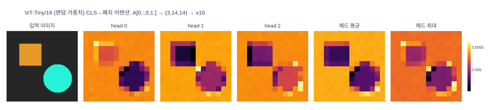

# 마지막 블록 어텐션에서 CLS 히트맵 만들기

> **Q.** 마지막 블록 어텐션에서 CLS 히트맵을 만드는 절차는?
>
> **A.** $A^{(h)} = \mathrm{softmax}(q^{(h)}k^{(h)\top}/\sqrt{d_h})$ 에서 $a^{(h)} = A^{(h)}[0, 1:]$ 를 꺼내
> $\sqrt{P}\times\sqrt{P}$ 로 reshape하고 `patch_size` 배 업샘플한다.

DINO의 대표 결과 — **레이블 없이 학습한 ViT의 `[CLS]` 어텐션이 객체 경계를 따라간다** — 를
그림으로 만드는 파이프라인이다. 코드로는 다섯 줄이지만, 각 줄이 왜 그 모양인지가 핵심이다.

---

## 1. 절차 전체 — shape 표

기준: ViT-S/16, 입력 $224\times224$ (헤드 6개). 실제 코드는
[`visualize_attention.py`](../../../../../visualize_attention.py) 의 본문 그대로다.

| # | 연산 | 결과 shape | 설명 |
|---|---|---|---|
| 0 | 입력 이미지 | $(1, 3, 224, 224)$ | ImageNet 통계로 정규화, 각 변이 `patch_size` 배수 |
| 1 | `prepare_tokens` (패치화 + CLS + pos-emb) | $(1, 197, 384)$ | $P = (224/16)^2 = 196$, 토큰 $N = 1 + P = 197$ |
| 2 | `model.get_last_selfattention(img)` | $A \in \mathbb{R}^{(1,\,6,\,197,\,197)}$ | **마지막 블록**의 softmax 후 어텐션 |
| 3 | `attentions[0, :, 0, 1:]` | $(6, 196)$ | 배치 0 / 모든 헤드 / query=CLS / key=패치 |
| 4 | `.reshape(nh, w_featmap, h_featmap)` | $(6, 14, 14)$ | 1D 패치 순서 → 2D 격자 |
| 5 | `interpolate(scale_factor=16, mode="nearest")` | $(6, 224, 224)$ | 패치 격자 → 픽셀 해상도 |

```python
attentions = model.get_last_selfattention(img)          # (1, nh, 1+P, 1+P)
nh = attentions.shape[1]                                 # number of heads
attentions = attentions[0, :, 0, 1:].reshape(nh, -1)     # (nh, P)
attentions = attentions.reshape(nh, w_featmap, h_featmap)
attentions = nn.functional.interpolate(
    attentions.unsqueeze(0), scale_factor=args.patch_size, mode="nearest"
)[0].cpu().numpy()                                       # (nh, H, W)
```

### $A$ 는 왜 이미 softmax를 거친 상태인가

[`vision_transformer.py` 의 `Attention.forward`](../../../../../vision_transformer.py) 가
어텐션 맵을 **항상 함께 반환**한다:

```python
attn = (q @ k.transpose(-2, -1)) * self.scale   # self.scale = d_h ** -0.5
attn = attn.softmax(dim=-1)
attn = self.attn_drop(attn)
x = (attn @ v).transpose(1, 2).reshape(B, N, C)
...
return x, attn        # ← 어텐션 맵을 같이 돌려준다
```

그리고 `get_last_selfattention` 은 마지막 블록만 `return_attention=True` 로 호출한다:

```python
def get_last_selfattention(self, x):
    x = self.prepare_tokens(x)
    for i, blk in enumerate(self.blocks):
        if i < len(self.blocks) - 1:
            x = blk(x)
        else:
            return blk(x, return_attention=True)   # 마지막 블록의 attn
```

즉 **반환값이 곧 $A^{(h)}$** 다. 우리가 따로 softmax를 걸 일이 없다.
$\text{scale} = d_h^{-1/2}$ 가 수식의 $1/\sqrt{d_h}$ 이고, ViT-Tiny/S 모두 $d_h = 64$ → $0.125$.

> **대가**: `attn` 을 반환해야 하므로 `F.scaled_dot_product_attention`(FlashAttention)을 쓸 수 없다.
> $(B, H, N, N)$ 행렬이 항상 메모리에 실체화된다 — patch 8 + 큰 이미지에서 OOM의 주범.

---

## 2. `[0, :, 0, 1:]` — 네 인덱스의 뜻

$A$ 의 축은 $(B, H, N_{\text{query}}, N_{\text{key}})$ 이다.

| 축 | 인덱스 | 뜻 |
|---|---|---|
| 0 · batch | `0` | 배치의 첫 이미지 (시각화는 보통 한 장) |
| 1 · head | `:` | **모든 헤드** — 헤드마다 히트맵 한 장씩 |
| 2 · query | `0` | **행 0 = `[CLS]` 토큰이 query일 때** |
| 3 · key | `1:` | key = 패치 토큰들. **열 0(CLS 자기 자신)은 버린다** |

핵심은 축 2와 축 3이 **비대칭**이라는 점이다. $A[i, j]$ 는 "토큰 $i$ 가 토큰 $j$ 에서
값을 얼마나 끌어오는가"이므로, **행을 고정**해야 "이 토큰이 어디를 보는가"가 되고,
열을 고정하면 "이 패치가 누구에게 보이는가"라는 다른 질문이 된다.

### 왜 하필 CLS 행인가

`[CLS]` 는 어떤 패치에도 대응하지 않는, **"이미지 전체를 벡터 하나로 요약"하는 전용 토큰**이다.
DINO의 손실은 이 CLS 출력에만 걸린다 (`DINOHead` 입력이 CLS). 그러니 CLS는
"이 이미지를 대표하려면 무엇을 봐야 하는가"를 학습할 수밖에 없고,
그 답이 문자 그대로 $A[0, 1:]$ 행에 확률분포로 적혀 있다.

> **직관 (왜 그게 객체가 되는가)**: local crop(96px, 면적 5–40%)이 global crop을 예측해야 한다.
> 배경은 crop마다 달라져 도움이 안 되지만 **객체는 crop 간에 일관**된다.
> 따라서 "부분에서 전체를 식별할 단서" = 객체의 판별적 영역으로 주의가 몰린다.

패치 행(`A[k, 1:]`, $k \ge 1$)을 꺼내면 그건 "그 패치가 보는 곳"이라 전혀 다른 그림이 된다.

---

## 3. $\sqrt{P}$ 가 정수인 이유와 비정사각 입력

ViT의 패치화는 `Conv2d(3, dim, kernel_size=P, stride=P)` 를 flatten한 것이라
패치는 **정사각 격자를 행 우선(row-major) 순서로 훑은** 1차원 나열이다.
정사각 입력 $224\times224$, patch 16이면 격자가 $14\times14$ → $P = 196$, $\sqrt P = 14$ 로 딱 떨어진다.
`reshape(nh, 14, 14)` 는 이 행 우선 순서를 그대로 되접는 것이라 공짜다.

하지만 $\sqrt{P}$ 로 뭉뚱그리면 **비정사각 입력에서 깨진다**. 원본 코드가
축마다 따로 나누는 이유:

```python
# 먼저 각 변을 patch_size의 배수로 잘라낸다
w, h = img.shape[1] - img.shape[1] % args.patch_size, \
       img.shape[2] - img.shape[2] % args.patch_size
img = img[:, :w, :h].unsqueeze(0)

w_featmap = img.shape[-2] // args.patch_size   # 세로 격자 수
h_featmap = img.shape[-1] // args.patch_size   # 가로 격자 수
```

`--image_size 480 640` 이면 격자가 $30\times40$, $P = 1200$ 이고 $\sqrt{1200}$ 은 정수가 아니다.
`reshape(nh, w_featmap, h_featmap)` 만이 올바르다.
(위치 임베딩은 `interpolate_pos_encoding` 이 알아서 늘려주므로 224가 아니어도 동작한다.
[expy §9](expy.py) 에서 $(144,96)$, $(256,160)$ 입력으로 실제 확인한다.)

**나머지 잘라내기가 필수**인 이유: 490px를 patch 16으로 넣으면 `Conv2d` 가 30패치만 만들고
끝의 10px를 조용히 버린다 → 히트맵과 원본 이미지의 좌표가 어긋난다.

---

## 4. 헤드별 히트맵 — 왜 6장인가

Multi-head attention이라 헤드마다 독립된 $q, k$ 투영을 쓴다.
사전학습된 DINO에서는 헤드가 **서로 다른 부위**를 본다 — 어떤 헤드는 객체 전체 실루엣,
어떤 헤드는 경계선, 어떤 헤드는 특정 부위(얼굴, 다리)에 반응한다.
DINO 논문의 유명한 컬러 그림이 헤드별로 다른 색을 입힌 것도 이 때문이다.

한 장으로 합칠 때:

| 결합 | 성질 |
|---|---|
| **평균** `heat.mean(0)` | 안정적이지만 흐려진다. 헤드 하나만 잡은 미세 구조가 희석 |
| **최대** `heat.max(0)` | 어떤 헤드든 본 곳을 살린다. 대신 헤드 하나의 노이즈도 그대로 통과 |

기본 `visualize_attention.py` 는 **결합하지 않고 헤드별로 `attn-head{j}.png` 를 따로 저장**한다.

---

## 5. `--threshold 0.6` — 어텐션 질량 60%를 덮는 패치만

분할 마스크처럼 보이는 그림을 만드는 옵션이다. 코드가 짧지만 인덱싱이 까다롭다:

```python
val, idx = torch.sort(attentions)            # (nh, P) 오름차순 — 작은 값이 앞
val /= torch.sum(val, dim=1, keepdim=True)   # 합이 1이 되도록 재정규화
cumval = torch.cumsum(val, dim=1)            # 정렬 순서로 누적합
th_attn = cumval > (1 - args.threshold)      # 하위 40% 질량은 버림 → 상위 60%만 True
idx2 = torch.argsort(idx)                    # 정렬 순서 → 원래 패치 순서로 되돌리는 순열
for head in range(nh):
    th_attn[head] = th_attn[head][idx2[head]]
th_attn = th_attn.reshape(nh, w_featmap, h_featmap).float()
```

한 줄씩:

1. **`torch.sort`** — 오름차순이므로 앞쪽이 "덜 중요한 패치". `idx[k]` = 정렬 후 $k$ 번째 값의 **원래 위치**.
2. **재정규화** — CLS→CLS(열 0)를 버렸으므로 합이 1이 아니다(§6). 나눠서 정확히 1로 만든다.
3. **`cumsum > 1 - 0.6`** — 하위 40% 질량을 넘어선 시점부터 True.
   결과적으로 **상위 60% 질량을 차지하는 최소 패치 집합**이 남는다.
   (하위 40%를 자르므로 개수가 아니라 **질량** 기준이라는 점이 중요하다.)
4. **`idx2 = torch.argsort(idx)`** — 여기가 핵심. `idx` 는 "정렬 위치 → 원래 위치" 매핑이고,
   그 argsort는 **역치환** "원래 위치 → 정렬 위치"다. `th_attn[head][idx2[head]]` 로
   정렬 순서의 마스크를 원래 격자 순서로 되돌린다. 이 줄을 빼면 마스크가 뒤죽박죽이 된다.
5. **reshape + interpolate** — 히트맵과 똑같이 격자로 접고 `nearest` 업샘플.

`--threshold` 를 주면 히트맵 대신 `display_instances` 가 마스크 윤곽선을 원본 위에 얹은
`mask_th0.6_head{j}.png` 를 저장한다.

> 사전학습 DINO에서는 어텐션이 객체에 집중되어 **수십 개 패치**만 남고 그게 실제 객체 모양이 된다.
> 랜덤 가중치에서는 어텐션이 거의 균일해 60% 질량을 덮는 데 패치의 **절반 이상**이 필요하다
> — expy에서 196개 중 114~115개가 남았다. 이 개수 자체가 "어텐션이 얼마나 집중돼 있나"의 척도다.

---

## 6. 함정: softmax라서 **행 합이 1**

`softmax(dim=-1)` 이므로 $\sum_j A[h, i, j] = 1$ 이다. 여기서 오는 주의사항:

- **절대값 비교 금지.** $P = 196$ 이면 균일 어텐션이 $1/196 \approx 0.0051$ 이지만,
  $P = 784$(patch 8)이면 $1/784 \approx 0.0013$ 이다. 해상도가 다른 두 히트맵의
  raw 값을 나란히 놓는 건 의미가 없다. **$1/P$ 대비 몇 배인가**로 봐야 한다.
- **열 0을 버리면 합이 1이 아니다.** `[0, :, 0, 1:]` 는 CLS→CLS 항을 뺀 것이라
  헤드별로 합이 $1 - A[h,0,0]$ 로 조금씩 다르다. 헤드 간 밝기 비교 시 이 차이가 섞인다.
  threshold 코드가 `val /= val.sum()` 으로 재정규화하는 이유가 이것.
- **컬러맵 정규화.** `plt.imsave` 는 각 그림을 자기 min–max로 정규화하므로,
  헤드별 PNG의 색이 밝다고 그 헤드의 어텐션이 더 강한 게 아니다.

---

## 7. `nearest` vs `bilinear` 업샘플

원본은 `mode="nearest"` 를 쓴다.

| | nearest | bilinear |
|---|---|---|
| 결과 | $16\times16$ 블록이 그대로 보임 | 매끄럽게 이어짐 |
| 값 | 원래 196개 값만 존재 | 보간으로 **없던 값**이 생김 (expy 실측: 38,841개) |
| 정직함 | 실제 해상도가 $14\times14$ 임을 숨기지 않음 | 실제보다 정밀해 보이게 함 |

어텐션은 **패치 단위의 이산 측정값**이지 연속 신호가 아니다.
패치 사이의 중간값에는 아무런 근거가 없으므로 nearest가 옳다.
논문 그림이 매끈해 보이는 건 보간이 아니라 **patch 8로 격자가 촘촘해서**다.

## 8. patch 16 vs patch 8

patch 8은 격자가 4배 촘촘해($28\times28$) 히트맵이 훨씬 선명하다 — 논문 시각화가 ViT-S/8인 이유.
대신 $N$ 이 4배가 되어 **$(B,H,N,N)$ 어텐션 메모리는 약 16배**다
(expy 실측: 224px 기준 0.44MB → 7.05MB, 448px patch 8은 112MB).

```bash
python visualize_attention.py --arch vit_small --patch_size 8 \
    --image_size 480 480 --threshold 0.6 --output_dir out/dino_attn
```

`--pretrained_weights` 를 안 주면 `torch.hub` 로 공식 DINO 체크포인트를 내려받는다
(ViT-S/8은 논문 시각화에 쓰인 바로 그 모델). 지원 조합이 없으면 **랜덤 가중치로 조용히 진행**하니
`"There is no reference weights available"` 로그를 꼭 확인할 것.

---

## 요약 (한 줄씩)

1. `a = model.get_last_selfattention(img)` → $(1, H, 1+P, 1+P)$, **이미 softmax된** $A$
2. `a[0, :, 0, 1:]` → $(H, P)$, 배치 0 / 모든 헤드 / **query=CLS(행 0)** / **key=패치(열 1:)**
3. `.reshape(H, w_featmap, h_featmap)` → 행 우선 1D 패치 순서를 2D 격자로 (비정사각은 축별로!)
4. `F.interpolate(..., scale_factor=patch_size, mode="nearest")` → 픽셀 해상도 히트맵
5. (선택) 정렬 → 누적합 → `argsort(idx)` 역정렬 로 상위 질량 60% 마스크

---

## 시각화

`expy.py` 를 실행해 만든 그림. 실제 `vits.vit_tiny(patch_size=16)`(헤드 3개, **랜덤 가중치**)에
합성 이미지를 넣어 $A[0,:,0,1:] \to (3,14,14) \to \times 16$ 흐름을 그대로 통과시킨 결과다.



컬러바가 $0.0040 \sim 0.0056$ 임에 주목 — 균일 어텐션 $1/196 \approx 0.0051$ 에서 $\pm10\%$ 뿐이고
게다가 물체 쪽이 오히려 **어둡다**. 랜덤 가중치이므로 당연히 객체를 찾지 못한다.
여기서 검증한 것은 **shape 흐름과 인덱싱 규칙**이며, 그건 사전학습 모델과 완전히 동일하다.
$16\times16$ 블록이 또렷이 보이는 것은 `mode="nearest"` 의 정직한 결과로,
히트맵의 실제 해상도가 $224$ 가 아니라 $14\times14$ 임을 눈으로 보여준다.
