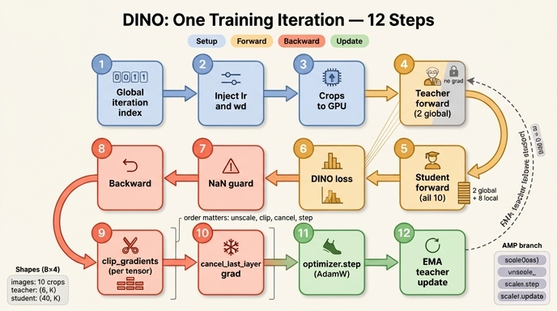

# DINO 학습 1 iteration의 12단계

> **Q.** DINO 학습 1 iteration의 12단계를 순서대로 나열하면?
>
> **A.** 글로벌 it 계산 → 스케줄 주입 → GPU 전송 → teacher forward(global 2개) → student forward(전부) → loss 계산 → NaN 가드 → backward → `clip_gradients` → `cancel_gradients_last_layer` → `optimizer.step` → EMA teacher 갱신.

전부 `main_dino.py`의 `train_one_epoch`(300–359행) 한 함수 안에 있다. 노트북 `dino_training_walkthrough.py` §10 "학습 1 iteration 완전 해부"가 이 12단계를 셀 하나로 그대로 재현하며 중간값을 찍는다.

---

## 1. 12단계 표

| # | 단계 | 코드 한 줄 | 무엇을 위해 | 관련 카드 개념 |
|---|---|---|---|---|
| 1 | 글로벌 iteration 계산 | `it = len(data_loader) * epoch + it` | 스케줄 배열의 인덱스를 만든다 | **스케줄 배열** (전역 step 인덱싱) |
| 2 | 스케줄 주입 | `param_group["lr"] = lr_schedule[it]` / `if i == 0: param_group["weight_decay"] = wd_schedule[it]` | lr·wd를 이번 step 값으로 덮어씀. wd는 **0번 group에만** | `get_params_groups`, cosine 스케줄 |
| 3 | GPU 전송 | `images = [im.cuda(non_blocking=True) for im in images]` | crop **리스트**를 통째로 GPU로 (텐서 1개가 아니다) | multi-crop, `pin_memory` |
| 4 | teacher forward | `teacher_output = teacher(images[:2])` | **global 2개만** 통과 → 타겟 분포 | **비대칭 view**, momentum encoder |
| 5 | student forward | `student_output = student(images)` | **10개 전부** 통과 → local-to-global 대응 강제 | `MultiCropWrapper` 해상도 그룹핑 |
| 6 | loss 계산 | `loss = dino_loss(student_output, teacher_output, epoch)` | centering+sharpening 붙인 CE, $v\neq u$ 항만 | **centering / sharpening**, $\tau_t$ warmup |
| 7 | NaN 가드 | `if not math.isfinite(loss.item()): sys.exit(1)` | AMP·lr 폭주로 loss가 터지면 **즉시 프로세스 종료** | **NaN 가드** |
| 8 | backward | `loss.backward()` (AMP면 `fp16_scaler.scale(loss).backward()`) | student 그래프에만 grad 채움 | teacher `requires_grad=False` |
| 9 | `clip_gradients` | `param_norms = utils.clip_gradients(student, args.clip_grad)` | 폭주 grad 억제 | **per-tensor clip** (전역 노름 아님) |
| 10 | `cancel_gradients_last_layer` | `utils.cancel_gradients_last_layer(epoch, student, args.freeze_last_layer)` | 초기 epoch 동안 프로토타입 층을 얼림 | **`freeze_last_layer`**, 붕괴 방지 |
| 11 | optimizer.step | `optimizer.step()` (AMP면 `fp16_scaler.step(optimizer)` + `update()`) | student 파라미터 갱신 | **AdamW** (+ decoupled wd) |
| 12 | EMA teacher 갱신 | `param_k.data.mul_(m).add_((1-m) * param_q.detach().data)` | 갱신된 student로 teacher를 조금 끌어당김 | **EMA / momentum $m:0.996\nearrow1.0$** |

`train_one_epoch`은 항상 `student.module.parameters()`를 쓴다 — 실제 학습에서 student가 **항상 DDP로 감싸져 있기** 때문. teacher는 BN이 있을 때만 DDP로 감싸므로 ViT에선 `teacher_without_ddp = teacher`다.

---

## 2. 왜 이 순서여야 하는가 (의존성 사슬)

### 2-1. `unscale → clip → cancel → step`

```
scale(loss).backward()   # grad = S · ∇L      (S = GradScaler의 스케일 인자)
unscale_(optimizer)      # grad = ∇L          ← 여기서 되돌려야
clip_gradients(...)      # ‖∇L‖ 기준으로 자름
cancel_gradients_last_layer(...)
step / scaler.step
```

- **clip은 unscale 뒤여야 한다.** AMP는 fp16 언더플로를 막으려고 loss에 $S \sim 2^{16}$ 을 곱한다. unscale 전 grad는 $S\cdot\nabla L$ 이므로, 이 상태로 `clip=3.0`을 적용하면 **모든 텐서가 통째로 클리핑**되어 실질적으로 grad 방향만 남기고 크기를 파괴한다.
- **cancel은 clip 뒤여야 한다.** 순서가 반대면 `clip_gradients`가 `p.grad is not None`인 텐서를 훑다가 이미 `None`이 된 last_layer를 그냥 건너뛰므로 결과는 같지만, 원 구현은 "grad를 다 정리한 뒤 마지막에 지운다"는 의미를 지킨다. 중요한 건 **cancel이 step 앞**이라는 것 — step 뒤로 가면 이미 갱신된 뒤라 freeze가 아무 의미가 없다.
- **cancel은 `if args.clip_grad` 밖**에 있다. `--clip_grad 0`으로 clip을 꺼도 freeze는 살아 있다.

### 2-2. `step → EMA`

```python
optimizer.step()                       # θs ← θs - η·(...)
with torch.no_grad():
    m = momentum_schedule[it]
    θt ← m·θt + (1-m)·θs               # 갱신된 θs 사용
```

EMA가 step 앞에 오면 teacher는 **이번 step의 학습 결과를 한 번도 반영하지 못한 채** 한 iteration 늦게 따라가고, teacher = "student의 지수이동평균"이라는 정의 자체가 어긋난다.

### 2-3. `1 → 2`, `4/5 → 6`, `6 → 7 → 8`

- 스케줄은 상태 없는 numpy 배열이라 인덱스 `it`가 먼저 확정돼야 한다. 이 덕분에 **resume이 자동으로 정확**하다(스케줄러 객체 상태 복원 불필요).
- NaN 가드는 backward **앞**이다. 터진 loss로 backward를 돌리면 파라미터가 NaN으로 오염되고, 그 뒤 EMA로 teacher까지 전염된다. `loss.item()`은 여기서 GPU 동기화를 강제하는 지점이기도 하다.
- teacher forward가 student forward보다 앞이지만 이건 순서 의존이 아니라 관례다(둘은 독립).

---

## 3. AMP(`--use_fp16 True`)가 켜지면 달라지는 것

`fp16_scaler = torch.cuda.amp.GradScaler()`가 `None`이 아닐 때만 분기가 갈린다. **12단계 골격은 그대로**이고 8·9·11번만 바뀐다.

| 단계 | fp32 (`fp16_scaler is None`) | AMP |
|---|---|---|
| 4–6 forward+loss | `autocast(False)` — 사실상 그냥 fp32 | `with torch.cuda.amp.autocast(True):` 안에서 실행, 출력이 **fp16** |
| 8 backward | `loss.backward()` | `fp16_scaler.scale(loss).backward()` — **scale** |
| 9 clip 직전 | — | `fp16_scaler.unscale_(optimizer)` — **unscale** (in-place) |
| 9 clip | `utils.clip_gradients(student, clip)` | 동일 |
| 10 cancel | 동일 | 동일 |
| 11 step | `optimizer.step()` | `fp16_scaler.step(optimizer)` + `fp16_scaler.update()` |

- `scaler.step`은 grad에 inf/NaN이 있으면 **step을 통째로 건너뛴다**. `scaler.update()`가 그때 스케일 $S$를 절반으로 줄이고, 성공이 이어지면 다시 키운다.
- `unscale_`는 `args.clip_grad`가 참일 때만 호출된다. clip을 끄면 unscale 없이 `scaler.step`이 내부적으로 unscale한다.
- DINOLoss 안에서 `teacher_output.float()`로 다시 fp32로 올리는 지점이 있어 softmax/center 통계는 fp32에서 계산된다.

---

## 4. 흐르는 텐서 shape (batch $B$ 기준)

`OUT_DIM = K`. 노트북 §5는 $B=4$, §10 본 셀은 `BATCH = 8`을 쓴다.

```
images        : list, 길이 10  = [ (B,3,224,224) x2,  (B,3,96,96) x8 ]
                └ 3번 단계는 이 "리스트"를 통째로 GPU로 옮긴다

teacher(images[:2])
   backbone forward 1회: (2B, 3, 224, 224) → CLS (2B, 192)
   head:                 (2B,192) → MLP (2B,256) → L2 norm → last_layer
teacher_output : (2B, K)          B=4 → (8, 4096)     B=8 → (16, 4096)

student(images)
   idx_crops = cumsum(unique_consecutive counts) = [2, 10]
   backbone forward 2회: (2B,3,224,224), (8B,3,96,96)   ← 10회가 아니다
   두 특징을 concat 후 head를 **한 번만** 통과
student_output : (10B, K)         B=4 → (40, 4096)    B=8 → (80, 4096)

dino_loss
   teacher: chunk(2)  → 2 x (B, K),  softmax((z-c)/τ_t), detach
   student: chunk(10) → 10 x (B, K), log_softmax(z/τ_s)
   항 개수 |N| = 2(2+8) - 2 = 18   (v == u 쌍 제외)
loss           : ()  스칼라
center         : (1, K)  — 배치 평균의 EMA (m_c = 0.9), all_reduce로 전 GPU 합산
```

- ViT-tiny 기준 backbone 출력은 CLS 토큰 `(*, 192)`, `prepare_tokens` 후 토큰은 `(*, 197, 192)` (CLS 1 + 패치 196).
- 마지막 층이 weight-norm에 `weight_g = 1` 고정이라 로짓 $z_k = \cos\angle(v_k, \tilde u) \in [-1,1]$ 이다.
- head를 **마지막에 한 번만** 부르는 것이 중요하다 — head에 BN을 쓰는 convnet 설정에서 모든 crop의 통계가 함께 잡힌다.

---

## 5. gradient가 흐르는 곳 / 안 흐르는 곳

| 대상 | grad | 이유 |
|---|---|---|
| student backbone + head | **흐름** | 유일한 학습 대상 |
| teacher 전체 | 안 흐름 | `build_pair`/`train_dino`에서 `p.requires_grad = False`. `no_grad` 블록이 아니라 **파라미터 플래그**로 끈다 |
| teacher_output → loss | 안 흐름 | `DINOLoss` 안에서 `.detach()` |
| `head.last_layer.weight_g` | 안 흐름 | `norm_last_layer=True` → `weight_g.data.fill_(1)` + `requires_grad=False` |
| `head.last_layer.weight_v` | 흐르지만 **epoch < freeze_last_layer 동안 버림** | `cancel_gradients_last_layer`가 `p.grad = None` |
| `dino_loss.center` | 안 흐름 | `register_buffer` + `no_grad` 안에서 EMA 갱신 |
| teacher 파라미터 갱신 | grad 아님 | 12단계 EMA (`no_grad`, in-place `mul_`/`add_`) |

teacher가 `no_grad`가 **아닌데도** 안전한 이유: 모든 leaf가 `requires_grad=False`라 그래프 자체가 만들어지지 않는다. 노트북 §10 주석도 이 점을 짚는다("`no_grad` 아님에 주의").

---

## 6. 두 헬퍼의 정확한 동작

### `utils.clip_gradients` (per-tensor, 전역 노름 아님)

```python
for name, p in model.named_parameters():
    if p.grad is not None:
        param_norm = p.grad.data.norm(2)
        clip_coef = clip / (param_norm + 1e-6)
        if clip_coef < 1:
            p.grad.data.mul_(clip_coef)
```

$$
g_p \leftarrow g_p \cdot \min\!\left(1,\ \frac{\texttt{clip}}{\lVert g_p \rVert_2 + \varepsilon}\right)
\quad \text{for each } p
$$

`torch.nn.utils.clip_grad_norm_`은 **모든 파라미터를 이어붙인 하나의 전역 노름**으로 자르는 반면, 이건 **텐서마다 독립**이다. 그래서 한 층만 폭주해도 나머지 층의 grad 크기는 그대로 보존된다(전역 clip이면 다 같이 줄어든다). 반환값은 클리핑 **전** 노름 리스트라서 로깅/진단에 쓸 수 있다.

### `utils.cancel_gradients_last_layer`

```python
if epoch >= freeze_last_layer:
    return
for n, p in model.named_parameters():
    if "last_layer" in n:
        p.grad = None
```

- 이름 문자열 매칭(`"last_layer" in n`)이라 `head.last_layer.weight_g`/`weight_v` 둘 다 걸린다.
- **epoch 단위**다 (iteration 아님). 기본 `--freeze_last_layer 1` → epoch 0 전체 동안 프로토타입 $K$개 방향이 고정된 채 backbone만 학습된다. 초기 불안정 구간에서 프로토타입이 한 점으로 무너지는 것을 막는 장치.
- `grad = 0`이 아니라 `grad = None`이다 — AdamW가 `p.grad is None`인 파라미터를 아예 건너뛰므로 **모멘텀/2차 모멘트 상태도 갱신되지 않고, decoupled weight decay도 적용되지 않는다.** `0`으로 채웠다면 wd가 계속 먹어서 층이 서서히 축소됐을 것이다.

---

## 7. 로깅 — `metric_logger`

12단계가 끝난 뒤 iteration 꼬리에 붙는다.

```python
torch.cuda.synchronize()
metric_logger.update(loss=loss.item())
metric_logger.update(lr=optimizer.param_groups[0]["lr"])
metric_logger.update(wd=optimizer.param_groups[0]["weight_decay"])
```

- 루프 헤더는 `metric_logger.log_every(data_loader, 10, header)` — 10 iteration마다 한 줄 출력.
- 에폭 끝에 `synchronize_between_processes()`로 전 rank 통계를 합치고 `{k: meter.global_avg}`를 반환한다.
- **기록하는 건 loss / lr / wd 셋뿐이다. 검증(validation)이 아예 없다.** 그리고 §11이 실험으로 보이듯 **loss가 낮다고 표현이 좋은 게 아니다** — centering을 빼면 loss는 셋 중 가장 많이 내려가면서 단일 프로토타입으로 붕괴한다. 실제로 봐야 할 것은 교사 엔트로피 $H(P_t)$, top-1 확률, argmax 다양성, center 노름이다.
- `lr`/`wd`를 `param_groups[0]`에서 읽는 것도 의도적이다 — 1번 group은 wd가 항상 0이라 볼 게 없다.

---

## 8. 노트북 §10 실측값 (`vit_tiny/16`, `OUT_DIM=4096`, `BATCH=8`)

### 2번 단계 — param group 분리

```
param_groups: [0] regularized 55 텐서, [1] not-regularized 102 텐서 (bias/Norm)
```

`get_params_groups`는 `name.endswith(".bias") or len(param.shape) == 1`이면 not-regularized로 보낸다. ViT는 층마다 LayerNorm weight/bias(1-D) + 각종 bias가 많아 **개수로는 not-regularized가 압도적**이다(102 > 55). 파라미터 **수**로는 반대. 총 named parameter는 158개인데 55+102=157인 이유는 `head.last_layer.weight_g`가 `requires_grad=False`라 `continue`로 걸러지기 때문이다.

### 4·5·6번 단계 — shape와 loss

```
it=0  lr=1.563e-05  wd=0.0400  m=0.99600
teacher_output (16, 4096) / student_output (80, 4096)
loss ≈ 8.3   (참고: -log(1/K) = log 4096 = 8.3178)
```

초기화 직후 학생 분포가 거의 uniform이라 loss가 $\log K$ 근처에서 출발한다. `lr`은 linear scaling rule로 $0.0005 \times 8/256 = 1.5625\times10^{-5}$.

### 9번 단계 — per-tensor clip

```python
before = {n: p.grad.norm().item() for n, p in student.named_parameters() if p.grad is not None}
norms  = utils.clip_gradients(student, clip=3.0)
after  = {...}
clipped = [n for n in before if after[n] < before[n] - 1e-9]
```

`clip=3.0`은 상당히 느슨해서 초기에는 클리핑되는 텐서가 없거나 극소수다. 반환된 `norms` 리스트가 클리핑 **전** 분포이므로, "몇 개가 3.0을 넘었나"를 보는 게 이 셀의 요점이다.

### 10번 단계 — freeze 확인

```
epoch=0 < freeze_last_layer=1  →  last_layer.weight_v.grad = None
```

grad가 `0`이 아니라 문자 그대로 `None`으로 찍힌다. epoch 1로 넘어가면 `cancel_gradients_last_layer`가 즉시 `return`하므로 grad가 살아남는다.

### 12번 단계 — EMA 전후

```
EMA 전 max|θs-θt| = 1.568e-05  →  후 1.562e-05   (m=0.99600)
```

읽는 법: $\theta_t \leftarrow m\theta_t + (1-m)\theta_s$ 를 차이에 대해 쓰면

$$
\theta_s - \theta_t^{\text{new}} = m\,(\theta_s - \theta_t^{\text{old}})
$$

즉 차이가 정확히 $m$배로 줄어든다. $1.568\times10^{-5} \times 0.996 = 1.5617\times10^{-5} \approx 1.562\times10^{-5}$ — 관측값과 일치한다. 한 step에 **0.4%만** 따라잡는다는 뜻이고, 유효 시간상수는

$$
\tau_{\text{eff}} = \frac{1}{1-m} = 250\ \text{iteration}
$$

$m$이 스케줄에 따라 $1.0$으로 가면 $\tau_{\text{eff}} \to \infty$, 즉 교사가 사실상 얼어붙어 후반 타겟이 안정된다.

또 하나: EMA 직전 `max|θs-θt|`가 $1.6\times10^{-5}$ 수준이라는 건 **11번 step이 방금 만든 변화량 그 자체**다(두 모델은 같은 가중치에서 출발했으므로). 즉 이 숫자는 AdamW 한 스텝의 크기를 보여준다.

---

## 9. 자주 틀리는 지점

1. **teacher forward가 `no_grad` 블록이 아니다.** `requires_grad=False`로 끈다. `images[:2]`(global 2개)만 통과한다는 것도 자주 빠뜨린다.
2. **9번과 10번의 순서.** clip이 먼저, cancel이 나중. 그리고 AMP에서는 그 앞에 `unscale_`가 하나 더 낀다.
3. **EMA는 맨 마지막.** `optimizer.step()` **뒤**다.
4. **`clip_gradients`는 전역 노름 클리핑이 아니다.**
5. **wd는 0번 param_group에만.** bias·Norm(1-D)은 wd=0 고정.
6. **NaN 가드는 backward 앞**이고, `print(..., force=True)` 후 `sys.exit(1)` — 예외가 아니라 프로세스 종료다.
7. **`freeze_last_layer`는 epoch 단위**, iteration 단위가 아니다.

---

## 인포그래픽


