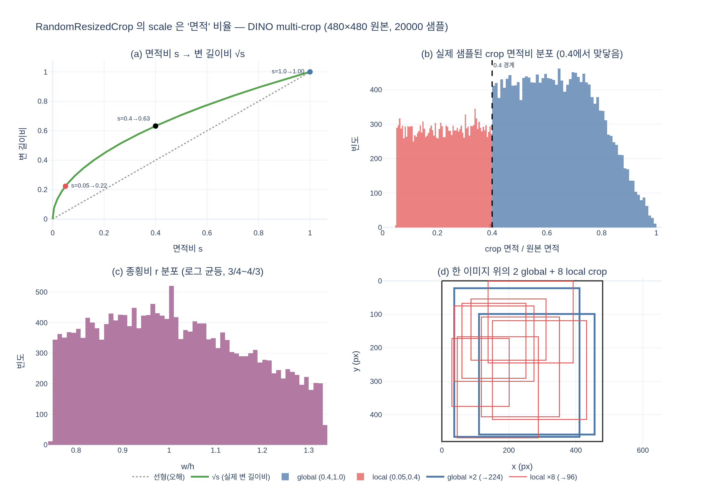

# `RandomResizedCrop`의 `scale`은 **면적** 비율이다

## 한 줄 답

`scale`은 **원본 이미지 면적 대비 crop 영역의 면적 비율**이다. 한 변의 길이 비율이 아니다.
DINO는 global crop에 $(0.4, 1.0)$, local crop에 $(0.05, 0.4)$를 주는데, local의 **상한 0.4**가
global의 **하한 0.4**와 정확히 맞닿아 있어 local crop은 항상 global crop 이하의 면적을 본다.

---

## 1. 왜 "면적"이라는 게 중요한가

torchvision 문서의 표현 그대로다.

> `scale (tuple of float)` — Specifies the lower and upper bounds for the random area
> of the crop, **before resizing**. The scale is defined with respect to the **area** of
> the original image.

즉 crop 박스 $(h_c, w_c)$ 에 대해

$$
s \;=\; \frac{h_c \, w_c}{H \, W}, \qquad s \sim \mathcal{U}(s_{\min},\, s_{\max})
$$

이고, 우리가 눈으로 인지하는 **한 변의 길이 비율**은 제곱근이다.

$$
\frac{\text{crop 한 변}}{\text{원본 한 변}} \;\approx\; \sqrt{s}
$$

$480 \times 480$ 원본 기준으로 환산하면:

| `scale` $s$ | $\sqrt{s}$ (변 길이비) | crop 한 변 | 어디에 쓰이나 |
|---|---|---|---|
| $0.05$ | $0.224$ | 107 px | local 하한 |
| $0.10$ | $0.316$ | 152 px | local 전형값 |
| $0.40$ | $\mathbf{0.632}$ | 304 px | **local 상한 = global 하한** |
| $1.00$ | $1.000$ | 480 px | global 상한 (원본 전체) |

**핵심 오해 포인트**: $s = 0.4$ 를 "이미지의 40%만 본다"로 읽으면 local crop이 실제보다
훨씬 좁다고 착각한다. 실제로는 **한 변의 약 63%**, 즉 원본의 절반이 넘는 폭을 본다.
반대로 $s = 0.05$ 는 한 변의 22% — 이건 정말 작은 조각이 맞다.
면적은 길이의 제곱이므로 작은 $s$ 쪽에서 이 왜곡이 훨씬 크다.

---

## 2. `ratio`와의 관계 — 두 파라미터는 직교한다

`RandomResizedCrop`은 `scale`과 `ratio`를 **독립적으로** 뽑는다.
`ratio`의 기본값은 $(3/4,\ 4/3)$ 이고 **로그 균등** 샘플링이다.

$$
\log r \sim \mathcal{U}\!\left(\log \tfrac{3}{4},\ \log \tfrac{4}{3}\right),
\qquad r = \frac{w_c}{h_c}
$$

로그 균등을 쓰는 이유는 $r$ 과 $1/r$ 이 대칭적으로 뽑히게 하기 위해서다
(가로로 $4/3$ 늘리는 것과 세로로 $4/3$ 늘리는 것이 같은 확률).

면적이 정해진 뒤 종횡비가 정해지므로, 둘의 관계는

$$
w_c = \sqrt{s \cdot HW \cdot r}, \qquad h_c = \sqrt{\frac{s \cdot HW}{r}}
\quad\Longrightarrow\quad h_c w_c = s \cdot HW
$$

**`ratio`를 어떻게 뽑든 면적은 그대로 유지된다.** `scale`은 "얼마나 넓게", `ratio`는
"어떤 모양으로"를 담당한다.

---

## 3. `get_params`의 실제 샘플링 절차

torchvision `RandomResizedCrop.get_params` 는 단순 계산이 아니라 **기각 샘플링(rejection
sampling)**이다.

```
area = H * W
for _ in range(10):                                  # 최대 10회 시도
    target_area  = area * U(scale[0], scale[1])      # ① 면적 먼저
    aspect_ratio = exp(U(log r_min, log r_max))      # ② 종횡비는 로그 균등
    w = round(sqrt(target_area * aspect_ratio))      # ③ 정수 픽셀로 반올림
    h = round(sqrt(target_area / aspect_ratio))
    if 0 < w <= W and 0 < h <= H:                    # ④ 원본을 벗어나지 않으면 채택
        i = randint(0, H - h)                        #    위치는 균등 랜덤
        j = randint(0, W - w)
        return i, j, h, w
# ⑤ 10회 실패 → 중앙 crop fallback
```

여기서 나오는 실전 함의가 셋 있다.

**(a) 명목 구간 안에서도 면적 분포는 균등이 아니다.** 정사각 원본에서 $s \approx 1$ 이고
$r \neq 1$ 이면 $w$ 또는 $h$ 가 원본을 넘어 그 시도는 기각된다. 그래서 실제 샘플된 global
면적비의 평균은 구간 중앙 $0.7$ 이 아니라 **약 0.64** 로 아래쪽에 치우친다
(`expy.py` 실측). 시각화 (b) 패널에서 global 히스토그램이 $1.0$ 쪽으로 갈수록
줄어드는 게 이 효과다. local $(0.05, 0.4)$ 는 애초에 작아서 기각이 거의 없어 거의 평평하다.

**(b) 경계 0.4는 정수 반올림 오차만큼 흔들린다.** `round`로 정수 픽셀을 만들기 때문에
실현 면적비는 local 최대 $0.4008$, global 최소 $0.3990$ 같은 값이 나온다.
"local ≤ global"은 **설계 의도**이지 부동소수점 수준의 불변식은 아니다.

**(c) fallback은 조용히 일어난다.** 10회 모두 실패하면 예외 없이 중앙 crop을 돌려주는데,
이때 `scale`은 **완전히 무시**된다. 세로로 아주 긴 파노라마 같은 극단적 종횡비 이미지에서는
`scale` 설정이 사실상 안 먹는 crop이 섞일 수 있다.

---

## 4. 0.4가 "맞닿아 있다"는 것의 정확한 의미

DINO `main_dino.py`의 `DataAugmentationDINO`:

| crop | 출력 해상도 | `scale` | 개수 |
|---|---|---|---|
| global 1 | 224 | $(0.4,\ 1.0)$ | 1 |
| global 2 | 224 | $(0.4,\ 1.0)$ | 1 |
| local | 96 | $(0.05,\ 0.4)$ | 8 |

두 구간 $[0.05, 0.4]$ 와 $[0.4, 1.0]$ 은 **한 점 $0.4$ 에서만 접하고 겹치는 폭이 0**이다.
그래서:

$$
\text{area}(\text{local}) \;\le\; 0.4 \, HW \;\le\; \text{area}(\text{global})
$$

가 항상 성립한다. 이것이 DINO의 **local-to-global 대응** 손실이 성립하는 전제다.
학생은 작은 조각(local)을 보고, 교사가 넓은 맥락(global)에서 뽑은 분포를 맞춰야 한다 —
"부분 → 전체"의 방향성이 면적 구간의 분리로 **구조적으로 보장**된다.
만약 local scale을 $(0.05, 0.8)$ 처럼 넓혀 구간이 겹치게 만들면, 어떤 local crop이
어떤 global crop보다 넓어져 이 방향성이 깨진다.

### 단, 위치까지 보장되는 건 아니다

여기가 가장 흔히 잘못 이해되는 지점이다. 보장되는 건 **면적의 대소뿐**이고,
crop **위치** $(i, j)$ 는 두 변환에서 완전히 독립적으로 뽑힌다.
`expy.py`에서 global 1개 vs local 1개를 5000쌍 샘플링해 실측한 결과:

- local이 global 안에 **완전히 포함될 확률: 약 40%**
- 평균 포함 비율(local 면적 중 global과 겹치는 비율): 약 0.86
- **전혀 겹치지 않을 확률: 약 0.3%** (드물지만 0이 아니다)

즉 "local crop은 global crop의 부분집합"이 아니다. 같은 이미지에서 나왔으니
**통계적으로 크게 겹칠 뿐**이고, 가끔 완전히 어긋난 쌍도 학습 신호로 들어간다.
이 노이즈가 오히려 "같은 이미지면 다른 부위라도 같은 표현"이라는 더 강한
불변성을 학습시킨다고 볼 수 있다.

---

## 5. 최종 resize — local은 픽셀 밀도까지 다르다

crop은 마지막에 반드시 고정 해상도로 리사이즈된다. global은 $224^2$, local은 $96^2$.
같은 면적비 $s$ 라도 원본 픽셀이 출력 픽셀 하나에 얼마나 압축되는지는 다르다.

$$
\frac{\text{원본 픽셀}}{\text{출력 픽셀}} = \frac{\sqrt{s \, HW}}{\text{out}}
$$

$480\times480$ 원본 기준 실측:

| $s$ | 원본 crop 변 | global(224) 밀도 | local(96) 밀도 |
|---|---|---|---|
| $0.05$ | 107 px | 0.48 px/px | 1.12 px/px |
| $0.10$ | 152 px | 0.68 px/px | 1.58 px/px |
| $0.40$ | 304 px | 1.36 px/px | **3.16 px/px** |
| $1.00$ | 480 px | 2.14 px/px | 5.00 px/px |

동일한 $s$ 에서 밀도 비는 항상 $224/96 \approx 2.33$ 으로 일정하다.
경계값 $s = 0.4$ 를 보면 극명하다 — **정확히 같은 크기의 영역**을 잘라내도
global은 304px를 224px로(약간 축소), local은 304px를 96px로(3배 이상 축소) 만든다.

그래서 local view는 단순히 "작은 영역"이 아니라 **"작은 영역을 저해상도로 본 것"** 이다.
ViT 관점에서는 patch 하나가 커버하는 원본 영역이 달라지므로, 모델은
scale-invariance와 resolution-invariance를 동시에 학습하게 된다.
(참고로 $s$ 가 작을 때 global 밀도가 1 미만인 건 **업샘플링**이라는 뜻 — 107px 영역을
224px로 늘리므로 실제 정보량 이상으로 확대된다.)

---

## 6. 정리

- `scale` = **면적** 비율. 변 길이는 $\sqrt{s}$ → $0.4$ 는 한 변의 63%.
- `ratio`는 면적을 바꾸지 않는다. 로그 균등 $(3/4, 4/3)$.
- local 상한 $0.4$ = global 하한 $0.4$ → **면적 대소는 항상 보장**, 위치 포함은 보장 안 됨(≈40%).
- `get_params`는 기각 샘플링이라 큰 $s$ 쪽이 깎이고, 10회 실패 시 `scale`을 무시한 중앙 crop.
- 최종 resize(224 vs 96) 때문에 같은 $s$ 라도 local이 $2.33\times$ 거칠게 샘플링된다.

---

## 시각화



- **(a)** 면적비 $s$ 와 변 길이비 $\sqrt{s}$ — 점선(선형 오해) 대비 실제 곡선이 훨씬 위에 있다.
- **(b)** `get_params`를 각각 20000회 호출해 얻은 실제 면적비 분포. $0.4$ 에서 두 분포가
  겹침 없이 맞닿는다. global 쪽이 $1.0$ 으로 갈수록 줄어드는 건 기각 샘플링 효과.
- **(c)** 종횡비 $r$ 의 분포 — 로그 균등이라 $r$ 자체는 왼쪽으로 살짝 치우친다.
- **(d)** 한 이미지 위의 global 2개(굵은 파랑) + local 8개(가는 빨강). local이 global 밖으로
  삐져나가는 경우가 실제로 보인다.

재현: `python3 expy.py` (torch, torchvision, plotly, kaleido, numpy 필요)
