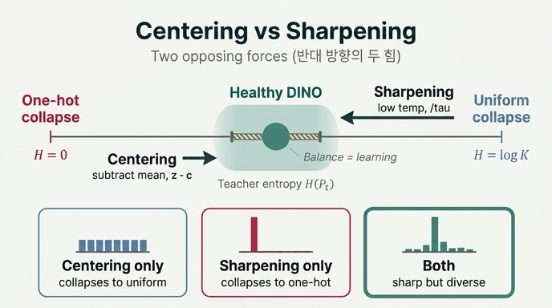

# centering과 sharpening이 서로를 대체할 수 없는 이유

> **Q.** centering과 sharpening이 서로를 대체할 수 없는 이유는?
>
> **A.** 두 장치가 서로 반대 방향으로 밀기 때문이다. sharpening은 one-hot 쪽, centering은 uniform 쪽으로 밀며, 하나만 있으면 해당 방향으로 붕괴한다(논문 Fig. 5).

---

## 1. 출발점: 손실을 낮추는 "부정행위" 경로가 있다

DINO의 손실은 교사 분포 $P_t$와 학생 분포 $P_s$ 사이의 교차엔트로피다. 이것은 다음처럼 분해된다.

$$
H\big(P_t, P_s\big) \;=\; \underbrace{H(P_t)}_{\text{교사 분포의 엔트로피}} \;+\; \underbrace{D_{\mathrm{KL}}\big(P_t \,\|\, P_s\big)}_{\text{두 view 정렬 — 우리가 원하는 것}}
$$

우리가 원하는 학습은 **둘째 항**을 줄이는 것이다: 같은 이미지의 서로 다른 crop을 보고도 학생이 교사와 같은 분포를 내놓게 만드는 것. 그런데 손실은 **첫째 항을 깎아도** 똑같이 내려간다. $H(P_t)$를 0으로 만들어 버리면, 정렬을 하나도 배우지 않고도 손실이 떨어진다. 이게 **붕괴(collapse)** 다.

붕괴는 한 종류가 아니다. 엔트로피 축의 **양쪽 끝** 모두가 함정이다.

| 붕괴 유형 | 증상 | 엔트로피 | 막는 장치 |
|---|---|---|---|
| **단일 프로토타입 collapse** | 입력이 뭐든 항상 같은 one-hot | $H(P_t) \to 0$ | **centering** ($z_t - c$) |
| **uniform collapse** | 모든 입력이 같은 flat 분포 $1/K$ | $H(P_t) \to \log K$ | **sharpening** ($\tau_t < \tau_s$) |

두 붕괴는 정반대 증상이다. 그러니 이걸 막는 장치도 정반대 방향으로 밀 수밖에 없다. **이것이 답의 핵심이다.**

---

## 2. 두 장치를 "힘의 방향"으로 정리

| | **centering** | **sharpening** |
|---|---|---|
| 수식 | $z_t - c$ | $\;\cdot\;/\,\tau_t$, $\tau_t = 0.04 < \tau_s = 0.1$ |
| 로짓에 하는 일 | **위치(location)** 를 옮김 — 평행이동 | **배율(scale)** 을 키움 — 확대 |
| $c$의 정의 | $c \leftarrow m_c\,c + (1-m_c)\,\frac{1}{B\cdot W}\sum_i z_t(i)$, $m_c = 0.9$ | (없음, 하이퍼파라미터 하나) |
| 직관 | 구조적으로 유리한 프로토타입의 편향을 EMA로 흡수해 빼줌 → 프로토타입 간 **평등** | 낮은 온도 → 로짓 차이를 증폭 → **확신** |
| 미는 방향 | **uniform 쪽** ($H \uparrow$ 방향) | **one-hot 쪽** ($H \downarrow$ 방향) |
| 없으면 | 단일 프로토타입 붕괴 ($H\to 0$) | uniform 붕괴 ($H\to\log K$) |

수식으로 보면 대체 불가능성이 더 분명해진다. softmax 인자는 $(z_t - c)/\tau_t$ 이고, 여기서

- $c$ 는 **덧셈** 항이다 → 분포의 **어느 프로토타입이 뽑히느냐**(위치)만 바꾼다.
- $\tau_t$ 는 **곱셈** 항이다 → 분포가 **얼마나 뾰족하냐**(폭)만 바꾼다.

평행이동은 아무리 해도 분포를 뾰족하게 만들 수 없고, 배율 조정은 아무리 해도 특정 프로토타입 편향을 없애지 못한다. **서로 다른 자유도를 건드리므로 원리적으로 대체가 불가능하다.**

---

## 3. 엔트로피 축 위에 "매달린" 상태라는 그림

머릿속에 가로축 하나를 그려보자. 왼쪽 끝은 $H(P_t) = 0$ (one-hot 붕괴), 오른쪽 끝은 $H(P_t) = \log K$ (uniform 붕괴). 둘 다 낭떠러지다.

```
H(P_t) = 0                    Healthy DINO                    H(P_t) = log K
 one-hot 붕괴  ◀──── sharpening   [ 구슬 ]   centering ────▶   uniform 붕괴
 (프로토타입 1개)                                                (전부 1/K)
```

학습이 실제로 일어나는 곳은 **중간**뿐이다. 왜냐하면 학습 신호인 $D_{\mathrm{KL}}(P_t\|P_s)$ 는 양 끝 어디서든 0으로 사라지기 때문이다. 교사 출력이 상수가 되면(어느 쪽 상수든) 학생이 맞출 것이 없다.

그래서 건강한 상태는 안정적으로 **머무는** 상태가 아니라, 양쪽에서 당기는 두 힘이 **균형을 이뤄 매달려 있는** 상태다. 줄 하나를 끊으면 그 즉시 반대쪽으로 떨어진다. 이게 "서로를 대체할 수 없다"의 물리적 그림이다.

---

## 4. 논문 Fig. 5가 실제로 보여주는 것

DINO 논문 Sec. 5.3 "Avoiding collapse"의 Fig. 5는 세 설정(centering only / sharpening only / both)에 대해 두 곡선을 그린다.

**(a) KL 곡선** — 세 설정 중 **하나만 쓴 두 경우 모두 KL이 0으로 수렴한다.** KL = 0 은 출력이 상수라는 뜻이고, 곧 붕괴다. 즉 *어느 장치를 남기든 하나만으로는 붕괴한다*. 이 그림이 "대체 불가"의 직접적 증거다.

**(b) 엔트로피 곡선** — 그런데 두 붕괴가 **서로 다른 값으로** 수렴한다.

- centering 없음(= sharpening only) → $H \to 0$
- sharpening 없음(= centering only) → $H \to \log K$ (논문 표기로 $-\log(1/K)$)

논문의 문장을 그대로 옮기면: *centering은 차원 간 균일성(uniformity across dimensions)을 유도하고, sharpening은 한 차원이 지배하도록 유도하며, 둘은 상보적(complementary)이다.* 그리고 두 장치를 다 쓴 경우에만 KL이 0으로 죽지 않고 엔트로피도 양 끝점 어느 쪽에도 붙지 않는다.

여기서 놓치기 쉬운 포인트: **엔트로피만 보면 안 된다.** 엔트로피가 서로 다른 값으로 갔다는 사실은 "두 붕괴가 다른 종류"임을 말해주지만, "붕괴했다"는 판정은 KL이 내린다. 두 그림을 같이 봐야 한다.

---

## 5. 워크스루 §11의 3-way ablation 실측

`dino_training_walkthrough.py` §11은 동일한 미니 학습 루프를 세 설정으로 돌려 논문 주장을 실제 모델로 재현한다 (ViT-Tiny/16, $K = 4096$, 따라서 $\log K \approx 8.318$).

| 설정 | centering | $\tau_t$ | 실측 |
|---|---|---|---|
| DINO | O | 0.04 | loss는 $\log K$ 근처, $H(P_t)$는 $\log K$보다 확실히 낮은 값에서 안정 — **양쪽 붕괴 영역 사이에 매달림** |
| centering 제거 | X | 0.04 | **loss 6.628** — 세 설정 중 가장 낮음. 그런데 $H(P_t)$ **5.86**으로 하강, top-1 확률 **0.192**로 상승, argmax 다양성 감소 → **단일 프로토타입 방향 붕괴** |
| sharpening 제거 | O | 0.10 ($=\tau_s$) | **loss 8.33에서 정지** ($\approx \log K$). gradient가 사실상 사라진 uniform 평탄면 → **uniform 정체/붕괴** |

이 표에서 가장 중요한 줄은 **centering 제거** 다.

> **loss가 가장 많이 내려간 설정이 붕괴한 설정이다.**

손실 감소분이 $D_{\mathrm{KL}}$ 에서 온 게 아니라 $H(P_t)$ 를 깎아서 온 것이기 때문이다. `main_dino.py` 의 사전학습 루프에는 검증이 전혀 없고 loss/lr/wd만 로깅하므로, loss만 보면 이 붕괴를 "학습이 잘 된다"로 오독한다. 실제로 봐야 하는 진단량은 다음 넷이다.

| 진단량 | 붕괴 신호 |
|---|---|
| 교사 엔트로피 $H(P_t)$ | $\to 0$ 또는 $\to \log K$ |
| 교사 top-1 확률 $\max_k P_t(k)$ | $\to 1$ |
| argmax 다양성 (배치 내 서로 다른 argmax 수) | $\to 1$ |
| center 노름 $\lVert c\rVert_2$ | 발산 |

`sharpening 제거` 쪽은 붕괴 메커니즘이 조금 다르다. $\tau_t = \tau_s$ 면 교사와 학생이 같은 온도라서 "교사가 학생보다 더 확신에 차 있다"는 부등호가 깨진다. 그 부등호가 곧 학습 신호의 원천이므로, 신호가 사라지고 loss는 $\log K$ 평탄면에서 꼼짝하지 않는다.

---

## 6. 한 가지 미묘한 점 — 두 힘이 같은 양을 밀지는 않는다

워크스루 §7 실험 C가 짚는 지점이다. **centering은 개별 샘플의 엔트로피를 직접 올려주지 않는다.** $\tau_t = 0.04$ 로 고정하고 centering만 켜고 껐을 때, 두 경우 모두 $H(P_t)$ 는 낮게 유지된다. centering이 바꾸는 것은 실험 B의 관측량, 즉 **"어떤 프로토타입이 argmax로 뽑히는가"의 배치 전체에 걸친 균형**이다.

- 실험 B: 프로토타입 0에 인위적 bias 2.0을 주입. centering 없으면 배치가 프로토타입 0에 독식된다. centering을 켜면 center가 그 bias를 EMA로 흡수($c[0] \approx$ 주입한 bias)하고 argmax가 흩어진다.

정리하면 두 장치의 담당 영역은 이렇게 갈린다.

- **centering**: 배치 주변분포(marginal) $\bar{P_t} = \frac{1}{B}\sum_i P_t^{(i)}$ 를 uniform 쪽으로 → *어떤 프로토타입이 뽑히나*
- **sharpening**: 샘플별 조건분포 $P_t^{(i)}$ 를 one-hot 쪽으로 → *하나를 얼마나 확신하나*

이 둘이 동시에 성립하는 상태 — "샘플마다 뾰족하지만, 뾰족한 위치는 샘플마다 다르다" — 가 바로 유용한 표현이다. 한쪽만 있으면 이 조합이 성립하지 않는다. 이것이 3절의 1차원 그림보다 정확한 설명이고, 왜 "반대 방향"이 단순한 상충이 아니라 **상보(complementary)** 인지를 말해준다.

---

## 7. 균형점은 하이퍼파라미터가 옮긴다

두 힘이 균형을 이루는 지점이 학습이 일어나는 곳이므로, 하이퍼파라미터는 곧 "균형점의 위치"를 정하는 손잡이다.

| 파라미터 | 기본값 | 역할 | 잘못 주면 |
|---|---|---|---|
| `teacher_temp` $\tau_t$ | 0.04 → 0.07 (warmup) | sharpening 세기 | $\tau_t \ge \tau_s$ 면 학습 신호 소멸 (uniform 정체) |
| `student_temp` $\tau_s$ | 0.1 고정 | 기준 온도 | — |
| `center_momentum` $m_c$ | 0.9 | centering EMA 속도 | 너무 크면 편향 추적 실패 → one-hot 쪽으로 흐름 |
| `out_dim` $K$ | 65536 | 축의 오른쪽 끝 $\log K$ 위치 자체 | 작으면 표현력 부족 |
| `momentum_teacher` | 0.996 → 1 | 타겟 안정성 | 작으면 타겟 요동 → 붕괴 |

$\tau_t$ 에 warmup(0.04 → 0.07)이 걸린 이유도 이 그림으로 읽힌다. 초기에는 너무 높은 온도가 불안정하므로 sharpening을 강하게 두고, 학습이 진행되며 서서히 완화한다. 세 번째 보조 장치인 `freeze_last_layer`(첫 1 epoch 동안 마지막 층 gradient를 버림)도 초기 노이즈로 프로토타입이 흔들리는 것을 막아 균형을 유지하는 역할이다.

---

## 8. 다른 방법과의 비교 한 줄

같은 문제(붕괴 방지)를 다른 방식으로 푼 사례를 하나만 대면, **SwAV**는 배치 내 할당에 **Sinkhorn-Knopp** 최적수송을 걸어 *"각 프로토타입이 배치에서 정확히 같은 횟수만큼 할당된다"* 는 균등 제약을 **하드하게** 강제한다. DINO의 centering은 같은 목적을 EMA 평행이동 하나로 **소프트하게** 근사한 것 — 대신 배치 통계에 대한 명시적 제약이 사라지므로, 반대 방향으로 미는 sharpening을 **반드시 짝으로 둬야** 균형이 성립한다. (BYOL은 또 다른 축으로, predictor + stop-gradient의 비대칭 구조로 붕괴를 피한다.) 즉 DINO에서 두 장치가 서로를 대체할 수 없는 것은 설계 실수가 아니라, "하드 제약 대신 마주 보는 두 소프트 힘"을 택한 결과다.

---

## 정리

- 손실 $H(P_t,P_s) = H(P_t) + D_{\mathrm{KL}}(P_t\|P_s)$ 에는 첫 항을 깎는 부정행위 경로가 있고, 그 경로가 엔트로피 축의 **양쪽 끝**에 있다.
- centering은 덧셈($z-c$, 위치)으로 uniform 쪽을, sharpening은 곱셈($/\tau_t$, 배율)으로 one-hot 쪽을 민다. **다른 자유도를 건드리므로 원리적으로 대체 불가.**
- 논문 Fig. 5: 하나만 쓰면 **KL이 0으로 수렴**(붕괴)하되 엔트로피는 각각 $0$ / $\log K$ 로 갈린다.
- 워크스루 §11 실측: no-centering은 loss 6.628로 **가장 낮지만** $H=5.86$·top-1 0.192로 붕괴 중, no-sharpening은 loss 8.33($\approx\log K$)에서 정지.
- **loss는 붕괴 탐지에 쓸 수 없다.** $H(P_t)$, top-1 확률, argmax 다양성, $\lVert c\rVert$ 를 봐야 한다.

**Sources:**
- [Emerging Properties in Self-Supervised Vision Transformers (DINO), arXiv:2104.14294](https://arxiv.org/pdf/2104.14294) — Sec. 5.3 "Avoiding collapse", Fig. 5
- [DINO as a von Mises-Fisher mixture model, arXiv:2405.10939](https://arxiv.org/pdf/2405.10939)

---

## 인포그래픽


