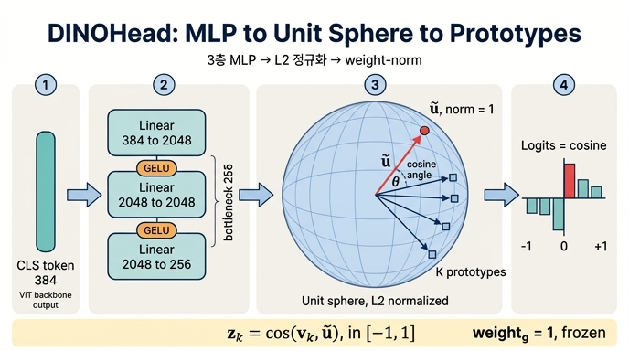

# DINOHead의 내부 구조

## 한눈에 보기

DINO의 전체 모델은 두 조각의 합성이다.

$$
g_\theta \;=\; h_\theta \circ f_\theta
$$

- $f_\theta$ : **backbone** (ViT). 입력 crop → CLS 토큰 $y \in \mathbb{R}^{D}$
- $h_\theta$ : **DINOHead**. 순서는 **3-layer MLP → L2 정규화 → weight-norm 선형층**

$$
h_\theta(y) \;=\; W\,\tilde{u},
\qquad
\tilde{u} \;=\; \frac{\mathrm{MLP}(y)}{\lVert \mathrm{MLP}(y)\rVert_2} \;\in\; \mathbb{S}^{255}
$$

핵심은 마지막 두 단계다. MLP 출력을 **단위 하이퍼구 위로 투영**하고, 그 위에서 **$K$ 개
프로토타입 방향과 내적**을 취한다. 그래서 출력 로짓은 확률도 거리도 아니고 **코사인 유사도**다.

---

## 1. 코드 해부 — `__init__`

`/home/sungwoo/projects/swcho/dino/vision_transformer.py` 의 `DINOHead` (256–290행):

```python
class DINOHead(nn.Module):
    def __init__(self, in_dim, out_dim, use_bn=False, norm_last_layer=True,
                 nlayers=3, hidden_dim=2048, bottleneck_dim=256):
        super().__init__()
        nlayers = max(nlayers, 1)
        if nlayers == 1:
            self.mlp = nn.Linear(in_dim, bottleneck_dim)      # 축퇴 케이스
        else:
            layers = [nn.Linear(in_dim, hidden_dim)]          # (1) in_dim -> 2048
            if use_bn:
                layers.append(nn.BatchNorm1d(hidden_dim))
            layers.append(nn.GELU())
            for _ in range(nlayers - 2):                      # nlayers=3 -> 1회
                layers.append(nn.Linear(hidden_dim, hidden_dim))   # (2) 2048 -> 2048
                if use_bn:
                    layers.append(nn.BatchNorm1d(hidden_dim))
                layers.append(nn.GELU())
            layers.append(nn.Linear(hidden_dim, bottleneck_dim))   # (3) 2048 -> 256
            self.mlp = nn.Sequential(*layers)
        self.apply(self._init_weights)                        # trunc_normal_(std=.02), bias=0

        self.last_layer = nn.utils.weight_norm(
            nn.Linear(bottleneck_dim, out_dim, bias=False))   # (5) 256 -> K
        self.last_layer.weight_g.data.fill_(1)                # g_k = 1
        if norm_last_layer:
            self.last_layer.weight_g.requires_grad = False    # g_k 고정
```

읽어야 할 포인트를 순서대로 정리한다.

### `nlayers` 의 실제 의미
`nlayers=3` 은 **선형층 3개**를 뜻한다. GELU는 그 사이 2군데에만 들어가고,
**마지막 `Linear(2048, 256)` 뒤에는 활성화가 없다**. 즉 MLP의 출력은 활성화를 거치지 않은
raw projection이고, 곧바로 L2 정규화를 받는다. (`nlayers=1` 이면 MLP 자체가
`Linear(in_dim, 256)` 하나로 축퇴한다 — hidden_dim이 완전히 무시된다는 점을 주의.)

### `use_bn=False`
ViT backbone에서는 BN을 쓰지 않는다. DINO 논문/구현이 ViT용으로 `use_bn=False`,
ResNet 계열에는 BN을 켜는 식으로 갈라진다. 노트북의 `build_pair` 도
`DINOHead(embed_dim, out_dim, use_bn=False, norm_last_layer=True)` 로 학생을 만든다.
BN을 끄면 batch 통계 의존성이 사라져서, multi-crop처럼 batch 구성이 들쭉날쭉한
상황에서 student/teacher 간 불일치가 생기지 않는다.

### `norm_last_layer` 의 학생/교사 비대칭
노트북(`§4 build_pair`)을 보면 흥미로운 비대칭이 있다.

```python
student = utils.MultiCropWrapper(student_bb,
    DINOHead(embed_dim, out_dim, use_bn=False, norm_last_layer=True))
teacher = utils.MultiCropWrapper(teacher_bb,
    DINOHead(embed_dim, out_dim, use_bn=False))   # 기본값도 True
```

교사는 인자를 생략했지만 기본값이 `norm_last_layer=True` 이므로 결국 동일하다. 게다가
`teacher.load_state_dict(student.state_dict())` + `requires_grad=False` 라서 교사 head는
어차피 EMA로만 갱신된다. (원본 `main_dino.py` 에서는 학생 쪽만 CLI 플래그
`--norm_last_layer` 로 노출된다 — ViT-Base 같은 큰 모델에서 학습이 불안정하면
`False` 로 풀어서 $g_k$ 를 학습 가능하게 만들라는 게 저자들의 조언이다.)

---

## 2. 코드 해부 — `forward` 와 shape

```python
def forward(self, x):
    x = self.mlp(x)                                  # (B, in_dim) -> (B, 256)
    x = nn.functional.normalize(x, dim=-1, p=2)      # (B, 256), 각 행의 노름 = 1
    x = self.last_layer(x)                           # (B, 256) -> (B, K)
    return x
```

ViT-Tiny/16, 224 입력 1장 기준 (노트북 §4의 shape 추적 셀이 실제로 출력하는 값):

| 단계 | shape | 비고 |
|---|---|---|
| input | `(1, 3, 224, 224)` | global crop |
| `prepare_tokens` | `(1, 197, 192)` | CLS 1 + 패치 $14^2=196$ |
| blocks + norm | `(1, 197, 192)` | |
| **CLS 토큰** | `(1, 192)` | ← backbone 출력 = head 입력 |
| `head.mlp` | `(1, 256)` | 192 → 2048 → 2048 → 256 |
| `F.normalize` | `(1, 256)` | `norm == 1.0000` |
| `last_layer` (로짓) | `(1, 4096)` | 모든 값이 $[-1, 1]$ |

> 문제/답의 "384"는 **ViT-Small/16** 의 `embed_dim` 이다. 즉 파이프라인은
> 384 → 2048 → 2048 → 256 → $K$. Tiny는 192, Base는 768로 첫 차원만 바뀌고
> 2048/256 은 arch와 무관하게 고정이다.

노트북은 여기에 검산까지 붙여 둔다.

```python
assert z.abs().max() <= 1.0 + 1e-4, "norm_last_layer 가 깨졌다"
```

로짓이 $[-1,1]$ 을 벗어나면 $g_k$ 고정이 풀렸다는 뜻이므로, 이 assert 하나가
head 구조가 의도대로 작동하는지에 대한 회귀 테스트 역할을 한다.

---

## 3. 왜 로짓이 코사인 유사도가 되는가

`nn.utils.weight_norm` 은 가중치 $W$ 의 각 행을 **크기 × 방향**으로 재매개화한다.

$$
w_k \;=\; g_k \,\frac{v_k}{\lVert v_k \rVert_2}
$$

여기서 $v_k$ (`weight_v`) 가 방향, $g_k$ (`weight_g`) 가 크기다. DINO는

- `self.last_layer.weight_g.data.fill_(1)` → $g_k = 1$
- `norm_last_layer=True` → `weight_g.requires_grad = False` → 영원히 1

로 크기를 못 박는다. 따라서 $\lVert w_k \rVert_2 = 1$ 이고, 입력도 이미
$\lVert \tilde u \rVert_2 = 1$ 이므로 $k$ 번째 로짓은

$$
z_k \;=\; w_k^\top \tilde u
\;=\; \frac{v_k^{\top}\tilde u}{\lVert v_k \rVert}
\;=\; \cos\angle(v_k,\, \tilde u) \;\in\; [-1, 1]
$$

**단위벡터 × 단위벡터 = 코사인.** 양쪽 모두를 정규화해야 성립한다는 게 요점이다.
L2 정규화만 있고 weight-norm이 없으면 $\lVert w_k \rVert$ 가 자유롭게 커지고,
weight-norm만 있고 L2 정규화가 없으면 $\lVert u \rVert$ 가 자유롭게 커진다. 어느 쪽이든
"로짓 스케일 = 확신도"라는 자유도가 살아난다.

### 이게 왜 중요한가 — 붕괴 방지의 0번째 장치

DINO 손실은 teacher 로짓에 temperature $\tau_t \approx 0.04$ 를 나눠 softmax를 취한다.
로짓 스케일이 자유롭다면 모델은 손실을 줄이는 가장 값싼 방법으로
**한 프로토타입의 노름을 폭주시켜** 항상 같은 one-hot을 뱉는 해로 도망갈 수 있다.
$[-1, 1]$ 이라는 구조적 상한이 있으면 그 지름길이 막힌다.

노트북 §7의 붕괴 대책 표는 이 셋을 나란히 놓는다.

| 대책 | 막는 것 | 어디 |
|---|---|---|
| **weight-norm + L2** (구조) | 로짓 스케일 폭주 | `DINOHead` 자체 |
| **centering** $z_t - c$ | 단일 프로토타입 독식 | `DINOLoss` |
| **sharpening** $\tau_t$ | 균등분포로의 붕괴 | `DINOLoss` |
| `freeze_last_layer` (1 epoch) | 초기 프로토타입 진동 | `cancel_gradients_last_layer` |

마지막 항목이 재밌다. `freeze_last_layer=1` 이면 첫 1 epoch 동안
이름에 `last_layer` 가 든 파라미터의 `grad`를 `None` 으로 지워 버린다
(노트북 §6의 `utils.cancel_gradients_last_layer`). MLP는 학습되지만
프로토타입 방향 $v_k$ 는 초기 랜덤 상태로 얼려 두어, 표현이 아직 노이즈일 때
프로토타입이 휘둘리는 것을 막는다.

---

## 4. bottleneck 256은 왜 그렇게 작은가

2048 → **256** → 65536 은 눈에 띄게 좁은 목이다. 이유가 여러 겹 있다.

**(a) 파라미터 예산.** 마지막 층은 $256 \times K$ 다. 기본 $K = 65536$ 이면
$256 \times 65536 \approx 16.8\text{M}$. bottleneck을 2048로 두면
$2048 \times 65536 \approx 134\text{M}$ — backbone(ViT-S 21.7M)의 6배가 된다.
노트북의 실전 함의 노트가 짚는 지점이 정확히 이것이다.

> 기본값 `out_dim=65536` 이면 ViT-S 기준 head가 **22.4M** 으로 backbone(21.7M)보다 크다.
> 그런데 **학습이 끝나면 head는 통째로 버린다** (공개 가중치가 21M인 이유).
> VRAM 계획에는 반드시 포함해야 한다.

즉 256은 "버릴 부품에 backbone보다 많은 예산을 쓰지 않기 위한" 타협이다.

**(b) 구 위에서의 표현 압축.** $\mathbb{S}^{255}$ 는 $65536$ 개 방향을 서로 충분히 떨어뜨려
배치하기에 여전히 넉넉하다 (고차원 구에서는 랜덤 방향들이 거의 직교한다). 반대로 차원이
너무 크면 $\tilde u$ 가 어떤 프로토타입과도 유사도가 낮은 영역에 놓여 로짓이 전부 0 근처로
뭉치고, softmax가 $\tau_t = 0.04$ 로도 날카로워지지 않는다.

**(c) 정규화 효과.** 좁은 목은 backbone이 "task-specific한 세부 정보를 head까지
흘려보내" 프로토타입 매칭을 암기로 푸는 걸 어렵게 만든다. 표현이 backbone 쪽에
남도록 압박하는 셈이고, downstream에서 실제로 쓰는 건 backbone이므로 이게 이득이다.

---

## 5. SwAV 프로토타입과의 관계

DINOHead의 마지막 층은 SwAV의 **프로토타입 행렬**과 사실상 같은 물건이다.

| | SwAV | DINO |
|---|---|---|
| 임베딩 정규화 | projection 출력 L2 정규화 | `F.normalize(x, dim=-1, p=2)` |
| 프로토타입 | $C \in \mathbb{R}^{K \times d}$, 행을 L2 정규화 | `weight_norm(Linear(256, K, bias=False))`, $g_k=1$ |
| 로짓 | $z = C\tilde u$ = 코사인 | $z = W\tilde u$ = 코사인 |
| 프로토타입 수 $K$ | 3000 | 65536 |
| 타깃 만드는 법 | **Sinkhorn-Knopp** 로 배치 내 균등 배정 (assignment 문제) | **centering + sharpening** 된 teacher softmax |
| 균등성 강제 | 명시적 최적수송 제약 | EMA center $c$ 로 암묵적·소프트하게 |

같은 점: 둘 다 "$K$ 개 방향과의 코사인"이라는 이산 코드북 위에서 학습한다.
다른 점: SwAV는 배치 단위 최적수송으로 타깃을 **계산**하고, DINO는 그냥 teacher 출력을
쓰되 center를 빼서 균등성을 **유도**한다. 그래서 DINO는 큰 배치나 queue가 필수가 아니고
$K$ 를 65536까지 키울 수 있다 — Sinkhorn을 돌리려면 $K$ 가 배치 크기 대비 너무 크면
안 되기 때문이다.

DINO 논문이 이 층을 굳이 "prototypes"라 부르지 않고 그냥 마지막 층으로 두는 이유도
여기 있다. 명시적인 클러스터 배정 절차가 없으므로 프로토타입은 학습된 방향일 뿐이고,
해석은 사후적이다. 그럼에도 노트북 §7의 진단 지표에 "argmax 다양성 = 배치 내 서로 다른
argmax 프로토타입 수"가 등장하는 것처럼, 실무에서는 클러스터처럼 취급해서
붕괴를 감시한다.

---

## 6. 외워야 할 골자

1. **순서**: 3-layer MLP → L2 정규화 → weight-norm 선형층. (정규화가 **중간**에 있다.)
2. **치수**: `in_dim`(384 for ViT-S) → 2048 → 2048 → **256** → $K$(=65536).
   GELU는 사이 2군데, 마지막 `Linear(2048,256)` 뒤에는 없음.
3. **수식**: $h_\theta(y) = W\tilde u$, $\tilde u = \mathrm{MLP}(y)/\lVert\mathrm{MLP}(y)\rVert_2$.
4. **효과**: $g_k=1$ 고정 + $\lVert\tilde u\rVert=1$ → 로짓 $z_k = \cos\angle(v_k,\tilde u) \in [-1,1]$.
5. **의의**: 로짓 스케일이 구조적으로 묶여 붕괴의 지름길이 막힌다. head는 학습 후 버린다.

---

## 참고 파일

- `/home/sungwoo/projects/swcho/dino/vision_transformer.py` — `DINOHead` (256–290행)
- `/home/sungwoo/projects/swcho/dino/fm/training/.fm/assets/dino_training_walkthrough.py` — §4 모델 (225–315행), §7 붕괴 대책

## 인포그래픽


