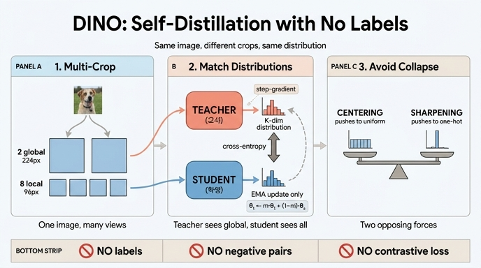

# DINO의 학습 원리를 한 문장으로 요약하면?

> **레이블도, negative pair도, contrastive loss도 없이 — 같은 이미지의 서로 다른 crop들을 같은 확률분포로 매핑하도록 학생 네트워크를 학습시키고, 교사는 학생의 EMA로만 갱신한다.**

DINO = **s**elf-**di**stillation with **no** labels ([Caron et al., ICCV 2021](https://arxiv.org/abs/2104.14294)).
이름 자체가 답이다: "레이블 없는 자기 증류(self-distillation)".

---

## 1. 왜 이 한 문장이 특이한가 — 무엇이 *없는지*부터

자기지도학습에서 보통 필요하다고 여겨지던 재료 세 가지가 DINO에는 없다.

| 없는 것 | 보통 쓰는 이유 | DINO는 대신 |
|---|---|---|
| **레이블** | 지도 신호 | 같은 이미지의 다른 crop이 곧 정답 쌍 |
| **negative pair** | "다른 것끼리는 멀어져라"로 붕괴 방지 | centering + sharpening 균형 |
| **contrastive loss** (InfoNCE 등) | positive/negative 대비 | 그냥 **cross-entropy** $H(P_t, P_s)$ |

`ImageFolder`가 레이블을 읽긴 하지만, `train_one_epoch`에서 `for it, (images, _) in ...`으로
**즉시 버려진다**. 클래스 디렉터리가 하나뿐이어도 학습은 정상적으로 돈다
(`main_dino.py` 학습 루프).

---

## 2. 문장의 앞 절: "다른 crop → 같은 확률분포"

### 2.1 출력이 벡터가 아니라 **분포**다

학생/교사는 구조가 완전히 동일한 $g_\theta = h_\theta \circ f_\theta$
(backbone $f$ + DINOHead $h$)이고, 출력 차원은 $K = 65536$ (`out_dim`, 프로토타입 수).
이 $K$차원 로짓에 softmax를 씌워 **확률분포**로 만든 뒤, 두 분포를 cross-entropy로 맞춘다.
즉 "특징 벡터를 가깝게"가 아니라 **"$K$개 프로토타입 위의 분포를 일치시켜라"** 다.

$$
P_s^{(v)}(k) = \frac{\exp(z_s^{(v)}(k)/\tau_s)}{\sum_j \exp(z_s^{(v)}(j)/\tau_s)}, \qquad \tau_s = 0.1
$$

$$
P_t^{(u)}(k) = \frac{\exp((z_t^{(u)}(k)-c_k)/\tau_t)}{\sum_j \exp((z_t^{(u)}(j)-c_j)/\tau_t)}, \qquad \tau_t : 0.04 \to 0.07
$$

### 2.2 "서로 다른 crop" = multi-crop 증강

한 이미지에서 $2+N$개 view를 만든다 ($N = 8$, `DataAugmentationDINO`).

| crop | 해상도 | `scale` (원본 면적 대비) | 특이 증강 |
|---|---|---|---|
| global 1 | 224 | $(0.4, 1.0)$ | GaussianBlur $p{=}1.0$ |
| global 2 | 224 | $(0.4, 1.0)$ | GaussianBlur $p{=}0.1$ + Solarization $p{=}0.2$ |
| local × 8 | 96 | $(0.05, 0.4)$ | GaussianBlur $p{=}0.5$ |

두 global crop의 증강이 **서로 다른 것**(BYOL에서 온 설계)은 의도적이다.
색·주파수 같은 저수준 단서로 쉽게 매칭되는 지름길을 막는다.

### 2.3 목적함수와 세 가지 비대칭

$$
\min_{\theta_s}\ \frac{1}{|\mathcal{N}|}\sum_{u\in V^{g}} \sum_{v\in V,\ v\neq u} H\big(P_{\theta_t}(u),\, P_{\theta_s}(v)\big),
\qquad H(a,b) = -\sum_k a_k \log b_k
$$

1. **교사는 global view만 본다** ($u \in V^g$, 2개), **학생은 전부 본다** ($v \in V$, 10개)
   → "96px 작은 조각을 보고 224px 전체가 만든 분포를 예측"하는 **local-to-global** 대응이 강제된다.
   이게 표현이 "물체 전체"를 담게 만드는 핵심 압력이다.
2. **$v = u$ 쌍 제외** → 같은 view끼리 맞추는 자명한 항이 없다.
3. **교사에는 gradient가 흐르지 않는다** (`.detach()`).

항의 개수는 $|\mathcal{N}| = 2(2+N) - 2 = 18$개 (한 이미지당).

---

## 3. 문장의 뒷 절: "교사는 학생의 EMA로만"

$$
\theta_t \leftarrow m\,\theta_t + (1-m)\,\theta_s, \qquad m : 0.996 \nearrow 1.0
$$

`main_dino.py:350` — `param_k.data.mul_(m).add_((1 - m) * param_q.detach().data)`
(in-place, `no_grad` 안에서).

- 교사는 **학습되지 않는다.** 옵티마이저도, gradient도 없다. 오직 학생 궤적의 지수이동평균.
- 교사는 대략 **최근 $\tau_{\text{eff}} = 1/(1-m)$ iteration**의 학생을 평균한 모델이다.
  $m = 0.996$이면 250 iteration, $m \to 1$이면 사실상 얼어붙는다 → 후반 타겟 안정화.
- 이 "평균 모델이 순간 모델을 가르친다"가 self-distillation의 실체다.
  교사가 학생보다 조금 낫기 때문에(모델 앙상블 효과) 부트스트랩이 성립한다.

> `momentum_teacher`가 너무 작으면 타겟이 요동쳐 붕괴한다.

---

## 4. 그런데 왜 붕괴하지 않는가 — DINO의 실질적 기여

negative pair가 없으므로, "모든 입력에 같은 값을 출력"하는 자명한 해로 무너질 수 있다.
cross-entropy를 분해하면 지름길이 보인다.

$$
H(P_t, P_s) = \underbrace{H(P_t)}_{\text{교사 분포 엔트로피}} + \underbrace{D_{\mathrm{KL}}(P_t \| P_s)}_{\text{두 view 정렬}}
$$

정렬을 배우지 않고 $H(P_t)$만 0으로 만들면 손실이 내려간다. 붕괴는 **두 방향**으로 일어난다.

| 붕괴 유형 | 증상 | 막는 장치 |
|---|---|---|
| **uniform collapse** | $P_t \to 1/K$, $H(P_t) \to \log K$ — 모든 입력이 같은 flat 분포 | **sharpening** ($\tau_t < \tau_s$) |
| **단일 프로토타입 collapse** | $P_t \to$ 항상 같은 one-hot, $H(P_t) \to 0$ | **centering** ($z_t - c$) |

두 장치는 **서로 반대 방향으로 민다**. sharpening은 one-hot 쪽으로, centering은 uniform 쪽으로.
하나만 있으면 붕괴한다 (논문 Fig. 5).

center는 배치 평균의 EMA다 (모든 GPU에 걸쳐):

$$
c \leftarrow m_c\, c + (1-m_c)\,\frac{1}{B\cdot W}\sum_i z_t(i), \qquad m_c = 0.9
$$

$W$가 world_size이므로 `update_center` 안에 `dist.all_reduce`가 있고,
**프로세스 그룹 없이는 `DINOLoss`가 아예 돌지 않는다.**

> 노트북 §7의 실험 결론: centering은 **엔트로피를 올리지 않는다**.
> 즉 두 장치는 서로를 대체하지 못한다 — centering은 "어떤 프로토타입이 뽑히나"의 균형,
> sharpening은 "얼마나 확신하나"를 담당한다.

보조 장치로 `freeze_last_layer`(첫 1 epoch 동안 마지막 층 gradient를 `None`으로)가
초기 프로토타입 진동을 막는다.

---

## 5. 한 장 요약 (노트북 §14)

```
ImageFolder (레이블 폐기)
   │
   ├─ DataAugmentationDINO ──▶ [g1(224), g2(224), l1..l8(96)]   비대칭 증강
   │
   ├─ teacher(g1, g2) ──▶ (2B, K) ──┐  centering(-c) + sharpening(τt=0.04) + detach
   │      ▲                          │
   │      │ EMA (m: 0.996↗1.0)       ▼
   ├─ student(전부)  ──▶ (10B, K) ──▶ DINOLoss = mean of 18 cross-entropy terms
   │      │                                        │
   │      └──── AdamW ◀── clip(3.0, per-tensor) ◀──┘ (+ epoch 0 은 last_layer 동결)
   │
   └─ 스케줄 4종: lr(warmup→cos↓) / wd(0.04→0.4↗) / m(0.996→1↗) / τt(0.04→0.07↗)
```

---

## 6. 답안을 재구성하는 체크리스트

이 카드의 답을 스스로 복원할 때 빠뜨리기 쉬운 조각들:

- [ ] **입력**: 같은 이미지의 서로 다른 crop (multi-crop: global 2 + local 8)
- [ ] **출력 형태**: 특징 벡터가 아니라 **$K$차원 확률분포**
- [ ] **맞추는 대상**: 학생 분포 → 교사 분포 (cross-entropy)
- [ ] **비대칭**: 교사=global만, 학생=전부 (local-to-global)
- [ ] **교사 갱신**: gradient 아님, 학생의 **EMA만**
- [ ] **없는 것 3종**: 레이블 / negative pair / contrastive loss
- [ ] (심화) 붕괴 방지: centering ↔ sharpening 균형

## 7. 흔한 오해

| 오해 | 사실 |
|---|---|
| "교사도 조금은 학습된다" | 아니다. gradient가 완전히 차단(`detach`)되고 EMA만으로 갱신된다. |
| "negative pair 없이 어떻게 붕괴를 막나 → stop-gradient 덕분" | stop-gradient만으로는 부족하다. **centering + sharpening**의 균형이 핵심이다. |
| "교사와 학생 구조가 다르다" | 구조는 완전히 동일. 다른 건 파라미터뿐이다. |
| "loss가 잘 내려가면 잘 학습된 것" | 사전학습에 검증셋이 없다. loss만 보면 붕괴를 놓친다 — k-NN(§12)이나 교사 엔트로피를 봐야 한다. |
| "$\tau_t$는 아무 값이나 괜찮다" | $\tau_t \ge \tau_s = 0.1$이면 학습 신호가 소멸한다. |

---

**소스**: `fm/training/.fm/assets/dino_training_walkthrough.py` §2 · §3 · §6 · §7 · §9 · §14,
저장소 `main_dino.py`(`DINOLoss` L363–, EMA L350, teacher/student forward L318–319).

## 인포그래픽


