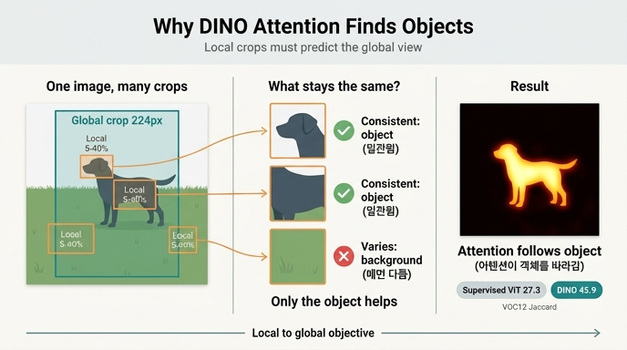

# DINO ViT의 어텐션이 객체 경계를 따라가는 이유

> **Q.** DINO ViT의 어텐션이 객체 경계를 따라가는 이유에 대한 직관은?
>
> **A.** local crop(면적 5~40%)이 global crop을 예측해야 하므로, 부분에서 전체를 식별할 수 있는 단서인 객체의 판별적 영역에 주의를 몰아야 한다. 배경은 crop마다 달라져 도움이 안 되지만 객체는 crop 간에 일관된다.

노트북 §13 「어텐션은 왜 물체를 찾는가」가 이 카드의 출처다. 아래는 그 한 문단을 다섯 단계로 풀고, 마지막에 이 직관이 **어디까지만 맞는지**까지 짚는다.

---

## ① 학습 과제: "조각으로 전체를 식별하라"

노트북 §2의 목적함수부터 보자. 한 이미지 $x$ 에서 만든 view 집합이

$$
V = \underbrace{\{x_1^{g},\, x_2^{g}\}}_{V^{g}\ (224\text{px, global})}\ \cup\ \underbrace{\{x_1^{l},\dots,x_{N}^{l}\}}_{96\text{px, local},\ N=8}
$$

일 때 최소화하는 것은

$$
\min_{\theta_s}\ \mathbb{E}_{x\sim\mathcal{D}}
\left[\ \frac{1}{|\mathcal{N}|}\sum_{u\in V^{g}}\ \sum_{\substack{v\in V\\ v\neq u}}
H\big(P_{\theta_t}(u),\, P_{\theta_s}(v)\big)\right],
\qquad H(a,b) = -\sum_{k} a_k \log b_k
$$

여기서 결정적인 비대칭은 **교사는 $u \in V^g$ (global view)만 본다**는 것이다. 학생은 96px local crop을 받아 놓고, 224px global crop을 본 교사의 출력 분포를 맞춰야 한다. 노트북의 표현대로 *"작은 조각을 보고 전체를 예측"* 하는 **local-to-global 대응이 손실 함수 수준에서 강제**된다.

crop의 면적 비율은 `DataAugmentationDINO`(`main_dino.py:419`)의 `RandomResizedCrop` `scale` 인자로 정해진다 — `scale`은 **원본 면적 대비 비율**이다.

| crop | 해상도 | `scale` | 특이 증강 |
|---|---|---|---|
| global 1 | 224 | $(0.4, 1.0)$ | GaussianBlur $p{=}1.0$ |
| global 2 | 224 | $(0.4, 1.0)$ | GaussianBlur $p{=}0.1$ + Solarization $p{=}0.2$ |
| local × 8 | 96 | $(0.05, 0.4)$ | GaussianBlur $p{=}0.5$ |

local의 상한 $0.4$ 가 global의 하한 $0.4$ 와 맞닿아 있어 **local crop은 항상 global 이하의 영역**을 본다(노트북 §3). 즉 "부분 → 전체"라는 방향이 우연이 아니라 스케일 구간 설계로 보장된다. $N=8$ 이면 이미지 하나당 $|\mathcal{N}| = 2(2+N)-2 = 18$ 개의 예측 항이 생기고, 그 대부분이 local→global 방향이다.

## ② crop 간 불변인 정보는 무엇인가

이제 "손실을 낮추려면 무엇을 봐야 하는가"를 따져 보자. 이미지를 면적 5~40%짜리 조각 8개로 잘랐을 때:

**객체 (예: 강아지)**
- 조각마다 **일부라도 들어갈 확률이 높다** (객체는 보통 프레임 중앙에 크게 있다).
- 들어간 부분이 귀든 코든 앞발이든, **정체(identity)는 동일**하다. 귀만 본 조각도 "이 강아지"라는 같은 답을 내놔야 한다.
- 따라서 객체 부위의 표현은 **crop을 바꿔도 같은 target 분포로 가야 하는, 재사용 가능한 신호**다.

**배경 (풀밭, 하늘, 벽)**
- 조각마다 **다른 부분**이 잡힌다. 왼쪽 풀, 오른쪽 풀, 위쪽 하늘.
- 그리고 텍스처가 대체로 균질해서, "이 풀 패치"는 **다른 이미지의 풀 패치와도 구별되지 않는다**. 인스턴스 판별에 무익하다.
- 게다가 DINO는 두 global crop의 저수준 통계를 일부러 어긋나게 만든다 — global 1은 blur $p{=}1.0$, global 2는 blur $p{=}0.1$ + solarize $p{=}0.2$ (BYOL 유래). 색·주파수 같은 **지름길 단서를 막는 설계**다. 배경을 "전체적인 색조"로 매칭하는 편법이 그만큼 손해를 본다.

정리하면, 손실의 관점에서 배경에 표현 용량을 쓰는 것은 **분산만 키우는 낭비**고, 객체의 판별적 영역에 쓰는 것만 손실을 실제로 낮춘다. 노트북 §13의 문장:

> 왜 이렇게 되는가에 대한 직관: local crop(96px, 면적 5~40%)이 global crop을 예측해야 하므로,
> 네트워크는 **부분에서 전체를 식별할 수 있는 단서** = 객체의 판별적 영역에 주의를 몰아야 한다.
> 배경은 crop마다 달라져 도움이 안 되고, 객체는 crop 간에 일관된다.
>
> — `dino_training_walkthrough.py:993-996`

## ③ 왜 하필 CLS 어텐션에 그게 나타나는가

ViT에서 최종 표현으로 head에 들어가는 것은 `[CLS]` 토큰 하나다. 즉 **CLS는 예측에 쓸 정보를 패치들로부터 모으는 집계 토큰**이고, "어느 패치에서 얼마나 모을지"의 가중치가 곧 CLS→패치 어텐션이다.

마지막 블록에서 CLS 행만 꺼내면 된다:

$$
A^{(h)} = \mathrm{softmax}\!\left(\frac{q^{(h)} k^{(h)\top}}{\sqrt{d_h}}\right)
\in \mathbb{R}^{(1+P)\times(1+P)},
\qquad a^{(h)} = A^{(h)}[0,\ 1:] \in \mathbb{R}^{P}
$$

$a^{(h)}$ 를 $\sqrt{P}\times\sqrt{P}$ 로 reshape 하고 patch_size 배 업샘플하면 히트맵이 된다.

②에서 "객체 패치가 판별에 유용하고 배경 패치는 무익하다"고 했으므로, 손실을 낮추는 최적 정책은 **CLS가 객체 패치에 어텐션 질량을 몰아주는 것**이다. 어텐션은 softmax라 총합이 1로 고정된 유한 자원이므로, 유용한 곳에 몰아주면 자동으로 무익한 곳에서 빠진다. 그 결과 히트맵이 객체 실루엣을 그리게 된다 — 아무도 세그멘테이션 레이블을 준 적이 없는데도.

여기에 ViT의 구조적 조건이 하나 더 붙는다. CNN과 달리 ViT는 **공간 정보를 마지막까지 명시적 토큰 격자로 유지**하고, CLS의 집계 가중치가 그 격자 위에 직접 노출된다. 그래서 "무엇을 봤는가"를 사후 해석(Grad-CAM 등) 없이 그냥 읽을 수 있다.

## ④ 논문의 실증: Fig. 1 / Fig. 4

이 현상은 DINO 논문(Caron et al., *Emerging Properties in Self-Supervised Vision Transformers*, ICCV 2021)의 대표 결과다.

- **Sec. 1**: "Self-supervised ViT features contain explicit information about the semantic segmentation of an image, **which does not emerge as clearly with supervised ViTs, nor with convnets.**" — 자기지도 + ViT 조합에서만 선명하게 나온다는 주장.
- **Fig. 1**: 지도 없이 학습한 ViT-S/8의 여러 헤드 CLS 어텐션을 겹쳐 보이며, "the model automatically learns class-specific features leading to unsupervised object segmentations"라고 설명한다.
- **Sec. 4.2**: "Self-supervised ViT features explicitly contain the scene layout and, in particular, object boundaries ... directly accessible in the self-attention modules."
- **Fig. 4 (와 딸린 표)**: 어텐션 맵을 **질량 60%를 남기도록 임계화**해 마스크를 만들고, PASCAL VOC12 val에서 GT와의 Jaccard 유사도를 잰다. (`visualize_attention.py`의 `--threshold 0.6`가 정확히 이 절차 — 헤드별로 어텐션을 정렬 후 `cumsum`해 상위 질량만 남긴다.)

| ViT-S/16 (VOC12 val) | Jaccard |
|---|---|
| Random weights | 22.0 |
| **Supervised** | **27.3** |
| **DINO** | **45.9** |
| DINO w/o multicrop | 45.1 |
| MoCo-v2 | 46.3 |
| BYOL | 47.8 |
| SwAV | 46.8 |

지도학습 ViT의 27.3은 랜덤 초기화(22.0)보다 겨우 5점 높다. DINO의 45.9는 **거의 두 배**다. "레이블 없이 배운 어텐션이 레이블로 배운 어텐션보다 객체를 훨씬 잘 분리한다"는 것이 이 표의 요지다.

## ⑤ 이 설명의 한계와 반론

카드의 직관은 **좋은 설명이지 증명이 아니다**. 세 가지를 짚어 두자.

**(a) 지도학습도 객체를 보긴 본다 — 다만 "최소한만" 본다.** 분류 손실은 "이게 개인가 고양이인가"만 맞히면 끝난다. 그러려면 클래스 판별에 충분한 **최소 부위**(귀 모양, 코, 텍스처 몇 조각)만 보면 되고, 나머지 객체 영역은 볼 유인이 없다. 그래서 지도 ViT의 어텐션은 객체의 일부 조각에 흩어지고 **경계 전체를 덮지 않는다**. 반면 DINO는 이미지 인스턴스 수준의 정체를 crop 간에 맞춰야 하므로, "어떤 조각이 잘려 나와도 같은 답"이 되려면 **객체 전 영역에 걸쳐** 일관된 표현이 필요하다. 이 차이가 27.3 vs 45.9의 그럴듯한 이유다.

**(b) multi-crop만의 공이 아니다 — 표가 직접 반박한다.** 위 표에서 **DINO w/o multicrop이 45.1**로, 풀 DINO의 45.9와 거의 차이가 없다. 게다가 multi-crop을 쓰지 않는(혹은 다르게 쓰는) MoCo-v2(46.3), BYOL(47.8), SwAV(46.8)도 비슷하거나 더 높다. 즉 "local→global 예측 때문에 어텐션이 객체를 찾는다"는 인과 주장을 표가 그대로 뒷받침하지는 않는다. 더 정확한 서술은 **"자기지도 인스턴스 판별 + ViT" 조합 일반의 창발적 성질**이고, local-to-global은 그 성질을 **이해하기 쉬운 형태로 요약한 직관**에 가깝다. (DINO가 유명해진 것은 이 성질을 처음 부각시키고 시각화 도구까지 함께 낸 덕이 크다.)

**(c) 완전한 이론은 없고, 어텐션 맵 자체도 깨끗하지 않다.** 왜 crop 불변성 목적이 하필 **공간적으로 국소화된** 어텐션으로 귀결되는지에 대한 형식적 설명은 아직 없다. 실무적으로도 어텐션 맵은 노이즈가 있고, 헤드마다 다른 것을 본다(어떤 헤드는 객체, 어떤 헤드는 배경/전역 통계). 후속 연구 *Vision Transformers Need Registers*(Darcet et al., 2023)는 DINOv2 등 큰 ViT에서 **정보가 적은 패치가 고노름(high-norm) "artifact" 토큰으로 재활용되어 어텐션 맵을 오염**시킨다는 것을 보이고, 더미 `[REG]` 토큰을 추가해 맵을 정리했다. "어텐션 맵 = 세그멘테이션"은 근사일 뿐이다.

## ⑥ 이 성질을 활용한 후속 연구

DINO 특징이 객체 경계를 담고 있다는 사실은 **비지도 객체 발견(unsupervised object discovery)** 이라는 분야를 사실상 열었다. **LOST**(Siméoni et al., 2021)는 사전학습된 DINO의 마지막 층 특징으로 이미지 내 패치 간 유사도를 계산해 레이블 없이 객체를 국소화한다(한 이미지에 하나만 찾는 한계). **TokenCut**(Wang et al., 2022)은 DINO 패치 토큰으로 그래프를 만들고 **normalized cut**(스펙트럼 클러스터링)으로 전경을 분리해 의사 레이블 품질을 크게 끌어올렸다 — 역시 단일 인스턴스 위주. 이후 **CutLER**, **CuVLER**, **CutS3D** 등이 이를 다중 객체/검출로 확장했고, **DINOv2**(2023)는 같은 계열의 학습을 대규모로 밀어붙여 밀집(dense) 다운스트림 태스크(깊이, 세그멘테이션)까지 frozen feature만으로 처리한다. 공통 패턴은 하나다 — **레이블 없이 학습된 ViT 특징 안에 이미 장면 레이아웃이 들어 있으니, 그것을 고전적 그래프/클러스터링 알고리즘으로 꺼내 쓴다.**

## ⑦ 노트북 §13에서 실제로 확인하는 법

노트북은 히트맵을 이렇게 뽑는다:

```python
img = eval_tf(raw).unsqueeze(0).to(DEVICE)
w_f = img.shape[-1] // PATCH

with torch.no_grad():
    a = teacher.backbone.get_last_selfattention(img)       # (1, heads, 1+P, 1+P)
nh = a.shape[1]
cls_attn = a[0, :, 0, 1:].reshape(nh, w_f, w_f)            # CLS 행만, CLS 자기 자신 제외
cls_attn = F.interpolate(cls_attn.unsqueeze(0), scale_factor=PATCH,
                         mode="nearest")[0].cpu().numpy()
```

핵심은 `a[0, :, 0, 1:]` — 배치 0, 모든 헤드, **0번 행(CLS 쿼리)**, **1번 열부터(CLS 자신을 제외한 패치 키)**. 이걸 격자로 되돌리고 patch_size 배 확대하면 원본 해상도 히트맵이 된다.

**단, 노트북에서 이 셀을 그대로 돌리면 아무 구조도 안 보인다.** 셀 제목이 이미 그렇게 말한다 — *"미니 학습한 ViT-Tiny/16의 CLS→패치 어텐션 (아직 구조 없음)"*. 수십 step 학습으로는 이 성질이 창발하지 않는다(§12의 k-NN 숫자를 믿지 말라는 경고와 같은 맥락). 제대로 보려면 **공식 사전학습 가중치**가 필요하고, 노트북도 그 명령을 그대로 안내한다:

```bash
python visualize_attention.py --arch vit_small --patch_size 8 \
    --image_size 480 480 --threshold 0.6 --output_dir out/dino_attn
```

`--patch_size 8`은 패치를 잘게 쪼개 경계를 더 선명하게 보기 위함이고, `--threshold 0.6`은 ④에서 말한 **어텐션 질량 상위 60% 마스크**를 만들어 `mask_th0.6_head{j}.png`로 저장한다 — 논문 Fig. 4의 재현이다.

### 구현 상의 대가 한 가지

노트북 §13이 덧붙이는 트레이드오프도 알아 둘 것:

> `Attention.forward` 가 `return x, attn` 으로 **어텐션 맵을 항상 함께 반환**하는 것도
> 이 시각화를 위한 의도적 설계다. 대가로 `F.scaled_dot_product_attention`(FlashAttention)을
> 쓸 수 없어 $(B, \text{heads}, N, N)$ 행렬이 항상 메모리에 올라간다 — patch 8 + 큰 이미지에서 OOM의 주범.

즉 "어텐션이 객체를 찾는다"는 결과를 **눈으로 볼 수 있게 만든 대가**가 학습 속도와 메모리다. `--patch_size 8 --image_size 480 480`이면 $N = 1 + 60\times60 = 3601$ 이라 $N \times N$ 행렬이 헤드마다 1300만 원소가 된다.

---

## 한 줄 정리

**교사가 global만 보고 학생이 local(면적 5~40%)도 봐야 하는 비대칭 때문에, "조각으로 전체를 맞히는" 과제가 강제된다. 그 과제에서 유용한 신호는 crop 간에 일관된 객체뿐이고 배경은 crop마다 달라 무익하므로, 정보를 모으는 CLS 토큰의 어텐션이 객체 쪽으로 쏠린다.** 다만 논문 표(DINO w/o multicrop 45.1, BYOL 47.8)는 이것이 multi-crop 고유의 효과라기보다 **자기지도 ViT 일반의 창발적 성질**임을 시사한다 — 직관은 기억용으로 쓰고, 인과 주장으로는 아껴 쓰자.

### 출처

- `/home/sungwoo/projects/swcho/dino/fm/training/.fm/assets/dino_training_walkthrough.py` §2, §3, §13
- `/home/sungwoo/projects/swcho/dino/main_dino.py` `DataAugmentationDINO` (L419-464)
- `/home/sungwoo/projects/swcho/dino/visualize_attention.py` `--threshold` 처리 (L186-197)
- Caron et al., [Emerging Properties in Self-Supervised Vision Transformers](https://arxiv.org/abs/2104.14294) (ICCV 2021) — Sec. 1, Sec. 4.2, Fig. 1, Fig. 4
- Darcet et al., [Vision Transformers Need Registers](https://arxiv.org/pdf/2309.16588) (2023)
- [TokenCut](https://www.researchgate.net/publication/373215097_TokenCut_Segmenting_Objects_in_Images_and_Videos_with_Self-supervised_Transformer_and_Normalized_Cut), [Enhancing Object Discovery for Unsupervised Instance Segmentation and Object Detection](https://arxiv.org/html/2508.02386) (LOST/TokenCut 계보 정리)

## 인포그래픽


