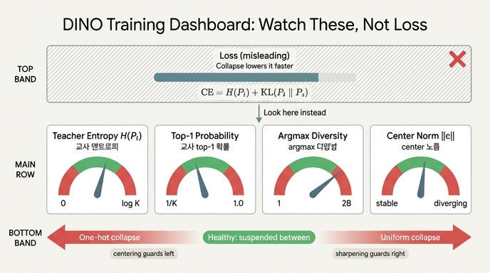

# DINO 학습을 지켜볼 때 loss 대신 봐야 하는 진단량 네 가지

> **Q.** DINO 학습을 지켜볼 때 loss 대신 봐야 하는 진단량 네 가지는?
>
> **A.** 교사 엔트로피 $H(P_t)$, 교사 top-1 확률 $\max_k P_t(k)$, 배치 내 argmax 프로토타입 다양성, center 노름 $\lVert c\rVert_2$ 다.

`main_dino.py` 의 사전학습 루프에는 **검증이 전혀 없다.** loss / lr / wd 만 로깅한다.
그리고 결정적으로 — **loss 값은 표현 품질과 상관되지 않는다. 붕괴는 loss를 *더 잘* 낮춘다.**
그래서 학습을 지켜볼 때 실제로 봐야 하는 것은 loss가 아니라 **교사 분포 $P_t$ 의 모양**이다.
네 진단량은 전부 그 모양을 서로 다른 각도에서 재는 계기다.

---

## 0. 표기와 기준선

$K$ = 프로토타입(head 출력) 차원. 노트북 설정은 ViT-Tiny/16, $K = 4096$.
교사 분포는 centering + sharpening 을 거친 뒤의 softmax다.

$$
P_t(k) \;=\; \mathrm{softmax}_k\!\left(\frac{z_t - c}{\tau_t}\right),
\qquad \tau_t = 0.04,\ \ \tau_s = 0.1
$$

| 기준선 | 값 (K = 4096) | 의미 |
|---|---|---|
| $\log K$ | $8.318$ nats | 엔트로피 **상한** = 완전 uniform |
| $1/K$ | $0.000244$ | top-1 확률 **하한** = 완전 uniform |
| $H = 0$ / top-1 $= 1$ | — | one-hot (단일 프로토타입 붕괴) |
| argmax 다양성 상한 | 교사 행 수 $= 2B$ | 교사는 global crop 2개만 보므로 배치 $B$ 에 대해 $2B$ 행 |

> 다양성 상한은 **배치 크기의 함수**다. batch 8 이면 교사 출력은 $2\times 8 = 16$ 행이므로 다양성의 최대값은 16이지 4096이 아니다. 절대값이 아니라 **$2B$ 대비 비율**과 **시간에 따른 추세**로 읽어야 한다. ($2B \ll K$ 인 보통의 경우 건강한 값은 상한에 가깝다.)

---

## 1. 네 진단량 한눈에

$p_t$ 는 `torch.no_grad()` 안에서 만든 `(2B, K)` 텐서 —
`p_t = F.softmax((teacher_output.float() - dino_loss.center) / teacher_temp, dim=-1)` — 라고 하자.

| 진단량 | 정의 (수식) | 계산 코드 한 줄 | 건강한 범위 | **단일 프로토타입 붕괴** | **uniform 붕괴** | 어느 장치의 상태인가 |
|---|---|---|---|---|---|---|
| **교사 엔트로피** | $H(P_t) = -\sum_k P_t(k)\log P_t(k)$ | `(-(p_t * p_t.clamp_min(1e-12).log()).sum(-1)).mean()` | $0 \ll H \ll \log K$ (예: $\log K$ 의 $0.7\!\sim\!0.95$ 배) | $\to 0$ | $\to \log K = 8.318$ | **sharpening** ($\tau_t$) 이 만드는 확신의 정도 |
| **교사 top-1 확률** | $\max_k P_t(k)$ | `p_t.max(-1).values.mean()` | $1/K \ll \cdot \ll 1$ | $\to 1$ | $\to 1/K = 0.00024$ | 같은 축(sharpening)의 **직관적 표현** |
| **argmax 다양성** | $\bigl|\{\arg\max_k P_t^{(i)}(k)\}_{i=1}^{2B}\bigr|$ | `p_t.argmax(-1).unique().numel()` | $2B$ 에 가깝게 | $\to 1$ | $\approx 2B$ (붕괴여도 높음) | **centering** 이 담당하는 marginal 균형 |
| **center 노름** | $\lVert c\rVert_2$, $c \leftarrow m c + (1-m)\bar z_t$ | `dino_loss.center.norm()` | 유한한 값으로 **수렴** | 발산 / 지속 상승 | 대체로 안정 | centering이 흡수 중인 **로짓 쏠림의 크기** |

**핵심**: 어느 하나도 단독으로는 두 붕괴를 다 잡지 못한다. `argmax 다양성`은 uniform 붕괴에서 멀쩡해 보이고, `엔트로피`만 보면 "낮음"이 병인지 건강인지 구분이 안 된다(§3).

---

## 2. 왜 loss는 부적절한가 — CE 분해가 만드는 지름길

DINO 손실은 교차엔트로피이고, 이것은 두 항으로 정확히 쪼개진다.

$$
\underbrace{H(P_t, P_s)}_{\text{로그에 찍히는 loss}}
\;=\;
\underbrace{H(P_t)}_{\text{교사 분포 자체의 엔트로피}}
\;+\;
\underbrace{D_{\mathrm{KL}}(P_t \,\Vert\, P_s)}_{\ \ge 0,\ \text{우리가 원하는 두 view 정렬}}
$$

- 우리가 **원하는** 학습은 둘째 항 $D_{\mathrm{KL}}$ 을 줄이는 것 — 서로 다른 crop이 같은 분포로 매핑되게 만드는 일이다.
- 그런데 최적화기는 첫째 항 $H(P_t)$ 를 깎아도 똑같이 loss가 내려간다. 정렬은 하나도 안 배우고 **교사를 뾰족하게 만들기만 해도** 되는 지름길이다.
- 학생은 한 스텝 안에서는 $P_t$ 를 못 건드리지만(`teacher_out ... .detach()`), **EMA로 자기 자신이 미래의 교사가 되므로** 시간축을 통해 $H(P_t)$ 를 끌어내릴 수 있다. 종착지가 단일 프로토타입 붕괴다.
- 반대편 극단인 uniform 붕괴에서는 loss가 $\log K$ 에 붙어 **꼼짝하지 않는다** — 이것도 loss만 보면 "수렴 안 하네" 정도로 보이지 붕괴로 안 읽힌다.

$$
\text{우리가 보고 싶은 값} \quad D_{\mathrm{KL}}(P_t\Vert P_s) \;=\; \underbrace{\mathcal{L}}_{\text{로그에 찍힘}} \;-\; \underbrace{H(P_t)}_{\text{따로 재야 함}}
$$

**loss에서 $H(P_t)$ 를 빼야 비로소 학습 신호가 보인다.** 네 진단량 중 첫 두 개는 바로 이 빼야 할 항을 재는 도구다.

---

## 3. 네 진단량은 어떻게 서로를 보완하나

```
            (얼마나 확신하나 — sharpening 축)
   H(P_t) → 0 ─────────────────────────────→ H(P_t) → log K
   top-1 → 1                                  top-1 → 1/K
   [단일 프로토타입 붕괴]      [건강]        [uniform 붕괴]

            (어느 프로토타입이 뽑히나 — centering 축)
   argmax 다양성 → 1  ←─── 쏠림 ───   다양성 ≈ 2B  [균형]
   ‖c‖₂ 발산                          ‖c‖₂ 수렴
```

- **엔트로피와 top-1 확률은 같은 축의 두 표현**이다. 둘 다 "교사가 얼마나 확신하는가"를 재고, sharpening($\tau_t$)이 지배한다. 엔트로피는 nats 단위라 $\log K$ 대비 비율로 읽기 좋고, top-1은 $[0,1]$ 확률이라 사람이 직관적으로 읽기 좋다. 하나만 봐도 되지만 둘을 같이 두면 **꼬리가 두꺼운지**(엔트로피는 낮은데 top-1은 안 높음 = 몇 개 프로토타입에 나뉘어 몰림)까지 구분된다.
- **argmax 다양성은 다른 축**이다. §7 패널 C의 요지 — centering은 **엔트로피를 올려주지 않는다**. centering이 담당하는 것은 marginal 균형, 즉 "배치 안에서 어느 프로토타입이 뽑히는가"의 분산이다. $\tau_t = 0.04$ 면 centering이 있든 없든 $H(P_t)$ 는 낮게 나오지만, centering이 없으면 argmax가 **한 프로토타입으로 수렴**한다. 그래서 낮은 엔트로피가 "건강한 확신"인지 "붕괴"인지는 **다양성이 판정한다.**
- **center 노름은 조기 신호**다. $c$ 는 교사 로짓의 배치 평균 EMA이므로, 특정 프로토타입 방향으로 로짓이 쏠리기 시작하면 $\lVert c\rVert_2$ 가 **먼저** 커진다. 아직 다양성이 무너지기 전에도 "centering이 점점 큰 편향을 흡수하고 있다"를 보여준다. 노름이 계속 커진다 = 모델이 붕괴 쪽으로 계속 밀고 있고 centering이 그걸 겨우 상쇄하고 있다는 뜻.

> §7 실험 B가 이 분업을 직접 보여준다: 프로토타입 0에 `bias = 2.0` 을 심어두면 centering 없이는 argmax가 프로토타입 0을 독식하고, centering이 있으면 학습된 `c[0]` 가 그 bias(2.0)를 흡수해 argmax가 흩어진다.

---

## 4. §11 실측: loss가 가장 낮은 설정이 가장 망가진 설정이다

노트북 §11은 **같은 미니 학습 루프를 세 설정으로** 돌린다 (ViT-Tiny/16, $K = 4096$, batch 8, 3 epoch × 75 iter = 225 step, 세 런 합쳐 675 step / 약 60초).

| 설정 | centering | $\tau_t$ | **loss** 처음→끝 | $H(P_t)$ 처음→끝 | 교사 top-1 처음→끝 | argmax 다양성(16행 중) |
|---|---|---|---|---|---|---|
| DINO (center + sharpen) | O | 0.04 | 8.076 → **8.114** | 7.212 → 7.408 | 0.018 → 0.018 | 9 → 8 |
| **centering 제거** | X | 0.04 | 8.076 → **6.628** | 7.151 → **5.862** | 0.020 → **0.192** | 9 → **5** |
| sharpening 제거 | O | 0.10 $(=\tau_s)$ | 8.332 → **8.331** | 8.134 → 8.188 | 0.002 → 0.001 | 9 → 9 |

기준선: $\log K = 8.318$, $1/K = 0.00024$, 다양성 상한 $2B = 16$.

**읽는 법 — 진단량이 붕괴를 잡아내는 순간:**

- **centering 제거**가 세 설정 중 loss를 **가장 많이 내린다** ($8.076 \to 6.628$, $-1.45$). loss만 보면 "이 설정이 제일 잘 배운다"로 읽힌다.
  그런데 같은 구간에서 $H(P_t)$ 가 $7.151 \to 5.862$ 로 $-1.29$ 내려갔다. **loss 감소분 1.45 중 1.29가 $H(P_t)$ 항에서 나온 것**이고, 정렬($D_{\mathrm{KL}}$)이 기여한 몫은 0.16 남짓이다. 지름길을 탔다는 **정량적 증거**다.
  동시에 top-1 $0.020 \to 0.192$ (약 10배), argmax 다양성 $9 \to 5$ — **세 진단량이 동시에** 단일 프로토타입 붕괴를 가리킨다.
- **sharpening 제거** ($\tau_t = \tau_s = 0.1$) — loss는 $8.332 \to 8.331$, 사실상 정지. $H(P_t) = 8.188$ 이 $\log K = 8.318$ 의 **98.4%**, top-1 $= 0.001$ 로 $1/K$ 수준. 완전 uniform 평탄면이다. **여기서 다양성은 9 → 9 로 멀쩡하다** — 다양성 하나만 봤으면 못 잡았을 붕괴를 엔트로피/top-1이 잡는다.
- **DINO(정상)** — loss가 $8.076 \to 8.114$ 로 **오히려 살짝 올라간다**. 그런데 $H(P_t) = 7.408$ 은 $\log K$ 의 89%로 확실히 아래, top-1 $= 0.018$ 은 $1/K$ 의 74배로 확실히 위, 다양성 8/16 유지. 두 붕괴 영역 **사이에 매달려 있는** 건강한 상태다.

> **한 줄**: loss가 가장 낮은 설정이 가장 망가졌고, 가장 건강한 설정은 loss가 올라갔다.
> 그리고 이 구간(수백 step)으로는 어차피 표현이 학습되지 않는다 — DINO의 loss는 초반 오랫동안 $\log K$ 근처 평탄면에 머물고 구조는 그 위에서 서서히 생긴다(ImageNet ViT-S/16, 8 GPU, 100 epoch에 약 1.75일). 여기서 확인한 건 "파이프라인이 돌고, 진단량이 붕괴 영역으로 떨어지지 않는다" 뿐이다.

---

## 5. 실제 학습 루프에 넣는 최소 로깅 코드

`train_one_epoch` 의 EMA 갱신 직후, `torch.no_grad()` 블록 안에서 계산한다.
`teacher_output` 은 이미 forward에서 만들어져 있으므로 **추가 forward가 없다** — 오버헤드는 softmax 한 번뿐이다.

```python
import math, torch, torch.nn.functional as F

@torch.no_grad()
def dino_diagnostics(teacher_output, dino_loss, epoch):
    """teacher_output: (2B, K) raw logits — DINOLoss가 받은 그 텐서 그대로."""
    temp = dino_loss.teacher_temp_schedule[epoch]          # warmup 반영
    p_t = F.softmax((teacher_output.float() - dino_loss.center) / temp, dim=-1)
    return {
        "H_t":   (-(p_t * p_t.clamp_min(1e-12).log()).sum(-1)).mean().item(),
        "top1":  p_t.max(-1).values.mean().item(),
        "uniq":  p_t.argmax(-1).unique().numel(),          # 상한 = 2B
        "cnorm": dino_loss.center.norm().item(),
    }

# --- 학습 루프 안 (loss.backward()/optimizer.step()/EMA 갱신 이후) ---
if it % 50 == 0:
    d = dino_diagnostics(teacher_output, dino_loss, epoch)
    logK = math.log(args.out_dim)
    metric_logger.update(**d)
    print(f"H(P_t)={d['H_t']:.3f} ({d['H_t']/logK:.1%} of logK={logK:.3f})  "
          f"top1={d['top1']:.4f} (1/K={1/args.out_dim:.5f})  "
          f"uniq={d['uniq']}/{2*args.batch_size_per_gpu}  ||c||={d['cnorm']:.3f}")
```

주의점:

- **`.float()`** — AMP 하에서 `teacher_output` 이 fp16이면 softmax/log가 부정확해진다.
- **`clamp_min(1e-12)`** — $0\log 0$ 의 NaN 방지.
- **`center` 를 빼야** DINOLoss가 실제로 쓰는 분포와 일치한다. raw 로짓으로 계산하면 다른 값이 나온다.
- **`teacher_temp_schedule[epoch]`** — warmup 구간에서 $\tau_t$ 가 변하므로 상수 0.04를 박아 넣으면 안 된다.
- DDP에서 `uniq` 는 **로컬 랭크의 배치**에 대한 값이다. 랭크별로 로깅하거나 `all_gather` 후 계산할 것. `H_t`/`top1` 은 평균이라 랭크 평균으로 충분하다.

---

## 6. 경보 규칙 (alerting) 예시

$\log K$ 와 $1/K$, $2B$ 를 기준으로 임계값을 정하면 규칙이 하드웨어/차원 설정에 안 묶인다.

| 경보 | 조건 (수백 step 이동평균 기준) | 의심 | 처방 |
|---|---|---|---|
| **A. uniform 정체** | $H(P_t) > 0.95 \log K$ 가 계속 유지 **AND** top-1 $< 10/K$ | uniform 붕괴 | $\tau_t$ 확인 — $\tau_t < \tau_s$ 인가? `warmup_teacher_temp` 가 너무 높게 오래 유지되나? |
| **B. 단일 프로토타입 붕괴** | $H(P_t) < 0.20 \log K$ 로 급락 **AND** top-1 상승 추세 | one-hot 붕괴 | centering이 살아 있나(`update_center` 호출, DDP `all_reduce`), `center_momentum` 이 너무 1에 가깝지 않나 |
| **C. 다양성 고갈** | argmax 다양성 $< 0.25 \times 2B$ | marginal 쏠림 | centering 문제. B보다 **먼저** 뜨는 경우가 많다 |
| **D. center 발산** | $\lVert c\rVert_2$ 가 단조 증가하며 수렴 안 함 | 로짓 쏠림 진행 | 가장 **이른** 신호. lr / `freeze_last_layer` / grad clip 점검 |
| **E. loss 급락** | loss가 빠르게 내려가는데 $H(P_t)$ 도 같은 폭으로 내려감 | 지름길 학습 | $\Delta\mathcal{L} \approx \Delta H(P_t)$ 면 정렬을 안 배운 것 |

읽는 순서 권장: **D(조기) → C → B/A(확정)**. 그리고 어떤 경보든 최종 판정은 §12의 **k-NN 평가**로 — 사전학습 루프에 검증이 없으므로 표현 품질은 따로 재야 한다 (backbone 얼리고 CLS 특징 L2 정규화 후 코사인 20-NN, $T=0.07$).

> 참고 (§11 수치에 규칙 적용): sharpening 제거 런은 $8.188 / 8.318 = 98.4\% > 95\%$ → **경보 A**. centering 제거 런은 다양성 $5 < 0.25\times 16 = 4$ 는 아직 아니지만 top-1이 10배 뛰고 $\Delta\mathcal{L} \approx \Delta H$ → **경보 E**가 먼저 뜬다. 225 step만 돌린 축소 실험이라 B의 급락 조건까지는 안 갔지만, 추세는 이미 명확하다.

---

## 7. 세 줄 요약

1. loss는 $H(P_t) + D_{\mathrm{KL}}$ 이고, 붕괴는 **첫 항을 깎는 지름길**이라 loss를 *더 잘* 낮춘다.
2. 그래서 **교사 엔트로피 $H(P_t)$ / top-1 확률 $\max_k P_t(k)$ / argmax 다양성 / center 노름 $\lVert c\rVert_2$** 네 가지를 본다 — 앞 둘은 sharpening 축, 셋째는 centering 축, 넷째는 조기 경보.
3. 기준선은 $\log K$, $1/K$, $2B$. 건강한 상태란 이 극단들 **사이에 매달려 있는** 것이지 어느 한쪽으로 수렴하는 것이 아니다.

---

## 인포그래픽


