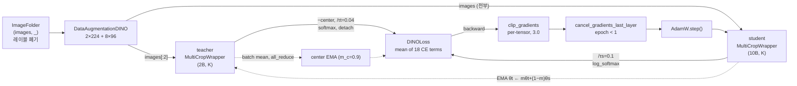

# DINO 학습 파이프라인 한 줄 요약 — 마디별 해부

> **Q.** DINO 학습 파이프라인 전체를 한 줄로 요약하면?
>
> **A.** `ImageFolder`(레이블 폐기) → `DataAugmentationDINO`로 비대칭 multi-crop → teacher(global 2개, centering+sharpening+detach) / student(전부) → 18개 교차엔트로피 항 평균 → clip(per-tensor)+AdamW → EMA teacher 갱신.

이 한 줄은 `main_dino.py`의 `train_dino` → `train_one_epoch` 흐름을 **여섯 마디**로 압축한 것이다.
아래에서 각 마디를 한 절씩 풀고, 마지막에 "비대칭"·"붕괴 방지"·"스케줄"을 축별로 다시 모은다.

---

## 0. 마디 요약표

$B$ = `batch_size_per_gpu`, $N$ = `local_crops_number` (기본 8), $K$ = `out_dim` (기본 65536).

| # | 마디 | 코드 위치 (`main_dino.py`) | 입력 → 출력 shape | 핵심 하이퍼파라미터 | 이 마디가 없으면 무너지는 것 |
|---|---|---|---|---|---|
| 1 | `ImageFolder` (레이블 폐기) | `train_dino:145`, `train_one_epoch`의 `for it, (images, _)` | 디스크 이미지 → `(images, _)` | `--data_path`, `batch_size_per_gpu` | **자기지도**라는 전제 자체. 레이블을 쓰면 그냥 지도학습 |
| 2 | `DataAugmentationDINO` | `DataAugmentationDINO.__call__:458` | PIL 1장 → 텐서 리스트 길이 $2+N$<br>`[2×(B,3,224,224), 8×(B,3,96,96)]` | `global_crops_scale=(0.4,1.0)`, `local_crops_scale=(0.05,0.4)`, `local_crops_number=8` | **불변성의 정의**. 증강이 없으면 "같아야 할 두 view"가 없어 목적함수가 성립 안 함 |
| 3 | teacher / student forward | `train_one_epoch:~320`, `utils.MultiCropWrapper` | teacher: `images[:2]` → $(2B, K)$<br>student: `images` 전부 → $(10B, K)$ | `arch`, `patch_size`, `out_dim`, `norm_last_layer`, `drop_path_rate` | **local-to-global 대응**. teacher가 전부 보면 "부분→전체" 예측 압력이 사라짐 |
| 4 | `DINOLoss` (18항 평균) | `DINOLoss.forward:380`, `update_center:407` | $(10B,K)+(2B,K)$ → scalar | $\tau_s=0.1$, $\tau_t: 0.04\!\to\!0.07$, `center_momentum=0.9` | **붕괴 방지**. centering/sharpening이 여기 심겨 있음 |
| 5 | clip(per-tensor) + AdamW | `utils.clip_gradients`, `utils.cancel_gradients_last_layer`, `optimizer.step()` (`:332`–`:345`) | grad in-place 수정 | `clip_grad=3.0`, `freeze_last_layer=1`, `lr`, `weight_decay 0.04→0.4` | **초기 안정성**. ViT + 큰 head는 초반 grad 스파이크에 취약 |
| 6 | EMA teacher 갱신 | `train_one_epoch:348-350` | $\theta_t \leftarrow m\theta_t+(1-m)\theta_s$ | `momentum_teacher 0.996→1.0` | **타겟의 존재 이유**. teacher를 student로 그냥 복사하면 즉시 붕괴 |

---

## 1. `ImageFolder` — 레이블을 읽고 버린다

```python
dataset = datasets.ImageFolder(args.data_path, transform=transform)   # train_dino
...
for it, (images, _) in enumerate(metric_logger.log_every(...)):       # train_one_epoch
```

`ImageFolder`는 디렉터리 이름을 클래스로 읽지만, 루프에서 `_`로 즉시 폐기된다.
그래서 **클래스 디렉터리가 하나뿐이어도 학습이 정상적으로 돈다** — DINO가 "no labels"인 지점이 코드 상으로는 이 밑줄 한 글자다.

- `DistributedSampler(shuffle=True)` + `drop_last=True`. 배치 크기가 항상 $B$로 고정되는 것은 §4의 centering(배치 평균 EMA)이 안정적으로 동작하는 전제이기도 하다.
- 레이블은 사전학습에서 완전히 무용하고, 나중에 **평가(k-NN / linear probe)에서만** 다시 등장한다.

## 2. `DataAugmentationDINO` — 비대칭 multi-crop

이미지 하나 → 텐서 리스트 $2+N$개. 해상도별로 **내림차순 정렬**되어 나온다.

| crop | 해상도 | `scale` (원본 면적비) | 특이 증강 |
|---|---|---|---|
| global 1 | 224 | $(0.4, 1.0)$ | GaussianBlur $p=1.0$ |
| global 2 | 224 | $(0.4, 1.0)$ | GaussianBlur $p=0.1$ + Solarization $p=0.2$ |
| local × 8 | 96 | $(0.05, 0.4)$ | GaussianBlur $p=0.5$ |

- local의 상한 $0.4$ 가 global의 하한 $0.4$ 와 맞닿아 있어 **local crop은 언제나 global 이하 면적**을 본다.
- 두 global crop이 blur 확률·solarize 유무에서 서로 다른 것(BYOL 유래)은 의도적이다: 저수준 통계(색·주파수)로 두 view를 쉽게 매칭하는 지름길을 막는다.
- **암묵적 계약**: 리스트가 해상도별로 연속 정렬돼 있어야 한다. `MultiCropWrapper`가 `torch.unique_consecutive`로 그룹을 잡기 때문에, 순서를 섞으면 **에러 없이 조용히** backbone forward 횟수만 늘어난다.

## 3. teacher(global 2개) / student(전부)

두 네트워크는 **구조가 완전히 동일**하다 ($g_\theta = h_\theta \circ f_\theta$, backbone + `DINOHead`). 다른 것은 파라미터뿐.

```python
teacher_output = teacher(images[:2])   # global views only, (2B, K)
student_output = student(images)       # all views,          (10B, K)
```

`MultiCropWrapper`는 해상도가 같은 crop을 concat해서 backbone을 **2번만** 호출한다
(`[224,224,96,96,...]` → counts `[2,8]` → cumsum `[2,10]`), 그 특징을 이어붙인 뒤 head는 **한 번만** 통과시킨다.

`DINOHead` 마지막 층은 `weight_norm` + `weight_g=1` 고정(`norm_last_layer=True`)이라 로짓이

$$
z_k = \frac{v_k^\top \tilde u}{\lVert v_k\rVert} = \cos\angle(v_k, \tilde u) \in [-1, 1]
$$

즉 **$K$개 프로토타입 방향과의 코사인 유사도**다. 로짓 스케일이 구조적으로 묶여 초기에 한 프로토타입의 노름이 폭주하지 못한다 — 붕괴 방지 장치의 "0번째" 요소.

> teacher는 `requires_grad=False`이며, ViT는 BatchNorm이 없어 `teacher_without_ddp = teacher`가 된다(student만 DDP).

## 4. 18개 교차엔트로피 항 평균

view 집합 $V = V^g \cup \{x_1^l,\dots,x_N^l\}$, $V^g=\{x_1^g, x_2^g\}$ 에 대해

$$
\mathcal{L} = \frac{1}{|\mathcal{N}|}\sum_{u\in V^g}\sum_{\substack{v\in V\\ v\neq u}} H\big(P_t(u),\,P_s(v)\big),
\qquad H(a,b) = -\sum_k a_k\log b_k
$$

$$
|\mathcal{N}| = 2(2+N) - 2 = 2\cdot 10 - 2 = \boxed{18}
$$

학생/교사 분포:

$$
P_s^{(v)}(k) = \mathrm{softmax}\!\left(\frac{z_s^{(v)}}{\tau_s}\right)_k,\ \ \tau_s = 0.1 \text{ (고정)}
$$

$$
P_t^{(u)}(k) = \mathrm{softmax}\!\left(\frac{z_t^{(u)} - c}{\tau_t}\right)_k,\ \ \tau_t : 0.04 \to 0.07
$$

$$
c \leftarrow m_c\,c + (1-m_c)\frac{1}{B\cdot W}\sum_{i} z_t(i),\qquad m_c = 0.9
$$

- $W$는 world_size — `update_center` 안에 `dist.all_reduce`가 있어 **프로세스 그룹 없이는 `DINOLoss`가 돌지 않는다**.
- 교사 분포에 `.detach()`가 걸려 gradient는 학생 쪽으로만 흐른다.
- 18항이 나오는 이유: $u$는 global 2개, $v$는 10개 전부, 단 $v=u$인 자기 자신 쌍 2개만 제외. (2 global-to-global + 16 local-to-global)

**왜 이 손실이 붕괴하지 않는가** — 분해하면

$$
H(P_t, P_s) = \underbrace{H(P_t)}_{\text{교사 엔트로피}} + \underbrace{D_{\mathrm{KL}}(P_t\Vert P_s)}_{\text{두 view 정렬}}
$$

정렬을 배우지 않고 $H(P_t)$만 죽이는 지름길이 두 방향으로 있다:

| 붕괴 유형 | 증상 | 막는 장치 |
|---|---|---|
| uniform collapse | $P_t \to 1/K$, $H(P_t)\to\log K$ | **sharpening** ($\tau_t < \tau_s$) |
| 단일 프로토타입 collapse | $P_t \to$ 항상 같은 one-hot, $H(P_t)\to 0$ | **centering** ($z_t - c$) |

두 장치는 **서로 반대 방향으로 민다**(sharpening은 one-hot 쪽, centering은 uniform 쪽). 하나만 있으면 붕괴한다 — 논문 Fig. 5의 요지. 그리고 centering은 엔트로피를 올려주지 않으므로 둘은 서로를 대체하지 못한다.

## 5. clip(per-tensor) + AdamW

`utils.clip_gradients`는 `torch.nn.utils.clip_grad_norm_`과 **다르다.** 글로벌 노름이 아니라 **파라미터 텐서마다 개별로** 클리핑한다:

$$
g_p \leftarrow g_p \cdot \min\!\left(1,\ \frac{\texttt{clip}}{\lVert g_p\rVert_2 + \varepsilon}\right)\quad \text{for each } p
$$

옵티마이저 단계의 전체 순서(= `train_one_epoch` 한 스텝):

1. `it = len(data_loader) * epoch + it` — 글로벌 iteration
2. `param_group["lr"] = lr_schedule[it]`, weight decay는 **0번 param_group에만** (bias·Norm은 wd 제외 — `utils.get_params_groups`)
3. crop 리스트 → GPU
4. `teacher(images[:2])`
5. `student(images)`
6. `dino_loss(student_output, teacher_output, epoch)`
7. **NaN 가드**: `math.isfinite(loss.item())` 실패 → `sys.exit(1)`
8. `backward` (AMP면 `fp16_scaler.scale(loss).backward()`)
9. `utils.clip_gradients(student, clip_grad=3.0)` — per-tensor
10. `utils.cancel_gradients_last_layer(epoch, student, freeze_last_layer)` — `epoch < freeze_last_layer`면 이름에 `last_layer`가 든 파라미터의 `grad`를 `None`으로
11. `optimizer.step()` (`AdamW`; convnet/대배치면 `LARS`)
12. EMA teacher 갱신

## 6. EMA teacher 갱신

```python
with torch.no_grad():
    m = momentum_schedule[it]
    for param_q, param_k in zip(student.module.parameters(), teacher_without_ddp.parameters()):
        param_k.data.mul_(m).add_((1 - m) * param_q.detach().data)
```

$$
\theta_t \leftarrow m\,\theta_t + (1-m)\,\theta_s,\qquad m: 0.996 \nearrow 1.0
$$

교사는 학생 궤적의 지수 이동평균이므로 대략 **최근 $\tau_{\text{eff}} = 1/(1-m)$ iteration**의 학생을 평균한 모델이다 ($m=0.996$이면 250 step). $m\to1$이면 교사가 사실상 얼어붙어 후반 타겟이 안정된다. 이것이 "self-distillation"에서 **teacher가 student보다 항상 조금 더 좋은** 이유(Polyak averaging 효과)이자, 붕괴를 막는 마지막 관성이다.

---

## 데이터 흐름 다이어그램



핵심은 두 개의 점선 되먹임이다: **student → teacher (EMA 파라미터)** 와 **teacher → center (EMA 통계)**. 둘 다 gradient가 아니라 이동평균으로만 갱신된다.

---

## "비대칭"은 어디에 몇 겹 있나

DINO는 사실상 **비대칭의 층층 쌓기**다. 네 겹으로 정리하면:

| 겹 | 비대칭 | 구체적으로 | 없으면 |
|---|---|---|---|
| ① **증강 비대칭** | 두 global crop의 증강 파이프라인이 다름 | g1: blur $p{=}1.0$ / g2: blur $p{=}0.1$ + solarize $p{=}0.2$ | 색·주파수 단서로 매칭되는 지름길이 열림 |
| ② **view 비대칭** (해상도/면적) | global 224px $(0.4,1.0)$ vs local 96px $(0.05,0.4)$ | local은 항상 global 이하 면적 | local-to-global "부분→전체" 압력 소멸 |
| ③ **경로 비대칭** (누가 무엇을 보나) | teacher는 $u\in V^g$만, student는 $v\in V$ 전부 | `teacher(images[:2])` vs `student(images)` | 16개의 local-to-global 항이 사라져 항이 2개만 남음 |
| ④ **gradient 비대칭** | teacher에 gradient가 흐르지 않음 | `p.requires_grad=False` + 손실 안 `.detach()` | 두 네트워크가 함께 자명해로 미끄러짐 (즉시 붕괴) |
| ⑤ **온도 비대칭** | $\tau_t = 0.04 < \tau_s = 0.1$ | teacher가 student보다 sharp = "더 확신에 차 있다" | $\tau_t \ge \tau_s$ 면 **학습 신호 자체가 소멸** |

(+ 보조로 **갱신 비대칭**: student는 AdamW로 한 스텝, teacher는 EMA로 아주 조금만.)

---

## 붕괴 방지 장치는 파이프라인 어느 마디에 심겨 있나

| 장치 | 심긴 마디 | 코드 위치 | 막는 것 |
|---|---|---|---|
| `norm_last_layer` ($g_k{=}1$ 고정) | ③ **모델** | `DINOHead.__init__` (`vision_transformer.py`) | 로짓 스케일 폭주 (프로토타입 노름 발산) |
| **centering** ($z_t - c$, $m_c{=}0.9$) | ④ **loss** | `DINOLoss.update_center` (`all_reduce` 필수) | 단일 프로토타입 독식 |
| **sharpening** ($\tau_t < \tau_s$) | ④ **loss** | `DINOLoss.forward` + `teacher_temp_schedule` | uniform collapse |
| `freeze_last_layer` (1 epoch) | ⑤ **옵티마이저 단계** | `utils.cancel_gradients_last_layer` | 초기 프로토타입 진동 |
| `clip_grad = 3.0` (per-tensor) | ⑤ **옵티마이저 단계** | `utils.clip_gradients` | 초반 grad 스파이크 |
| **EMA momentum** ($m: 0.996\to1$) | ⑥ **teacher 갱신** | `train_one_epoch` in-place `mul_/add_` | 타겟 요동 → 붕괴 |

즉 붕괴 방지는 한 군데에 몰려 있지 않고 **모델 / loss / optimizer step / teacher update 네 마디에 분산 배치**되어 있다.

---

## 스케줄 4종은 어디서 주입되나

`utils.cosine_scheduler`는 학습 **전에** `epochs × niter_per_ep` 길이의 numpy 배열을 통째로 만들고, 루프에서 `schedule[it]`로 조회한다. **스케줄러에 상태가 없으므로 resume이 자동으로 정확**하다.

$$
v_t=\begin{cases}\dfrac{t}{T_w}v_{\text{base}} & t < T_w\\[6pt]
v_{\text{final}}+\dfrac{1}{2}(v_{\text{base}}-v_{\text{final}})\Big(1+\cos\dfrac{\pi(t-T_w)}{T-T_w}\Big) & t \ge T_w\end{cases}
$$

| 스케줄 | 시작 → 끝 | 방향 | 주입 지점 |
|---|---|---|---|
| learning rate | $0 \to \texttt{lr} \to 10^{-6}$ | warmup 후 감소 | 마디 ⑤ — `param_group["lr"] = lr_schedule[it]` (**모든** param_group) |
| weight decay | $0.04 \to 0.4$ (**증가**) | 초기 자유 탐색 → 후반 표현 압축 | 마디 ⑤ — `param_groups[0]["weight_decay"]` (**0번만**; bias·Norm 제외) |
| teacher momentum $m$ | $0.996 \to 1.0$ | 증가 (교사를 점점 얼림) | 마디 ⑥ — `m = momentum_schedule[it]` |
| teacher temp $\tau_t$ | $0.04 \to \texttt{teacher\_temp}$ | linear warmup만 | 마디 ④ — `DINOLoss` **내부** `teacher_temp_schedule[epoch]` (iteration이 아니라 **epoch** 인덱스) |

lr에는 **linear scaling rule**이 먼저 적용된다:

$$
\texttt{lr}_{\text{eff}} = 0.0005 \times \frac{\texttt{batch\_size\_per\_gpu}\times\texttt{world\_size}}{256}
$$

> **함정**: `cosine_scheduler` 끝에 `assert len(schedule) == epochs * niter_per_ep`가 있다. `warmup_epochs`(기본 10) $>$ `epochs`면 여기서 죽는다. 짧은 스모크 테스트에는 `--warmup_epochs 0`이 필수.

---

## 학습이 끝나면 무엇이 남나

- **`checkpoint.pth`에는 student·teacher·optimizer·`dino_loss`(center 포함)가 모두 저장**되지만, 실제로 쓰는 것은 **teacher backbone** 하나다 (EMA라 student보다 좋다).
- **`DINOHead`는 통째로 버린다.** `out_dim=65536` 기준 ViT-S의 head는 22.4M으로 backbone(21.7M)보다 크다 — 공개 가중치가 21M인 이유이자, VRAM 계획에 head를 반드시 포함해야 하는 이유.
- **사전학습 루프에는 검증이 없다.** loss는 표현 품질과 상관되지 않으며 **붕괴가 오히려 loss를 더 잘 낮춘다.** 지켜봐야 할 것은 loss가 아니라 교사 분포의 모양(엔트로피 $H(P_t)$, top-1 확률, argmax 다양성, $\lVert c\rVert$)이다.
- **평가 프로토콜**: `eval_knn.py`는 학습 파라미터 **0개** — backbone을 얼려 CLS 특징을 L2 정규화 후 코사인 유사도로 20-NN 투표($T=0.07$); `eval_linear.py`는 `get_intermediate_layers(n=4)` 위에 선형층 하나만 학습한다.

---

## 노트북 §14 요약 표 (원문 인용)

```
ImageFolder (레이블 폐기)
   │
   ├─ DataAugmentationDINO ──▶ [g1(224), g2(224), l1..l8(96)]   비대칭 증강
   │
   ├─ teacher(g1, g2) ──▶ (2B, K) ──┐  centering(-c) + sharpening(τt=0.04) + detach
   │      ▲                          │
   │      │ EMA (m: 0.996↗1.0)      ▼
   ├─ student(전부)  ──▶ (10B, K) ──▶ DINOLoss = mean of 18 cross-entropy terms
   │      │                                        │
   │      └──── AdamW ◀── clip(3.0, per-tensor) ◀──┘ (+ epoch 0 은 last_layer 동결)
   │
   └─ 스케줄 4종: lr(warmup→cos↓) / wd(0.04→0.4↗) / m(0.996→1↗) / τt(0.04→0.07↗)
```

### 하이퍼파라미터가 하는 일 (§14)

| 파라미터 | 기본값 | 역할 | 잘못 주면 |
|---|---|---|---|
| `out_dim` $K$ | 65536 | 프로토타입 수 | 작으면 표현력 부족, 크면 head가 백본보다 커짐 |
| `teacher_temp` $\tau_t$ | 0.04 → 0.07 | sharpening | $\tau_t \ge \tau_s$ 면 학습 신호 소멸 |
| `student_temp` $\tau_s$ | 0.1 (고정) | 학생 분포 | — |
| `center_momentum` | 0.9 | centering EMA | 너무 크면 편향 추적 실패 |
| `momentum_teacher` | 0.996 → 1 | 타겟 안정성 | 작으면 타겟 요동 → 붕괴 |
| `local_crops_number` | 8 | local-to-global 항 수 | 0이면 multi-crop 무효화 |
| `freeze_last_layer` | 1 epoch | 초기 안정화 | 0이면 초기 진동 |
| `clip_grad` | 3.0 | per-tensor 클리핑 | — |
| `warmup_epochs` | 10 | lr warmup | `> epochs` 면 assert 실패 |

---

## 암기 포인트

한 줄을 다시 여섯 토막으로 끊어 외운다:

1. **레이블 폐기** — `(images, _)`
2. **비대칭 multi-crop** — 2×224 + 8×96, 두 global도 서로 다른 증강
3. **teacher 2개 / student 10개** — centering + sharpening + detach
4. **18항 평균** — $2(2{+}8)-2$, 자기 자신 쌍 제외
5. **per-tensor clip + AdamW** — 글로벌 노름 아님, epoch 0은 last_layer 동결
6. **EMA teacher** — $m: 0.996\nearrow1$, gradient 아님

그리고 "왜 안 무너지나?"의 답은 항상 **centering(uniform 쪽으로) ↔ sharpening(one-hot 쪽으로)의 균형** 한 문장이다.
