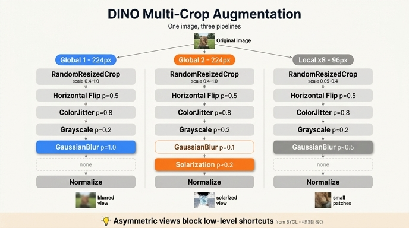

# DINO의 global crop 1 vs global crop 2 — 증강 차이

## 한 줄 요약

두 global crop은 **해상도(224px)도 같고 `RandomResizedCrop`의 scale $(0.4, 1.0)$도 같다**.
다른 것은 파이프라인 **끝부분의 두 단계**뿐이다.

- **global 1**: `GaussianBlur(p=1.0)` — 항상 블러
- **global 2**: `GaussianBlur(p=0.1)` + `Solarization(p=0.2)` — 거의 블러 없음, 대신 가끔 색 반전

---

## 1. 세 파이프라인 전체 대비

`main_dino.py`의 `DataAugmentationDINO.__init__`이 만드는 세 개의 `transforms.Compose`를
단계별로 나란히 놓으면 이렇다.

| 단계 | global 1 | global 2 | local × 8 |
|---|---|---|---|
| `RandomResizedCrop` | 224px, scale $(0.4, 1.0)$, BICUBIC | 224px, scale $(0.4, 1.0)$, BICUBIC | **96px**, scale $(0.05, 0.4)$, BICUBIC |
| `RandomHorizontalFlip` | $p=0.5$ | $p=0.5$ | $p=0.5$ |
| `ColorJitter` (0.4/0.4/0.2/0.1) | `RandomApply` $p=0.8$ | `RandomApply` $p=0.8$ | `RandomApply` $p=0.8$ |
| `RandomGrayscale` | $p=0.2$ | $p=0.2$ | $p=0.2$ |
| **`GaussianBlur`** | **$p=1.0$** | **$p=0.1$** | $p=0.5$ |
| **`Solarization`** | **없음** | **$p=0.2$** | 없음 |
| `ToTensor` + `Normalize` | ImageNet mean/std | ImageNet mean/std | ImageNet mean/std |

가운데 네 줄(`flip_and_color_jitter` + normalize)은 **세 파이프라인이 문자 그대로 같은 객체를
공유**한다. 코드상으로도 `flip_and_color_jitter`와 `normalize`를 한 번만 만들어 세 `Compose`에
끼워 넣는다. 즉 **차이는 오직 crop 크기·scale과, blur/solarize 두 줄**이다.

```python
# main_dino.py:435-455 (요약)
self.global_transfo1 = transforms.Compose([
    transforms.RandomResizedCrop(224, scale=global_crops_scale, interpolation=Image.BICUBIC),
    flip_and_color_jitter,
    utils.GaussianBlur(1.0),          # ← 항상
    normalize,
])
self.global_transfo2 = transforms.Compose([
    transforms.RandomResizedCrop(224, scale=global_crops_scale, interpolation=Image.BICUBIC),
    flip_and_color_jitter,
    utils.GaussianBlur(0.1),          # ← 거의 안 함
    utils.Solarization(0.2),          # ← global 2에만
    normalize,
])
```

> **주의**: `GaussianBlur(1.0)`의 인자 `1.0`은 반지름이 아니라 **확률 $p$** 다.
> 시그니처가 `__init__(self, p=0.5, radius_min=0.1, radius_max=2.)`라 첫 위치 인자가 `p`다.
> 여기서 `1.0`을 블러 강도로 오독하기 쉬운데, 강도는 매 호출마다 따로 뽑힌다(아래 참조).

`__call__`은 이 순서로 리스트를 만든다.

```python
crops = [global_transfo1(image), global_transfo2(image)]
crops += [local_transfo(image) for _ in range(local_crops_number)]
```

**global 2개가 반드시 먼저** 와야 한다. `MultiCropWrapper`가 `torch.unique_consecutive`로
해상도 그룹을 잡아 forward를 묶기 때문에, 순서를 섞으면 **에러 없이 조용히** backbone forward
횟수만 늘어난다. 또 손실에서 `teacher(images[:2])`로 앞의 두 개만 교사에 넣는 것도 이 순서 계약에
의존한다.

---

## 2. GaussianBlur가 이미지에 하는 일 — 주파수 제거

```python
# utils.py:36-54
class GaussianBlur(object):
    def __init__(self, p=0.5, radius_min=0.1, radius_max=2.):
        self.prob, self.radius_min, self.radius_max = p, radius_min, radius_max

    def __call__(self, img):
        do_it = random.random() <= self.prob
        if not do_it:
            return img
        return img.filter(ImageFilter.GaussianBlur(
            radius=random.uniform(self.radius_min, self.radius_max)))
```

동작은 두 단계다.

1. **적용 여부**: $\text{Bernoulli}(p)$. `random.random() <= self.prob`이므로 $p=1.0$이면 항상,
   $p=0.1$이면 10번에 1번꼴.
2. **강도**: 적용될 때 반지름 $r \sim \mathcal{U}(0.1,\ 2.0)$ 을 **매번 새로 뽑는다**. 그래서
   global 1도 "고정된 블러"가 아니라 거의 원본에 가까운 $r{=}0.1$부터 꽤 뭉개진 $r{=}2.0$까지
   섞인다.

가우시안 블러는 커널
$G(x,y) = \frac{1}{2\pi r^2}\exp\!\left(-\frac{x^2+y^2}{2r^2}\right)$
와의 합성곱, 즉 **저역통과 필터(low-pass filter)** 다. 주파수 영역에서 보면 곱해지는 것이
$\hat{G}(\xi) = \exp(-2\pi^2 r^2 \|\xi\|^2)$ 이므로 **고주파(에지·텍스처·노이즈)가 지수적으로
감쇠**한다. PIL은 이를 근사 박스필터 3회 통과로 구현한다.

의미: global 1은 **고주파가 깎인 view**, global 2는 **고주파가 대체로 살아 있는 view**다.
두 view의 스펙트럼 통계가 다르다.

---

## 3. Solarization이 이미지에 하는 일 — 픽셀 값 반전

```python
# utils.py:57-68
class Solarization(object):
    def __init__(self, p):
        self.p = p

    def __call__(self, img):
        if random.random() < self.p:
            return ImageOps.solarize(img)
        else:
            return img
```

`ImageOps.solarize(img, threshold=128)`은 기본 임계값 128로, 채널별 픽셀 값 $v \in [0,255]$ 에
대해

$$
v' = \begin{cases} v, & v < 128 \\ 255 - v, & v \ge 128 \end{cases}
$$

를 적용한다. 어두운 픽셀은 그대로 두고 **밝은 픽셀만 뒤집는다**. 결과적으로 밝기 히스토그램이
접히며(fold), 밝은 하늘이 어둡게 보이는 등 **색·밝기 단서가 크게 파괴**된다. 하지만 임계값
경계에서만 꺾이는 조각별 선형 변환이라 **에지 위치와 형태는 대체로 보존**된다 — "색은 못 믿게
하고 구조는 남긴다"가 정확히 노리는 바다.

주의할 점 두 가지:

- **단조 증가가 아니다**. brightness/contrast 같은 다른 photometric 증강과 달리 밝기 순서를
  깨뜨리므로, 네트워크가 "평균 밝기"로 두 view를 매칭하는 지름길을 무력화한다.
- **비교 연산이 미묘하게 다르다**: `GaussianBlur`는 `<=`, `Solarization`은 `<`. $p=0$ 일 때
  블러는 `random.random() <= 0`이 사실상 거의 항상 거짓이라 실질 차이는 없지만, 코드 읽을 때
  헷갈리기 쉬운 비대칭이다.

---

## 4. 왜 두 global view를 다르게 만드는가 — BYOL에서 온 비대칭

이 비대칭 설계는 DINO가 **BYOL**(Grill et al., 2020)에서 그대로 가져온 것이다. BYOL도 두 view
$T$ 와 $T'$ 를 서로 다른 확률로 만들었고, 그 값이 정확히 blur $1.0$ vs $0.1$, solarize $0.0$ vs
$0.2$ 였다. SimCLR 계열은 두 view에 **같은** 증강 분포를 쓰지만, BYOL 이후의 자기지도 학습은
비대칭 쪽이 더 잘 되는 것을 실험적으로 확인했다.

이유는 이렇게 정리된다.

**(a) 저수준 통계 단서를 지름길로 못 쓰게 만든다.**
두 view가 같은 분포에서 나오면, 모델은 "이 두 조각은 평균 색조가 비슷하다", "선명도가 같다"
같은 **표면적 통계만 맞춰도** 목적함수를 상당히 낮출 수 있다. 이건 의미 있는 표현이 아니라
지름길(shortcut)이다. 한쪽은 항상 블러, 다른 쪽은 거의 선명하게 만들면 **주파수 통계로는
매칭이 불가능**해지고, 한쪽에만 solarize를 걸면 **밝기·색상 통계로도 매칭이 불가능**해진다.
남는 유일한 공통 신호가 **"무엇이 찍혀 있는가"라는 의미 내용**이다. 워크스루의 표현대로
"색·주파수 같은 단서로 쉽게 매칭되는 지름길을 막는다".

**(b) 증강 불변성의 범위를 넓힌다.**
학생·교사가 맞춰야 하는 쌍이 (블러된 것, 선명한 것)이므로, 표현은 **블러 정도에 불변**해야 한다.
solarize 쌍도 마찬가지로 **극단적 색 변환에 불변**하도록 밀어붙인다. 대칭 증강에서는 이 두 축의
불변성이 훨씬 약하게만 학습된다.

**(c) 붕괴(collapse) 방지에 간접적으로 기여한다.**
DINO에는 negative pair가 없으므로 모든 출력이 같은 벡터로 무너질 위험이 있다. 이걸 막는 주된
장치는 centering + sharpening이지만, view 간 다양성이 클수록 표현이 "모두 같다"로 무너지기
어려워진다. 증강 다양성이 부족하면 실제로 학습이 잘 안 붕괴하는 대신 표현이 빈약해진다.

**(d) 그런데 왜 교사/학생 역할과 고정 결합하지 않나?**
DINO 손실은 $u \in V^g$ 인 **모든 global view를 교사 입력으로 순회**한다. 즉 global 1이 교사,
global 2가 학생으로 한 번 쓰이고, 반대로도 한 번 쓰인다 (대칭화). 그래서 "blurred가 항상 교사"
같은 편향은 생기지 않고, 두 방향 모두 학습된다.

---

## 5. 손실에서 실제로 어떤 쌍이 만들어지는가

$N = 8$ 이면 view 집합은

$$
V = \{x_1^g, x_2^g\} \cup \{x_1^l, \dots, x_8^l\}, \qquad |V| = 10
$$

이고, 교사는 $V^g$ 만, 학생은 $V$ 전부를 본다. $v = u$ 인 자명한 쌍을 빼면 항의 개수는

$$
|\mathcal{N}| = 2(2+N) - 2 = 18
$$

이다. 이 18개 중 **2개**가 (global 1 ↔ global 2) 쌍 — 위에서 말한 비대칭 증강 쌍 — 이고,
나머지 16개가 local-to-global 쌍이다.

---

## 6. local crop과의 관계 (보너스)

local은 blur $p=0.5$ 로 두 global의 **중간값**이고 solarize는 없다. 대신 결정적 차이는 scale이다.
local의 상한 $0.4$ 가 global의 하한 $0.4$ 와 정확히 맞닿아 있어, **local crop이 보는 면적은 항상
global crop 이하**다. 이 설계가 "작은 조각을 보고 전체를 예측"하는 local-to-global 대응을
기하학적으로 보장한다.

---

## 7. 자주 하는 착각 체크리스트

| 착각 | 실제 |
|---|---|
| global 1과 2는 crop 크기가 다르다 | 둘 다 224px, scale $(0.4,1.0)$ 로 **동일** |
| `GaussianBlur(1.0)`의 1.0은 블러 반지름 | **확률 $p$**. 반지름은 $\mathcal{U}(0.1, 2.0)$ 에서 매번 샘플링 |
| global 2는 블러를 안 한다 | $p=0.1$ 이므로 **가끔은** 한다 |
| Solarization이 global 2에 항상 걸린다 | $p=0.2$, 5번에 1번꼴 |
| local crop에도 solarize가 있다 | **없다**. blur $p=0.5$ 만 |
| ColorJitter/grayscale도 view마다 다르다 | 세 파이프라인이 **같은 `flip_and_color_jitter` 객체를 공유** |
| crop 리스트 순서는 상관없다 | global 2개가 앞에 와야 한다 (`unique_consecutive` + `teacher(images[:2])`) |

---

## 참고 위치

- `/home/sungwoo/projects/swcho/dino/main_dino.py` — `DataAugmentationDINO` (419–464행)
- `/home/sungwoo/projects/swcho/dino/utils.py` — `GaussianBlur` (36–54행), `Solarization` (57–68행)
- `.fm/assets/dino_training_walkthrough.py` — §3 데이터: multi-crop 증강 (150–220행)

## 인포그래픽


