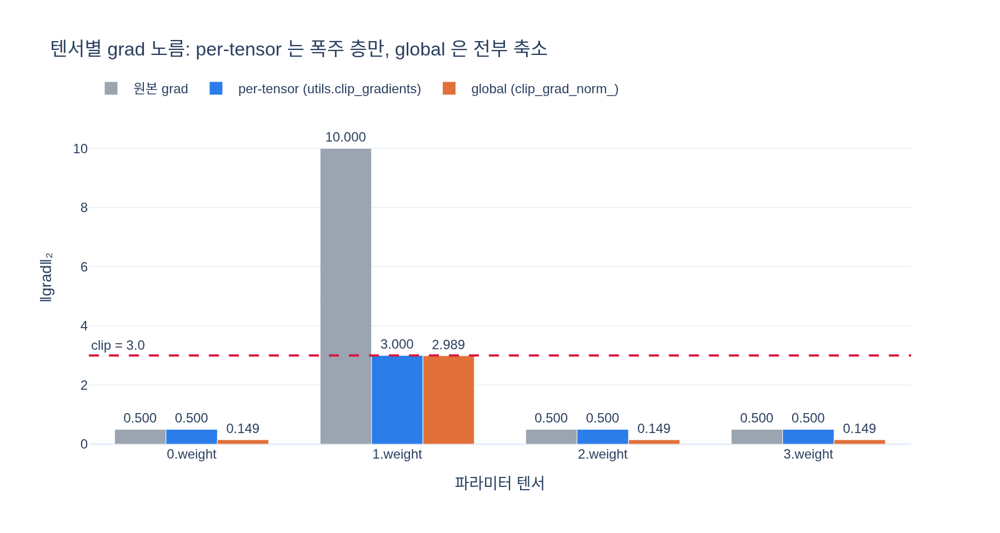

# `utils.clip_gradients` vs `torch.nn.utils.clip_grad_norm_`

## 한 줄 답

DINO 의 `utils.clip_gradients` 는 **전체 파라미터의 글로벌 노름**이 아니라
**파라미터 텐서마다 개별로** 노름을 재고 클리핑한다.

$$
g_p \leftarrow g_p \cdot \min\!\left(1,\ \frac{\texttt{clip}}{\lVert g_p \rVert_2 + \varepsilon}\right)
\qquad \text{for each } p
$$

이름이 비슷해서 같은 함수의 래퍼처럼 보이지만, **클리핑의 단위가 다르다.**

---

## 1. 두 수식의 대비

| | global (`clip_grad_norm_`) | per-tensor (`utils.clip_gradients`) |
|---|---|---|
| 노름 계산 단위 | 모든 grad 를 **한 벡터**로 이어붙임 | 파라미터 **텐서 하나씩** |
| 곱하는 계수 | **딱 하나** (모두 공유) | **텐서마다 다름** |
| gradient 방향 | 스칼라 배 → **보존** ($\cos = 1$) | 텐서 간 비율이 바뀜 → **회전** ($\cos < 1$) |
| 사후 보장 | $\lVert g \rVert_{\text{all}} \le c$ 정확히 | 각 텐서만 $\le c$, 전체는 보장 없음 |

**global**: 파라미터 grad 전부를 하나의 거대한 벡터 $g$ 로 보고 단일 계수를 곱한다.

$$
g \leftarrow g \cdot \min\!\left(1,\ \frac{c}{\lVert g \rVert_{\text{all}}}\right),
\qquad
\lVert g \rVert_{\text{all}} = \sqrt{\textstyle\sum_p \lVert g_p \rVert_2^2}
$$

방향 $g/\lVert g\rVert$ 는 그대로고 길이만 줄어든다. 이론적으로 깔끔하다 — "gradient 방향으로
가되 보폭만 제한한다"는 clipping 의 원래 의도 그대로다.

**per-tensor**: 텐서 $p$ 마다 독립적으로 $\min(1, c/(\lVert g_p\rVert_2+\varepsilon))$ 을 곱한다.
텐서마다 계수가 다르므로 **텐서 간 상대 크기가 바뀐다** → 이어붙인 전체 벡터의 방향이 회전한다.

### 장단점

- 👍 **한 층의 폭주가 다른 층의 grad 를 억누르지 않는다.**
  global 에서는 어느 한 층의 grad 가 터지면 $\lVert g\rVert_{\text{all}}$ 이 커져
  **멀쩡한 층들의 grad 까지 같은 비율로 축소**된다. 사실상 그 iteration 의 전역 학습률이
  폭주 층 때문에 깎이는 셈이다. per-tensor 는 문제의 텐서만 손보고 나머지는 그대로 둔다.
- 👎 **이론적 방향 왜곡.** 더 이상 gradient descent 방향이 아니다. 층별로 다른 축척을
  적용한 preconditioning 에 가깝다 (실용적으로는 Adam 이 어차피 좌표별 스케일링을 하므로
  영향이 덜하다는 논리도 가능).
- 👎 **글로벌 노름 상한이 없다.** 아래 §4 참조.

---

## 2. 구현 한 줄씩 읽기

```python
def clip_gradients(model, clip):                       # utils.py:132
    norms = []
    for name, p in model.named_parameters():
        if p.grad is not None:
            param_norm = p.grad.data.norm(2)           # 이 텐서만의 L2 노름
            norms.append(param_norm.item())            # ← GPU sync 1회
            clip_coef = clip / (param_norm + 1e-6)     # ← ε = 1e-6
            if clip_coef < 1:                          # ← 줄일 때만
                p.grad.data.mul_(clip_coef)
    return norms                                       # ← 클리핑 "전" 노름들
```

### `if clip_coef < 1` 을 왜 거는가

계수를 무조건 곱하면 $\lVert g_p \rVert < c$ 인 작은 텐서가 **$c$ 로 부풀려진다.**
클리핑은 "자르기"이지 "정규화"가 아니므로 임계값 아래는 손대지 않아야 한다.
$\min(1,\cdot)$ 을 코드로 옮긴 것이 바로 이 `if` 다.

### `+ 1e-6` 은 무엇인가

$\lVert g_p \rVert_2 = 0$ 인 텐서(freeze 된 층, 한 번도 쓰이지 않은 파라미터)에서
$c/0 = \infty$ 또는 NaN 이 되는 것을 막는 수치 안정화 항이다.
$\varepsilon$ 이 있으면 `clip_coef = 3/1e-6 = 3e6` 이 되고, `< 1` 이 아니므로
곱셈 자체가 일어나지 않아 grad 는 0 그대로 남는다.
(참고: `clip_grad_norm_` 도 내부적으로 `clip_coef = max_norm / (total_norm + 1e-6)` 로
같은 트릭을 쓴다.)

### `.item()` — 숨은 비용

`norms.append(param_norm.item())` 은 **텐서마다** `.item()` 을 호출한다.
`.item()` 은 GPU 텐서를 CPU 스칼라로 꺼내는 연산이라 **매번 device sync** 를 유발한다.
ViT-S/16 + DINOHead 는 파라미터 텐서가 **158개**(백본 150 + 헤드 8) 이므로,
**iteration 당 158 번의 GPU 동기화**가 발생한다. `clip_grad_norm_` 은 `foreach` 커널로
전 텐서의 노름을 한 번에 모아 계산하므로 sync 가 0~1 회다.

작은 배치·빠른 스텝에서는 이 158 회 sync 가 무시 못 할 오버헤드가 될 수 있다.
(개선하려면 `norms.append(param_norm)` 로 텐서를 그대로 모으고, 필요할 때만 한 번
`torch.stack(norms).cpu()` 하면 된다.)

### 반환값의 용도

반환 리스트는 **클리핑 적용 전** 노름들이다 — 즉 "지금 이 스텝에서 각 층의 grad 가
얼마나 컸는가"의 진단 정보. 층별 grad 폭주/소실을 로깅해 학습 붕괴 징후를 잡는 데 쓸 수 있다.

> `main_dino.py` 에서는 `param_norms = utils.clip_gradients(student, args.clip_grad)` 로
> 받아만 두고 **어디에도 쓰지 않는다** (죽은 변수). 직접 학습을 모니터링한다면
> 여기에 wandb/tensorboard 로깅을 붙이면 좋다.

---

## 3. `--clip_grad 3.0` 의 의미가 다르다

```python
parser.add_argument('--clip_grad', type=float, default=3.0, help="""Maximal parameter
    gradient norm if using gradient clipping. Clipping with norm .3 ~ 1.0 can
    help optimization for larger ViT architectures. 0 for disabling.""")
```

help 문구의 **"Maximal *parameter* gradient norm"** 이 정확한 표현이다 — 모델 전체가 아니라
**파라미터(텐서) 하나의** 최대 노름이다.

따라서 `3.0` 은 `clip_grad_norm_(..., 3.0)` 과 **강도가 전혀 다르다.**
텐서 158 개가 모두 임계값에 걸려 있는 최악의 경우 글로벌 노름은

$$
\sqrt{158} \times 3.0 \approx 37.7
$$

까지 커질 수 있다. per-tensor 3.0 은 global 3.0 보다 훨씬 **느슨한** 제약이다.
DINO 설정을 다른 코드베이스로 옮기면서 `clip_grad_norm_` 로 바꿔 끼우고 `3.0` 을 그대로
쓰면, 의도보다 **훨씬 강하게** 클리핑되어 학습이 느려진다. (`0` 을 주면 클리핑 자체가 꺼진다.)

---

## 4. 호출 위치 — backward 와 step 사이

`main_dino.py` `train_one_epoch` (1 iteration 해부의 8~11 단계):

```
loss.backward()                              # 8) AMP: fp16_scaler.scale(loss).backward()
  │
  ├─ [AMP 일 때만] fp16_scaler.unscale_(optimizer)
  │
  ├─ utils.clip_gradients(student, args.clip_grad)          # 9)  per-tensor 클리핑
  │
  ├─ utils.cancel_gradients_last_layer(epoch, student,      # 10) epoch<freeze_last_layer 면
  │                                    args.freeze_last_layer)    last_layer grad = None
  │
  └─ optimizer.step()                                       # 11) AMP: scaler.step + update
       └─ EMA teacher 갱신                                  # 12)
```

### AMP 에서 `unscale_` 이 반드시 먼저인 이유

`fp16_scaler.scale(loss).backward()` 직후의 grad 는 fp16 언더플로를 막으려고
스케일 팩터 $S$ (보통 $2^{k}$, 수만 단위) 배로 **부풀려진 상태**다.
이 상태로 클리핑하면 $\lVert S \cdot g_p \rVert_2$ 를 $3.0$ 과 비교하게 되어
거의 모든 텐서가 임계값에 걸리고, 결과적으로 **모든 grad 가 노름 3.0 으로 균일화**되는
말도 안 되는 일이 벌어진다. 그래서 `unscale_(optimizer)` 로 원래 스케일로 되돌린 뒤
클리핑해야 임계값 $3.0$ 이 의미를 갖는다.

또 `cancel_gradients_last_layer` 는 클리핑 **뒤**에 온다 — 어차피 grad 를 `None` 으로
날릴 파라미터지만, 순서상 클리핑을 먼저 통과하므로 반환 노름 리스트에는 포함된다.

---

## 5. 왜 DINO 는 per-tensor 를 골랐나

- `clip_gradients` 는 timm/DeiT 의 관행이 아니라 **DINO 저장소 자체의 유틸**이다
  (timm 의 `dispatch_clip_grad` 는 global norm 이 기본).
- ViT 자기지도 학습 초기에는 **특정 텐서만 국소적으로 폭주**하는 패턴이 흔하다:
  attention `qkv` 가중치, 그리고 특히 65536-way 프로토타입을 다루는 `head.last_layer`.
  global 클리핑이면 이 한 텐서 때문에 백본 전체의 grad 가 짓눌린다.
- 실제로 DINO 는 `freeze_last_layer=1` (첫 epoch 동안 마지막 층 grad 를 아예 `None` 으로)
  과 per-tensor 클리핑을 **함께** 써서 초기 불안정을 억제한다. 두 장치 모두
  "문제가 되는 특정 텐서만 국소적으로 처리한다"는 같은 철학이다.
- help 문구가 권하는 `.3 ~ 1.0` 범위(더 큰 ViT 일수록 강하게)도 텐서 단위 기준임에 유의.

---

## 6. 요약 표

| 항목 | `utils.clip_gradients` | `clip_grad_norm_` |
|---|---|---|
| 단위 | 파라미터 텐서별 | 모델 전체 |
| 계수 | 텐서마다 다름 | 하나 |
| 방향 | 회전 ($\cos<1$) | 보존 ($\cos=1$) |
| 폭주 층의 영향 | 그 층에만 국한 | 전 층 축소 |
| 글로벌 노름 보장 | 없음 ($\le \sqrt{N}c$) | $\le c$ |
| GPU sync | 텐서 수만큼 (ViT-S: 158) | 0~1 회 |
| 반환값 | 클리핑 **전** 텐서별 노름 리스트 | 클리핑 **전** 글로벌 노름 (스칼라 텐서) |
| in-place | grad 를 직접 수정 | grad 를 직접 수정 |

---

## 시각화

`clip=3.0`, 4층 장난감 모델에서 **2번째 층만 노름 10.0**, 나머지 0.5 로 두고 두 방식을 비교했다.
per-tensor 는 폭주한 층만 정확히 3.0 으로 자르고 나머지는 0.5 그대로 두는 반면,
global 은 공통 계수 $3/10.037 = 0.2989$ 를 곱해 **멀쩡한 층들까지 $0.5 \to 0.149$ 로 축소**한다.
(자세한 수치와 코사인 유사도 계산은 `expy.py` 참조 — per-tensor $\cos = 0.9811$, global $\cos = 1.0$)


