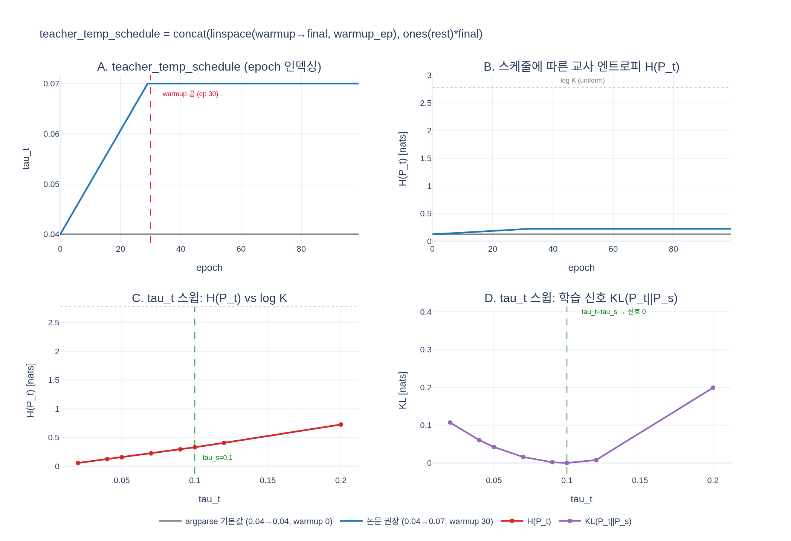

# `teacher_temp_schedule`은 어떻게 만들어지는가?

`main_dino.py`의 `DINOLoss.__init__`에서
`np.linspace(warmup_teacher_temp, teacher_temp, warmup_teacher_temp_epochs)`(선형 warmup 조각)와
`np.ones(nepochs - warmup_teacher_temp_epochs) * teacher_temp`(상수 조각)를 `np.concatenate`해
길이 `nepochs`의 배열로 만든다. `forward`에서는 `self.teacher_temp_schedule[epoch]`로 **epoch 단위** 조회한다.
초기 고온은 교사 분포를 평평하게 만들어 학습 신호를 약하게 하므로(τ_t → τ_s면 신호 소멸) warmup을 둔다.

- 실행 가능한 예제: [expy.py](expy.py)

## 시각화

