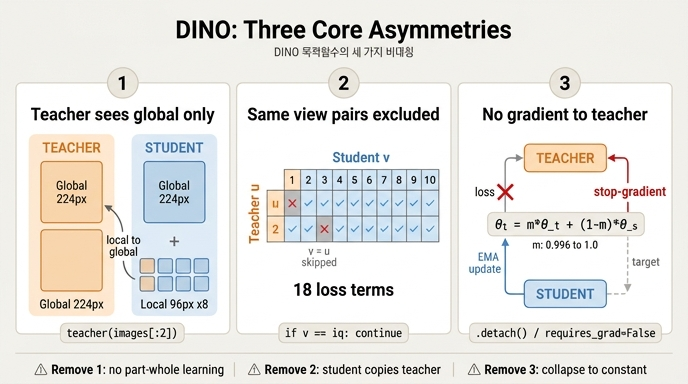

# DINO 목적함수의 핵심 비대칭 세 가지

## 한눈에

학생 $g_{\theta_s}$ 와 교사 $g_{\theta_t}$ 는 **구조가 완전히 같다**. 다른 것은 파라미터뿐이고,
레이블도 negative pair도 contrastive 항도 없다. 그런데도 붕괴하지 않고 표현이 학습되는 이유가
바로 목적함수에 박아 넣은 **세 가지 비대칭**이다.

한 이미지 $x$ 에서 만든 view 집합을

$$
V = \underbrace{\{x_1^{g},\, x_2^{g}\}}_{V^{g}\ (224\text{px, global})}\ \cup\ \underbrace{\{x_1^{l},\dots,x_{N}^{l}\}}_{96\text{px, local},\ N=8}
$$

라 하면 최소화 대상은

$$
\min_{\theta_s}\ \mathbb{E}_{x\sim\mathcal{D}}
\left[\ \frac{1}{|\mathcal{N}|}\sum_{u\in V^{g}}\ \sum_{\substack{v\in V\\ v\neq u}}
H\big(P_{\theta_t}(u),\, P_{\theta_s}(v)\big)\right],
\qquad H(a,b) = -\sum_{k} a_k \log b_k
$$

이 한 줄 안에 세 비대칭이 전부 들어 있다.

| # | 비대칭 | 수식에서 | 코드에서 |
|---|---|---|---|
| ① | 교사는 global view만, 학생은 전부 | $u \in V^g$ vs $v \in V$ | `teacher_output = teacher(images[:2])` / `student(images)` |
| ② | 같은 view 쌍 제외 | $v \neq u$ | `if v == iq: continue` |
| ③ | 교사에 gradient 없음, EMA로만 갱신 | $\theta_t \leftarrow m\theta_t + (1-m)\theta_s$ | `.detach()`, `p.requires_grad = False`, `param_k.data.mul_(m).add_(...)` |

항의 개수는 $|\mathcal{N}| = 2(2+N) - 2$ 이고, $N=8$ 이면 이미지당 **18개** 항이 만들어진다.

---

## ① 교사는 global view만 본다 — local-to-global

### 코드

`main_dino.py:318` (`train_one_epoch`):

```python
teacher_output = teacher(images[:2])  # only the 2 global views pass through the teacher
student_output = student(images)      # 전부 (global 2 + local 8 = 10)
```

`images` 리스트는 `DataAugmentationDINO` 가 만든 `[global1, global2, local1, ..., local8]` 순서다.
교사는 앞 2개(224px)만, 학생은 10개 전부(224px 2 + 96px 8)를 통과시킨다.
그래서 텐서 모양이 `teacher_output = (2B, K)`, `student_output = (10B, K)` 로 **비대칭**이다.
`DINOLoss.forward` 가 각각 `chunk(2)`, `chunk(ncrops=10)` 하는 것도 이 때문이다.

### 왜 이게 학습을 만드는가

교사 분포 $P_t(u)$ 는 224px 전체 맥락을 본 "정답"이고, 학생은 96px 짜리 좁은 조각 $v$ 로
그 정답을 맞춰야 한다. 즉 **"작은 조각만 보고 전체가 무엇인지 예측하라"** 는
local-to-global 대응이 손실 자체에 강제된다. 이게 DINO가 물체 경계에 반응하는
어텐션 맵을 만들어 내는 주된 압력이다.

### 없애면 무엇이 무너지는가

- **교사도 local view를 보게 하면**: 타겟이 "부분만 본 흐릿한 분포"가 되어 감독 신호의 품질이
  떨어지고, local↔local 매칭이 다수를 차지해 전체-부분 관계를 배울 이유가 사라진다.
  multi-crop이 주는 성능 이득(논문에서 가장 큰 단일 요인 중 하나)이 그대로 날아간다.
- **학생도 global view만 보게 하면**: 그냥 2-view BYOL류가 되고, 항 개수도 $18 \to 2$ 로 줄어
  이미지당 감독 신호가 9배 얇아진다. 계산은 싸지지만 표현 품질은 크게 떨어진다.
- 부수 효과: 교사가 global만 보므로 **연산량이 훨씬 싸다**. 무거운 224px forward를
  교사는 2번, 학생은 2번만 하고 나머지 8개는 96px라 거의 공짜다
  (`MultiCropWrapper` 가 같은 해상도끼리 묶어 배치 forward 하는 것도 이 구조를 전제로 한다).

---

## ② $v = u$ 인 같은 view 쌍은 제외한다

### 코드

`main_dino.py:396` (`DINOLoss.forward`):

```python
for iq, q in enumerate(teacher_out):          # iq = 0, 1  (global view 2개)
    for v in range(len(student_out)):         # v  = 0..9  (전체 crop 10개)
        if v == iq:
            # we skip cases where student and teacher operate on the same view
            continue
        loss = torch.sum(-q * F.log_softmax(student_out[v], dim=-1), dim=-1)
        total_loss += loss.mean()
        n_loss_terms += 1
```

`chunk` 인덱스가 crop 순서와 **정확히 정렬**되어 있다는 점이 핵심이다.
`teacher_out[0]` 과 `student_out[0]` 은 같은 픽셀(global1), `teacher_out[1]` 과
`student_out[1]` 도 같은 픽셀(global2)이다. 그래서 `v == iq` 하나만 걸러도
"같은 crop을 교사·학생이 동시에 본 항"이 정확히 제거된다.

제거되는 항은 $(0,0), (1,1)$ 두 개뿐이므로
$|\mathcal{N}| = 2 \times 10 - 2 = 18$. 노트북 §6이 이걸 assert로 확인한다:

```python
assert n_terms == 2 * (2 + 8) - 2 == 18
```

### 없애면 무엇이 무너지는가

$v = u$ 항은 **같은 입력에 대한 두 네트워크 출력을 맞추는 항**이다. 이 항은 view 불변성에 대해
아무것도 요구하지 않는다 — 증강이 개입하지 않으므로 "서로 다르게 보여도 같은 것"이라는
지식이 전혀 필요 없고, 학생이 교사를 **함수로 복제**하기만 하면 0에 가까워진다.

- **넣으면**: 손실을 줄이는 가장 쉬운 지름길이 "증강 불변성 학습"이 아니라
  "교사 파라미터 따라하기"가 된다. 교사가 학생의 EMA이므로 이건 자기 자신을 향한
  자명한 회귀이고, 20개 항 중 2개가 아무 정보 없는 방향으로 gradient를 섞는다.
- 실용적으로는 손실값이 인위적으로 낮아져 학습 진척을 오독하게 만든다.
  ($u \neq v$ 항만 남기면 손실은 정직하게 "다른 view끼리 얼마나 안 맞는가"를 잰다.)

---

## ③ 교사에는 gradient가 흐르지 않고 EMA로만 갱신된다

이 비대칭만 **세 겹**으로 걸려 있다.

### (a) 파라미터 자체가 gradient를 안 받는다 — `main_dino.py:209-211`

```python
# there is no backpropagation through the teacher, so no need for gradients
for p in teacher.parameters():
    p.requires_grad = False
```

그래서 `teacher(images[:2])` 가 `torch.no_grad()` **밖**에 있어도 안전하다
(노트북 §10의 4단계가 "`no_grad` 아님에 주의"라고 짚는 지점). 교사 파라미터가
leaf-with-grad가 아니므로 그래프가 파라미터 쪽으로 자라지 않는다.

### (b) 손실에서 교사 분포를 잘라낸다 — `main_dino.py:390`

```python
teacher_out = F.softmax((teacher_output - self.center) / temp, dim=-1)
teacher_out = teacher_out.detach().chunk(2)
```

$H(P_t, P_s) = -\sum_k P_t(k)\log P_s(k)$ 에서 $P_t$ 를 **상수 타겟**으로 고정하는 것이다.
`.detach()` 가 없으면 $P_t$ 를 통한 경로가 살아 있어(입력 텐서 쪽 그래프),
"학생을 타겟에 맞추는" 대신 "타겟을 학생 쪽으로 끌어내리는" 성분이 섞인다.

### (c) 갱신은 오직 EMA — `main_dino.py:347-350`

```python
with torch.no_grad():
    m = momentum_schedule[it]                      # 0.996 ↗ 1.0 (cosine)
    for param_q, param_k in zip(student.module.parameters(),
                                teacher_without_ddp.parameters()):
        param_k.data.mul_(m).add_((1 - m) * param_q.detach().data)
```

$$
\theta_t \leftarrow m\,\theta_t + (1 - m)\,\theta_s, \qquad m: 0.996 \nearrow 1.0
$$

교사는 학생 궤적의 지수이동평균이므로 **최근 $\tau_{\text{eff}} = 1/(1-m)$ iteration의 학생을
평균한 모델**이다. $m=0.996$ 이면 약 250 iteration, $m \to 1$ 이면 사실상 얼어붙어
후반부 타겟이 고정되고 학습이 안정된다. 노트북 §9의 실험이 학생을 1.0으로 고정했을 때
교사가 $1/(1-m)$ step 뒤 $1 - 1/e \approx 0.632$ 에 도달함을 수치로 보여준다.

### 없애면 무엇이 무너지는가

- **`.detach()` / `requires_grad=False` 를 빼면**: 손실 $-\sum_k P_t \log P_s$ 를 최소화하는
  가장 쉬운 방법은 $P_t$ 를 학생이 이미 큰 확률을 주는 한 차원에 몰아주는 것이다.
  두 네트워크가 함께 **하나의 상수 출력**으로 붕괴한다(전형적 self-distillation collapse).
  자기지도 학습에 negative pair 없이 성립하려면 타겟이 gradient로부터 격리돼 있어야 한다.
- **EMA 없이 교사 = 학생(즉 $m=0$)으로 두면**: 타겟이 매 step 요동쳐 "움직이는 목표"를
  쫓는 꼴이 되고, $P_t$ 와 $P_s$ 가 같은 네트워크가 되므로 손실이 자명하게 낮아진다.
  EMA는 타겟에 **시간적 관성**을 주어 학생보다 약간 앞선(그리고 더 안정한) 교사를
  만들고, 이것이 "학생이 따라갈 만한 조금 더 나은 선생"이라는 self-distillation 구도를 만든다.
- **$m$ 을 너무 작게(예: 0.9)** 두면 교사가 학생에 너무 빨리 붙어 위 붕괴에 가까워지고,
  **처음부터 1.0** 이면 교사가 초기 랜덤 가중치에 얼어붙어 아무것도 배우지 못한다.
  그래서 cosine으로 $0.996 \to 1.0$ 스케줄링한다.

---

## 세 비대칭이 함께 하는 일

세 비대칭은 각자 다른 자명해(trivial solution)를 막는다.

| 비대칭 | 막는 지름길 |
|---|---|
| ① 교사=global only | 부분-전체 관계를 안 배우고 얕은 통계만 맞추기 |
| ② $v \neq u$ | 증강 불변성 대신 교사 함수 복제하기 |
| ③ stop-gradient + EMA | 두 네트워크가 함께 상수 출력으로 붕괴하기 |

여기에 **centering**($z_t - c$, 한 프로토타입 독식 방지)과 **sharpening**($\tau_t=0.04 < \tau_s=0.1$,
uniform 붕괴 방지)이라는 서로 반대 방향으로 미는 두 힘이 더해져야
DINO가 negative pair 없이도 안정적으로 학습된다. 세 비대칭 중 하나라도 빠지면,
centering/sharpening이 있어도 목적함수에 "표현을 배우지 않고 손실을 낮추는 길"이 열린다.

## 참고 위치

- 노트북: `fm/training/.fm/assets/dino_training_walkthrough.py` — §2 전체 목적함수,
  §6 `DINOLoss`, §7 붕괴 방지, §9 EMA, §10 1 iteration 해부
- 원본 구현: `main_dino.py` — `train_one_epoch` (L318, L347-350), `DINOLoss.forward` (L380-405),
  교사 `requires_grad` 차단 (L209-211)

## 인포그래픽


