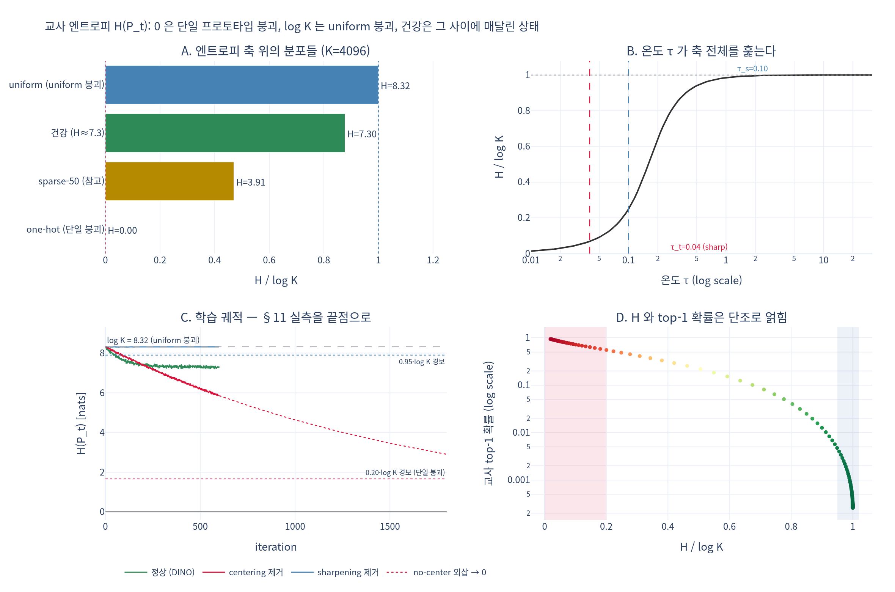

# 교사 엔트로피 $H(P_t)$ — 붕괴 신호를 읽는 법

## 한 줄 답

$$
H(P_t) \to 0 \;\Rightarrow\; \textbf{단일 프로토타입 붕괴}, \qquad
H(P_t) \to \log K \;\Rightarrow\; \textbf{uniform 붕괴}
$$

건강한 학습은 $0 \ll H(P_t) \ll \log K$ 사이에 **매달려 있는** 상태다. 축의 어느 끝에도 도달하지 않는다.

---

## 1. 왜 하필 엔트로피인가 — loss는 붕괴를 못 잡는다

DINO의 손실은 교사–학생 교차엔트로피이고, 이건 이렇게 분해된다.

$$
H\big(P_t,\,P_s\big) \;=\; \underbrace{H(P_t)}_{\text{교사 분포의 엔트로피}} \;+\; \underbrace{D_{\mathrm{KL}}\big(P_t \,\|\, P_s\big)}_{\text{두 view 정렬}}
$$

손실을 낮추는 방법이 **두 가지**라는 게 문제다. 정직한 길은 두 번째 항 $D_{\mathrm{KL}}$ 을 줄이는 것 — 서로 다른 crop이 같은 분포를 내도록 표현을 배우는 것. 지름길은 첫 번째 항 $H(P_t)$ 를 그냥 0으로 만들어 버리는 것. 교사가 항상 같은 one-hot을 뱉으면 $H(P_t)=0$ 이고, 학생은 그 상수를 흉내내기만 하면 되므로 loss는 **가장 잘 내려간다**.

`main_dino.py` 의 사전학습 루프에는 검증이 전혀 없다(loss / lr / wd 만 로깅). 그래서 로그의 loss만 보고 있으면 붕괴를 "학습이 잘 된다"로 오독한다. 실제로 봐야 하는 것은 **교사 분포의 모양**, 그 중에서도 엔트로피다.

$$
H(P_t) \;=\; -\sum_{k=1}^{K} P_t(k)\,\log P_t(k) \;\in\; [\,0,\ \log K\,]
$$

여기서 $P_t$ 는 **centering을 빼고 sharpening을 거친 뒤**의 교사 분포다.

$$
P_t^{(u)}(k) = \frac{\exp\!\big((z_t^{(u)}(k) - c_k)/\tau_t\big)}{\sum_j \exp\!\big((z_t^{(u)}(j) - c_j)/\tau_t\big)}, \qquad \tau_t = 0.04 \to 0.07
$$

---

## 2. 엔트로피 축의 세 구역

```
   H = 0                                                        H = log K
     ├──────────────┼─────────────────────────────┼───────────────┤
   단일 프로토타입      ←── 건강한 "매달린" 구간 ──→        uniform
      붕괴                                                     붕괴
  (centering 실패)                                        (sharpening 실패)
```

| 구역 | 증상 | 교사 분포 | 막는 장치 |
|---|---|---|---|
| $H \to 0$ | 어떤 입력이든 **항상 같은** one-hot. top-1 확률 $\to 1$, argmax 다양성 $\to 1$ | 한 프로토타입 독식 | **centering** ($z_t - c$) |
| $0 \ll H \ll \log K$ | 입력마다 다른, 적당히 확신에 찬 분포 | 여러 프로토타입이 살아 있음 | 두 장치의 균형 |
| $H \to \log K$ | 모든 입력이 $P_t(k) = 1/K$ 로 같은 flat 분포. gradient가 사라진 평탄면 | 아무것도 구분 안 함 | **sharpening** ($\tau_t < \tau_s$) |

두 붕괴는 **정반대 방향**이라는 점이 핵심이다. $H$ 가 낮은 것도 나쁘고 높은 것도 나쁘다. 그래서 "$H$ 는 낮을수록 좋다/높을수록 좋다" 같은 단순한 규칙이 성립하지 않는다.

### 왜 "매달려 있다"인가

sharpening($\tau_t = 0.04$)은 분포를 one-hot 쪽, 즉 축의 **왼쪽으로** 민다. centering($z_t - c$)은 특정 프로토타입이 구조적으로 유리해지는 편향을 EMA로 흡수해 빼주므로 분포를 흩어 축의 **오른쪽으로** 민다. 두 힘의 세기가 맞는 지점이 건강한 $H$ 다. 그래서 안정 상태가 아니라 **평형점**이고, 한쪽 장치를 빼면 즉시 반대쪽 끝으로 굴러 떨어진다 (논문 Fig. 5의 요지).

> 주의: 워크스루 §7 패널 C가 보여주듯 **centering은 엔트로피를 올리지 않는다**. centering은 "어떤 프로토타입이 뽑히나"의 marginal 균형을 담당하고, sharpening은 "얼마나 확신하나"를 담당한다. 둘은 서로를 대체하지 못한다 — centering이 $H$ 를 직접 밀어 올리는 게 아니라, 독식을 막아 $H \to 0$ 으로 굴러가는 것을 저지한다.

---

## 3. 축의 오른쪽 끝은 $K$ 가 정한다 — 절대값이 아니라 비율

$H$ 의 절대값은 $K$ 를 모르면 해석할 수 없다. 예를 들어 $H = 7.0$ 은:

| $K$ (`--out_dim`) | $\log K$ [nats] | $H=7.0$ 의 위치 |
|---|---|---|
| 512 | **6.238** | $\log K$ 를 **넘음** — 불가능한 값 (계산 버그) |
| 4096 | **8.318** | $0.84 \cdot \log K$ — 건강 |
| 65536 (DINO 기본값) | **11.090** | $0.63 \cdot \log K$ — 다소 낮음, 추세 확인 필요 |

그래서 로깅할 때는 항상 정규화해서 남긴다.

$$
\tilde H \;=\; \frac{H(P_t)}{\log K} \;\in\; [0, 1]
$$

$\exp(H)$ 로 보면 더 직관적이다 — "실질적으로 살아 있는 프로토타입 수"(perplexity). $K=4096$ 에서 $H = 7.3$ 은 $e^{7.3} \approx 1480$ 개가 살아 있다는 뜻이다. 붕괴(1개)와 무의미(4096개) 사이.

---

## 4. 워크스루 §11 실측을 축 위에 배치

§11은 같은 미니 학습 루프를 세 설정으로 돌린다 ($K = 4096$, $\log K = 8.318$).

| 설정 | centering | $\tau_t$ | $H(P_t)$ 끝값 | $\tilde H = H/\log K$ | 판정 |
|---|---|---|---|---|---|
| **DINO** (center + sharpen) | O | 0.04 | **7.2 ~ 7.4** | **0.87 ~ 0.89** | 건강 — 두 끝 사이에 매달림 |
| **centering 제거** | X | 0.04 | **5.86** (계속 하강 중) | 0.70 ↓ | 단일 프로토타입 붕괴로 가는 중 |
| **sharpening 제거** ($\tau_t = \tau_s$) | O | 0.10 | $\approx 8.33 \approx \log K$ | **1.00 (정지)** | uniform 붕괴 |

```
 0          1.66              5.86      7.2~7.4   7.90  8.318
 ├───────────┼──────────────────┼───────────┼───────┼──────┤
 │        0.2·logK          no-center     DINO  0.95   log K
 │         (경보)            (하강중↓)    (건강) (경보) (no-sharpen 정지)
단일붕괴                                                  uniform붕괴
```

읽는 법:

- **centering 제거** — loss가 세 설정 중 **가장 많이 내려간다**. 동시에 $H(P_t)$ 가 내려가고, top-1 확률이 올라가고, argmax 다양성이 줄어든다. loss 감소분은 두 view를 정렬해서 얻은 게 아니라 $H(P_t,P_s) = H(P_t) + D_{\mathrm{KL}}$ 의 **첫 항을 깎아서** 얻은 것이다. 이게 붕괴다.
- **sharpening 제거** — loss가 $\log K \approx 8.32$ 에서 꼼짝하지 않는다. 교사와 학생이 같은 온도라 gradient가 사실상 사라진 uniform 평탄면이다.
- **DINO** — $H(P_t)$ 가 $\log K$ 보다 확실히 낮은 값에서 안정되고, top-1 확률도 $1/K$ 보다 크지만 1에서 멀다.

### 5.86은 그 자체로 나쁜 값이 아니다 — 추세가 신호다

$K = 65536$ 이었다면 $5.86 / \log K = 0.53$ 이고, 학습 후반의 정상 값일 수도 있다. no-center 실행이 붕괴인 이유는 값이 낮아서가 아니라

1. **계속 내려가고 있고**(단조 하강, 안정화되지 않음),
2. top-1 확률이 동시에 올라가고,
3. argmax 다양성이 줄고 있기 때문이다.

정지한 $\tilde H = 1.00$(no-sharpen)도 마찬가지다. 초기 몇백 step 동안은 정상 학습도 $\log K$ 바로 아래에 머문다 — **정체**가 신호다.

---

## 5. 왜 정상 상태에서도 $H$ 가 $\log K$ 에 꽤 가까운가

§11의 정상 값 $\tilde H \approx 0.88$ 은 "거의 uniform 아닌가?" 싶을 만큼 오른쪽에 붙어 있다. 이유:

- **대부분의 프로토타입이 아직 비어 있다.** 학습 초반에는 $K$ 개 중 극히 일부만 의미를 갖고, 나머지는 서로 구별되지 않는 잔여 질량을 나눠 갖는다. 그 잔여 질량이 엔트로피를 크게 부풀린다.
- **DINO의 loss는 학습 초반 오랫동안 $\log K$ 근처의 평탄면에 머문다.** 구조는 그 평탄면 위에서 서서히 생긴다 — ImageNet ViT-S/16 8 GPU 기준 100 epoch에 약 1.75일. §11의 수백 step은 "파이프라인이 돌고 진단량이 붕괴 영역으로 떨어지지 않는다"만 확인할 수 있는 구간이다.
- 실제 100 epoch 학습의 궤적은 여기보다 **더 낮은 값**으로 서서히 내려간다 (논문 [arXiv:2104.14294](https://arxiv.org/abs/2104.14294) Fig. 5의 target entropy 곡선 참조).

따라서 "$0.88$ 이니까 uniform 붕괴 직전" 이 아니라 "$0.88$ 에서 **천천히 내려가는 중**이면 정상"이다. 다시 한 번, 절대값보다 추세.

---

## 6. 엔트로피 하나로는 부족하다

$H$ 는 **배치 안 각 행의 분포가 얼마나 뾰족한가**만 잰다. 다음 두 상황을 구별하지 못한다.

- (A) 입력마다 다른 프로토타입 집합을 쓴다 — 건강
- (B) 어떤 입력이든 **항상 같은 소수 집합**만 쓴다 — marginal 붕괴

둘 다 행별 $H$ 는 똑같이 나올 수 있다. $H$ 는 행별(conditional) 양이고, marginal $\bar P_t = \frac{1}{B}\sum_i P_t^{(i)}$ 의 불균형은 보지 않기 때문이다. 그래서 §11은 네 가지를 같이 로깅한다.

| 진단량 | 정의 | 붕괴 신호 |
|---|---|---|
| 교사 엔트로피 | $H(P_t) = -\sum_k P_t(k)\log P_t(k)$ | $\to 0$ 또는 $\to \log K$ |
| 교사 top-1 확률 | $\max_k P_t(k)$ | $\to 1$ |
| **argmax 다양성** | 배치 내 서로 다른 argmax 프로토타입 수 | $\to 1$ (marginal 붕괴 — $H$ 가 못 잡음) |
| **center 노름** | $\lVert c \rVert_2$ | 발산 (centering이 폭주하는 편향을 쫓다 실패) |

top-1 확률은 $H$ 와 거의 단조로 얽혀 있어(expy 패널 D, 상관계수 $-0.98$) 새 정보가 크게 늘지 않는다. **진짜 보완 정보는 argmax 다양성과 center 노름**이다.

---

## 7. 계산 코드와 로깅 팁

```python
with torch.no_grad():
    # centering 뒤, sharpening 뒤의 분포로 재야 한다. 로짓 그대로 재면 무의미.
    p_t = F.softmax((teacher_output.float() - dino_loss.center) / teacher_temp, dim=-1)
    H_t = -(p_t * p_t.clamp_min(1e-12).log()).sum(-1).mean()      # nats
    log = {
        "H_t":     H_t.item(),
        "H_norm":  H_t.item() / math.log(K),          # 0~1 로 정규화 — K 가 달라도 비교 가능
        "top1":    p_t.max(-1).values.mean().item(),
        "uniq":    p_t.argmax(-1).unique().numel(),   # argmax 다양성
        "cnorm":   dino_loss.center.norm().item(),    # center 발산 감시
    }
```

함정:

- `clamp_min(1e-12)` 없으면 $0 \log 0$ 에서 NaN.
- `teacher_temp` 는 epoch에 따라 warmup되므로 ($0.04 \to 0.07$) 하드코딩하지 말고 `dino_loss.teacher_temp_schedule[epoch]` 을 쓴다. 온도가 바뀌면 $H$ 도 바뀌므로, 온도 warmup 구간의 $H$ 상승은 붕괴가 아니다.
- 분산 학습이면 rank 0 배치만 보게 되므로, 엄밀히 하려면 `all_reduce` 로 평균낸다.
- **loss는 붕괴할수록 내려간다.** 절대 loss만 보고 판단하지 말 것.

### 경보 임계값 예시

$K$ 에 무관하게 쓰려면 $\tilde H = H/\log K$ 기준으로 건다.

| 조건 | 해석 | 조치 |
|---|---|---|
| $\tilde H > 0.95$ 가 수백 step **정지** | uniform 붕괴 의심 | $\tau_t < \tau_s$ 확인, `teacher_temp` warmup 확인 |
| $\tilde H < 0.2$ | 단일 프로토타입 붕괴 확정 | centering 동작 확인 (`update_center` / `all_reduce` / `center_momentum`) |
| 최근 500 step 기울기가 지속 음수 + top-1 상승 + `uniq` 하락 | 붕괴 진행 중 | 값이 아직 0.2 위여도 개입 |
| `uniq` 가 배치 크기 대비 급락 | marginal 붕괴 | $H$ 가 멀쩡해도 경보 |
| $\lVert c \rVert_2$ 발산 | center가 편향을 못 쫓음 | `center_momentum` 하향, lr 확인 |

$\tilde H > 0.95$ 는 학습 **초반에는 정상**이라는 점을 반드시 기억할 것 — 이 선은 "정체했을 때만" 경보다. 반대로 하강 추세 경보는 값이 아직 안전 구간에 있어도 잡아낸다(expy §4 참조: no-center는 $\tilde H = 0.71$ 로 0.2 선 위인데도 기울기 $-0.36/100\text{step}$ 으로 검출된다).

---

## 8. 실전 원인 체크리스트

$H$ 가 한쪽으로 굴러가면 보통 이 중 하나다.

| 증상 | 흔한 원인 |
|---|---|
| $H \to \log K$ | $\tau_t \ge \tau_s$ (온도 부등호 깨짐). `teacher_temp` 를 0.1 이상으로 올렸거나, warmup 설정 실수 |
| $H \to 0$ | `DINOLoss` 가 프로세스 그룹 없이 돌아 `update_center` 의 `all_reduce` 가 실패했거나 centering이 무력화됨. `center_momentum` 이 너무 커서 편향 추적 실패 |
| 초기에 요동 후 붕괴 | `freeze_last_layer 0` — 첫 epoch 마지막 층 동결을 껐다. `momentum_teacher` 가 너무 작아 타겟이 요동 |

---

## 시각화



- **A** — $K=4096$ 축 위의 네 분포. one-hot($\tilde H = 0$), sparse-50($0.47$), 건강($0.88$), uniform($1.00$).
- **B** — 온도 $\tau$ 하나로 같은 로짓의 엔트로피가 $0 \leftrightarrow \log K$ 를 연속으로 이동한다. $\tau_t = 0.04$ 와 $\tau_s = 0.10$ 사이의 간격이 학습 신호의 원천이다.
- **C** — §11 실측을 끝점으로 삼은 세 궤적과 경보선. no-center는 관측 구간 끝(5.86)에서 멈추지 않고 같은 지수율로 0을 향한다(점선 외삽).
- **D** — $\tilde H$ 와 top-1 확률의 단조 관계(상관계수 $-0.98$). 붉은 띠가 단일 붕괴 구역, 푸른 띠가 uniform 붕괴 구역.
